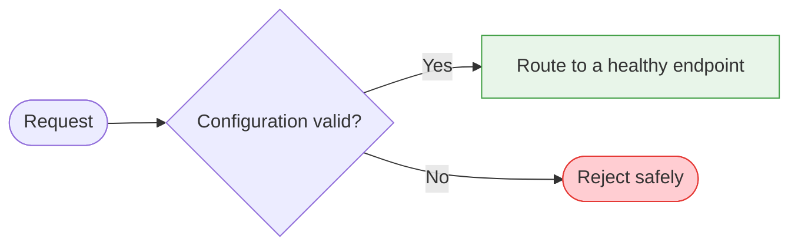

# Contributing

Thanks for helping improve the LoxiLB Inference Gateway documentation. This guide covers how to
propose changes and the conventions we follow.

By participating in this project you agree to abide by our [Code of Conduct](CODE_OF_CONDUCT.md).

## Ways to contribute

- **Report a problem** — open an issue for anything inaccurate, unclear, or out of date.
- **Improve a page** — fix typos, clarify wording, add examples, expand a section.
- **Add a page** — cover a feature or workflow that isn't documented yet.

## Ground rule: correctness over everything

The [loxilb-inference-gateway](https://github.com/loxilb-io/loxilb-inference-gateway) code
repository is the **single source of truth**. Every documented API field, default, enum,
endpoint, and runnable example must be traceable to:

1. `api/swagger.yml` / `api/swagger-extras.yml` — the authoritative API contract, or
2. a working scenario under `cicd/` — for runnable examples.

If a page and the code disagree, the code wins. When you document a field, use its exact name,
type, default, and allowed values from the API spec. Do not document behavior the code does not
implement — if a capability is partial or roadmap, say so with a status admonition.

## Workflow

1. Fork the repository and create a branch from `main`.
2. Make your change and preview it locally:
   ```bash
   pip install -r requirements.txt
   mkdocs serve
   ```
3. Ensure the strict build passes (this is what CI runs):
   ```bash
   mkdocs build --strict
   ```
4. Open a pull request. Fill in the PR template and link any related issue.

## Commit messages

Use [Conventional Commits](https://www.conventionalcommits.org/), e.g.:

```
docs(kv-caching): correct kvBlockSize default for CPU vLLM
fix(nav): repair broken relative link in llm-routing
ci(linkcheck): exclude hosts that block automated checkers
```

Give the PR a Conventional Commits style title as well — it becomes the squash-merge commit
message.

## Sign your commits (DCO)

We require a [Developer Certificate of Origin (DCO)](https://developercertificate.org/) sign-off on
every commit. The sign-off certifies that you wrote the change or otherwise have the right to
submit it under the project's license.

Add a `Signed-off-by` line to each commit — it must match the git author name and email:

```
Signed-off-by: Your Name <your.name@example.com>
```

Git adds it automatically with the `-s` flag:

```bash
git commit -s -m "docs(kv-caching): correct kvBlockSize default for CPU vLLM"
```

If you forgot on an unpushed commit, amend it with `git commit --amend -s`.

## Style conventions

- One `# H1` per page, followed by a one- to two-sentence purpose line.
- Use [Material admonitions](https://squidfunk.github.io/mkdocs-material/reference/admonitions/)
  (`!!! note`, `!!! warning`, `!!! tip`) for callouts; use `!!! warning` for status/roadmap notes.
- Show runnable configuration as `curl` against the REST API (`http://<host>:11111/netlox/v1/...`).
  Where a CLI form is expected later, use tabbed blocks so it can be added beside the `curl` block.
- Prefer relative links between pages (e.g. `../ai-gateway/kv-caching.md`).
- Use placeholder or lab addresses in examples — never real production hosts, keys, or credentials.

### Diagrams and page structure

Confirm the patterns used by nearby pages before introducing a new layout. Feature and operations
guides should normally progress from **purpose → architecture or decision flow → prerequisites →
configuration → verification → troubleshooting → related pages**.

Prefer Mermaid when a diagram makes a request path, decision, state category, or component
relationship easier to understand than prose. Follow these rules:

- Keep each diagram focused on one idea and give nodes short, plain-language labels.
- Use `flowchart TD` for request/decision flows and `flowchart LR` for compact pipelines.
- Reuse the site's semantic colors: green for success/ready paths, blue for processing or
  observation, orange/yellow for conditional or degraded paths, and red for denial or failure.
- Make the meaning available in adjacent prose or a table; never require color alone to understand
  the diagram.
- Check every diagram in both light and dark themes and keep labels readable at narrow widths.
- Do not embed private topology, customer names, internal identifiers, credentials, or unpublished
  performance claims in diagram text.

Example:



## What not to include

To keep the project clean and professional, the following must **never** be committed:

- Internal planning, design, or migration documents.
- AI-assistant artifacts and scratch/working directories (assistant instruction files, planning caches, and similar).
- Absolute developer paths, private hostnames/IPs, tokens, or internal registry references.
- Internal ticket, test-case, phase, work-package, pull-request, or commit identifiers used as
  proof of behavior. Explain the public behavior and validation procedure instead.
- Unsupported security, availability, compatibility, or performance guarantees. State validation
  limits and required production checks explicitly.

CI enforces these rules automatically; a pull request that introduces them will fail.

## Reporting security issues

Please do **not** open a public issue for security vulnerabilities. See [SECURITY.md](SECURITY.md).
