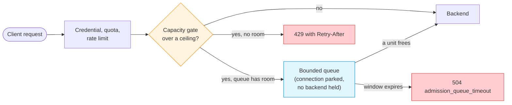

# Admission Flow Control

--8<-- "snippets/common/mutation-fragment-notice.md"

The capacity admission gate bounds how many inference requests execute on a model pool at once,
and how many may wait for a turn. A request over a ceiling is queued or refused before any byte
reaches a backend, so an overloaded engine is protected and the client gets a fast, explicit
answer instead of a timeout.

!!! warning "Development contract"
    The gate, its queue, the adaptive ceiling, warm-up, tenant share, and the admission headers
    are present on Gateway `main`, after the `v0.9.8.9-rc.1` release candidate. They have not
    completed release, Linux appliance, GPU-engine, or two-node HA qualification. Confirm the
    served Swagger and the immutable image you deploy before relying on a field on this page.

## Concept

The gate runs on every **AI-gateway service**: a `mode: 4` (fullproxy) rule that sets
`sse_mode`, `pd_disagg_mode`, or an `api_key_auth` policy. It runs after the policy checks
(credential, quota, rate limit) and before dispatch.



A refused request never opens a backend connection. A queued request holds no backend resource
while it waits. A unit is taken once per request: an HTTP/1.1 request (every request on a
keep-alive connection is gated again) or an HTTP/2 stream. It is released when the request
completes, the client goes away, or the backend leg fails. Requests that are not inference calls
(`GET /v1/models`, health probes) bypass the ceilings and are counted as
`bypass_non_inference`.

### Modes

A rule sets its mode with `fc_mode`. A rule that declares nothing, or declares `inherit`, runs on
the process default `LLB_FC_MODE`. A rule may switch the gate off under an enforcing environment.

| Mode | Behavior |
|---|---|
| unset / `off` | The dispatch path is unchanged. Every pool still exports its state with mode `0`, so a scrape can tell an ungated AI pool from a non-AI service. |
| `observe` | Every decision is computed and counted and everything is admitted. `observe_would_shed` and `observe_would_queue` say what `enforce` would have done, at each ceiling that would have refused the request. |
| `enforce` | Over a ceiling, a request is queued when the pool has a queue depth and the request may wait, otherwise refused. |

!!! tip "Roll out in `observe` first"
    Set `fc_mode` to `observe`, watch `loxilb_ai_admission_decisions_total{reason="observe_would_shed"}`
    under real traffic, size the ceilings from what it shows, then switch to `enforce`.

### Ceilings

A ceiling of `0` in force means unlimited at that level. Each field is at most `100000`.

| Level | Field (`serviceArguments`) | Process default | Counts |
|---|---|---|---|
| Service (pool-wide) | `fc_max_outstanding` | `LLB_FC_MAX_OUTSTANDING` | One unit per executing inference request, however many backend legs it opens |
| Endpoint, normal role | `fc_ep_max_inflight` | `LLB_FC_EP_MAX_INFLIGHT` | One unit per executing request on that endpoint |
| Endpoint, prefill role | `fc_prefill_max_inflight` | `LLB_FC_PREFILL_MAX_INFLIGHT`, else `LLB_PD_MAX_INFLIGHT_PER_EP` | One unit per prefill leg |
| Endpoint, decode role | `fc_decode_max_inflight` | `LLB_FC_DECODE_MAX_INFLIGHT` | One unit per decode leg |

### Where a value comes from

Every setting on this page resolves the same way, per rule: the rule's own value when it declares
one, else the process environment, else the product default. A rule field of `0` (or `fc_mode`
`inherit`) declares nothing and inherits, so a rule cannot ask for "unlimited" under an
environment that sets a ceiling.

`GET` on the rule returns what was declared. `fc_effective` returns what is in force on the pool,
and `fc_effective.source` names, for each value, whether it came from the `rule`, the `env`, or
the `default`.

## Configuration

### A gated service with a bounded queue

=== "curl"
    ```bash
    curl -s -X POST http://192.0.2.254:11111/netlox/v1/config/loadbalancer \
      -H 'Content-Type: application/json' \
      -d '{
        "serviceArguments": {
          "externalIP": "192.0.2.10",
          "port": 8080,
          "protocol": "tcp",
          "mode": 4,
          "sse_mode": true,
          "fc_mode": "enforce",
          "fc_max_outstanding": 16,
          "fc_ep_max_inflight": 8,
          "fc_max_queue_depth": 32,
          "fc_max_queue_wait_ms": 5000
        },
        "endpoints": [
          {"endpointIP": "198.51.100.11", "targetPort": 8000, "weight": 1},
          {"endpointIP": "198.51.100.12", "targetPort": 8000, "weight": 1}
        ]
      }'
    ```

=== "loxicmd"
    ```bash
    # CLI availability: main-only
    loxicmd create lb 192.0.2.10 --tcp=8080:8000 --endpoints=198.51.100.11:1,198.51.100.12:1 --mode=fullproxy --sse-mode --fc-mode=enforce --fc-max-outstanding=16 --fc-ep-max-inflight=8 --fc-max-queue-depth=32 --fc-max-queue-wait-ms=5000
    ```

With this rule at most 16 requests execute on the pool and at most 8 on any one endpoint. A 17th
request waits, up to 32 of them, for at most 5 seconds each. The 33rd is refused `429`.

### Read back what is in force

--8<-- "snippets/common/fc-effective-readback.md"

`fc_effective` carries `mode`, `max_outstanding`, `ep_max_inflight`, `prefill_max_inflight`,
`decode_max_inflight`, `queue_depth`, `queue_wait_ms`, the live `inflight` and `queued`,
`queue_memory_bound_mib`, `telemetry_stale_ms`, the adaptive fields below, and `source`. It is
present on `GET` for AI-gateway services and ignored on input.

### Change the gate at runtime

All the fields are runtime settings. A replace `POST` with the same key applies the new values to
the live pool without touching executing requests:

- an omitted field keeps its stored value;
- an explicit `0` (or `inherit`) returns it to the environment or product default;
- JSON `null` is refused.

`PATCH` does not reach FullProxy rules, and every AI-gateway service is one, so the runtime change
on an AI service is a replace `POST`. When a change lets waiting requests through (a higher
ceiling, or a mode that no longer enforces), they are woken at once, oldest first, one per free
unit, or all of them when the pool no longer enforces.

=== "curl"
    ```bash
    curl -s -X POST http://192.0.2.254:11111/netlox/v1/config/loadbalancer \
      -H 'Content-Type: application/json' \
      -d '{
        "serviceArguments": {
          "externalIP": "192.0.2.10",
          "port": 8080,
          "protocol": "tcp",
          "mode": 4,
          "sse_mode": true,
          "fc_max_outstanding": 24
        },
        "endpoints": [
          {"endpointIP": "198.51.100.11", "targetPort": 8000, "weight": 1},
          {"endpointIP": "198.51.100.12", "targetPort": 8000, "weight": 1}
        ]
      }'
    ```

=== "loxicmd"
    ```bash
    # CLI availability: main-only
    loxicmd create lb 192.0.2.10 --tcp=8080:8000 --endpoints=198.51.100.11:1,198.51.100.12:1 --mode=fullproxy --sse-mode --fc-max-outstanding=24
    ```

The example raises only the pool ceiling from `16` to `24`: every other admission field keeps its
stored value, and requests waiting on the pool are woken into the new units. Every field outside
the `fc_*` set must repeat the stored rule exactly; a difference there is a change to more than the
gate and re-creates the entry (see the warning below).

!!! warning "Change the gate on its own when requests may be waiting"
    A replace that changes only the admission fields is applied in place. A replace that also
    changes anything else re-creates the service's data-plane entry: requests waiting in its
    queue are then ended with `503 admission_drained`, as on a rule delete, and the pool's counts
    start again.

The rule that a depth needs a wait window is judged on the rule a request leaves behind. A
replace carrying only a new depth keeps the stored wait and is accepted. A replace carrying only
`fc_max_queue_wait_ms: 0` on a rule with a stored depth is refused `400`, and the stored rule is
unchanged.

!!! note "Nothing replicates these between gateway instances"
    The gate settings are rule configuration, like every other `serviceArguments` field. Each
    instance holds the rules its controller (or its snapshot) gave it, so two instances given the
    same rule resolve the same values, and an instance given a rule without them runs on its own
    environment.

## The bounded queue

When the pool is over a ceiling and has a queue depth, an HTTP/1.1 request is parked instead of
refused: its connection stays open with reads paused, and it holds no capacity unit and no backend
connection. Each release of an executing unit wakes exactly one waiter, oldest first, and a
newcomer never jumps a non-empty queue. A woken request that loses the race goes back to the head
and keeps the deadline it was first parked with, so `fc_max_queue_wait_ms` bounds its whole wait.
A turn is never lost: if a woken client has gone, the turn passes to the next waiter, and a
once-a-second pass wakes the head of any pool that has a free unit and requests still waiting.

| Field (`serviceArguments`) | Process default | Meaning |
|---|---|---|
| `fc_max_queue_depth` | `LLB_FC_MAX_QUEUE_DEPTH` | Requests that may wait on the pool. `0` means over a ceiling is refused at once. At most `65536`. |
| `fc_max_queue_wait_ms` | `LLB_FC_MAX_QUEUE_WAIT_MS` (`5000` when a depth is set and no window is) | The longest a request may wait before it is ended with `504 admission_queue_timeout`. Required, greater than `0`, whenever a depth is set. At most `3600000`. |

| Request | Over a ceiling |
|---|---|
| HTTP/1.1, body fully buffered | Queued when the pool has a depth |
| HTTP/1.1, streamed body (large or chunked) | Queued when the pool has a depth; the connection closes after the answer either way |
| HTTP/2 stream | Refused on its own stream with `429`; streams never wait |
| Prefill or decode leg of a P/D request | Refused; role legs never wait, the request is answered once |

### What a queue costs

A parked connection holds about 1 MiB of receive buffer with the request in it, so a depth is a
memory bound as much as a queue bound:

```text
memory the full queue may park ≈ fc_max_queue_depth × 1 MiB
```

`65536` is about 64 GiB. The gateway applies any depth up to the ceiling and logs one `WARNING` at
rule apply when the bound exceeds half of the node's memory. Bound the connections themselves
with the per-rule `connectionLimit` (SYN-time, DNAT rules) or the process valve
`LLB_PD_MAX_TOTAL_INFLIGHT` (accept-time, every proxied connection). Size the depth from the
memory you can spend, and read `fc_effective.queue_memory_bound_mib` to see the bound in force.

## Adaptive ceiling

With `fc_adaptive` `on` (or `LLB_FC_ADAPTIVE=on` and the rule declaring nothing), the pool-wide
ceiling in force follows what the pool's engines report, between a quarter of the configured
`fc_max_outstanding` (at least one) and all of it. Once a second, per pool:

| Endpoints, within the telemetry window | Ceiling in force |
|---|---|
| An endpoint reports requests waiting in its engine (`vllm:num_requests_waiting` above `0`) | Four fifths of what it was, never below the quarter (reason `queued`) |
| An endpoint's time to first token is above `fc_ttft_target_ms` | The same (reason `ttft`) |
| Fresh reports, no backpressure | One unit more, up to the configured ceiling; the request waiting longest is woken for it (reason `clear`) |
| Nothing fresh (scrapes fail or stopped) | Unchanged: held, never widened (state `frozen`, reason `stale`) |

Only fresh evidence moves the ceiling, and only fresh evidence without backpressure widens it: a
gateway that has lost sight of its engines keeps the tighter bound it last had reason for. The
configured ceiling stays the hard bound. A pool with no service ceiling (`fc_max_outstanding` `0`
in force) has nothing to adapt.

| Field | Meaning |
|---|---|
| `fc_adaptive` | `on`, `off`, or `inherit` (process default `LLB_FC_ADAPTIVE`). |
| `fc_ttft_target_ms` | With `fc_adaptive` `on`: tighten while an endpoint's streamed responses average more than this many milliseconds to their first token. `0` in force leaves time to first token out. At most `3600000`. |
| `fc_telemetry_stale_ms` | How long a scraped queue depth or a time-to-first-token average is trusted. Default `30000`; at most `3600000`. Also the window the P/D scorers trust an endpoint's scraped depth for. |

The waiting-request count comes from each engine's own `/metrics`, which the gateway scrapes every
10 seconds for every rule that adapts. The time to first token is measured on **streamed**
responses only, from admission to the first data event; a buffered response's first byte says how
long the answer was, not how soon the engine started. `fc_effective` reads back `adaptive`,
`effective_max_outstanding`, `adapt_state` (`off`, `open`, `tightened`, `frozen`) and
`adapt_reason`. Turning `fc_adaptive` off by a replace gives the configured ceiling back at once.

=== "curl"
    ```bash
    curl -s -X POST http://192.0.2.254:11111/netlox/v1/config/loadbalancer \
      -H 'Content-Type: application/json' \
      -d '{
        "serviceArguments": {
          "externalIP": "192.0.2.10",
          "port": 8080,
          "protocol": "tcp",
          "mode": 4,
          "sse_mode": true,
          "fc_mode": "enforce",
          "fc_max_outstanding": 32,
          "fc_max_queue_depth": 64,
          "fc_max_queue_wait_ms": 5000,
          "fc_adaptive": "on",
          "fc_ttft_target_ms": 2000,
          "fc_telemetry_stale_ms": 30000
        },
        "endpoints": [
          {"endpointIP": "198.51.100.11", "targetPort": 8000, "weight": 1},
          {"endpointIP": "198.51.100.12", "targetPort": 8000, "weight": 1}
        ]
      }'
    ```

=== "loxicmd"
    ```bash
    # CLI availability: main-only
    loxicmd create lb 192.0.2.10 --tcp=8080:8000 --endpoints=198.51.100.11:1,198.51.100.12:1 --mode=fullproxy --sse-mode --fc-mode=enforce --fc-max-outstanding=32 --fc-max-queue-depth=64 --fc-max-queue-wait-ms=5000 --fc-adaptive=on --fc-ttft-target-ms=2000 --fc-telemetry-stale-ms=30000
    ```

## Warm-up after a return to service

An endpoint that comes back (its circuit breaker closes, its health probe or host state turns it
active again, or a replace adds it) would otherwise take a full share of a burst at once, and a
cold engine then answers slowly or fails. With `fc_warmup_ms` (or `LLB_FC_WARMUP_MS`) its
per-endpoint ceilings ramp instead: a quarter of each (at least one) at the moment it returns,
rising in a straight line to all of it at the end of the window. An unlimited role stays
unlimited, and the service ceiling is not ramped. `fc_effective.warming_endpoints` counts the
endpoints inside their window. `fc_warmup_ms` is at most `3600000`.

## Tenant fair share

Without a share the queue is strictly first come, first served, so one tenant sending a burst
fills the ceiling and the queue and everyone else waits behind it. With
`fc_tenant_max_share_pct` (or `LLB_FC_TENANT_MAX_SHARE_PCT`), a tenant holds at most that
percentage of the service ceiling in force (the adaptive one while the pool adapts) and of the
queue depth, rounded up and at least one each. The value is at most `100`; `100` is no share, and `0` or omitted leaves the process default.

| `fc_max_outstanding` | `fc_max_queue_depth` | Share | A tenant may execute | And wait |
|---:|---:|---:|---:|---|
| 8 | 16 | 25 | 2 | 4 |
| 10 | 0 | 30 | 3 | refused at once |
| 3 | 1 | 10 | 1 | 1 |

A tenant is the tenant id the request's credential resolved to (API key or JWT, on a service that
enforces one). Every request without a tenant id, keyless traffic included, is one tenant. A
tenant at its share of the ceiling waits for one of its own units when the pool queues and it
still has room in its share of the queue. Otherwise it is refused `429 admission_tenant_share`
while every other tenant still admits. A waiting tenant that cannot run holds nobody up: a
released unit wakes the oldest waiter whose tenant is under its share, the others keeping their
place.

!!! note "The share is a hard cap and needs a service ceiling"
    The share binds even when the service is otherwise idle, and it is inert without
    `fc_max_outstanding`. A pool tracks up to 64 tenants at a time; tenants past that share one
    last slot and are held together to one share, and each request placed there counts
    `loxilb_ai_admission_anomalies_total{kind="tenant_table_full"}`. A tenant's slot is freed as
    soon as it holds nothing, so the table bounds the tenants active at once, not the tenants
    known. `fc_effective.tenants_active` counts them.

=== "curl"
    ```bash
    curl -s -X POST http://192.0.2.254:11111/netlox/v1/config/loadbalancer \
      -H 'Content-Type: application/json' \
      -d '{
        "serviceArguments": {
          "externalIP": "192.0.2.10",
          "port": 8080,
          "protocol": "tcp",
          "mode": 4,
          "sse_mode": true,
          "fc_mode": "enforce",
          "fc_max_outstanding": 16,
          "fc_max_queue_depth": 32,
          "fc_max_queue_wait_ms": 5000,
          "fc_tenant_max_share_pct": 25,
          "fc_warmup_ms": 20000
        },
        "endpoints": [
          {"endpointIP": "198.51.100.11", "targetPort": 8000, "weight": 1},
          {"endpointIP": "198.51.100.12", "targetPort": 8000, "weight": 1}
        ]
      }'
    ```

=== "loxicmd"
    ```bash
    # CLI availability: main-only
    loxicmd create lb 192.0.2.10 --tcp=8080:8000 --endpoints=198.51.100.11:1,198.51.100.12:1 --mode=fullproxy --sse-mode --fc-mode=enforce --fc-max-outstanding=16 --fc-max-queue-depth=32 --fc-max-queue-wait-ms=5000 --fc-tenant-max-share-pct=25 --fc-warmup-ms=20000
    ```

## What the client sees

Every refusal carries `Retry-After` in seconds (`1` for a ceiling refusal; the mean queue wait,
between `1` and `30`, when the queue was full or a wait timed out; `5` for a drain) and the three
admission headers `X-Loxilb-Admission-Inflight`, `X-Loxilb-Admission-Queued`, and
`X-Loxilb-Admission-Limit`: the live counts and the ceiling that refused. The body is JSON.

| Status | `error` | When | Connection |
|---|---|---|---|
| `429` | `admission_capacity` | Over a ceiling with no queue, or the queue at its depth. The body carries `retry_after` and `jitter_hint_ms`. | Kept open when the request body was fully buffered, else closed |
| `429` | `admission_tenant_share` | The request's tenant holds its share of the ceiling (and may not wait) or of the queue. The admission headers carry the pool's counts, not the tenant's. | As `admission_capacity` |
| `503` | `admission_no_capacity` | No healthy endpoint of the pool has capacity | Closed |
| `503` | `gateway_draining` | The gateway is in maintenance (see below) | Closed |
| `504` | `admission_queue_timeout` | The request waited the whole `fc_max_queue_wait_ms`. The body carries `queued_ms`. | Closed |
| `503` | `admission_drained` | The request was waiting when its pool was deleted or the gateway entered maintenance | Closed |

Clients should honor `Retry-After` and add the jitter the body hints, so a burst of refusals does
not return as one burst of retries. Every non-admit decision is also a `sec.ai.deny` record on the
audit trail with the service, the model, and the decision.

### The same headers on admitted responses

With `fc_expose_headers` `on` (or `LLB_FC_EXPOSE_HEADERS=on` with the rule declaring nothing),
every admitted inference response carries the three admission headers too, so a client can slow
down before it is refused. `X-Loxilb-Admission-Inflight` and `X-Loxilb-Admission-Queued` are the
pool's executing and waiting requests as the response head goes out (the request itself counted),
and `X-Loxilb-Admission-Limit` is the service ceiling in force (the adaptive one while the pool
adapts; `0` when the pool has none).

They go on the response head on HTTP/1.1 and HTTP/2, streamed (`text/event-stream`, chunked)
responses included, and the body is never touched. Headers of those names sent by the backend are
replaced. A pool in `observe` mode reports them too, since it counts its requests; requests the
gate does not count (non-inference paths, a pool in `off` mode) carry none. On HTTP/1.1 a
response head the backend split across several reads is sent without them.

=== "curl"
    ```bash
    curl -s -X POST http://192.0.2.254:11111/netlox/v1/config/loadbalancer \
      -H 'Content-Type: application/json' \
      -d '{
        "serviceArguments": {
          "externalIP": "192.0.2.10",
          "port": 8080,
          "protocol": "tcp",
          "mode": 4,
          "sse_mode": true,
          "fc_mode": "enforce",
          "fc_max_outstanding": 16,
          "fc_expose_headers": "on"
        },
        "endpoints": [
          {"endpointIP": "198.51.100.11", "targetPort": 8000, "weight": 1}
        ]
      }'
    ```

=== "loxicmd"
    ```bash
    # CLI availability: main-only
    loxicmd create lb 192.0.2.10 --tcp=8080:8000 --endpoints=198.51.100.11:1 --mode=fullproxy --sse-mode --fc-mode=enforce --fc-max-outstanding=16 --fc-expose-headers=on
    ```

!!! warning "Not with directional sockmap acceleration"
    A rule refuses `fc_expose_headers` `on` with a `sockMapMode` of `both` or `response` (`400`):
    those responses go from the backend to the client in the kernel and the gateway never sees
    them. Set process-wide with `LLB_FC_EXPOSE_HEADERS=on`, the headers appear only on the
    responses the gateway relays. See [Sockmap Acceleration](../operations/sockmap-acceleration.md).

## Maintenance drain

`PUT /netlox/v1/maintenance {"enabled": true}` reaches the data path on a gateway with its data
path attached. New inference requests on every pool whose mode is `enforce` are answered `503
gateway_draining`, every request waiting in a queue is ended with `503 admission_drained`, and
executing requests finish on their own. A pool in `observe` or `off` mode keeps admitting: the
drain refuses through the gate, and only an enforcing gate refuses. `GET /netlox/v1/maintenance`
reports `refusing_new_inference: true` while maintenance is in effect and `in_flight_requests`,
the executing count summed over the gated pools. `enabled: false` restores admission. On a
management plane with no data path attached `refusing_new_inference` stays `false`, so the
read-back never claims a drain that is not happening. See
[Readiness, Capabilities, Diagnostics & Maintenance](../operations/readiness-diagnostics-maintenance.md).

!!! warning "A service outside the gate is not drained"
    A rule that is not an AI-gateway service, or whose gate is `observe` or `off`, still accepts
    inference traffic during maintenance. Prove the drain with a backend-owned receipt count, not
    with `refusing_new_inference` alone.

## Verify

1. Read `fc_effective` back and compare each value and its `source` with what you declared.
2. Send a burst above the ceiling and confirm the split in
   `loxilb_ai_admission_decisions_total` (`admitted`, `queued`, `capacity_shed`,
   `queue_timeout`).
3. Confirm `loxilb_ai_admission_inflight{role="service"}` never exceeds
   `loxilb_ai_admission_limit{role="service"}` and `loxilb_ai_admission_queued` never exceeds
   `loxilb_ai_admission_limit{role="queue"}`.
4. Confirm `loxilb_ai_admission_anomalies_total` stays at `0` for `underflow` and
   `unknown_permit`: any increase is a bookkeeping defect, not load.

The metric families, their labels, and their activation are listed in the generated
[Metrics reference](../reference/metrics.md); the queue, ceiling, and decision series are also
plotted in the AI dashboard's "AI admission gate" row (see
[Grafana Dashboards](../operations/observability-metrics-grafana.md)).

## Troubleshoot

| What you see | What it means | What to do |
|---|---|---|
| `decisions_total{reason="capacity_shed"}` rising while `effective_limit` equals `limit{role="service"}` | The pool is at its configured ceiling | Raise `fc_max_outstanding` if the engines have headroom (their own `num_requests_waiting` stays `0`), else add endpoints |
| The same while `effective_limit` is below the configured ceiling, `adapt_reason` `queued` or `ttft` | The engines report backpressure and the gateway is shedding in front of them, as intended | Add capacity. A target (`fc_ttft_target_ms`) far below what the model can do keeps the ceiling at its floor |
| `adapt_state{state="frozen"}` | The scrapes stopped (engine `/metrics` down or blocked) while the ceiling was tightened: it holds | Check the engines' `/metrics` and `loxilb_ai_worker_scrape_total`; turn `fc_adaptive` off by a replace to return to the configured ceiling at once |
| `decisions_total{reason="queue_timeout"}` rising | Requests wait a whole `fc_max_queue_wait_ms` | The queue only delays refusals at this load: shorten the wait or add capacity |
| `queued` near `limit{role="queue"}` for minutes | The queue absorbs a sustained overload, not a burst | Add capacity. A deeper queue parks more client memory (depth × 1 MiB) |
| `warming_endpoints` above `0` after every health flap | An endpoint flaps between down and up | Fix the endpoint; its ramp restarts on every return |
| `decisions_total{reason="tenant_share"}` rising while `inflight` is below the limit | One tenant is at its share and the rest of the ceiling is left for others, as intended | Raise `fc_tenant_max_share_pct` if one tenant should be allowed more of an idle pool |
| `anomalies_total{kind="tenant_table_full"}` rising | More than 64 tenants active on one pool at once; the ones past the table share one budget | Expected under a very wide tenant fan-out; split the pool if they need separate budgets |
| `anomalies_total` (`underflow`, `unknown_permit`) above `0` | A bookkeeping defect | Report it with the gateway log |
| A replace ended waiting requests with `503 admission_drained` | The replace changed more than the admission fields, which re-creates the data-plane entry | Change the gate on its own when requests may be waiting |

## Accept valve

The process accept valve `LLB_PD_MAX_TOTAL_INFLIGHT` bounds connection contexts, not requests,
before any pool sees them. At the bound it pauses the listeners, so connections waiting in the
backlog cost no CPU, and the release of a connection context re-arms them.

| Family | Type | Meaning |
|---|---|---|
| `loxilb_proxy_context_inflight` | gauge | Connection contexts held, client and backend legs alike. Counted only while the valve is on, so `0` when unbounded. |
| `loxilb_proxy_accept_bound` | gauge | The bound; `0` when unbounded |
| `loxilb_proxy_accept_blocked_total` | counter | Times the valve paused accepting at the bound: one per pause, not per connection |

Size the bound so that it is reached only in overload, and treat contexts held at the bound as a
capacity alarm.

## Limits

- The queue is per gateway process; nothing is shared across instances.
- HTTP/2 streams and P/D role legs never wait: they are refused at the ceiling. Only HTTP/1.1
  requests queue.
- A `429` keeps the connection only when the request body was fully buffered before the decision;
  a streamed body closes it.
- The queue is first come, first served within the tenant share; without a share it is strictly
  FIFO. There are no priorities between tenants beyond the share.

## See also

- [AI Traffic Governance](ai-traffic-governance.md) for the credential, quota, and rate-limit
  checks that run before the gate.
- [Configuration Reference](configuration-reference.md) for every `serviceArguments` field.
- [AI Quotas & QoS](../operations/ai-qos.md) for quota and byte-rate policy.
- [Monitoring & Metrics](../operations/monitoring.md) for scraping and alerting.
