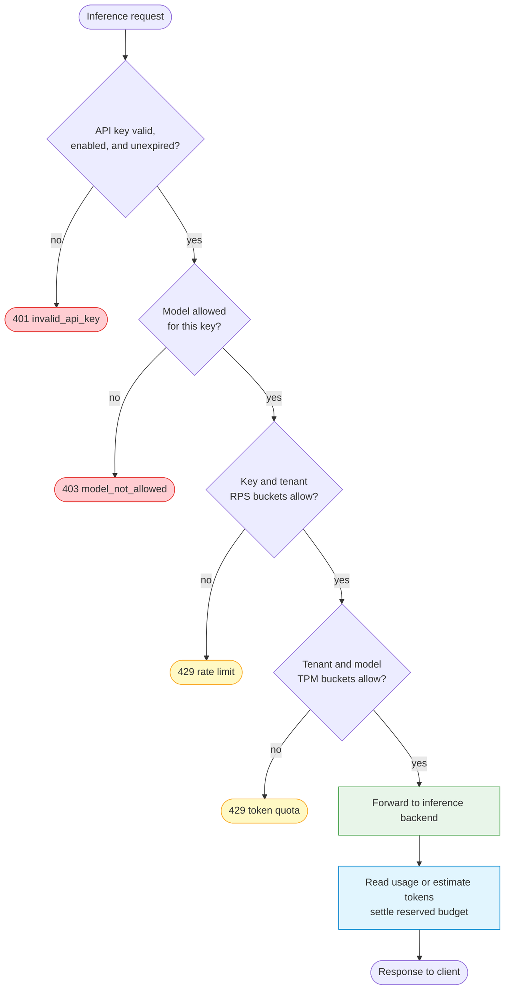

# AI Traffic Governance

LoxiLB can control who may use an inference service, which models they may
call, how quickly they may submit requests, how many tokens they may consume,
and how much network bandwidth a service may use. These controls solve
different problems and should be configured independently.

The request-admission flow below applies only to a `mode: 4` rule with
`sse_mode: true` or `pd_disagg_mode: true`. Plain fullproxy rules bypass the
current AI key and quota gate.

## Choose the control that matches the problem



The gateway evaluates access and admission before it spends backend capacity.
It accounts for actual or estimated token use when the response completes.
Bandwidth policies sit on a separate path and meter bytes rather than requests
or tokens.

| Control | Scope | Unit | Typical purpose |
|---|---|---|---|
| API-key model allow-list | One API key | Model identifiers | Prevent a workload from calling unauthorized models |
| API-key RPS | One API key | Requests per second | Protect against one noisy credential |
| Per-key TPM field | One API key | Tokens per minute | Persisted and returned, but **not enforced** in the current data path |
| Tenant RPS | All keys for one tenant | Requests per second | Share an admission ceiling across a tenant |
| Tenant TPM | All models for one tenant | Tokens per minute | Bound aggregate AI work |
| Tenant-and-model TPM | One model within one tenant | Tokens per minute | Reserve a smaller budget for an expensive model |
| QoS policy | LB rule or network port | Megabits per second at the API | Bound traffic rate or pace a fullproxy service |

RPS means **requests per second**. TPM means **tokens per minute**. TPM is a
smooth token bucket that refills continuously; it is not a counter that resets
at the top of each minute.

## Prerequisites and secure API access

You need:

- a fullproxy inference rule (`mode: 4`) with `sse_mode: true` or
  `pd_disagg_mode: true`; plain `mode: 4` does not enter the current key/quota gate;
- the Gateway started with the independent PostgreSQL AI-key store configured through
  `--aikey-db-*` options;
- one management authentication mode enabled for port `11111`;
- a control-plane identity authorized to manage AI keys and limits;
- TLS on every control-plane and inference endpoint outside an isolated lab.

Keep the management bearer token and inference API key separate. The following
examples read the management header from a permission-restricted file so the
token is not written directly into every shell command:

```bash
export CONTROL_API="https://gateway.example.com/netlox/v1"
install -m 600 /dev/null ./control-plane.headers
printf 'Authorization: Bearer %s\n' "$CONTROL_PLANE_TOKEN" > ./control-plane.headers
```

Replace the example URL with your deployment. Obtain `CONTROL_PLANE_TOKEN`
from your identity and secret-management workflow; do not paste it into shell
history, source control, tickets, or logs.

!!! danger "Prove both authentication planes before exposure"
    A plain `mode: 4` rule is keyless even with a healthy key store. On an SSE- or P/D-enabled
    rule, no `--aikey-db-host` also admits requests without API-key checks.
    With no user, OAuth, or manual-token management mode, key and quota CRUD is callable without
    credentials. Require `401` from both a missing-key inference probe and an unauthenticated
    management mutation before proceeding.

## Step 1 — Create a narrowly scoped key

Start with only the models and request rate the workload needs:

```bash
curl --fail-with-body --silent --show-error \
  --request POST "$CONTROL_API/config/ai/apikey" \
  --header @control-plane.headers \
  --header 'Content-Type: application/json' \
  --data '{
    "tenant_id": "team-a",
    "name": "chat-service",
    "allowed_models": ["example-chat-model"],
    "rate_limit_rps": 5,
    "burst_size": 10,
    "tokens_per_min": 0,
    "enabled": true
  }' > ./new-key.json

jq '{key_id, raw_key_present: (.raw_key | type == "string")}' ./new-key.json
```

Expected result: `201 Created`; the response contains a `key_id` and a
`raw_key`. The raw key is returned only by this create operation. Store it in a
secret manager immediately, then securely remove `new-key.json`. List and get
operations never return the raw key or its stored hash.

!!! danger "Treat the create response as a secret"
    Do not print `raw_key` in a terminal recording, CI log, dashboard, or issue.
    If it is exposed or lost, delete the key and create a replacement.

Per-key `tokens_per_min` remains part of the key schema and round-trips through
CRUD, but the current data path does not enforce it. Tenant and
tenant-and-model token budgets are the enforced TPM controls and are configured
through the tenant rate-limit API described next.

## Step 2 — Set tenant and per-model token budgets

This example gives the tenant an aggregate budget of 60,000 TPM and limits one
model to 20,000 TPM:

```bash
curl --fail-with-body --silent --show-error \
  --request POST "$CONTROL_API/config/ai/tenant/ratelimit" \
  --header @control-plane.headers \
  --header 'Content-Type: application/json' \
  --data '{
    "tenant_id": "team-a",
    "rps": 20,
    "tokens_per_min": 60000,
    "burst_pct": 50,
    "model_limits": [
      {"model": "example-chat-model", "tokens_per_min": 20000}
    ]
  }'
```

Expected result: `204 No Content`. Read the effective configuration back:

```bash
curl --fail-with-body --silent --show-error \
  --header @control-plane.headers \
  "$CONTROL_API/config/ai/tenant/ratelimit/team-a" | jq .
```

The response should show `rps: 20`, `tokens_per_min: 60000`,
`burst_pct: 50`, and the model limit.

### What `burst_pct` changes

`burst_pct` changes bucket **capacity**, not refill rate:

- `tokens_per_min` sets the continuous refill rate;
- `burst_pct` sets how much accumulated credit an idle tenant may spend at
  once;
- `0` uses the server default, which is normally 100 percent;
- positive values are clamped to the supported 1–1000 percent range.

With 60,000 TPM and `burst_pct: 50`, an idle aggregate bucket can hold 30,000
tokens. A single request whose prompt estimate plus declared completion ceiling
exceeds that capacity cannot be admitted, even if the sustained TPM rate looks
large enough. Size the bucket for the largest legitimate request, but avoid a
large value that permits an unwanted burst after a long idle period.

The same tenant `burst_pct` applies to its aggregate and per-model buckets.

### How aggregate and model budgets combine

When both limits exist, a request must fit both buckets. A denial by the model
bucket rolls back the aggregate reservation, so a failed two-bucket admission
does not consume aggregate headroom. A `tokens_per_min` value of `0` disables
that quota. A model entry with `tokens_per_min: 0` removes that model quota.

## Step 3 — Understand reservation and settlement

Before dispatch, the gateway reserves the estimated prompt tokens plus the
request's declared `max_tokens` or equivalent completion ceiling only when it
has buffered a complete, contiguous, positive-`Content-Length` JSON body.
Chunked, partial, and oversized bodies skip request-body parsing and
`include_usage` injection. Their fallback prompt estimate can undercount the
actual prompt, so do not treat admission as exact accounting for those bodies.

When the response completes, the gateway releases the pessimistic reservation
and charges the measured result:

1. If the engine returns a readable `usage` object, its prompt and completion
   counts are charged.
2. For a streaming request whose complete, contiguous JSON body was buffered
   with a positive `Content-Length`, the gateway requests usage reporting.
   Chunked, partial, and oversized bodies skip this injection.
3. If no readable usage object arrives, the gateway charges its fallback
   estimate and exposes that path in metrics. For a skipped request body, the
   prompt estimate may be zero and can undercount actual use.
4. A response already sent to the client is not withdrawn by settlement. If
   the final charge creates debt, a later request is denied until refill
   restores headroom.

During peer quota-state warm-up, admission returns `429 token_quota_warming`
with `Retry-After: 1`. The default warm-up deadline is three seconds; if no
peer state arrives by then, the compatibility path fails open. Alert on this
condition and do not treat the timeout as proof of synchronized quota state.

This is why an operator should alert on both denied requests and estimated
accounting. A growing estimate rate may indicate an engine or response-format
compatibility problem.

## Step 4 — Verify enforcement safely

Send the inference key in `X-Api-Key`. Use a protected header file for the same
reason as the control-plane token:

```bash
install -m 600 /dev/null ./inference.headers
printf 'X-Api-Key: %s\n' "$INFERENCE_API_KEY" > ./inference.headers

curl --fail-with-body --silent --show-error \
  --header @inference.headers \
  --header 'Content-Type: application/json' \
  --data '{
    "model": "example-chat-model",
    "messages": [{"role": "user", "content": "Reply with one word."}],
    "max_tokens": 8
  }' \
  "https://ai.example.com/v1/chat/completions" | jq .
```

Verify one failure at a time in a non-production environment:

| Probe | Expected result | Meaning |
|---|---|---|
| Omit `X-Api-Key` | `401`, `invalid_api_key` | Authentication is active |
| Use an unknown, disabled, expired, or revoked key | `401` | The key cannot authenticate |
| Request a model outside `allowed_models` | `403`, `model_not_allowed` | Model authorization is active |
| Send a concurrent burst above key or tenant RPS | At least one `429` | Request admission is active |
| Submit a request larger than available token headroom | `429` with retry guidance | Token reservation is active |

Do not load-test a shared production tenant to prove a limiter. Use a dedicated
tenant and a small test limit, then restore or remove the configuration.

## Observe the decision path

Useful Prometheus series include:

| Metric | Type | Meaning |
|---|---|---|
| `loxilb_ai_rate_limit_hits_total{tenant,reason}` | Counter | RPS and quota denials by reason |
| `loxilb_ai_model_not_allowed_total{model,tenant}` | Counter | Model authorization denials |
| `loxilb_ai_tokens_consumed_total{model,tenant,kind}` | Counter | Prompt or completion tokens charged |
| `loxilb_ai_tokens_estimated_total{model,tenant}` | Counter | Tokens charged from estimates |
| `loxilb_ai_tokens_missing_total{model,tenant}` | Counter | Responses without readable usage |
| `loxilb_ai_token_quota_denied_total{tenant}` | Counter | Token-quota admission denials |
| `loxilb_ai_token_quota_utilization{tenant}` | Gauge | Aggregate quota fraction currently spent |
| `loxilb_ai_token_quota_limit_tokens{tenant}` | Gauge | Aggregate TPM limit |
| `loxilb_ai_token_quota_model_utilization{tenant,model}` | Gauge | Per-model quota fraction currently spent |
| `loxilb_ai_token_quota_model_limit_tokens{tenant,model}` | Gauge | Per-model TPM limit |
| `loxilb_ai_token_quota_cold_open_total` | Counter | Node began quota service without restored peer state |

Utilization can temporarily exceed `1` after post-response debt. It decreases
continuously as the bucket refills. Do not add aggregate and model utilization
together; they are two gates over the same request.

## Diagnose HTTP responses

| Status | Likely source | Check first |
|---|---|---|
| `401` | Missing, unknown, disabled, expired, or revoked API key | Key state and `X-Api-Key` handling; never log the key value |
| `403` | Requested model is outside the key allow-list | Effective model and exact allow-list spelling |
| `429` | Key RPS, tenant RPS, aggregate TPM, or model TPM | Response error code, `Retry-After`, and rate-limit metrics |
| `502` | Selected backend failed before a usable response | Endpoint health and backend/proxy logs |
| `503` | No usable route/backend, maintenance, or a dialect-specific fail-closed condition | Rule read-back, endpoint health, and engine-specific metrics |
| `503` from key/quota CRUD | Key store not configured or unavailable | Check the independent PostgreSQL store and `--aikey-db-*` settings |

A `502` or `503` is not evidence of quota exhaustion. A `429` is not evidence
of backend failure. Diagnose the status and error body before changing limits.

## Security and operational guidance

- Give management access only to identities that need key and quota CRUD.
- Terminate TLS with a trusted certificate; do not expose management or
  inference credentials over plaintext networks.
- Use one key per workload, environment, or rotation boundary. Avoid sharing a
  single key across unrelated applications.
- Keep tenant and model labels free of secrets and personal information; they
  appear in metrics and logs.
- Redact `Authorization`, `X-Api-Key`, `raw_key`, request bodies, and prompt
  content before sharing diagnostic output.
- Rotate by creating and validating a replacement, switching the workload, and
  then revoking the old key.
- Treat quota runtime state as sensitive operational data. It reveals workload
  activity even though it does not contain raw prompts or keys.

## Clean up

Delete the key by its opaque `key_id`, not by its raw secret:

```bash
curl --fail-with-body --silent --show-error \
  --request DELETE \
  --header @control-plane.headers \
  "$CONTROL_API/config/ai/apikey/$KEY_ID"

rm -f ./new-key.json ./inference.headers ./control-plane.headers
unset CONTROL_PLANE_TOKEN INFERENCE_API_KEY
```

Expected delete result: `204 No Content`; a later get for the same key returns
`404`. A `PATCH /config/ai/apikey/{key_id}` can replace `allowed_models` without
changing the secret. For a rotation boundary or a high-risk scope reduction,
create a narrower replacement, switch the workload, verify it, and then delete
the old key.

Setting tenant and model TPM values to `0` disables those quota gates. Confirm
the result with the tenant rate-limit get operation.

## What this guide does not prove

The repository validation scenarios demonstrate single-node authentication,
authorization, RPS enforcement, and API behavior. Unit and mock checks validate
quota arithmetic and metrics. They do not demonstrate production capacity,
two-node failover, mixed-version quota compatibility, or lossless migration of
in-flight requests. See [HA and Upgrade Limitations](../operations/ha-limitations.md).

## Related pages

- [API Key Management](api-key-management.md)
- [SSE and Quota Management](sse-quota-management.md)
- [AI Quotas and QoS](../operations/ai-qos.md)
- [AI Key Store Operations](../operations/ai-key-store.md)
- [Management API Authentication](../security/management-api-authentication.md)
- [Monitoring and Metrics](../operations/monitoring.md)
