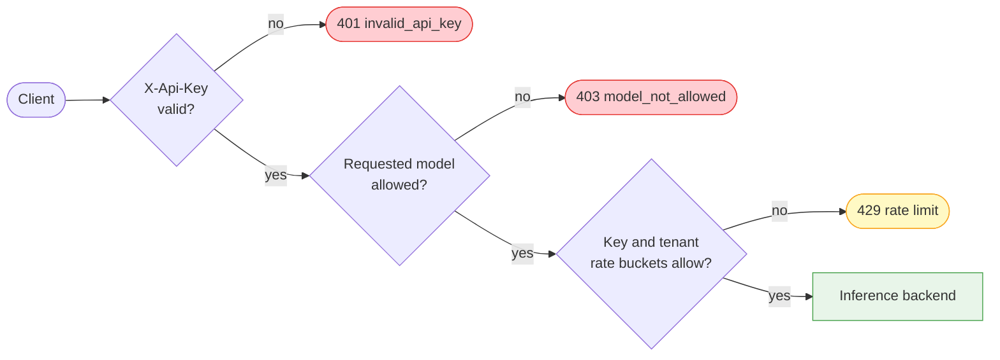

# API Key Management

Use the AI Gateway key API to create, inspect, rotate, and revoke
workload credentials. On a `mode: 4` rule with `api_key_auth: required`, the
request path enforces key validity, model allow-lists, per-key request rate,
and the configured quota ladder. This declaration is independent of
`sse_mode` and `pd_disagg_mode`.

## Request path



API-key configuration uses an independent PostgreSQL data-plane store. It does
not depend on the management user service. Management operations use a
control-plane bearer identity when management authentication is configured;
inference requests use `X-Api-Key` and never use the management bearer token.

!!! warning "Development-source behavior"
    The independent key store and authentication-plane separation described on this page are
    implemented in the current development source but have not completed release qualification.
    Confirm the flags and API schema exposed by the exact image you deploy.

!!! danger "The service declaration, not SSE or P/D, activates authentication"
    Omitted `api_key_auth` preserves a backend-owned `X-Api-Key`. Explicit `disabled` strips that
    header without validating it. `required` validates and strips it. If a `required` rule has no
    usable key store, the request fails closed with `503 policy_store_unavailable`; an unknown key
    returns `401 invalid_api_key`. Prove those two failures separately and require a zero backend
    receipt delta before exposure.

!!! danger "A key store does not protect the management listener"
    The key lifecycle routes are registered independently of `--userservice`. If none of the
    management authentication modes (`--userservice`, `--oauth2`, or `--manualtoken`) is enabled,
    the current authorizer grants management requests unrestricted access. Before exposing port
    `11111`, enable one management authentication mode and verify an unauthenticated key-creation
    request returns `401`.

## Security rules

- Use TLS for both control-plane and inference traffic outside an isolated
  lab.
- Create one key per workload and environment, with the smallest model list and
  rate limits it needs.
- The create response is the only place that returns the raw key. List and get
  return metadata only.
- Never put a raw key in a URL, log, metric label, Git repository, screenshot,
  or support ticket.
- Prefer protected header files or a secret-aware client over credentials in
  command arguments.

Prepare a management header file:

```bash
export CONTROL_API="https://gateway.example.com/netlox/v1"
install -m 600 /dev/null ./control-plane.headers
printf 'Authorization: Bearer %s\n' "$CONTROL_PLANE_TOKEN" > ./control-plane.headers
```

## Endpoints

| Method | Path | Purpose |
|---|---|---|
| `POST` | `/config/ai/apikey` | Create a key; raw value is returned once |
| `GET` | `/config/ai/apikey?tenant_id=...` | List key summaries, optionally by tenant |
| `GET` | `/config/ai/apikey/{key_id}` | Read one key summary |
| `PATCH` | `/config/ai/apikey/{key_id}` | Update `allowed_models`, `enabled`, `rate_limit_rps`, `burst_size`, and/or `tokens_per_min`; raw-middleware route |
| `DELETE` | `/config/ai/apikey/{key_id}` | Permanently delete a key |
| `POST` | `/config/ai/tenant/ratelimit` | Set tenant RPS and token quotas |
| `GET` | `/config/ai/tenant/ratelimit/{tenant_id}` | Read tenant limits |

## Create a key

Only `tenant_id` is required, but a production key should be explicitly
scoped:

```bash
curl --fail-with-body --silent --show-error \
  --request POST "$CONTROL_API/config/ai/apikey" \
  --header @control-plane.headers \
  --header 'Content-Type: application/json' \
  --data '{
    "tenant_id": "team-a",
    "name": "chat-service",
    "allowed_models": ["example-chat-model"],
    "rate_limit_rps": 5,
    "burst_size": 10,
    "tokens_per_min": 0,
    "enabled": true
  }' > ./new-key.json

jq '{key_id, raw_key_present: (.raw_key | type == "string")}' ./new-key.json
```

Expected result: `201 Created`, with `key_id` and `raw_key`. Move the raw value
directly into your secret manager, then securely remove the temporary file.

| Field | Type | Meaning |
|---|---|---|
| `tenant_id` | String | Owning tenant; required |
| `name` | String | Non-secret operator label |
| `api_key` | String | Optional caller-supplied key for a controlled credential import; write-only |
| `allowed_models` | String array | Exact model identifiers this key may use |
| `rate_limit_rps` | Integer | Per-key requests per second; `0` disables this limit |
| `burst_size` | Integer | Per-key request bucket capacity |
| `tokens_per_min` | Integer | The implementation charges a per-key TPM bucket and denies the next request after debt; primary Swagger text is stale, so published support remains pending contract convergence |
| `expires_at` | RFC 3339 timestamp | Optional key expiry |
| `enabled` | Boolean | Defaults to enabled when omitted |

An empty model list records no model restriction. Prefer an explicit list when
the workload should use only known models.

The implementation is authoritative for observed behavior: the current limiter
and tests charge and latch a per-key bucket. The frozen primary Swagger text
incorrectly calls the field stored-only metadata, while `swagger-extras.yml`
describes PATCH enforcement. Until the primary schema text is corrected and
release-qualified, do not call per-key TPM a supported release contract; use
tenant/user/model or shared-VIP limits when a published guarantee is required.

The normal path omits `api_key`, lets the Gateway generate the credential, and
receives it once as `raw_key`. The development contract also accepts a
caller-supplied key between 16 and 512 printable, non-space ASCII characters.
That path stores only its SHA-256 hash and never echoes the supplied value.

!!! warning "Imported-key response boundary"
    The current handler returns an empty `raw_key` value for an imported key, while the development
    Swagger description says the field is omitted and its response schema still marks `raw_key` as
    required. Do not automate against empty-versus-absent behavior until the release contract
    resolves this mismatch. Generated-key responses are unaffected.

## List and inspect without exposing the secret

```bash
curl --fail-with-body --silent --show-error \
  --get "$CONTROL_API/config/ai/apikey" \
  --header @control-plane.headers \
  --data-urlencode 'tenant_id=team-a' \
  | jq 'map({key_id, name, allowed_models, enabled, expires_at})'

curl --fail-with-body --silent --show-error \
  --header @control-plane.headers \
  "$CONTROL_API/config/ai/apikey/$KEY_ID" \
  | jq '{key_id, tenant_id, name, allowed_models, enabled, expires_at}'
```

Verify that neither response contains `raw_key` nor `key_hash`. Avoid listing
all tenants unless your role and operational need require it.

## Disable, rotate, and delete

Disable is reversible and is useful for a controlled cutover:

```bash
curl --fail-with-body --silent --show-error \
  --request PATCH \
  --header @control-plane.headers \
  --header 'Content-Type: application/json' \
  --data '{"enabled":false}' \
  "$CONTROL_API/config/ai/apikey/$OLD_KEY_ID"
```

Expected result: `204 No Content`. The route is described in the companion
`swagger-extras.yml` contract because it is dispatched before the generated
OpenAPI handler chain.

1. Create a replacement with the same or narrower permissions.
2. Store it in the workload's secret manager.
3. Roll the workload to the replacement.
4. Verify authorized requests succeed and old-key traffic has stopped.
5. Permanently delete the old key:

```bash
curl --fail-with-body --silent --show-error \
  --request DELETE \
  --header @control-plane.headers \
  "$CONTROL_API/config/ai/apikey/$OLD_KEY_ID"
```

Expected result: `204 No Content`; subsequent get returns not found. Prove
that inference use fails on the same `mode: 4` rule declaring
`api_key_auth: required`. A rule that omits the field does not enter the key
gate. A delete is permanent—create a new key if access is needed again.

Disable, allow-list changes, and delete evict the local authentication and
key-summary caches before the operation returns. The development HA path also
sends a best-effort invalidation to peers. An unreachable or older peer may
continue using a cached entry until its five-minute cache TTL expires, so do
not describe peer invalidation as an instantaneous cluster-wide revocation
guarantee.

## Verify data-plane enforcement

Write the inference header without printing its value:

```bash
install -m 600 /dev/null ./inference.headers
printf 'X-Api-Key: %s\n' "$INFERENCE_API_KEY" > ./inference.headers
```

| Test | Expected response |
|---|---|
| Valid key and allowed model | Backend response |
| No key or unknown key | `401 invalid_api_key` |
| Disabled, expired, or revoked key | `401` |
| Valid key, disallowed model | `403 model_not_allowed` |
| Burst over key or tenant request bucket | `429` |
| Required rule with no/evaluable store | `503 policy_store_unavailable` |

Run destructive or throttling probes only with a dedicated non-production
tenant. Give each request a non-secret nonce and require backend receipt delta
`0` for every `401`, `403`, `429`, and `503`; a client status alone does not
prove non-delivery. Never print the test key in the result.

## Tenant limits

Tenant RPS, aggregate TPM, per-model TPM, and token burst capacity use the
tenant rate-limit API. These limits are shared by the tenant's keys and are
explained step by step in [AI Traffic Governance](ai-traffic-governance.md).

## Troubleshooting

| Symptom | Likely cause | Action |
|---|---|---|
| Create returns `400` | Missing tenant or invalid body | Validate JSON and provide a non-empty `tenant_id` |
| Management call returns `401` | Management credential missing or expired | Refresh through the approved identity workflow |
| Management call returns `403` | Authenticated viewer or unknown role attempted a mutation | Use an explicitly authorized administrator; do not widen the viewer role |
| Key or quota call returns `503 ai_key_store_unconfigured` | `--aikey-db-host` is unset | Stop exposure, configure the independent key store, and re-run missing-key probes |
| Key or quota call returns `503 ai_key_store_unavailable` | A configured store did not initialize or is unreachable | Restore the store and verify the reconnect; do not bypass the key check |
| Inference call returns `401` | Key missing, unknown, disabled, expired, or revoked | Inspect summary by `key_id`; do not log the raw key |
| Required inference call returns `503 policy_store_unavailable` | No store, unreachable store without a usable cached answer, or policy evaluation failure | Restore the store; do not relabel this as an invalid client key |
| Inference call returns `403` | Effective model is not allowed | Compare the exact model with `allowed_models` |
| Inference call returns `429` | Key/tenant RPS or token quota | Inspect the error reason, `Retry-After`, and metrics |
| Key cannot be recovered | Raw value was not stored | Revoke the record and rotate to a new key |
| CRUD fails despite valid management auth | Independent PostgreSQL key store unavailable | Restore the data-plane store securely; management-user health does not prove key-store health |

## Cleanup

```bash
rm -f ./new-key.json ./control-plane.headers ./inference.headers
unset CONTROL_PLANE_TOKEN INFERENCE_API_KEY KEY_ID OLD_KEY_ID
```

## Related pages

- [AI Traffic Governance](ai-traffic-governance.md)
- [SSE and Quota Management](sse-quota-management.md)
- [AI Quotas and QoS](../operations/ai-qos.md)
- [AI Key Store Operations](../operations/ai-key-store.md)
- [Management API Authentication](../security/management-api-authentication.md)
- [Data-Plane Authentication and JWT](../security/data-plane-jwt-auth.md)
- [Monitoring and Metrics](../operations/monitoring.md)
