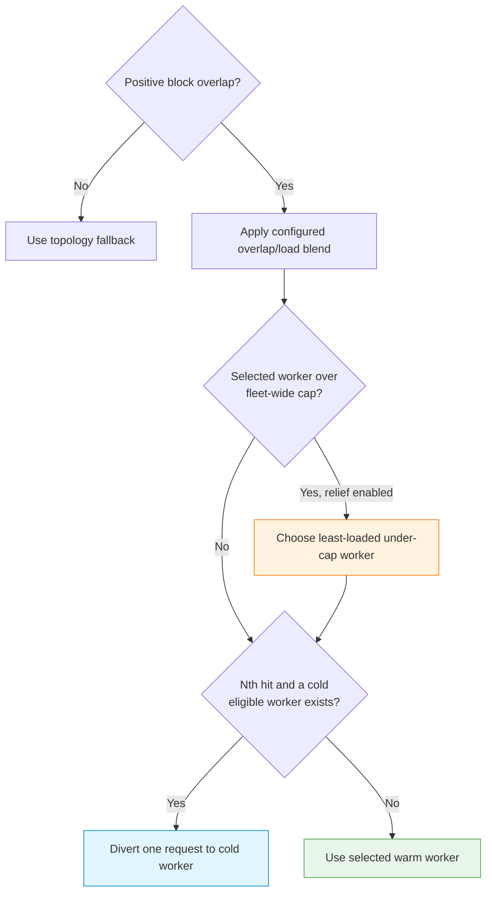

# KV-Cache-Aware Routing

Route each inference request to the backend that already holds the matching
prompt prefix in its GPU KV cache, so tokens are reused instead of recomputed.
This is the **Tier 1.5** stage of the routing cascade.

## Concept

During inference an engine stores per-token key/value attention
tensors in GPU memory — the **KV cache**. If a follow-up request lands on a
backend that already cached the shared prefix (a system prompt, a running
conversation, a repeated document), that backend can skip prefill for those
tokens. If it lands anywhere else, the whole prefix is recomputed from scratch.
KV-cache-aware routing exists to keep matching prefixes and matching backends
together.

loxilb does this with **block-hash prefix routing**, and the key property is
that it moves *hashes, not tensors*:

- vLLM and SGLang publish **KV-cache block events** on ZMQ. TensorRT-LLM exposes
  a destructive HTTP event drain on each serving port. loxilb consumes the
  selected engine's event contract and builds a per-endpoint **block inventory**.
  llama.cpp has no supported Gateway KV-event contract.
- vLLM and SGLang ultimately contribute 8-byte block keys. TensorRT-LLM sends
  event envelopes with token sequences; the Gateway rehashes those tokens into
  its internal keys. The multi-gigabyte KV tensors never leave the GPU. Inventory updates track evictions within one
  message cycle, so routing reflects current GPU memory state.
- On each request loxilb tokenizes the prompt with a **staged tokenizer**,
  groups token IDs into fixed-size blocks, hashes each block with the configured
  algorithm, and picks the endpoint whose inventory overlaps the most prompt
  blocks. No explicit conversation ID is required — the prompt content *is* the
  key.

On a P/D rule (`kvExactMode: 1`), Tier 1.5 runs after session/trie affinity and
before the P/D load fallback. On a role-less single pool (`kvExactMode: 3`),
there is no P/D session, trie, or admission ladder: a KV miss falls back to the
rule's own `sel` algorithm. See [Routing Hierarchy](../use-cases/routing-hierarchy.md).

!!! note "Prerequisite: fullproxy"
    KV-cache-aware routing requires `mode: 4` (fullproxy). loxilb must terminate
    HTTP to read the prompt body before it can tokenize and hash it. Lower LB
    modes cannot inspect request bodies and so cannot drive Tier 1.5.

## Configuration fields

All fields below are `serviceArguments` on the load-balancer rule (verbatim from
the API schema — defaults and ranges are authoritative).

| Field | Type | Default | Range / enum | Purpose |
|---|---|---|---|---|
| `kvExactMode` | int | `0` | `0`–`3` | `0`=off; `1`=P/D role-partitioned pool; `2`=reserved and not implemented; `3`=role-less single pool. Engine transport comes from `kvEngineType`. |
| `kvBlockSize` | int | `16` | `≥ 1` | Tokens per hashed block. **Must match** the engine's block/page size. |
| `kvHashAlgo` | string | engine-derived when omitted | `sha256_cbor`, `xxhash_cbor`, `sha256_sglang`, `blockhash_trtllm` | Prefer omission so the engine selects a coherent default. Explicit engine/algorithm mismatches are rejected. |
| `kvZmqPort` | int | `5557` | `1`–`65535` | Base ZMQ port for vLLM/SGLang. Do not set a non-default value for TensorRT-LLM; it uses HTTP on the serving port. |
| `kvWarmupSec` | int | `30` | `≥ 0` | **Accepted but currently inert** — intended as a Tier 1.5 warmup delay after subscriber connect, but the timer is never armed; Tier 1.5 activates without waiting. Do not design procedures around it. |
| `kvEngineType` | string | `vllm` | `vllm`, `sglang`, `trtllm`, `llamacpp` | Engine contract for the rule; **immutable after create**. llama.cpp accepts plain load balancing only and rejects KV-exact/P/D controls. |
| `kvDpRankCount` | int | `1` | `1`–`8` | SGLang data-parallel rank count. Rank *N* publishes at `kvZmqPort + N`; all ranks union into one endpoint inventory. Keep `1` for other engines. |
| `kvExactApiMode` | string | profile surfaces or legacy `both` when omitted | `completions`, `chat`, `both` | REST-only strict API-surface declaration. Requires KV-exact and is immutable. |
| `kvModelProfile` | string | profile-less legacy mode when omitted | published profile ID | REST-only strict tokenizer/template binding. Requires KV-exact; discover it before create and verify `kvexactstatus` afterward. |
| `LLB_KV_MIN_MATCH_TOKENS` | environment | `16` | `0`–`4096` | Skip KV-exact scoring for shorter prompts. `0` disables this guard. |

!!! warning "One engine per VIP"
    `kvEngineType` is fixed at rule-create time. A single loxilb gateway can
    carry many engine rules side by side, but each
    VIP:port rule speaks exactly one engine's contract. To switch a VIP's engine,
    delete the rule and recreate it.

## The block-hash parity contract

Cache-aware routing works **only** if loxilb reproduces the engine's block
hashes bit-for-bit. This is an **all-or-nothing** contract: if any single leg is
mismatched, hash overlap is **0%**, no backend ever "matches," and every request
silently falls through to the load-based tier. There is no error — only a
mysterious 0% hit rate. Get every leg right.

### vLLM parity triad

For `kvEngineType: "vllm"` (`kvExactMode: 1`), align these three legs between
your vLLM launch and the loxilb rule:

1. **Seed** — vLLM `PYTHONHASHSEED` must equal loxilb's `LLB_KV_NONE_HASH_SEED`.
   This seeds the "none hash" that anchors the first block of every chain. Current Gateway main
   refuses vLLM KV-exact rule creation with HTTP `412` unless the Gateway seed is nonempty and at
   most 23 bytes.
2. **Hash algorithm** — vLLM `--prefix-caching-hash-algo=sha256_cbor` must equal
   the rule's `kvHashAlgo`. vLLM's *default* is a pickle-based `sha256` that is
   not portable across processes — you must select the `*_cbor` variant on both
   sides. Pairing: `sha256_cbor ↔ sha256_cbor`, `xxhash_cbor ↔ xxhash_cbor`.
   The Gateway's internal implementation uses XXH3-128 before truncation; operators configure
   the public `xxhash_cbor` contract, not an `xxhash128` value.
3. **Block size** — vLLM `--block-size` must equal `kvBlockSize` (both `16` in
   the reference topology). CPU vLLM defaults to `128`, so this is easy to miss.

Before presenting or submitting a vLLM KV-exact rule, query
`GET /netlox/v1/status/capabilities` and require the `kv_exact_vllm` entry to report
`ready=true`. `KV_EXACT_SEED_UNSET` and `KV_EXACT_SEED_TOO_LONG` are launch-environment
preconditions; changing the rule body cannot satisfy them. The capability query is a REST-only,
current-main surface and does not replace tokenizer, event-stream, inventory, or hit-counter
verification. See [Readiness, Capabilities, Diagnostics, and Maintenance](../operations/readiness-diagnostics-maintenance.md).

Under the hood the vLLM contract encodes each block as a canonical CBOR tuple
`[parent_hash, [token_ids…], null]`, hashes it, and takes the **last** 8 digest
bytes big-endian as the u64 key. The PUB socket binds `tcp://*:5557` and vLLM
must run with `VLLM_KV_EVENTS_USE_INT_BLOCK_HASHES=1`.

### SGLang parity triad

For `kvEngineType: "sglang"` (`kvExactMode: 3`, single-role — all endpoints are
KV candidates, no prefill/decode split), align these three legs instead:

1. **Page size** — SGLang `--page-size` must equal `kvBlockSize`. SGLang's page
   size is model-dependent; read the running value from the server's
   `/get_server_info` before setting the rule.
2. **Tokenizer** — the served model must match the staged `tokenizer.json` for
   that model slug on the loxilb host (see below). Token IDs must be identical on
   both sides or no block can ever match.
3. **Engine identity** — set `kvEngineType: "sglang"` and preferably omit
   `kvHashAlgo`. Omission derives `sha256_sglang`. An explicit
   `sha256_sglang` is accepted, while an incoherent engine/algorithm pair is
   rejected at rule creation.

The SGLang contract differs from vLLM on the wire: the u64 key is the **first**
8 digest bytes big-endian (the inverse of vLLM), there is no CBOR envelope, and
keys travel as **signed int64**. Block 0 has no parent. With data parallelism,
set `kvDpRankCount = --dp-size`; rank *N* publishes at `kvZmqPort + N` and all
ranks union into that endpoint's single inventory.

!!! tip "Deep dives"
    For the full architecture, launch flags, and side-by-side hash walkthroughs
    see [KV-Cache-Aware Routing (use-case)](../use-cases/kv-cache-aware-routing.md)
    and [SGLang Routing](../use-cases/sglang-routing.md).

## Load safety and cold-endpoint recovery

KV affinity is bounded so one hot prefix does not permanently monopolize one
worker, and a restarted worker can re-enter a warm fleet.



- `LOXILB_KV_SPILL_RELIEF` is tri-state. When unset, relief is on for
  single-pool mode 3 and off for P/D mode 1. An explicit on/off value overrides
  that behavior process-wide.
- `LOXILB_KV_COLDSTART_SEED_N` defaults to `16`: while an eligible worker is
  cold, every sixteenth Tier-1.5 hit is diverted to the lowest-index cold
  worker. `0` disables seeding.
- `LOXILB_KV_COLDSTART_MIN_BLOCKS` defaults to `16`; an inventory below that
  floor is cold. `0` means strictly empty-only.
- Watch `loxilb_pd_kv_tier15_spills_total` and
  `loxilb_pd_kv_tier15_cold_seeds_total` to distinguish normal affinity from
  load relief and recovery traffic.

These knobs are process-wide. Change them only with a staged workload test,
because a spill or seed deliberately trades one cache-local request for fleet
health.

## Tokenizer staging

loxilb tokenizes prompts with the model's HuggingFace `tokenizer.json`, staged
on the loxilb host at:

```
/etc/loxilb/tokenizers/<model-slug>/tokenizer.json
```

The **model slug** is the served model name with every `/` replaced by `__`:

| Served model name | Model slug | Path |
|---|---|---|
| `Qwen/Qwen3-0.6B` | `Qwen__Qwen3-0.6B` | `/etc/loxilb/tokenizers/Qwen__Qwen3-0.6B/tokenizer.json` |
| `meta-llama/Llama-3-8B` | `meta-llama__Llama-3-8B` | `/etc/loxilb/tokenizers/meta-llama__Llama-3-8B/tokenizer.json` |

```bash
mkdir -p /etc/loxilb/tokenizers/Qwen__Qwen3-0.6B/
wget -O /etc/loxilb/tokenizers/Qwen__Qwen3-0.6B/tokenizer.json \
  https://huggingface.co/Qwen/Qwen3-0.6B/raw/main/tokenizer.json
```

!!! warning "Missing tokenizer = silent fall-through"
    If the tokenizer file is missing, unreadable, or the slug does not match the
    served `model` name exactly (case-sensitive), Tier 1.5 is skipped and routing
    falls through to the load-based tier. There is no request error.

## Configuration

Configure a rule with `POST /netlox/v1/config/loadbalancer` on port `11111`.
Both examples below mirror the reference topologies (VIP `10.10.10.254`, prefill
endpoints `192.0.2.1 / 203.0.113.1 / 198.51.100.101`).

!!! warning "Protect the management API"
    The `curl` examples use plain HTTP for an isolated lab. In production, use an authenticated,
    TLS-protected management endpoint and load its authorization header from a
    permission-restricted file.

### vLLM KV-exact rule (`kvExactMode: 1`)

A fullproxy P/D service carrying `kvExactMode: 1`. Prefill endpoints
(`ep_role: 1`) are the KV-selection candidates; decode endpoints (`ep_role: 2`)
are never Tier-1.5 targets.

=== "curl"
    ```bash
    curl -s -X POST http://10.10.10.254:11111/netlox/v1/config/loadbalancer \
      -H "Content-Type: application/json" \
      -d '{
        "serviceArguments": {
          "externalIP": "10.10.10.254",
          "port": 8080,
          "protocol": "tcp",
          "sel": 0,
          "mode": 4,
          "pd_disagg_mode": true,
          "kvExactMode": 1,
          "kvZmqPort": 5557,
          "kvHashAlgo": "sha256_cbor",
          "kvWarmupSec": 30,
          "kvBlockSize": 16
        },
        "endpoints": [
          {"endpointIP": "192.0.2.1", "targetPort": 8080, "weight": 1, "ep_role": 1},
          {"endpointIP": "198.51.100.1", "targetPort": 8080, "weight": 1, "ep_role": 2},
          {"endpointIP": "203.0.113.1", "targetPort": 8080, "weight": 1, "ep_role": 1},
          {"endpointIP": "192.0.2.101", "targetPort": 8080, "weight": 1, "ep_role": 2},
          {"endpointIP": "198.51.100.101", "targetPort": 8080, "weight": 1, "ep_role": 1},
          {"endpointIP": "203.0.113.101", "targetPort": 8080, "weight": 1, "ep_role": 2}
        ]
      }'
    ```
=== "loxicmd"
    ```bash
    loxicmd create lb 10.10.10.254 --tcp=8080:8080 --endpoints=192.0.2.1:1,198.51.100.1:1,203.0.113.1:1,192.0.2.101:1,198.51.100.101:1,203.0.113.101:1 --mode=fullproxy --pd-disagg --kv-exact-mode=1 --kv-zmq-port=5557 --kv-hash-algo=sha256_cbor --kv-warmup=30 --kv-block-size=16 --ep-role=prefill,decode,prefill,decode,prefill,decode
    ```

### SGLang KV-exact rule (`kvExactMode: 3`)

A single-role service: `kvExactMode: 3`, `kvEngineType: "sglang"`, no `ep_role`
on the endpoints (every endpoint is a KV candidate), `kvHashAlgo` **omitted**,
and `kvDpRankCount` equal to the SGLang `--dp-size`.

=== "curl"
    ```bash
    curl -s -X POST http://10.10.10.254:11111/netlox/v1/config/loadbalancer \
      -H "Content-Type: application/json" \
      -d '{
        "serviceArguments": {
          "externalIP": "10.10.10.254",
          "port": 9090,
          "protocol": "tcp",
          "sel": 0,
          "mode": 4,
          "kvExactMode": 3,
          "kvEngineType": "sglang",
          "kvDpRankCount": 3,
          "kvZmqPort": 5561,
          "kvWarmupSec": 30,
          "kvBlockSize": 16
        },
        "endpoints": [
          {"endpointIP": "198.51.100.101", "targetPort": 8080, "weight": 1},
          {"endpointIP": "203.0.113.101", "targetPort": 8080, "weight": 1},
          {"endpointIP": "192.0.2.102", "targetPort": 8080, "weight": 1}
        ]
      }'
    ```
=== "loxicmd"
    ```bash
    loxicmd create lb 10.10.10.254 --tcp=9090:8080 --endpoints=198.51.100.101:1,203.0.113.101:1,192.0.2.102:1 --mode=fullproxy --kv-exact-mode=3 --kv-engine-type=sglang --kv-dp-ranks=3 --kv-zmq-port=5561 --kv-warmup=30 --kv-block-size=16
    ```

With `kvDpRankCount: 3` and `kvZmqPort: 5561`, loxilb subscribes to ranks at
`5561`, `5562`, and `5563` on each endpoint and unions them into one inventory
per endpoint.

## Verify

For a strict rule, first discover the profile and retain its registry generation and artifact
digests. After create, `GET .../kvexactstatus` is the mandatory readiness check; a successful
`POST`, load-balancer read-back, or nonempty inventory does not prove that the composed binding is
enforced. See [Model Profiles and KV-Exact Readiness](model-profiles-kv-readiness.md).

Confirm the rule is live and carries the KV fields you set:

--8<-- "snippets/common/load-balancer-readback-rest.md"

Look for `kvExactMode`, `kvBlockSize`, `kvHashAlgo` (vLLM) or `kvEngineType` /
`kvDpRankCount` (SGLang) on the rule. On a strict rule, also require the intended
`kvModelProfile` and `kvExactApiMode`.

Query the dedicated status read model for a strict rule:

```bash
curl -s "http://10.10.10.254:11111/netlox/v1/config/loadbalancer/externalipaddress/10.10.10.254/port/8080/protocol/tcp/kvexactstatus" \
  | jq '.kvExactStatusAttr[] | {
    modelName, modelProfileId, modelProfileGen, apiMode,
    bindingDigest, desiredState, enforcedState, reasonCodes,
    enforcement
  }'
```

Require `READY` for normal strict qualification. Keep `READY_FUNCTIONAL_ONLY` distinct, and treat
unknown states as not ready/in transition. A legacy rule reports
`LEGACY_ACTIVE_UNATTESTED`; it is active but not strict or attested.

Then inspect the live per-endpoint block inventory with the raw-middleware
endpoint:

```bash
curl -s "http://10.10.10.254:11111/netlox/v1/config/ai/kv/inventory?service_id=0&ep_idx=0"
```

```json
{
  "service_id": 0,
  "ep_idx": 0,
  "hash_algo": "sha256_cbor",
  "blocks": [
    {"block_idx": 0, "hash_uint64": 1234567890123456789}
  ],
  "total": 42
}
```

- `service_id` — numeric service identifier (uint32); `ep_idx` — the endpoint
  index within the service. Both query parameters are required.
- `total` — number of blocks currently tracked for that endpoint. A non-zero,
  growing `total` on your KV-candidate endpoints (prefill EPs for `kvExactMode: 1`;
  all EPs for `kvExactMode: 3`) is the proof the subscriber is connected and ingesting.
- `block_idx` is a synthetic sequence index (map iteration order), not a semantic
  block position. For SGLang, an endpoint's inventory is the **union** of all its
  ranks.

!!! note "Raw middleware — not in generated clients"
    `GET /config/ai/kv/inventory` is served by the API-server's global
    middleware and bypasses code generation, so it is **absent from the generated
    API clients**. Drive it with raw `curl`. See
    [swagger-extras](../reference/swagger-extras.md).

## Troubleshoot

### 0% cache hits — a mismatched parity leg

**Symptom:** the rule is live and inventories are populating, but no request is
ever routed by cache match — everything falls through to the load-based tier.

**Cause:** the block-hash contract is all-or-nothing. A single mismatched leg
makes loxilb's hashes disagree with the engine's, so overlap is 0% and Tier 1.5
silently falls through. Walk the triad for your engine:

- **vLLM** — confirm all three legs: `PYTHONHASHSEED` == `LLB_KV_NONE_HASH_SEED`;
  vLLM `--prefix-caching-hash-algo` == rule `kvHashAlgo` (both a `*_cbor` value,
  not vLLM's default `sha256`); vLLM `--block-size` == `kvBlockSize`.
- **SGLang** — confirm: `--page-size` == `kvBlockSize`; served model == staged
  tokenizer slug; `kvEngineType: "sglang"` with `kvHashAlgo` omitted or explicitly set only to
  `sha256_sglang`. Any other explicit algorithm is rejected as incoherent.

### Inventory stays empty

**Symptom:** `total` is `0` for every endpoint.

**Check:**

1. **Engine publishing** — the backend must publish KV events (vLLM
   `--kv-events-config` on the ZMQ publisher; SGLang KV-event export enabled).
2. **Port reachability** — `kvZmqPort` (and `kvZmqPort+1..+N` for SGLang ranks)
   must be reachable from loxilb to each endpoint over TCP. Test with
   `nc -zv <endpoint-ip> 5557`.
3. **Publisher liveness** — the PUB socket only emits while the engine is
   serving. loxilb's subscriber reconnects automatically after a restart, then
   re-ingests.

### Tier 1.5 never activates

**Check:**

1. **Mode** — the rule must be `mode: 4` (fullproxy). Lower modes cannot read
   the prompt body.
2. **Inventory** — give the ZMQ subscriber time to receive KV events and populate
   the inventory before testing. (`kvWarmupSec` does **not** gate this — the field
   is accepted but currently inert; Tier 1.5 activates as soon as inventory and
   routing conditions are met.)
3. **Tokenizer** — verify `/etc/loxilb/tokenizers/<slug>/tokenizer.json` exists,
   is readable by loxilb, and the slug (`/` → `__`) matches the served `model`
   name exactly.
4. **No match** — if no endpoint holds any matching block for a prompt, Tier 1.5
   correctly declines and routing falls through. This is expected for cold or
   one-shot prompts; it is only a problem when *warm, repeated* prompts miss.

### High miss rate on repeated prompts

1. **Block/page size mismatch** — `kvBlockSize` must equal the engine's block
   (vLLM) or page (SGLang) size, or identical content hashes differently.
2. **HA consistency** — all loxilb instances in an HA pair must use the same
   `kvHashAlgo` and `kvBlockSize`.
3. **Workload fit** — cache-aware routing helps most with shared prefixes
   (system prompts, multi-turn conversations, repeated documents). For unique
   one-shot queries in a plain pool, start with round-robin. Do not assume
   plain-pool selector 9 consumes live GPU metrics; see the
   [vLLM selector boundary](vllm-integration.md).

## Tiered caching with LMCache (advanced)

!!! warning "Advanced — gate this before rollout"
    LMCache adds a second KV cache tier *inside* the engine. It is powerful for
    prefill-heavy, high-reuse workloads, but it composes vLLM, LMCache, and NIXL — a
    stack with **no official compatibility matrix** — and several of its failure modes
    are silent. Validate it on a staging fleet and pin every component's version before
    you put it in front of traffic. Everything above (block-hash routing) works without
    LMCache; this is an optional add-on, not a prerequisite.

Everything earlier on this page moves *hashes, not tensors*: LoxiLB routes a request to
the endpoint that already holds the prefix. LMCache is complementary and lives one layer
down — it gives each engine a **larger place to keep KV** so a prefix survives eviction
from the GPU cache. LoxiLB still does the routing; LMCache changes what "the endpoint
already holds this" can mean.

### What it is

LMCache is wired into vLLM as a **MultiConnector** that composes two connectors:

- `LMCacheConnectorV1` — the tiered KV store: a **CPU** KV tier (and, optionally, a
  remote or peer-to-peer tier) layered *under* the GPU KV cache. When a prefix is
  evicted from GPU memory, its KV can be retrieved from the CPU tier instead of
  recomputed.
- `NixlConnector` — the same P/D transfer connector used for prefill/decode KV handoff.

Composing both lets one vLLM process both participate in P/D transfer *and* back its GPU
cache with a CPU tier. LMCache runs on the **prefill tier only** — decode nodes are
excluded from the connector config.

### Configuration surface

LMCache is configured entirely on the **vLLM launch**, not on the LoxiLB rule — LoxiLB's
KV-exact contract is unchanged. The moving parts:

| Setting | Where | Note |
|---|---|---|
| `--kv-transfer-config` | vLLM flag | MultiConnector JSON naming `LMCacheConnectorV1` + `NixlConnector` |
| `LMCACHE_CONFIG_FILE` | env | Path to `lmcache.yaml` (tier sizes, remote backend, chunk size) |
| `PROMETHEUS_MULTIPROC_DIR` | env | **Must be identical across all vLLM and LMCache processes** (see hazards) |
| chunk size | `lmcache.yaml` | Default **256 tokens**; a prefix must exceed one chunk to be stored |
| decode nodes | topology | **Excluded** — LMCache is configured on prefill nodes only |

The `--kv-transfer-config` is a MultiConnector document (rather than a single
`NixlConnector` object as in the plain P/D case). Keep the engine image tag pinned
(e.g. `vllm/vllm-openai:v0.17.0`): LMCache and NIXL versions travel with the image and a
bump can change the wire behavior.

### Metrics

LMCache exports its own `lmcache:*` Prometheus series. Read the **hit counter**, not the
rate gauge:

| Metric | Use |
|---|---|
| `lmcache:num_hit_tokens` | **Authoritative** hit counter — this is the number to trust |
| `lmcache:retrieve_hit_rate` | **STALE gauge** — can read `1.0` with zero retrieves; informational only, never gate on it |
| `lmcache:local_cache_usage` | CPU-tier occupancy |
| `lmcache:remote_cache_usage` | Remote/P2P-tier occupancy (if configured) |
| `lmcache:time_to_retrieve` | Retrieval latency from a lower tier |

!!! warning "`lmcache:retrieve_hit_rate` is misleading"
    The rate gauge is not reset/recomputed the way you would expect — it can sit at
    `1.0` even when no retrieval has happened. Judge effectiveness by the delta on
    `lmcache:num_hit_tokens` over a known workload, not by the rate.

### Hazards (read before enabling)

- **No official compat matrix.** vLLM × LMCache × NIXL has no vendor-published
  compatibility table. Pin all three (via the engine image tag) and validate the exact
  combination you will run.
- **Nested NIXL layout.** Because NIXL appears both as the P/D connector and under
  LMCache, configure the **HND cache layout** required by the current engine integration.
  A layout mismatch can produce invalid output without a clear transport error, so verify the
  exact pinned engine image with known prompts before admitting production traffic.
- **Prefix caching hides retrievals.** With vLLM prefix caching **ON**, an immediate
  re-issue of the same prompt is served straight from the **GPU** cache, so LMCache
  never retrieves and its counters stay flat — making it look broken. To exercise
  LMCache, **evict first**: drive enough distinct traffic to exceed `num_gpu_blocks` so
  the prefix leaves the GPU cache, *then* re-issue.
- **`PROMETHEUS_MULTIPROC_DIR` must be set and shared.** If it is unset or differs
  between the vLLM and LMCache processes, **all `lmcache:*` series vanish** — you lose
  every metric silently. Set it identically for every process in the deployment.

!!! tip "Parity triad still applies underneath"
    LMCache changes the KV *storage tiers*, not the block-hash contract. LoxiLB's
    routing still depends on the parity triad — `PYTHONHASHSEED` / `LLB_KV_NONE_HASH_SEED`,
    `--block-size` / `kvBlockSize`, and `--prefix-caching-hash-algo` / `kvHashAlgo`.
    Before you attribute a hit-rate change to LMCache, run the read-only preflight in
    [Configuration & Tuning → Environment parity & preflight](../use-cases/configuration-tuning.md#environment-parity-preflight)
    to confirm the triad and the version/platform matrix are still intact.

## Next steps

- [KV-Cache-Aware Routing (use-case)](../use-cases/kv-cache-aware-routing.md) — flagship deep dive: architecture and the vLLM hash contract in full.
- [SGLang Routing](../use-cases/sglang-routing.md) — SGLang architecture, launch flags, and the single-role contract.
- [TensorRT-LLM Integration](tensorrt-llm-integration.md) — destructive HTTP event ownership and context/generation P/D.
- [Model Profiles and KV-Exact Readiness](model-profiles-kv-readiness.md) — strict profile discovery and enforcement status.
- [llama.cpp Integration](llamacpp-integration.md) — the plain-pool alternative for an engine without a supported KV event plane.
- [LLM Routing](llm-routing.md) — the full routing-tier cascade.
- [P/D Disaggregation](pd-disaggregation.md) — combine KV routing with prefill/decode separation.
- [Configuration Reference](configuration-reference.md) — every `serviceArguments` field.
