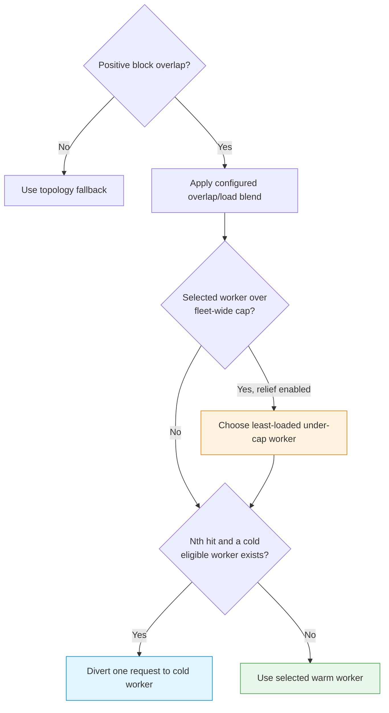

# KV-Exact Fields and Load Safety

Use [routing concepts](../concepts/kv-routing.md) for the mechanism,
[Engine Contracts](engine-contracts.md) for engine-specific parity, and the
[converged guide](../use-cases/model-engine-standard/matrix-manual.md) for commands.
This reference owns KV-specific API fields and load-safety semantics. General
routing, process and P/D settings are in [Configuration and Arguments](../use-cases/configuration-tuning.md).

## Configuration fields

The single [REST KV field table](configuration-reference.md#4-kv-cache-exact-routing)
owns types, defaults, allowed values, engine coherence and binding mutability.
Use [profile readiness](model-profiles-kv-readiness.md) for strict admission and
`kvexactstatus`. The process-only `LLB_KV_MIN_MATCH_TOKENS` control is documented
with the [process environment](../use-cases/configuration-tuning.md#c-data-plane-tier-15-parity-admission-timeouts),
not as a REST field.

!!! warning "One engine per VIP"
    `kvEngineType` is fixed at rule-create time. A single loxilb gateway can
    carry many engine rules side by side, but each
    VIP:port rule speaks exactly one engine's contract. To switch a VIP's engine,
    delete the rule and recreate it.

## Load safety and cold-endpoint recovery

KV affinity is bounded so one hot prefix does not permanently monopolize one
worker, and a restarted worker can re-enter a warm fleet.

```mermaid
flowchart TD
    HIT{Positive block overlap?}
    HIT -->|No| FALLBACK[Use topology fallback]
    HIT -->|Yes| BLEND[Apply configured overlap/load blend]
    BLEND --> RELIEF{Selected worker over<br/>fleet-wide cap?}
    RELIEF -->|Yes, relief enabled| SPILL[Choose least-loaded under-cap worker]
    RELIEF -->|No| SEED{Nth hit and a cold<br/>eligible worker exists?}
    SPILL --> SEED
    SEED -->|Yes| COLD[Divert one request to cold worker]
    SEED -->|No| WARM[Use selected warm worker]

    style SPILL fill:#fff3e0,stroke:#f57c00
    style COLD fill:#e1f5fe,stroke:#0288d1
    style WARM fill:#e8f5e9,stroke:#43a047
```

- `LOXILB_KV_SPILL_RELIEF` is tri-state. When unset, relief is on for
  single-pool mode 3 and off for P/D mode 1. An explicit on/off value overrides
  that behavior process-wide.
- `LOXILB_KV_COLDSTART_SEED_N` defaults to `16`: while an eligible worker is
  cold, every sixteenth Tier-1.5 hit is diverted to the lowest-index cold
  worker. `0` disables seeding.
- `LOXILB_KV_COLDSTART_MIN_BLOCKS` defaults to `16`; an inventory below that
  floor is cold. `0` means strictly empty-only.
- Watch `loxilb_pd_kv_tier15_spills_total` and
  `loxilb_pd_kv_tier15_cold_seeds_total` to distinguish normal affinity from
  load relief and recovery traffic.

These knobs are process-wide. Change them only with a staged workload test,
because a spill or seed deliberately trades one cache-local request for fleet
health.

## Profile and tokenizer preparation

For strict Exact, follow [profile discovery and readiness](model-profiles-kv-readiness.md)
and [Step 2](../use-cases/model-engine-standard/prepare.md). Pin revision,
tokenizer/template hashes, engine manifests and fixtures. A raw tokenizer file
alone does not establish a strict model binding. Legacy profile-less shapes
require their own compatibility/evidence boundary. Verify the effective rule and
[actual cache engagement](../operations/kv-routing-verification.md).

## Advanced integrations

[LMCache and the experimental controller](../use-cases/advanced-cache-integrations.md)
have separate version, layout, telemetry and qualification requirements.

<!-- Previous section IDs: kept so old deep links redirect to the current page. -->

- [kv-cache-aware-routing](engine-contracts.md)
- [concept](../concepts/kv-routing.md)
- [the-block-hash-parity-contract](engine-contracts.md)
- [vllm-parity-triad](engine-contracts.md)
- [sglang-parity-triad](engine-contracts.md)
- [tokenizer-staging](engine-contracts.md)
- [configuration](engine-contracts.md)
- [vllm-kv-exact-rule-kvexactmode-1](engine-contracts.md)
- [sglang-kv-exact-rule-kvexactmode-3](engine-contracts.md)
- [verify](../operations/kv-routing-verification.md)
- [troubleshoot](../operations/kv-routing-verification.md)
- [0-cache-hits-a-mismatched-parity-leg](../operations/kv-routing-verification.md)
- [inventory-stays-empty](../operations/kv-routing-verification.md)
- [tier-15-never-activates](../operations/kv-routing-verification.md)
- [high-miss-rate-on-repeated-prompts](../operations/kv-routing-verification.md)
- [tiered-caching-with-lmcache-advanced](../use-cases/advanced-cache-integrations.md)
- [what-it-is](../use-cases/advanced-cache-integrations.md)
- [configuration-surface](../use-cases/advanced-cache-integrations.md)
- [metrics](../use-cases/advanced-cache-integrations.md)
- [hazards-read-before-enabling](../use-cases/advanced-cache-integrations.md)
- [next-steps](engine-contracts.md)

