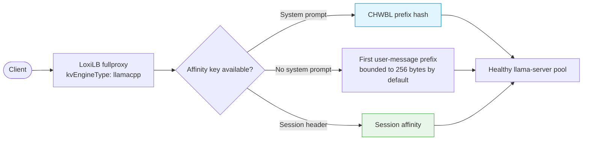
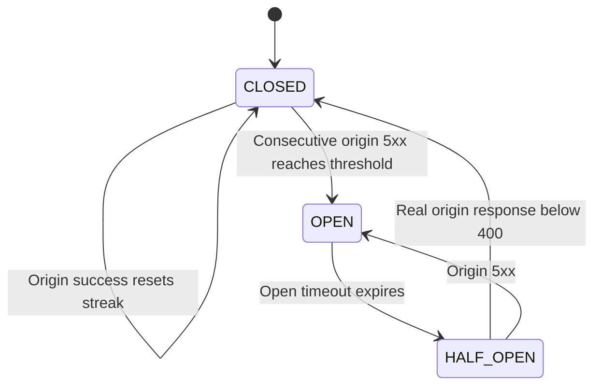

# llama.cpp Integration

--8<-- "snippets/common/mutation-fragment-notice.md"

Place a `llama-server` fleet behind fullproxy load balancing with content or session affinity. llama.cpp intentionally uses a shorter Gateway feature ladder because it exposes neither a supported KV-event plane nor prefill/decode disaggregation.

## Supported capabilities

| Capability | Support |
|---|---|
| OpenAI-compatible L7 load balancing and SSE relay | Yes |
| CHWBL prefix affinity (`sel: 8`) | Yes; recommended for repeating prompt families |
| Session-header affinity | Yes |
| Gateway KV-exact routing | No; `kvExactMode` is rejected |
| Gateway P/D disaggregation | No; `pd_disagg_mode` is rejected |



The system message is the preferred content-affinity key. If a chat request has no system message, the gateway hashes a bounded prefix of the first user message. `LLB_LLM_USER_PREFIX_FALLBACK_LEN` controls the bound; the default is `256`, and `0` disables the fallback. Requests without a usable system or user message receive no content affinity.

!!! warning "Affinity is not authorization"
    Prompt-derived hashes influence endpoint selection only. They do not isolate tenants, protect prompt contents, or replace API authentication and authorization.

## Prerequisites

- A homogeneous `llama-server` fleet with the same GGUF model, quantization, build, and slot configuration.
- Each server bound to a backend-reachable address instead of localhost only.
- `GET /health` and `GET /props` reachable from the Gateway.
- Fullproxy mode for CHWBL and request inspection.
- Engine metrics enabled if endpoint-level llama.cpp observability is required.

Avoid sleeping servers behind an active VIP. A sleeping endpoint can accept placement and then impose a model reload on the next request.

## Configuration

The example addresses are reserved for documentation. The plain HTTP listener is appropriate only for an isolated lab; select the production TLS mode that matches the deployment's trust boundaries.

Prepare an HTTPS management base URL and protected authorization header:

--8<-- "snippets/common/control-api-header.md"

```bash
curl --fail-with-body --silent --show-error \
  --request POST "$CONTROL_API/config/loadbalancer" \
  --header @control-plane.headers \
  --header 'Content-Type: application/json' \
  --data-binary '{
    "serviceArguments": {
      "externalIP": "192.0.2.10",
      "port": 2044,
      "protocol": "tcp",
      "sel": 8,
      "mode": 4,
      "security": 0,
      "kvEngineType": "llamacpp",
      "sse_mode": true,
      "host": "192.0.2.10",
      "monitor": true,
      "cb_enable": true,
      "probetype": "http",
      "probeport": 8085,
      "probereq": "/health",
      "probeTimeout": 5,
      "probeRetries": 2
    },
    "endpoints": [
      {"endpointIP": "198.51.100.11", "targetPort": 8085, "weight": 1},
      {"endpointIP": "198.51.100.12", "targetPort": 8085, "weight": 1},
      {"endpointIP": "198.51.100.13", "targetPort": 8085, "weight": 1}
    ]
  }'
```

Typing the rule as `llamacpp` activates engine-specific validation, engine identity metrics, and non-blocking `/props` consistency checks. Do not add `kvExactMode`, `pd_disagg_mode`, or an explicit `kvHashAlgo`; they are unsupported.

The current control path does not propagate submitted CHWBL tuning values. The live proxy uses
factor 175, replication 256, flags 0, and salt enforcement off. Verify request distribution against
the released artifact rather than certifying a threshold from stored rule fields.

### Session affinity alternative

For a client that sends a stable session header, use a regular selector and set `session_header_name`:

```json
{
  "sel": 0,
  "session_header_name": "x-session-id"
}
```

Use high-entropy, non-secret session identifiers. Do not put credentials or raw API keys in affinity headers.

## Origin-5xx demotion

Plain llama.cpp rules can demote an endpoint after consecutive origin 5xx responses when the circuit breaker is enabled. Error responses are still relayed to clients; demotion changes later endpoint selection and is not a retry or response-masking mechanism.



The default origin-error threshold is three. `LLB_PD_ORIGIN_ERR_THRESHOLD=0` disables origin-5xx demotion. A 4xx response neither advances nor resets the origin-error streak.

!!! note "Client errors can still look like origin 5xx"
    Some llama.cpp request failures, including malformed JSON, can be returned as 5xx. Validate clients and choose a threshold that does not let repeated malformed requests demote otherwise healthy endpoints.

## Verify

1. Confirm the rule and engine type:

   ```bash
   curl --fail-with-body --silent --show-error \
     --header @control-plane.headers "$CONTROL_API/config/loadbalancer/all" \
     | jq '.lbAttr[] | select(.serviceArguments.port == 2044)'
   ```

2. Send repeated requests with the same system prompt, then confirm they remain successful through the VIP.
3. For streamed requests, set `stream_options.include_usage` if the engine build supports usage in streams and inspect `cached_tokens` as an engine-side affinity signal.
4. Check engine identity and admission warnings:

   Before the first scrape, enable metrics with an authenticated
   `POST /netlox/v1/config/metrics`; see [Monitoring and Metrics](../operations/monitoring.md#enable-and-scrape-metrics).

   ```bash
   curl --fail-with-body --silent --show-error "$CONTROL_API/metrics" \
     | grep -E 'loxilb_ai_engine_info|loxilb_ai_llamacpp_probe_warnings_total'
   ```

5. Scrape each trusted endpoint's own llama.cpp metrics directly when engine-level cache and queue detail is needed.

## Failure diagnosis

| Symptom | Likely cause | Action |
|---|---|---|
| Rule rejects KV or P/D fields | The engine has no supported Gateway event or disaggregation contract | Remove those fields and use CHWBL or session affinity. |
| Repeated prompts land on different endpoints | No usable content key, fallback disabled, or bounded-load spill occurred | Add a stable system prompt or session header; then inspect concurrency and selector settings. |
| `/props` warning appears | Model, build, slots, sleep state, or probe reachability differs | Make the fleet homogeneous before performance testing. |
| `/health` returns 503 during startup | Model is still loading | Keep the endpoint out of service until readiness succeeds. |
| Endpoint leaves rotation after several 5xx responses | Origin-error breaker opened | Correct the engine or client error source and allow a successful half-open origin request to re-admit it. |
| SSE comments appear during a pause | llama.cpp emitted a keepalive comment | Preserve it; it is valid SSE framing. |

## Cleanup

```bash
curl --fail-with-body --silent --show-error \
  --request DELETE --header @control-plane.headers \
  "$CONTROL_API/config/loadbalancer/hosturl/192.0.2.10/externalipaddress/192.0.2.10/port/2044/protocol/tcp"
```

Remove `control-plane.headers` after the workflow and unset `CONTROL_PLANE_TOKEN`.

## Evidence limits

The typed rule guards, affinity extraction, health gating, admission warnings, SSE relay, and origin-5xx breaker behavior have deterministic repository validation. Cache benefit and latency depend on prompt distribution, model context, slot configuration, build, concurrency, and hardware; measure them in the target environment.

## See also

- [Engine Capability Matrix](../concepts/engine-capability-matrix.md)
- [Model Load Balancing](model-load-balancing.md)
- [Monitoring and Metrics](../operations/monitoring.md)
