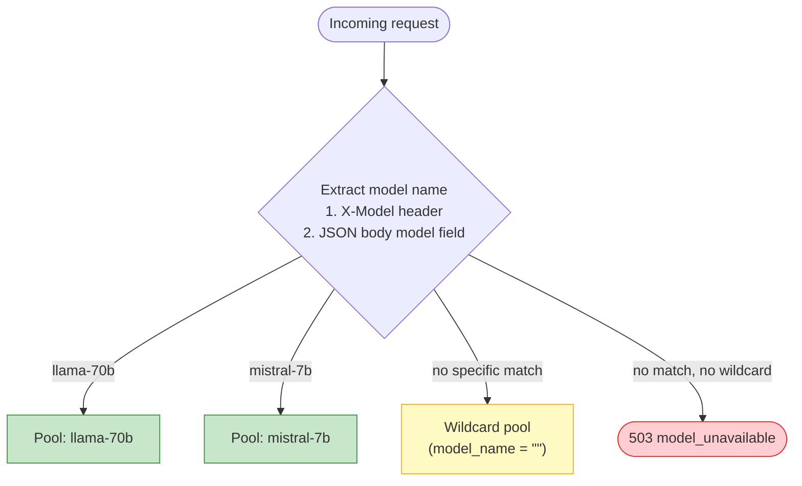

# Model Load Balancing

Model load balancing is **Stage 1** of AI Gateway routing: loxilb reads the requested model name from each request and dispatches it to the backend pool that serves that model. This page covers how model-name matching works, how to configure per-model pools, and how to verify and troubleshoot them.

!!! info "Where this fits"
    AI Gateway routing runs in two sequential stages. This page is Stage 1 (which pool). Once a pool
    is chosen, **Stage 2** picks a specific endpoint within it using the `sel` algorithm — see
    [LLM Routing](llm-routing.md). Both stages run for every request.

## Why standard load balancers can't route by model

A single AI endpoint often fronts several models — a large model for deep reasoning, a smaller one for fast queries, an embedding model for RAG. Each model lives on a different backend pool.

Standard load balancers operate at Layer 4 and never read the HTTP body, so they cannot extract the `"model"` field from an OpenAI-format request and cannot dispatch it to the right pool. loxilb, running in fullproxy mode (`mode: 4`), inspects the HTTP request, extracts the model name, and selects the matching pool — before any backend is touched. Clients keep using a single VIP and the standard OpenAI request format.

---

## How model-name routing works

Each LB rule carries a `model_name`. Multiple rules on the same VIP:port can differ only in `model_name`, each pointing to a different set of endpoints. loxilb determines the target model for a request in this priority order:

1. **`X-Model` HTTP header** (highest priority) — lets a client select a model without modifying the request body.
2. **`"model"` field in the JSON body** — the standard OpenAI-compatible format, extracted from the parsed HTTP body.
3. **Wildcard pool** (lowest priority) — a rule with `model_name` set to the empty string (`""`) catches any request whose model does not match a specific rule.

If neither a specific rule nor a wildcard rule matches, loxilb returns **HTTP 503 `model_unavailable`**.



The `X-Model` header takes precedence over the JSON body, so a client can override the body's model field per request. On keep-alive connections the header is evaluated per request — an empty or absent `X-Model` falls through to the JSON body, then to the wildcard.

!!! danger "Routing and authorization disagree when header and body differ"
    Pool routing is header-first, but the current model-authorization gate evaluates the JSON
    body model first. A request carrying two different model names can therefore be authorized
    for one model and routed to another. Reject conflicting header/body values at a trusted
    upstream proxy, or require clients to send exactly one model source, until the implementation
    uses one canonical model identity for both decisions.

!!! warning "HTTP/2 feature boundary"
    The current HTTP/2 backend path passes an empty model into endpoint lookup and falls back to
    round-robin for selector 9. It does not integrate model-aware pools, selector 10, P/D, or
    KV-exact routing. Use `backend_protocol: http1` for these features; treat HTTP/2 parity as a
    development and release gate.

---

## Prerequisites

!!! warning "FullProxy mode required"
    Model-name routing requires `mode: 4` (FullProxy). L4 modes operate at the connection level and
    cannot inspect the HTTP body to read the `model` field.

| Requirement | Details |
|-------------|---------|
| `mode: 4` (FullProxy) | Enables L7 HTTP body inspection — required to read the `model` field from each request |
| `backend_protocol` | Set to match your inference servers (`http1` default, or `http2` / `both`) |
| REST API on port `11111` | LB rules are created via `POST /netlox/v1/config/loadbalancer` |

---

## Configuration

The example creates three rules on the **same** listener, VIP `10.10.10.254:2020`: one per
named model plus a wildcard catch-all. The VIP, port, protocol, host, and path fields must
match across the rules; `model_name` is the part of the L7 key that separates their backend
pools. A wildcard on another port cannot catch an unmatched request sent to port `2020`.

Each rule uses `mode: 4` and `sel: 0` (round-robin, the default), and includes the
`host` / `path_prefix` / `path_match_mode` fields so the L7 lookup key is well-formed.

!!! warning "Protect the management API"
    The `curl` examples use plain HTTP for an isolated lab. On a shared or production network,
    use an authenticated, TLS-protected management endpoint. Read the authorization header from
    a permission-restricted file; never put bearer values in a URL, command argument, or document.

| Port | `model_name` | Backend |
|------|--------------|---------|
| 2020 | `llama-70b` | `192.0.2.1:8080` |
| 2020 | `mistral-7b` | `198.51.100.1:8080` |
| 2020 | `""` (wildcard) | `203.0.113.1:8080` |

### Rule 1 — `llama-70b` pool

=== "curl"

    ```bash
    curl -s -X POST http://10.10.10.254:11111/netlox/v1/config/loadbalancer \
      -H "Content-Type: application/json" \
      -d '{
        "serviceArguments": {
          "externalIP":      "10.10.10.254",
          "port":             2020,
          "protocol":        "tcp",
          "sel":              0,
          "mode":             4,
          "host":            "10.10.10.254",
          "path_prefix":     "/",
          "path_match_mode": "prefix",
          "model_name":      "llama-70b",
          "inactiveTimeOut":  30
        },
        "endpoints": [
          {"endpointIP": "192.0.2.1", "targetPort": 8080, "weight": 1}
        ]
      }'
    ```

=== "loxicmd"

    ```bash
    loxicmd create lb 10.10.10.254 --tcp=2020:8080 --endpoints=192.0.2.1:1 --mode=fullproxy --host=10.10.10.254 --path-prefix=/ --path-match-mode=prefix --model-name=llama-70b --inatimeout=30
    ```

### Rule 2 — `mistral-7b` pool

=== "curl"

    ```bash
    curl -s -X POST http://10.10.10.254:11111/netlox/v1/config/loadbalancer \
      -H "Content-Type: application/json" \
      -d '{
        "serviceArguments": {
          "externalIP":      "10.10.10.254",
          "port":             2020,
          "protocol":        "tcp",
          "sel":              0,
          "mode":             4,
          "host":            "10.10.10.254",
          "path_prefix":     "/",
          "path_match_mode": "prefix",
          "model_name":      "mistral-7b",
          "inactiveTimeOut":  30
        },
        "endpoints": [
          {"endpointIP": "198.51.100.1", "targetPort": 8080, "weight": 1}
        ]
      }'
    ```

=== "loxicmd"

    ```bash
    loxicmd create lb 10.10.10.254 --tcp=2020:8080 --endpoints=198.51.100.1:1 --mode=fullproxy --host=10.10.10.254 --path-prefix=/ --path-match-mode=prefix --model-name=mistral-7b --inatimeout=30
    ```

### Rule 3 — wildcard fallback

An empty `model_name` (`""`) makes this rule the catch-all for any model that does not match a specific rule.

=== "curl"

    ```bash
    curl -s -X POST http://10.10.10.254:11111/netlox/v1/config/loadbalancer \
      -H "Content-Type: application/json" \
      -d '{
        "serviceArguments": {
          "externalIP":      "10.10.10.254",
          "port":             2020,
          "protocol":        "tcp",
          "sel":              0,
          "mode":             4,
          "host":            "10.10.10.254",
          "path_prefix":     "/",
          "path_match_mode": "prefix",
          "model_name":      "",
          "inactiveTimeOut":  30
        },
        "endpoints": [
          {"endpointIP": "203.0.113.1", "targetPort": 8080, "weight": 1}
        ]
      }'
    ```

=== "loxicmd"

    ```bash
    loxicmd create lb 10.10.10.254 --tcp=2020:8080 --endpoints=203.0.113.1:1 --mode=fullproxy --host=10.10.10.254 --path-prefix=/ --path-match-mode=prefix --inatimeout=30
    ```

!!! tip "Per-pool selection algorithm"
    `sel` can differ per pool. `sel: 0` (round-robin) is the default and is fine for even backends.
    For cache locality within a plain pool, use `sel: 8` (CHWBL). Selector 9 provides
    prefix/session modulo placement on a plain pool; its P/D capacity-aware activation is currently
    release-blocked. See [LLM Routing](llm-routing.md).

---

## Verify

List every rule and confirm each shows the expected `model_name`, `mode: 4`, and `sel`:

--8<-- "snippets/common/load-balancer-readback-rest.md"

Then exercise each pool end-to-end:

```bash
# JSON body model field -> mistral-7b pool
curl -s http://10.10.10.254:2020/v1/chat/completions \
  -H "Content-Type: application/json" \
  -d '{"model":"mistral-7b","messages":[{"role":"user","content":"hi"}]}'

# Negative routing test: the header selects llama-70b even though the body says mistral-7b.
# A real backend may reject the mismatched body model after routing.
curl -s http://10.10.10.254:2020/v1/chat/completions \
  -H "X-Model: llama-70b" \
  -H "Content-Type: application/json" \
  -d '{"model":"mistral-7b","messages":[{"role":"user","content":"hi"}]}'

# No model -> wildcard pool
curl -s http://10.10.10.254:2020/

# With the wildcard rule installed, an unknown model reaches the wildcard pool
curl -s -o /dev/null -w "%{http_code}\n" http://10.10.10.254:2020/ \
  -H "X-Model: unknown-xyz"
```

To test the `503 model_unavailable` path, use a listener on which you intentionally did not
create a wildcard rule. Do not expect `503` from the three-rule listener above: its wildcard
is designed to accept the request.

Model matching is **case-sensitive**: `MISTRAL-7B` does not match a rule for `mistral-7b`.

---

## Cleanup

Delete a model-specific rule with the same complete key used to create it. `model_name` is part of
that key; leaving it out matches only a model-less rule and can leave the intended pool active.

=== "curl"

    ```bash
    curl --fail-with-body -sS -X DELETE \
      'http://10.10.10.254:11111/netlox/v1/config/loadbalancer/hosturl/10.10.10.254/externalipaddress/10.10.10.254/port/2020/protocol/tcp?path_prefix=%2F&path_match_mode=prefix&model_name=llama-70b'
    ```

=== "loxicmd"

    ```bash
    loxicmd delete lb 10.10.10.254 --tcp=2020 --host=10.10.10.254 \
      --path-prefix=/ --path-match-mode=prefix --model-name=llama-70b
    ```

List the remaining rules after each deletion. For repeatable operations, assign a unique `name` at
creation and verify the selected rule before deleting it by name.

---

## Troubleshooting

**Requests routed to the wrong pool**

- Check that `model_name` in each rule matches exactly what clients send in the `"model"` field (case-sensitive).
- Remember the `X-Model` header takes precedence over the JSON body `"model"` field.

**503 `model_unavailable`**

- No specific rule matched and there is no wildcard rule (`model_name: ""`) for that VIP:port. Add a wildcard rule or correct the model name the client sends.

**All traffic falls through to the wildcard**

- Confirm `mode: 4` and a matching `backend_protocol` are set — without fullproxy the HTTP body is never parsed.
- Confirm the client sends the model in the JSON `"model"` field or the `X-Model` header.
- On keep-alive connections, confirm every request carries the intended `X-Model` header — it is evaluated per request.

**Model not found (404 from the backend)**

- The pool was selected correctly but the backend inference server is not serving that model. Confirm the backend serves the expected model and that `targetPort` matches its serving port.

**Cleanup returns 404 or leaves the model pool active**

- Repeat the rule's exact `host`, `path_prefix`, `path_match_mode`, and `model_name`. Omitting
  `model_name` does not select every model; it selects only the model-less key.

**Uneven load within a pool**

- Check endpoint health — unhealthy endpoints are excluded from selection.
- For a plain pool, use round-robin for independent requests or CHWBL for bounded prefix affinity.
  Pushed worker metrics do not make plain-pool `sel: 9` least-loaded; see
  [vLLM Integration](vllm-integration.md).

---

## Next steps

- [LLM Routing](llm-routing.md) — Stage 2: endpoint selection within the pool chosen here.
- [KV-Cache Routing](kv-caching.md) — cache-aware routing for conversational workloads within a pool.
- [vLLM Integration](vllm-integration.md) — vLLM parity and the selector-9 metrics boundary.
- [Configuration Reference](configuration-reference.md) — every `serviceArguments` field and default.
