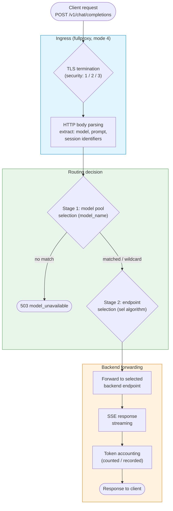
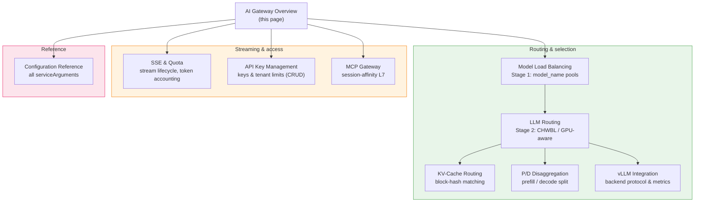

# AI Gateway Overview

The AI Gateway is loxilb's Layer-7 inference front door: an OpenAI-aware proxy that reads each request body, routes it to the right model pool and the right backend, and streams the response back. This page walks the request lifecycle through the fullproxy data path and maps every feature to its own guide.

!!! info "Foundation concepts"
    Every AI Gateway feature requires the load-balancer service to run in **FullProxy mode**
    (`mode: 4`). If you are new to loxilb's proxy modes and selection algorithms, read
    [Running Modes](../concepts/running-modes.md) and [LB Algorithms](../concepts/lb-algorithms.md)
    first — they explain the endpoint model that all examples below build on.

## Why inference needs a specialized proxy

A standard load balancer routes each connection to the least-busy server without ever reading the payload. That works for stateless web traffic, but LLM inference behaves differently:

- **Requests carry a model name.** A single endpoint may front several models. The proxy must read the `"model"` field from the JSON body (or an `X-Model` header) to pick the correct backend pool — an L4 balancer cannot see that field.
- **Backends hold warm KV-cache state.** Sending a follow-up turn to a backend that already computed the conversation's prefix avoids an expensive cache rebuild. Routing must be aware of which backend holds the relevant blocks.
- **Responses stream.** OpenAI-compatible endpoints reply with Server-Sent Events (SSE). The proxy must keep long-lived streams open and account for tokens as they flow.

The AI Gateway addresses all three by terminating the client connection in fullproxy mode, parsing the HTTP request, and making a model- and load-aware routing decision before opening a backend connection.

---

## Request lifecycle through the fullproxy

Every request follows the same fullproxy data path. Understanding these stages is the key to configuring and troubleshooting the gateway.



### Stages explained

| Stage | What happens |
|-------|--------------|
| **TLS termination** | When `security` is `1` (https), `2` (tls), or `3` (e2ehttps), loxilb terminates TLS so the plaintext HTTP body is available for inspection. `security: 0` (plain) skips this. |
| **HTTP body parsing** | In fullproxy mode loxilb parses the full HTTP request and extracts the `model` field, prompt content, and any session identifiers from the JSON body. |
| **Stage 1 — model pool selection** | The extracted model name is matched against the `model_name` on each LB rule for that VIP:port. The most specific match wins; an empty `model_name` acts as the wildcard pool. No match at all returns **503 `model_unavailable`**. See [Model Load Balancing](model-load-balancing.md). |
| **Stage 2 — endpoint selection** | Within the chosen pool, the `sel` algorithm picks a backend (round-robin, CHWBL consistent hash, GPU-aware, and so on). See [LLM Routing](llm-routing.md). |
| **Backend forwarding** | loxilb opens (or reuses from a pool) a connection to the selected endpoint and forwards the request using the negotiated `backend_protocol`. |
| **SSE streaming** | For streaming endpoints (`sse_mode: true`), loxilb passes each `data:` chunk through in real time and suppresses the idle timeout while the stream is active. See [SSE & Quota](sse-quota-management.md). |
| **Token accounting** | On the response path, tokens are counted from SSE chunks and recorded against the tenant. |

!!! warning "Data-plane enforcement: roadmap"
    API-key authentication (401/403) and per-tenant rate limiting (429) are **control-plane CRUD
    only** today — the gateway stores and manages keys/limits but does not yet reject requests in
    the data path. SSE stream lifecycle and token accounting **are** wired. Treat the
    [API Key Management](api-key-management.md) and tenant rate-limit endpoints as management APIs,
    not as live enforcement gates in the request path.

---

## FullProxy mode is the prerequisite

All AI Gateway features require `mode: 4` (FullProxy). This is fundamentally different from L4 modes:

| Mode | Layer | Body inspection | AI Gateway features |
|------|-------|-----------------|---------------------|
| `0` (DNAT), `1` (onearm), `2` (fullnat), `3` (dsr), `5` (hostonearm) | L4 | No — connection-level only | None |
| `4` (**FullProxy**) | L7 | Yes — full HTTP parsing | All features available |

In fullproxy mode loxilb terminates the client TCP connection, parses the HTTP request completely, makes the two-stage routing decision above, then forwards to the backend. This is what enables model-aware routing and body inspection.

!!! note "mode 6 (aigw)"
    The `mode` enum also lists `6-aigw`, but it is experimental and carries no validated scenario
    today. Use `mode: 4` for all AI routing. See [Running Modes](../concepts/running-modes.md).

---

## Feature map

The AI Gateway documentation is organized around the request lifecycle. Each feature has its own guide:



| Feature | What it does | Guide |
|---------|--------------|-------|
| Model Load Balancing | Route by model name (`X-Model` header / JSON `model` field) to per-model backend pools; wildcard fallback | [model-load-balancing.md](model-load-balancing.md) |
| LLM Routing | Stage-2 endpoint selection within a pool: CHWBL consistent hash, GPU-aware, session affinity | [llm-routing.md](llm-routing.md) |
| KV-Cache Routing | Route to the endpoint that already holds the relevant KV blocks (`kvExactMode`) | [kv-caching.md](kv-caching.md) |
| P/D Disaggregation | Split prefill and decode phases across separate endpoint pools | [pd-disaggregation.md](pd-disaggregation.md) |
| vLLM Integration | Backend protocol / ALPN negotiation and metrics for GPU-aware routing | [vllm-integration.md](vllm-integration.md) |
| SSE & Quota | Streaming lifecycle, stream duration caps, token accounting | [sse-quota-management.md](sse-quota-management.md) |
| API Key Management | Create/list/revoke tenant API keys and rate limits (control-plane CRUD) | [api-key-management.md](api-key-management.md) |
| MCP Gateway | Session-affinity L7 routing for Model Context Protocol backends | [mcp-gateway.md](mcp-gateway.md) |
| Configuration Reference | Every `serviceArguments` field, default, and enum | [configuration-reference.md](configuration-reference.md) |

---

## Choosing a routing strategy

| Strategy | Best for | Requires backend metrics |
|----------|----------|:---:|
| **Model-based routing** — dispatch by model name to different pools | Serving multiple models behind one VIP | No |
| **CHWBL consistent hash** (`sel: 8`) — cache-locality-preserving hash ring | Chatbots and multi-turn assistants that share context | No |
| **GPU-aware routing** (`sel: 9`) — route to the least-loaded backend by live metrics | Batch and high-throughput single-turn workloads | Yes |
| **KV-cache-aware routing** — send a request to the endpoint holding its KV blocks | Long-context and multi-turn workloads on vLLM/SGLang | Yes |

Strategies compose: use model-based routing to separate model pools, then apply CHWBL or KV-cache routing **within** each pool. See [LLM Routing](llm-routing.md).

---

## Prerequisites

!!! warning "FullProxy mode required"
    All AI Gateway features require the service to run in **FullProxy mode** (`mode: 4`). L4 modes
    cannot inspect HTTP bodies for model routing. See
    [Configuration Reference](configuration-reference.md).

- **loxilb** running with the REST API reachable on port `11111` (`/netlox/v1/...`).
- **HTTP backends** reachable from loxilb; set `backend_protocol` to `http1`, `http2`, or `both` to match your inference servers (default `http1`).
- **vLLM (or SGLang) endpoints** for GPU-aware and KV-cache features — these depend on backend metrics/events.

---

## Verify the gateway is running

Confirm the REST API is up:

```bash
curl -s http://<VIP>:11111/netlox/v1/version
```

List all configured load-balancer rules — this is the authoritative inventory of your AI Gateway services, including each rule's `model_name`, `mode`, and `sel`:

```bash
curl -s http://<VIP>:11111/netlox/v1/config/loadbalancer/all
```

Each rule in the response should show `mode: 4` and the `model_name` you configured. If a service is missing or shows a different mode, re-check the create call.

---

## Troubleshooting

**Gateway not responding**

- Confirm loxilb is running and the REST API port (`11111`) is reachable.
- Verify the service rule uses `mode: 4` — L4 modes cannot serve AI Gateway features.

**Requests all land on one pool / the wildcard**

- Confirm `model_name` is set on each model-specific rule for the same VIP:port.
- Confirm the client sends the model in the JSON `"model"` field or the `X-Model` header. See [Model Load Balancing](model-load-balancing.md).

**503 `model_unavailable`**

- No rule matched the requested model and no wildcard (`model_name: ""`) rule exists. Add a wildcard rule or correct the model name.

**Backend not receiving traffic**

- Verify the backend endpoints are healthy in the rule.
- Confirm `backend_protocol` matches what the inference server speaks.

**High latency on the first request of a conversation**

- Expected on a cold KV cache. See [KV-Cache Routing](kv-caching.md) for warm-up guidance.

---

## Next steps

| Goal | Start here |
|------|------------|
| Route by model name | [Model Load Balancing](model-load-balancing.md) |
| Choose an endpoint-selection algorithm | [LLM Routing](llm-routing.md) |
| Enable KV-cache-aware routing | [KV-Cache Routing](kv-caching.md) |
| Split prefill and decode pools | [P/D Disaggregation](pd-disaggregation.md) |
| Manage streaming and token accounting | [SSE & Quota](sse-quota-management.md) |
| Manage tenant keys and limits | [API Key Management](api-key-management.md) |
| See every config field | [Configuration Reference](configuration-reference.md) |
