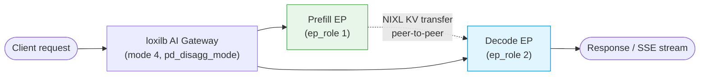
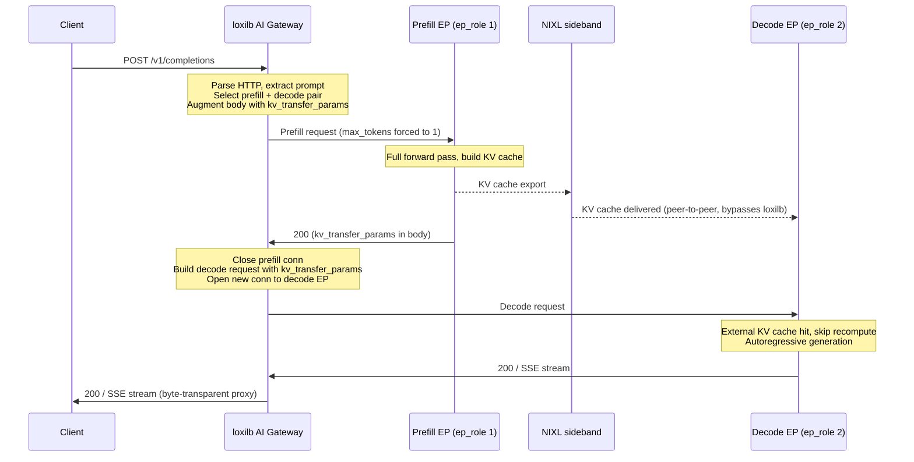
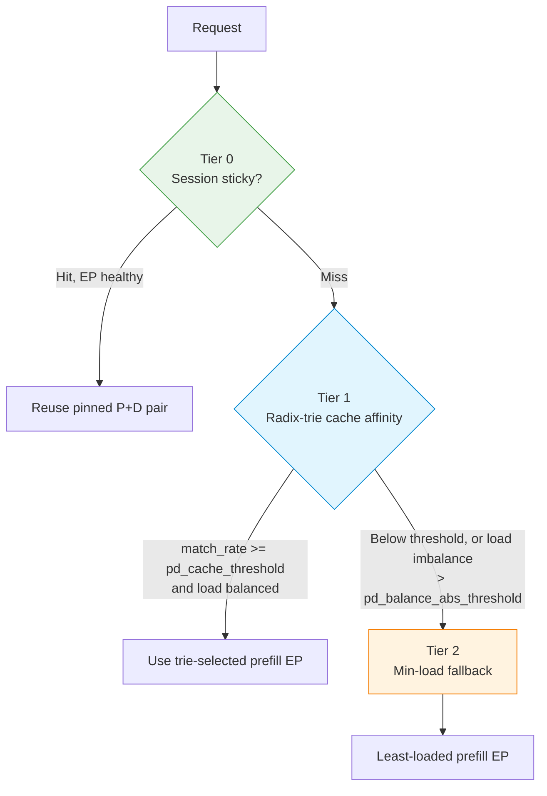

# P/D Disaggregation

Split the LLM inference pipeline across specialized prefill and decode GPU pools, with loxilb orchestrating the two-phase request flow and the endpoints exchanging KV cache directly over NIXL.

## What is P/D Disaggregation?

LLM inference has two phases with very different resource profiles:

- **Prefill (P)** — processing the input prompt. This is **compute-bound**: the GPU runs a full forward pass over all input tokens in parallel to build the initial KV cache. Latency scales with prompt length.
- **Decode (D)** — generating output tokens one at a time. This is **memory-bandwidth-bound**: each new token reads the entire KV cache from GPU memory. Throughput scales with memory bandwidth.

**P/D disaggregation** places these phases on separate endpoint pools so each can run on hardware tuned for its workload — high-FLOPS GPUs for prefill, high-bandwidth GPUs for decode. loxilb routes the prompt to a prefill endpoint, then routes the generation request to a decode endpoint that reuses the KV cache produced by prefill.



!!! note "Prerequisite: fullproxy (mode 4)"
    P/D disaggregation is an L7 feature and requires `mode: 4` (fullproxy). The API rejects
    `pd_disagg_mode: true` on any other mode. See [Running Modes](../concepts/running-modes.md).

---

## Request Lifecycle

When P/D is enabled, loxilb runs a strictly sequential two-phase flow for every request:



Key properties of the flow:

- **loxilb augments the prefill body** — it forces `max_tokens`/`max_completion_tokens` to `1` and injects `kv_transfer_params` so the prefill endpoint produces the KV cache but no output tokens.
- **The decode request carries the prefill result** — loxilb extracts `kv_transfer_params` (remote engine id, block ids, host, port) from the prefill response and injects it into the decode request.
- **The KV cache never traverses loxilb** — tensor data moves prefill → decode directly over the NIXL sideband port; loxilb only orchestrates the two HTTP legs.
- **The legs are sequential** — the decode connection opens only after prefill completes. On the decode → client leg loxilb is a byte-transparent stream proxy, so SSE tokens pass through unmodified.

---

## Endpoint Selection

With `pd_cache_aware_mode` enabled, loxilb selects the **prefill** endpoint through a three-tier policy:



- **Tier 0 — session stickiness.** Multi-turn conversations pin to the same prefill+decode pair. The key is the `X-Conversation-Id` header (or the request body `user` field). The pin is kept while the session TTL is valid and both endpoints are healthy.
- **Tier 1 — radix-trie cache affinity.** Requests with similar prompt prefixes route to the same prefill endpoint for KV reuse. A match is accepted when `match_rate >= pd_cache_threshold`; if the active-connection spread between endpoints exceeds `pd_balance_abs_threshold`, loxilb skips to Tier 2 to avoid hotspots.
- **Tier 2 — min-load fallback.** Always available. Picks the healthy prefill endpoint with the fewest active connections. Used for cold start, novel prompts, and when load imbalance overrides trie affinity.

Decode endpoint selection is always **session → min-load** (no trie): the decode side receives the KV cache over NIXL, so prompt-prefix affinity provides no benefit there.

!!! note "Cache-aware routing is P/D-specific"
    The radix-trie prefix routing above runs only when **both** `pd_disagg_mode` and
    `pd_cache_aware_mode` are set. It is distinct from block-hash KV-exact routing
    (`kvExactMode`, see [KV-Cache Routing](kv-caching.md)) — where applicable, choose one model
    per service, not both.

---

## Configuration Fields

Service-level fields (`serviceArguments`):

| Field | Type | Default | Range / notes |
|---|---|---|---|
| `pd_disagg_mode` | bool | `false` | Enable P/D orchestration. Requires `mode: 4`. |
| `pd_cache_aware_mode` | bool | `false` | Enable Tier 0/1/2 selection. Requires `pd_disagg_mode: true`. |
| `pd_session_ttl_sec` | int32 | `0` | Session stickiness TTL in seconds. **`0` = no automatic expiry.** Used only when `pd_cache_aware_mode` is true. |
| `pd_cache_threshold` | int32 | `20` | `0`–`100`. Minimum trie match percentage to prefer a cache-affinity endpoint. Lower = more aggressive cache routing. |
| `pd_balance_abs_threshold` | int32 | `3` | `>= 0`. Max active-connection spread before cache affinity is bypassed for min-load. |

Endpoint-level fields (per entry in `endpoints`):

| Field | Type | Default | Range / notes |
|---|---|---|---|
| `ep_role` | int32 | `0` | `0`-normal, `1`-prefill, `2`-decode. Only used when `pd_disagg_mode` is true. |
| `nixl_port` | int32 | `0` | NIXL side-channel port for KV transfer. `0` = use `targetPort`. |

!!! warning "Set ep_role on every endpoint"
    With `pd_disagg_mode: true`, endpoints left at `ep_role: 0` do not participate in P/D routing.
    A valid P/D service needs at least one `ep_role: 1` (prefill) and one `ep_role: 2` (decode)
    endpoint.

---

## Configuration

Configure a P/D service with `POST /netlox/v1/config/loadbalancer` on the loxilb API port (`11111`). The example below mirrors the `vllm-pd-disagg` CI scenario: one prefill endpoint (`ep_role: 1`) and one decode endpoint (`ep_role: 2`), with HTTP health probing against each backend's `/health`.

=== "curl"
    ```bash
    curl -s -X POST http://<loxilb>:11111/netlox/v1/config/loadbalancer \
      -H 'Content-Type: application/json' \
      -d '{
        "serviceArguments": {
          "externalIP": "10.10.10.254",
          "port": 2020,
          "protocol": "tcp",
          "sel": 0,
          "mode": 4,
          "security": 1,
          "pd_disagg_mode": true,
          "sse_mode": true,
          "host": "10.10.10.254",
          "monitor": true,
          "probetype": "http",
          "probeport": 8000,
          "probereq": "/health",
          "probeTimeout": 5,
          "probeRetries": 2
        },
        "endpoints": [
          {"endpointIP": "31.31.31.1", "targetPort": 8000, "weight": 1, "ep_role": 1, "nixl_port": 9001},
          {"endpointIP": "32.32.32.1", "targetPort": 8000, "weight": 1, "ep_role": 2, "nixl_port": 9002}
        ]
      }'
    ```

=== "loxicmd"
    !!! info "Coming soon"
        AI-aware `loxicmd` subcommands are planned. Use the REST/curl form today.

### Cache-Aware, Multi-Endpoint

To scale to multiple prefill and decode endpoints with session stickiness and prefix affinity, add `pd_cache_aware_mode: true` and the tuning thresholds. This mirrors the 2-prefill / 2-decode cache-aware rule in the CI scenario.

=== "curl"
    ```bash
    curl -s -X POST http://<loxilb>:11111/netlox/v1/config/loadbalancer \
      -H 'Content-Type: application/json' \
      -d '{
        "serviceArguments": {
          "externalIP": "10.10.10.254",
          "port": 2023,
          "protocol": "tcp",
          "sel": 0,
          "mode": 4,
          "security": 1,
          "pd_disagg_mode": true,
          "pd_cache_aware_mode": true,
          "pd_session_ttl_sec": 600,
          "pd_cache_threshold": 20,
          "pd_balance_abs_threshold": 3,
          "sse_mode": true,
          "host": "10.10.10.254",
          "monitor": true,
          "probetype": "http",
          "probeport": 8000,
          "probereq": "/health",
          "probeTimeout": 5,
          "probeRetries": 2
        },
        "endpoints": [
          {"endpointIP": "31.31.31.1", "targetPort": 8000, "weight": 1, "ep_role": 1, "nixl_port": 9001},
          {"endpointIP": "33.33.33.1", "targetPort": 8000, "weight": 1, "ep_role": 1, "nixl_port": 9003},
          {"endpointIP": "32.32.32.1", "targetPort": 8000, "weight": 1, "ep_role": 2, "nixl_port": 9002},
          {"endpointIP": "34.34.34.1", "targetPort": 8000, "weight": 1, "ep_role": 2, "nixl_port": 9004}
        ]
      }'
    ```

=== "loxicmd"
    !!! info "Coming soon"
        AI-aware `loxicmd` subcommands are planned. Use the REST/curl form today.

**Tuning guidance:**

- Lower `pd_cache_threshold` (e.g. `10`) accepts shorter prefix matches — more cache hits, better latency for chatbots with shared system prompts.
- Lower `pd_balance_abs_threshold` (e.g. `2`) rebalances sooner and prevents hotspots at the cost of some cache locality.
- Raise `pd_session_ttl_sec` for long multi-turn conversations; leave it at `0` for independent, single-shot batch queries (no stickiness benefit).

### vLLM Backend Requirement

P/D disaggregation requires vLLM's **`NixlConnector`**. Prefill nodes run with `kv_role: kv_producer`, decode nodes with `kv_role: kv_consumer`, and `nixl_port` on the loxilb endpoint must match the vLLM NIXL side-channel port. Connectors that do not read `kv_transfer_params` from the response body will silently fall back to full recompute on the decode side.

=== "Prefill node"
    ```bash
    docker run -d --gpus all --network host \
      -e VLLM_NIXL_SIDE_CHANNEL_HOST=31.31.31.1 \
      -e VLLM_NIXL_SIDE_CHANNEL_PORT=9001 \
      -e UCX_TLS=tcp \
      vllm/vllm-openai:v0.17.0 \
        --model Qwen/Qwen3-0.6B \
        --port 8000 \
        --enable-request-id-headers \
        --kv-transfer-config '{"kv_connector":"NixlConnector","kv_role":"kv_producer","kv_buffer_device":"cpu"}'
    ```

=== "Decode node"
    ```bash
    docker run -d --gpus all --network host \
      -e VLLM_NIXL_SIDE_CHANNEL_HOST=32.32.32.1 \
      -e VLLM_NIXL_SIDE_CHANNEL_PORT=9002 \
      -e UCX_TLS=tcp \
      vllm/vllm-openai:v0.17.0 \
        --model Qwen/Qwen3-0.6B \
        --port 8000 \
        --enable-request-id-headers \
        --kv-transfer-config '{"kv_connector":"NixlConnector","kv_role":"kv_consumer","kv_buffer_device":"cpu"}'
    ```

!!! tip "kv_buffer_device: cpu on TCP-only hosts"
    The default `cuda` buffer device makes UCX attempt GPU-Direct transfers. On instances without
    GDRcopy/RDMA (for example AWS `g5.xlarge` with A10G), that fails during NIXL init. Setting
    `kv_buffer_device: cpu` routes KV tensors through host memory and works reliably on any
    TCP-only host. See [Deploy: P/D Disaggregation](../use-cases/deploy-pd-disaggregation.md) for a
    full cloud walkthrough.

---

## Verify

**1. Confirm the service carries P/D config:**

```bash
curl -s http://<loxilb>:11111/netlox/v1/config/loadbalancer/all \
  | jq '.lbAttr[] | select(.serviceArguments.pd_disagg_mode==true)'
```

**2. Confirm endpoints are healthy** — the health probe marks each endpoint active once `/health` responds. An endpoint that fails the probe reports `"inActiveEP": true` in the same listing.

**3. Send a request and confirm two-phase routing** — with a real vLLM backend, the response `id` embeds both worker addresses when P/D is active:

```bash
curl -s http://10.10.10.254:2020/v1/completions \
  -H 'Content-Type: application/json' \
  -d '{"model":"Qwen/Qwen3-0.6B","prompt":"hello","max_tokens":8}' \
  | jq -r '.id'
# P/D active   -> id embeds prefill and decode addresses
# P/D inactive -> plain completion id
```

---

## Troubleshooting

### Decode endpoint counter stays at 0:0

Expected in `pd_disagg_mode`. The prefill leg carries the original client connection, so its counter increments. The decode leg is a new loxilb-originated connection (source IP = loxilb), which is not counted as a forwarded client connection. Verify real decode activity from vLLM's own metrics on the decode node, not from the LB counter.

### Prefill endpoints not sticky

- Confirm `pd_cache_aware_mode: true` is set on the service.
- Ensure the client sends `X-Conversation-Id` (or a body `user` field) so sessions can key.
- Check `pd_session_ttl_sec` — `0` means no expiry, but stickiness still requires a live session and healthy endpoints.
- Lower `pd_cache_threshold` so partial prefix matches still stick.

### Decode load imbalanced

- Lower `pd_balance_abs_threshold` to trigger rebalancing sooner.
- Verify all `ep_role: 2` endpoints are healthy and passing the probe.

### Routing falls back to normal selection

- Confirm every endpoint has an explicit `ep_role` (`1` or `2`).
- Confirm `pd_disagg_mode: true` is present in `serviceArguments`.
- A service with no healthy prefill **or** no healthy decode endpoint cannot run the two-phase flow.

### No KV-transfer benefit (full latency despite P/D)

Usually the wrong vLLM connector is deployed.

- Verify both nodes use `NixlConnector` (producer on prefill, consumer on decode).
- Confirm the prefill response contains a non-empty `kv_transfer_params` with block ids.
- Ensure `nixl_port` on each loxilb endpoint matches that node's `VLLM_NIXL_SIDE_CHANNEL_PORT`.
- Set `VLLM_NIXL_SIDE_CHANNEL_HOST` to the node's routable address (not `0.0.0.0`).
- On hosts without RDMA, set `kv_buffer_device: cpu` in `--kv-transfer-config`.

---

## Next Steps

- [Deploy: P/D Disaggregation](../use-cases/deploy-pd-disaggregation.md) — cloud deployment walkthrough and vLLM launch reference
- [KV-Cache Routing](kv-caching.md) — block-hash KV-exact routing for non-disaggregated deployments
- [vLLM Integration](vllm-integration.md) — health probing, ALPN, and GPU-aware routing
- [Configuration Reference](configuration-reference.md) — all AI Gateway `serviceArguments`
