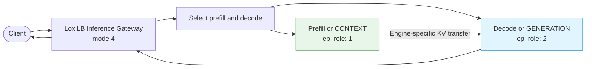
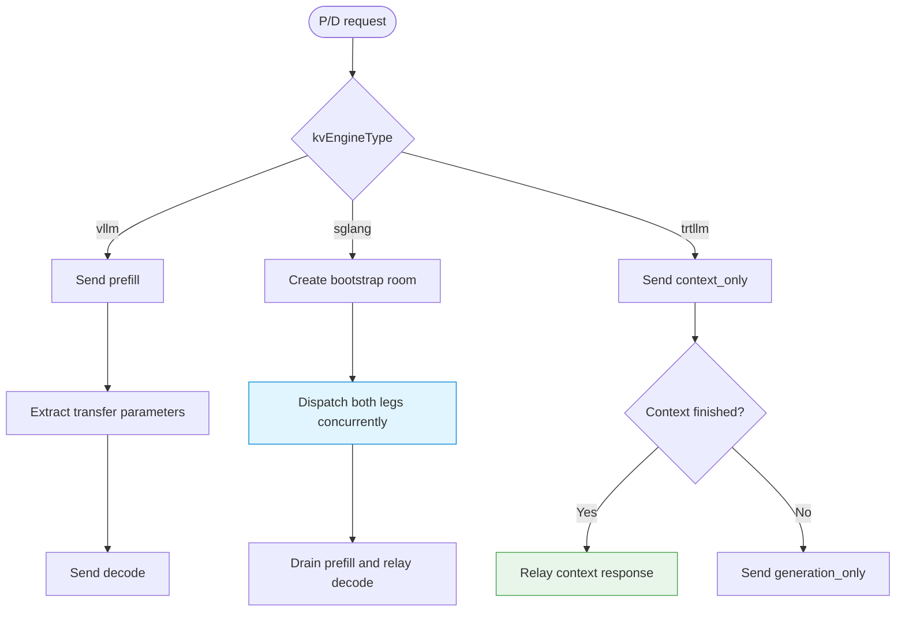

# P/D Disaggregation

Prefill/decode (P/D) disaggregation separates prompt processing from token generation. LoxiLB Inference Gateway selects the two endpoint roles and runs the request sequence required by the configured serving engine.

## Why separate prefill and decode?

- **Prefill** processes the input tokens and creates KV state. It is primarily compute intensive.
- **Decode** produces tokens iteratively while reading KV state. It is primarily memory-bandwidth sensitive.

P/D lets operators scale and tune those roles independently. It also adds network, engine-dialect, timeout, and failure-coupling requirements, so start with a converged pool unless the operational benefit is clear.

## Shared topology



Every P/D rule requires:

- `mode: 4` (fullproxy)
- `pd_disagg_mode: true`
- at least one `ep_role: 1` endpoint
- at least one `ep_role: 2` endpoint
- one coherent `kvEngineType` for the entire rule

## The request flow depends on the engine

| Engine | Request order | Transfer contract | Engine-specific setting |
|---|---|---|---|
| vLLM | Sequential prefill, then decode | Gateway extracts `kv_transfer_params`; KV data moves through NIXL | Endpoint `nixl_port` |
| SGLang | Concurrent prefill and decode | Gateway injects one bootstrap host/port/room triple into both requests | `pdBootstrapPort` |
| TensorRT-LLM | Sequential CONTEXT, then GENERATION | Gateway extracts and relays `disaggregated_params`; context may finish early | Context and generation server roles |
| llama.cpp | Not supported | None | P/D configuration is rejected |



!!! warning "Do not copy fields across engines"
    `nixl_port`, `pdBootstrapPort`, ZMQ rank settings, and TensorRT-LLM's HTTP event drain solve different problems. A configuration that is valid for one engine can be rejected or meaningless for another.

## Optional cache-aware layers

P/D itself does not require `kvExactMode`.

- P/D always applies session stickiness first and falls back to load-aware endpoint selection.
- `pd_cache_aware_mode: true` adds the radix-trie prefix-affinity tier between those two stages.
- `kvExactMode: 1` adds engine-exact cache inventory selection for eligible prefill or context endpoints.
- `kvExactMode: 3` is not a P/D option; it is reserved for role-less single pools.

For KV-exact mode, the tokenizer, model identity, block/page size, hash contract, and event transport must match the engine. A rule can continue serving through fallback routing even when this parity is broken, so verify metrics explicitly.

## Shared configuration fields

| Field | Default | Meaning |
|---|---:|---|
| `pd_disagg_mode` | `false` | Enable the engine-specific P/D orchestrator. |
| `pd_cache_aware_mode` | `false` | Add radix-trie prefix affinity to the P/D ladder. Session stickiness and load fallback do not depend on this flag. Requires P/D. |
| `pd_session_ttl_sec` | `0` in the API | Session lifetime in seconds. The data path converts `0` to its 300-second runtime default. |
| `pd_cache_threshold` | `20` | Minimum prefix-trie match percentage. |
| `pd_balance_abs_threshold` | `3` | Active-connection spread that bypasses the optional radix-trie choice and uses load fallback. |
| `kvExactMode` | `0` | `1` adds P/D KV-exact selection; `3` is invalid with P/D. |
| `ep_role` | `0` | Endpoint role: `1` prefill/CONTEXT, `2` decode/GENERATION. |
| `nixl_port` | `0` | vLLM transfer side channel; `0` uses the target port. |
| `pdBootstrapPort` | `0` | SGLang prefill bootstrap port; `0` means `8998`. |

See the [Configuration Reference](configuration-reference.md) before copying these fields into a rule.

## Minimal validation workflow

1. Start every backend and wait for model readiness, not only process readiness.
2. Prove ordinary fullproxy routing with health probes.
3. Create one P/D rule with one endpoint of each role and without KV-exact mode.
4. Test a non-streaming request and an SSE request.
5. Confirm both roles handled the request using engine logs and Gateway metrics.
6. Add more endpoints and exercise one endpoint failure at a time.
7. Add cache-aware selection only after the base P/D flow is reliable.

Useful Gateway metric families include:

```text
loxilb_ai_pd_requests_total
loxilb_pd_kv_tier15_hits_total
loxilb_pd_kv_blocks
loxilb_kv_subscriber_connected
loxilb_pd_sg_room_retry_total
loxilb_pd_trt_ctx_early_exit_total
```

Metric availability depends on the configured engine and optional routing layers.

## Failure diagnosis

| Symptom | Check first |
|---|---|
| Rule creation fails | Fullproxy mode, both endpoint roles, and engine-specific field coherence |
| Client request hangs | Engine request order, role health, transfer reachability, and first-byte timeouts |
| Decode recomputes the prompt | Engine transfer configuration and side-channel/bootstrap connectivity |
| Traffic succeeds but KV-exact hits remain zero | Tokenizer, model, block size, hash algorithm, event feed, and inventory readiness; `kvWarmupSec` is currently inert |
| One role becomes overloaded | Endpoint health, session TTL, load threshold, and role counts |
| Errors continue to select one endpoint | Circuit-breaker enablement and origin/connect failure classification |

### Circuit-breaker behavior

P/D rule creation enables a per-endpoint breaker with a three-connect-failure threshold and a
30-second open window in the current implementation. An enabled breaker also tracks
consecutive origin 5xx responses; the default origin threshold is three and
`LLB_PD_ORIGIN_ERR_THRESHOLD=0` disables that path. The current 5xx response is relayed to the
client. Opening the breaker demotes the endpoint for later selection; it does not replay the
failed request. A 4xx response neither advances nor resets the origin-5xx streak.

## Security considerations

- Isolate management, client, event, and engine-transfer networks according to their trust levels.
- Permit SGLang bootstrap or vLLM transfer ports only between the endpoints that need them.
- Do not expose TensorRT-LLM's destructive event endpoint to monitoring or untrusted consumers.
- Avoid logging request bodies or engine transfer objects when they may contain sensitive prompts or opaque state.
- P/D routing is not a tenant boundary. Apply authentication, authorization, and quota policies independently.

## Evidence limits

Repository validation proves configuration guards and deterministic mock request paths. It does not establish production throughput, latency, cache benefit, engine-version compatibility, cross-node fault tolerance, or secure network policy for a particular deployment.

## Next steps

- [SGLang P/D Disaggregation](sglang-pd-disaggregation.md)
- [TensorRT-LLM Integration](tensorrt-llm-integration.md)
- [vLLM Integration](vllm-integration.md)
- [Engine Capability Matrix](../concepts/engine-capability-matrix.md)
