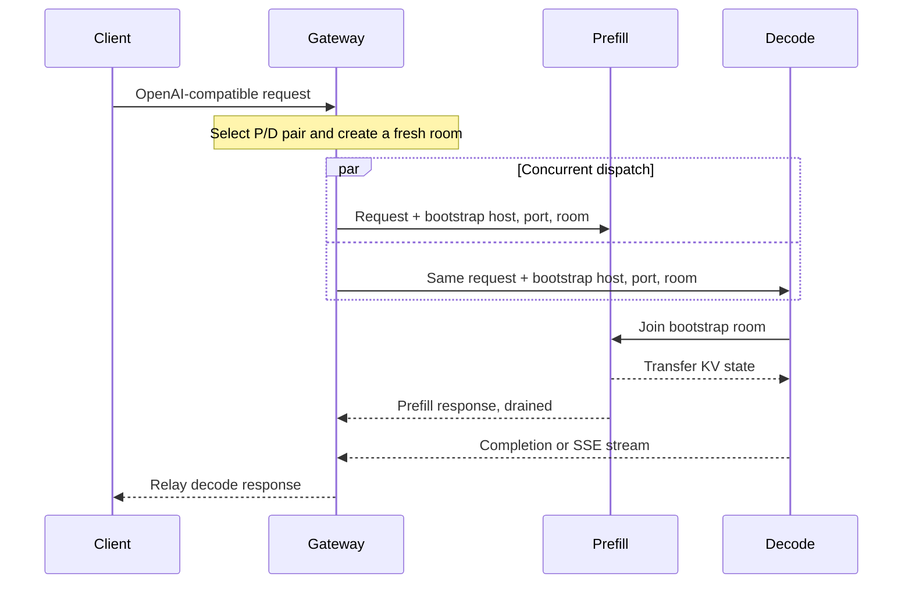

# SGLang P/D Disaggregation

Run SGLang prefill/decode disaggregation through a concurrent two-leg Gateway flow. This guide separates base P/D from the optional KV-exact routing layer so the two configurations are not confused.

## Prerequisites

- LoxiLB Inference Gateway with a reachable management API on port `11111`.
- `mode: 4` fullproxy traffic path.
- At least one SGLang prefill endpoint and one decode endpoint.
- The same model and compatible SGLang build across the pool.
- Network reachability from each decode endpoint to every prefill endpoint's disaggregation bootstrap port.
- HTTP health endpoints that return success only after the model is ready.

!!! warning "Use an isolated management network"
    The management API changes live routing state. Do not expose it directly to untrusted networks. Keep credentials and model repository tokens outside rule payloads and documentation.

Prepare the management client without placing its token in each command:

--8<-- "snippets/common/control-api-header.md"

## Mental model

SGLang P/D is not sequential. The prefill server waits for the decode server to join a bootstrap room, so waiting for prefill to finish before contacting decode would deadlock until the engine timeout.



On the successful path, the gateway relays the decode response and drains the prefill response.
A prefill-origin client error can instead be relayed to the client, as described in failure
diagnosis below. The gateway closes both legs when their paired lifecycle requires it and uses a
fresh room for a pair retry after a retryable drain-leg transport failure.

## Base P/D configuration

The following addresses are documentation-only examples. Replace the VIP and endpoint addresses with the isolated lab or production network.

!!! warning "The example inference listener is plaintext"
    `security: 0` is for an isolated lab. Choose `security: 1` or `2` and configure certificate
    verification for production trust boundaries; see [mTLS](../security/mtls.md).

```bash
curl --fail-with-body --silent --show-error \
  --request POST "$CONTROL_API/config/loadbalancer" \
  --header @control-plane.headers \
  --header 'Content-Type: application/json' \
  --data-binary '{
    "serviceArguments": {
      "externalIP": "192.0.2.10",
      "port": 2030,
      "protocol": "tcp",
      "sel": 0,
      "mode": 4,
      "security": 0,
      "pd_disagg_mode": true,
      "kvEngineType": "sglang",
      "pdBootstrapPort": 9998,
      "sse_mode": true,
      "host": "192.0.2.10",
      "monitor": true,
      "cb_enable": true,
      "probetype": "http",
      "probeport": 8100,
      "probereq": "/health",
      "probeTimeout": 5,
      "probeRetries": 2
    },
    "endpoints": [
      {"endpointIP": "198.51.100.11", "targetPort": 8100, "weight": 1, "ep_role": 1},
      {"endpointIP": "198.51.100.12", "targetPort": 8100, "weight": 1, "ep_role": 1},
      {"endpointIP": "198.51.100.21", "targetPort": 8100, "weight": 1, "ep_role": 2}
    ]
  }'
```

!!! info "REST is required for this example"
    Use the REST API for `pdBootstrapPort`. CLI field availability can vary by client version;
    always confirm the stored value through the REST read-back.

`pdBootstrapPort: 0` uses SGLang's default bootstrap port `8998`. A nonzero value is accepted only when both `pd_disagg_mode: true` and `kvEngineType: "sglang"` are present.

### Optional KV-exact prefill selection

Base SGLang P/D works without `kvExactMode`. Add the following fields only after the P/D request flow is healthy and SGLang KV events are verified:

```json
{
  "kvExactMode": 1,
  "kvBlockSize": 16,
  "kvZmqPort": 5557,
  "kvDpRankCount": 1,
  "kvWarmupSec": 30
}
```

- Set `kvBlockSize` to the effective SGLang page size; do not assume the example value fits the deployed model.
- Set `kvDpRankCount` to the engine's DP rank count. Rank `N` publishes on `kvZmqPort + N`.
- Keep the entire consecutive port range reachable and at or below `65535`.
- Omit `kvHashAlgo`; the gateway derives `sha256_sglang` from the engine type.
- Do not use `kvExactMode: 3` on a P/D rule. Mode 3 is for a role-less single pool.
- `kvWarmupSec` is accepted and stored, but the production path currently does not arm
  its start timestamp. Gate traffic on endpoint health, subscriber connectivity, and
  inventory signals instead of sleeping for this duration.

## Verify

1. Confirm the rule was accepted and both endpoint roles are present:

   ```bash
   curl --fail-with-body --silent --show-error \
     --header @control-plane.headers "$CONTROL_API/config/loadbalancer/all" \
     | jq '.lbAttr[] | select(.serviceArguments.port == 2030)'
   ```

2. Send a non-streaming request, then an SSE request through the VIP. Both must complete through the decode leg.

   ```bash
   curl -sS http://192.0.2.10:2030/v1/chat/completions \
     -H 'Content-Type: application/json' \
     --data-binary '{"model":"example-model","messages":[{"role":"user","content":"Explain prefill and decode briefly."}],"max_tokens":32}'
   ```

3. Scrape Gateway metrics and confirm the SGLang P/D counter families exist:

   Before the first scrape, enable metrics with an authenticated
   `POST /netlox/v1/config/metrics`; see [Monitoring and Metrics](../operations/monitoring.md#enable-and-scrape-metrics).

   ```bash
   curl --fail-with-body --silent --show-error "$CONTROL_API/metrics" \
     | grep -E 'loxilb_pd_sg_(room_retry|prefill_abort_decode|decode_close_drain|prefill_reject_relay|oversize_reject)_total'
   ```

4. If KV-exact mode is enabled, confirm subscriber and cache metrics move under repeated warm-prefix traffic:

   ```bash
   curl --fail-with-body --silent --show-error "$CONTROL_API/metrics" \
     | grep -E 'loxilb_kv_subscriber_connected|loxilb_pd_kv_blocks|loxilb_pd_kv_tier15_hits_total'
   ```

Metrics prove that code paths executed; they do not by themselves prove cache parity or a performance gain.

## Failure diagnosis

| Symptom | Likely cause | Action |
|---|---|---|
| Rule creation says P/D needs both roles | Missing `ep_role: 1` or `ep_role: 2` | Add at least one healthy endpoint of each role. |
| Request waits near the engine bootstrap timeout | Prefill and decode were not concurrently joined, or the bootstrap port is blocked | Verify the rule engine type and decode-to-prefill reachability. |
| Fast 503 before dispatch | Request body exceeded the gateway inspection window needed for bootstrap injection | Reduce request size or raise the inspected-body limit only after a memory and security review. |
| Prefill 4xx reaches the client | The engine rejected the request | Correct the client payload; do not retry it as a gateway fault. |
| Pair fails after a prefill error or transport loss | The coupled legs were aborted | Inspect endpoint health, circuit-breaker state, and SGLang logs on both roles. |
| KV subscribers connect but hits stay at zero | Page size, tokenizer, engine hash contract, or DP port layout differs | Recheck every parity input and leave `kvHashAlgo` omitted. |

## Cleanup

```bash
curl --fail-with-body --silent --show-error \
  --request DELETE --header @control-plane.headers \
  "$CONTROL_API/config/loadbalancer/hosturl/192.0.2.10/externalipaddress/192.0.2.10/port/2030/protocol/tcp"
```

Confirm the rule is absent before reusing the VIP and port.
Remove `control-plane.headers` after the workflow and unset `CONTROL_PLANE_TOKEN`.

## Evidence limits

The Gateway configuration, dual-dispatch behavior, guardrails, error coupling, metrics, and mock validation scenario are implemented and reproducible without GPUs. Real SGLang interoperability, cache-hit benefit, latency, and capacity remain dependent on the deployed engine build, model, tokenizer, network, and GPU environment.

## See also

- [P/D Disaggregation](pd-disaggregation.md)
- [SGLang Routing](../use-cases/sglang-routing.md)
- [SGLang Configuration and Tuning](../use-cases/sglang-configuration-tuning.md)
- [Engine Capability Matrix](../concepts/engine-capability-matrix.md)
