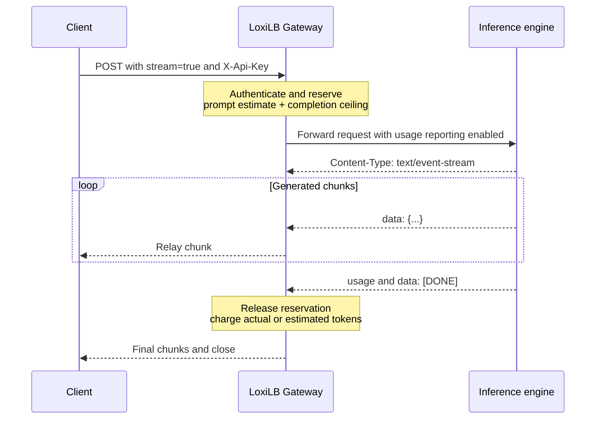

# SSE and Quota Management

Server-Sent Events (SSE) keep an HTTP response open while an inference engine
streams tokens. LoxiLB protects this long-lived path from normal idle reaping,
requests usage accounting, and settles token-quota reservations when the
response completes.

!!! danger "SSE does not activate authentication"
    SSE relay behavior is part of fullproxy. `api_key_auth` separately decides whether the
    request is keyless, API-key protected, JWT protected, or accepts either. A `required` rule
    uses the PostgreSQL store configured by `--aikey-db-*` and fails closed with `503` when the
    policy cannot be evaluated. Verify missing/unknown credential `401`, store failure `503`, and
    backend receipt delta `0` before relying on quota enforcement.

## Stream lifecycle



With `mode: 4` and `sse_mode: true`, the Gateway:

- suppresses ordinary inactivity reaping while an SSE response is active;
- detects the OpenAI-compatible `data: [DONE]` terminator;
- applies an absolute stream-duration ceiling;
- can enable backend TCP keepalive for network idle periods;
- reserves tokens before dispatch and settles usage after completion;
- excludes time paused by the configured fullproxy byte shaper from idle and
  stream-duration accounting.

## Configuration fields

| Field | Default | Meaning |
|---|---:|---|
| `sse_mode` | `false` | Enables event-stream lifecycle and AI Gateway request handling |
| `max_stream_duration_sec` | `0` | Absolute limit in seconds; `0` uses the system ceiling of 86,400 seconds |
| `backend_keepalive_interval_sec` | `0` | Backend TCP keepalive idle interval; `0` disables it |
| `inactiveTimeOut` | Rule default | Normal inactivity timeout; suppressed while an SSE stream is active |

Choose a finite stream duration that covers legitimate generations and still
bounds stuck connections. Set keepalive from your network's measured idle
behavior rather than copying a value blindly.

## Configure a streaming rule

Use TLS and a protected control-plane header outside an isolated lab:

```bash
export CONTROL_API="https://gateway.example.com/netlox/v1"
install -m 600 /dev/null ./control-plane.headers
printf 'Authorization: Bearer %s\n' "$CONTROL_PLANE_TOKEN" > ./control-plane.headers
```

The example addresses use documentation-only ranges. Replace all addresses and
the model with your environment:

```bash
curl --fail-with-body --silent --show-error \
  --request POST "$CONTROL_API/config/loadbalancer" \
  --header @control-plane.headers \
  --header 'Content-Type: application/json' \
  --data '{
    "serviceArguments": {
      "externalIP": "192.0.2.20",
      "port": 2020,
      "protocol": "tcp",
      "sel": 0,
      "mode": 4,
      "host": "192.0.2.20",
      "path_prefix": "/",
      "path_match_mode": "prefix",
      "model_name": "example-stream-model",
      "sse_mode": true,
      "max_stream_duration_sec": 300,
      "backend_keepalive_interval_sec": 60,
      "inactiveTimeOut": 60
    },
    "endpoints": [
      {"endpointIP": "198.51.100.20", "targetPort": 8000, "weight": 1}
    ]
  }'
```

Read the rule back and confirm `mode`, `sse_mode`, duration, keepalive, and
model before sending traffic.

## Verify streaming and quota accounting

Store the inference key in a protected header file:

```bash
install -m 600 /dev/null ./inference.headers
printf 'X-Api-Key: %s\n' "$INFERENCE_API_KEY" > ./inference.headers

curl --no-buffer --fail-with-body --silent --show-error \
  --header @inference.headers \
  --header 'Content-Type: application/json' \
  --data '{
    "model": "example-stream-model",
    "stream": true,
    "stream_options": {"include_usage": true},
    "messages": [{"role": "user", "content": "Reply briefly."}],
    "max_tokens": 32
  }' \
  "https://ai.example.com/v1/chat/completions"
```

A healthy stream produces incremental `data:` records, a terminal usage
object, and `[DONE]`. The active-stream gauge rises during the request and
returns after completion. Token counters increase for the tenant and model.

The Gateway can request usage reporting and reserve prompt/completion tokens
only after buffering a complete, contiguous, positive-`Content-Length` JSON
body. Chunked, partial, and oversized bodies skip parsing and
`include_usage` injection. If usage is absent or unreadable, the fallback
estimate can undercount the actual prompt; the estimated-token and
missing-usage series are signals to verify framing and engine compatibility.

## Quota behavior for streams

For a complete, contiguous, positive-`Content-Length` JSON body, admission
reserves the prompt estimate plus the declared completion ceiling. Both
aggregate tenant TPM and tenant-and-model TPM must have enough capacity. After
completion, the reservation is credited back and replaced with the actual
extracted charge or the estimate. Chunked, partial, and oversized bodies skip
pre-admission reservation and settle afterward from readable usage or the
fallback estimate, which may undercount prompt use.

If a final charge creates debt, the already-served stream is not interrupted;
later requests receive `429` until continuous refill restores headroom. An
eligible buffered request that cannot fit before dispatch receives `429`
without consuming GPU work. This pre-dispatch guarantee does not apply to the
skipped body shapes above.

While peer quota state is warming, the gateway returns
`429 token_quota_warming` with `Retry-After: 1`. The default warm-up deadline is
three seconds. If no peer state arrives before that deadline, the current
compatibility path fails open; alert on this event and verify synchronization
instead of treating the timeout as healthy quota state.

See [AI Traffic Governance](ai-traffic-governance.md) for `burst_pct`, model
limits, and status-code diagnosis.

## Shaping interaction

A policer attached to a fullproxy rule becomes a bidirectional L7 payload
shaper. A shaped stream may take longer than the configured duration in wall
time because periods deliberately paused by the shaper are excluded. An
unshaped slow stream is still bounded by `max_stream_duration_sec`.

This exclusion prevents the Gateway's own pacing policy from being mistaken
for an idle or runaway stream. It does not disable duration protection for
backend-generated slowness.

## Troubleshooting

| Symptom | Likely cause | Action |
|---|---|---|
| Stream ends during a quiet gap | SSE handling is off or response is not recognized as event-stream | Confirm `mode: 4`, `sse_mode: true`, and backend content type |
| Connection remains open | Backend omitted `[DONE]` or failed to close | Inspect sanitized backend output and keep a finite duration cap |
| Long streams fail across a network idle period | Intermediary removed the backend flow | Configure and validate backend keepalive; also check external proxy timeouts |
| Stream ends at a fixed duration | Absolute cap reached | Increase only after confirming legitimate generation time |
| Estimated/missing metrics rise | Usage object absent, split, or incompatible | Verify engine usage format and streaming configuration |
| Request receives `429` before backend traffic | Reservation exceeds current aggregate or model headroom | Check declared completion ceiling, `burst_pct`, and utilization |
| Stream completes but next request gets `429` | Final usage produced quota debt | Wait for refill or correct an undersized limit; do not retry in a tight loop |
| Shaped stream survives beyond wall-clock cap | Time was paused by the shaper | Expected; confirm QoS park metrics and effective policy |

## Security and cleanup

Streaming bodies can contain sensitive prompts and model output. Do not capture
complete streams in routine logs. Redact `X-Api-Key`, authorization headers,
prompt content, and usage correlated with customer identities.

Delete the example rule using its complete key, including `model_name` when the
delete route requires the keyed model value. Then remove local secret files:

```bash
rm -f ./control-plane.headers ./inference.headers
unset CONTROL_PLANE_TOKEN INFERENCE_API_KEY
```

## Related pages

- [AI Traffic Governance](ai-traffic-governance.md)
- [API Key Management](api-key-management.md)
- [AI Quotas and QoS](../operations/ai-qos.md)
- [AI Key Store Operations](../operations/ai-key-store.md)
- [Monitoring and Metrics](../operations/monitoring.md)
