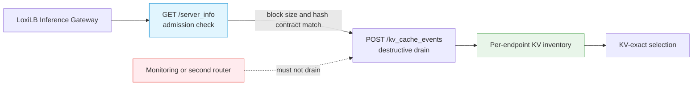
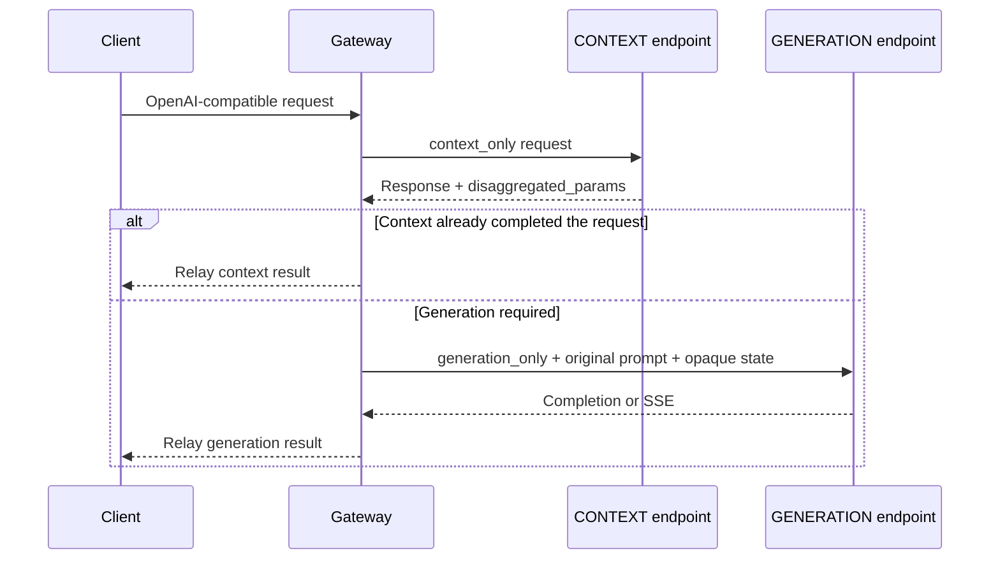

# TensorRT-LLM Integration

Configure TensorRT-LLM for plain fullproxy routing, single-pool KV-exact routing, or sequential context/generation disaggregation. The event plane uses a destructive HTTP drain, which makes consumer ownership a central operational requirement.

## Prerequisites

- A homogeneous TensorRT-LLM fleet with the same model and compatible serving configuration.
- Fullproxy (`mode: 4`) on every AI-aware rule.
- `kv_cache_config.event_buffer_max_size` greater than zero when KV-exact routing is used.
- A reachable `GET /server_info` endpoint and `POST /kv_cache_events` on each TensorRT-LLM serving port.
- For P/D, at least one CONTEXT endpoint (`ep_role: 1`) and one GENERATION endpoint (`ep_role: 2`).

## Supported shapes

| Shape | Required rule fields |
|---|---|
| Plain fullproxy | `mode: 4`, `kvEngineType: "trtllm"` |
| Single-pool KV-exact | Add `kvExactMode: 3` and a matching `kvBlockSize` |
| Sequential P/D with KV-exact prefill selection | Add `pd_disagg_mode: true`, `kvExactMode: 1`, and endpoint roles |



!!! warning "Exactly one event consumer"
    `POST /kv_cache_events` drains buffered events. The Gateway must be the sole consumer for each endpoint. Do not use that endpoint as a health probe or monitoring scrape target, and do not attach a second cache-aware router.

## Sequential P/D lifecycle



The gateway preserves the original prompt on the generation leg and transfers the engine-produced opaque state without reconstructing it. A context result that already reached a terminal finish reason is returned directly and skips generation.

## P/D configuration

The example uses documentation-only addresses and the rule shape accepted by the current API. `kvBlockSize: 32` must be replaced if `/server_info` reports a different `tokens_per_block`.

!!! warning "The example inference listener is plaintext"
    `security: 0` is for an isolated lab. Choose `security: 1` or `2` and configure certificate
    verification for production trust boundaries; see [mTLS](../security/mtls.md).

Prepare an HTTPS management base URL and protected authorization header:

--8<-- "snippets/common/control-api-header.md"

```bash
curl --fail-with-body --silent --show-error \
  --request POST "$CONTROL_API/config/loadbalancer" \
  --header @control-plane.headers \
  --header 'Content-Type: application/json' \
  --data-binary '{
    "serviceArguments": {
      "externalIP": "192.0.2.10",
      "port": 2040,
      "protocol": "tcp",
      "sel": 0,
      "mode": 4,
      "security": 0,
      "pd_disagg_mode": true,
      "kvEngineType": "trtllm",
      "kvExactMode": 1,
      "kvBlockSize": 32,
      "kvWarmupSec": 5,
      "sse_mode": true,
      "host": "192.0.2.10",
      "monitor": true,
      "cb_enable": true,
      "probetype": "http",
      "probeport": 8355,
      "probereq": "/health",
      "probeTimeout": 5,
      "probeRetries": 2
    },
    "endpoints": [
      {"endpointIP": "198.51.100.11", "targetPort": 8355, "weight": 1, "ep_role": 1},
      {"endpointIP": "198.51.100.12", "targetPort": 8355, "weight": 1, "ep_role": 1},
      {"endpointIP": "198.51.100.21", "targetPort": 8355, "weight": 1, "ep_role": 2}
    ]
  }'
```

!!! info "REST is required for the typed example"
    Use the REST API for the complete TensorRT-LLM rule. CLI field availability can vary by
    client version; always confirm the stored rule through the REST read-back.

Do not set a non-default `kvZmqPort`; TensorRT-LLM events use each endpoint's serving port. Do not set `kvDpRankCount` above one. Omit `kvHashAlgo` to select `blockhash_trtllm` automatically.

`kvWarmupSec` is accepted and stored, but the production path currently does not arm its
start timestamp. Treat successful `/server_info` admission plus nonzero inventory as the
readiness signal; do not rely on the example's five-second value to delay routing.

### Convert to a single pool

For converged workers, remove `pd_disagg_mode` and all `ep_role` fields, keep `kvEngineType: "trtllm"`, and set `kvExactMode: 3`. All endpoints are then admitted and scored as one role-less pool.

## Verify

1. Confirm the rule and endpoint roles:

   ```bash
   curl --fail-with-body --silent --show-error \
     --header @control-plane.headers "$CONTROL_API/config/loadbalancer/all" \
     | jq '.lbAttr[] | select(.serviceArguments.port == 2040)'
   ```

2. Confirm each endpoint's `/server_info` reports the expected block size before relying on KV routing.
3. Send both non-streaming and streaming requests through the VIP.
4. Confirm event subscribers and inventories become active:

   Before the first scrape, enable metrics with an authenticated
   `POST /netlox/v1/config/metrics`; see [Monitoring and Metrics](../operations/monitoring.md#enable-and-scrape-metrics).

   ```bash
   curl --fail-with-body --silent --show-error "$CONTROL_API/metrics" \
     | grep -E 'loxilb_kv_subscriber_connected|loxilb_pd_kv_blocks|loxilb_pd_kv_tier15_hits_total|loxilb_pd_trt_ctx_early_exit_total'
   ```

5. Confirm no monitoring job or second router calls `/kv_cache_events`.

## Failure diagnosis

| Symptom | Likely cause | Action |
|---|---|---|
| Traffic works but KV inventory stays empty | Event buffer disabled or admission failed | Enable a nonzero event buffer and compare `tokens_per_block` with `kvBlockSize`. |
| Subscriber repeatedly resynchronizes | Another consumer drains events or the engine ring overflows | Remove the competing consumer and review event-buffer capacity. |
| Rule rejects `kvZmqPort` | ZMQ is not used by this engine | Remove the field or leave the API default untouched. |
| Rule rejects `kvDpRankCount` | The current poller does not expose client-visible rank fan-out | Remove the field or use the default value. |
| P/D request never reaches generation | Context finished early or generation is unavailable | Inspect `loxilb_pd_trt_ctx_early_exit_total`, endpoint health, and engine logs. |
| KV hits remain zero | Block size, tokenizer, or event ownership is wrong | Correct parity, then warm the pool again before measuring. |

## Cleanup

```bash
curl --fail-with-body --silent --show-error \
  --request DELETE --header @control-plane.headers \
  "$CONTROL_API/config/loadbalancer/hosturl/192.0.2.10/externalipaddress/192.0.2.10/port/2040/protocol/tcp"
```

Stop the Gateway event consumer before assigning `/kv_cache_events` ownership to another router.
Remove `control-plane.headers` after the workflow and unset `CONTROL_PLANE_TOKEN`.

## Security and evidence limits

- Restrict `/server_info` and `/kv_cache_events` to the Gateway and trusted operators; they are operational control surfaces, not public application APIs.
- Protect the management API and backend network. Do not embed model registry credentials in rule payloads.
- The repository validates admission, event ingestion, P/D rewriting, early exit, and failure behavior with mocks. Real engine compatibility and performance must be verified against the deployed TensorRT-LLM build and GPU topology.

## See also

- [Engine Capability Matrix](../concepts/engine-capability-matrix.md)
- [P/D Disaggregation](pd-disaggregation.md)
- [KV-Cache Routing](kv-caching.md)
