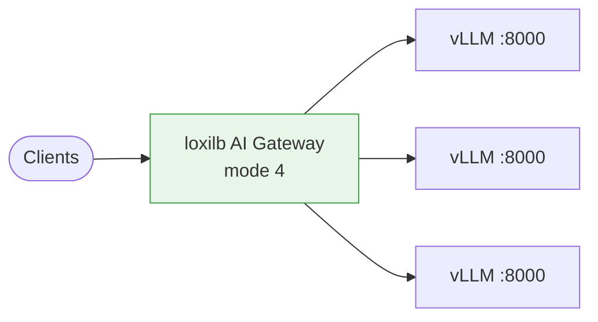
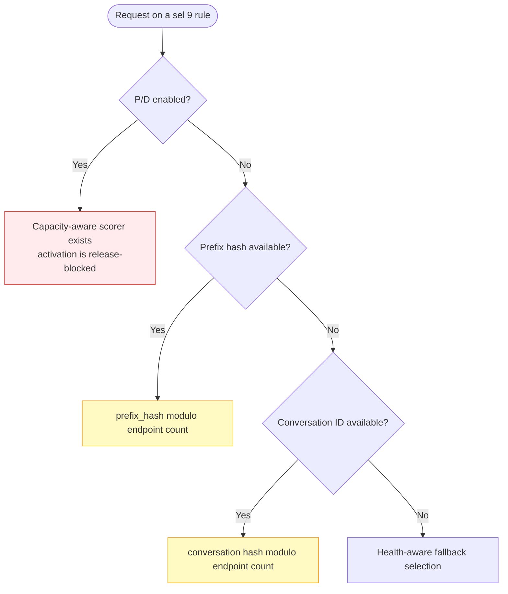

# vLLM Integration

!!! warning "Keep AI-aware vLLM rules on HTTP/1.1"
    Current HTTP/2 forwarding lacks model-aware pool lookup, selector 10, P/D, and KV-exact
    integration; selector 9 becomes round-robin. Treat HTTP/2 parity as a release gate.

Run vLLM behind the loxilb AI Gateway: the launch flags that must line up with the gateway, how to health-probe vLLM backends, backend protocol / ALPN, and the exact selector-9 metrics boundary.

## Concept

vLLM is the inference engine that actually runs the model on the GPU. loxilb fronts one or more vLLM instances as an L7 fullproxy (`mode: 4`) and spreads requests according to the selected routing law. Nothing special is required of vLLM to sit behind the gateway, but several launch flags must **match** the gateway's configuration for KV-aware features to work.



---

## Launch Flags That Matter

Most vLLM launch flags are independent of loxilb. These few must be consistent with the gateway rule, because the gateway and vLLM independently compute or exchange values that only match when the parameters agree.

| vLLM flag / env | Gateway field | Why it must match |
|---|---|---|
| `--block-size 16` | `kvBlockSize` (default `16`) | Block-hash routing hashes fixed-size token blocks. A different block size on either side yields non-overlapping hashes and zero cache-hit routing. |
| `--prefix-caching-hash-algo sha256_cbor` | `kvHashAlgo` (default `sha256_cbor`) | The block-hash algorithm must be identical end to end. vLLM's own default is not CBOR-based, so set this explicitly. |
| KV-events publisher `tcp://*:5557` | `kvZmqPort` (default `5557`) | vLLM publishes KV-cache events on a ZMQ PUB socket; loxilb subscribes on `kvZmqPort`. The ports must line up. |
| `VLLM_KV_EVENTS_USE_INT_BLOCK_HASHES=1` | — | Emits integer block hashes in the KV-event stream, the form loxilb consumes for its per-block inventory. |
| `--enable-request-id-headers` | — | Optional: exposes request IDs in vLLM response headers for client-side diagnostics. Gateway-internal request correlation does not require this flag. |

```bash
docker run -d --gpus all --network host \
  -e VLLM_KV_EVENTS_USE_INT_BLOCK_HASHES=1 \
  vllm/vllm-openai:v0.17.0 \
    --model Qwen/Qwen3-0.6B \
    --port 8000 \
    --block-size 16 \
    --prefix-caching-hash-algo sha256_cbor \
    --enable-request-id-headers \
    --kv-events-config '{"enable_kv_cache_events":true,"publisher":"zmq","endpoint":"tcp://*:5557"}'
```

The tag above is a reproducible example, not a floating compatibility promise. For production,
pin the exact vLLM image you tested and validate its block-hash and KV-event output against the
gateway before promotion.

!!! note "KV-cache routing has its own page"
    The block-size, hash-algo, and KV-events flags above only matter when you enable block-hash
    KV-exact routing (`kvExactMode`). The full end-to-end parity contract — including hash-seed
    alignment — is covered in [KV-Cache Routing](kv-caching.md). For plain CHWBL,
    selector-9 affinity, or round-robin load balancing, none of these flags are required.

---

## Health Probing

!!! warning "Protect the management API"
    The `curl` examples use plain HTTP for an isolated lab. In production, use an authenticated,
    TLS-protected management endpoint and read its authorization header from a
    permission-restricted file.

loxilb can actively health-check each vLLM backend and take failing endpoints out of rotation. vLLM exposes an OpenAI-style `/health` endpoint, which pairs naturally with an HTTP probe.

| Field | Type | Notes |
|---|---|---|
| `monitor` | bool | Enable active health probing for the service. |
| `probetype` | string | One of `tcp`, `udp`, `sctp`, `http`, `https`, `ping`, `none`. Use `http` for vLLM `/health`. |
| `probeport` | int | Probe port (the vLLM serving port, e.g. `8000`). |
| `probereq` | string | Probe request — the URL path for `http`/`https` probes (e.g. `/health`). |
| `proberesp` | string | Expected response string to match (optional). |
| `probeTimeout` | int | Per-probe timeout in seconds. |
| `probeRetries` | int | Retries before marking an endpoint inactive. |

=== "curl"
    ```bash
    curl -s -X POST http://<loxilb>:11111/netlox/v1/config/loadbalancer \
      -H 'Content-Type: application/json' \
      -d '{
        "serviceArguments": {
          "externalIP": "10.10.10.254",
          "port": 8080,
          "protocol": "tcp",
          "sel": 0,
          "mode": 4,
          "security": 0,
          "backend_protocol": "http1",
          "monitor": true,
          "probetype": "http",
          "probeport": 8000,
          "probereq": "/health",
          "probeTimeout": 5,
          "probeRetries": 2
        },
        "endpoints": [
          {"endpointIP": "192.0.2.1", "targetPort": 8000, "weight": 1},
          {"endpointIP": "198.51.100.1", "targetPort": 8000, "weight": 1}
        ]
      }'
    ```

=== "loxicmd"
    ```bash
    loxicmd create lb 10.10.10.254 --tcp=8080:8000 --endpoints=192.0.2.1:1,198.51.100.1:1 --mode=fullproxy --backend-protocol=http1 --monitor --probetype=http --probeport=8000 --probereq=/health --probetimeout=5 --proberetries=2
    ```

A backend that fails its probe is reported with `"inActiveEP": true` in `GET /config/loadbalancer/all` and is skipped by endpoint selection until it recovers.

---

## Backend Protocol and ALPN

`backend_protocol` sets the protocol loxilb negotiates toward the vLLM backends (via ALPN when TLS is in play):

| Value | Meaning |
|---|---|
| `http1` | HTTP/1.1 only. Default and safest — matches vLLM's OpenAI server. |
| `http2` | HTTP/2 only. |
| `both` | Advertise both HTTP/1.1 and HTTP/2 and let ALPN negotiate. |

`security` controls TLS on the service VIP:

| Value | Mode |
|---|---|
| `0` | Plaintext frontend and backend |
| `1` | Frontend TLS termination with a plaintext HTTP backend |
| `2` | Frontend TLS termination plus TLS re-encryption to the backend |

For a typical vLLM deployment, `backend_protocol: http1` with `security: 0` (plain) or `security: 1` (TLS termination on the VIP) is the right starting point.

---

## `sel: 9`: Current Topology-Dependent Behavior

The API and CLI call selector 9 `gpuaware`, but its current fullproxy behavior depends on the
service topology. Do not assume that the name means every rule reads the worker-metrics API.



- **Plain single pool:** selector 9 uses request affinity, not live GPU load. Adding or removing
  endpoints can remap modulo placements. Use CHWBL (`sel: 8`) when you need a stable hash ring and
  bounded-load protection, or round-robin (`sel: 0`) for independent requests.
- **P/D pool:** a capacity-aware Tier-2 scorer exists, but the current activation gate compares a
  mutable endpoint cursor instead of the configured selector. Configuring `sel: 9` therefore does
  not reliably enable it. Normal Tier 2 uses active connections plus queued requests. See
  [Routing Hierarchy](../use-cases/routing-hierarchy.md).
- **Worker-metrics control surface:** the GPU enable/status and worker-metrics APIs populate and
  report a separate metrics/eBPF surface. The current plain fullproxy selector does not read that
  surface. A successful metrics POST or `routing_mode: gpu_aware` status is therefore not proof of
  least-loaded selection for a plain pool.

!!! warning "Do not deploy from the historical least-loaded claim"
    For a plain fullproxy vLLM pool, do not use `sel: 9` as a production least-loaded-GPU policy.
    Treat P/D capacity scoring as unavailable until the activation field is corrected and the exact
    release artifact passes an end-to-end test. Use the selectors above when their documented
    behavior matches the workload.

---

## Verify

**GPU monitoring status** — `GET /config/gpu/status` reports the worker-metrics control surface:

```bash
curl -s http://<loxilb>:11111/netlox/v1/config/gpu/status
# {
#   "enabled": true,
#   "routing_mode": "gpu_aware",
#   "worker_count": 3,
#   "last_metrics_update": "...",
#   "ebpf_map_loaded": true
# }
```

`routing_mode` is `gpu_aware` when that surface is active or `standard_chwbl` when disabled.
This is a control-plane status, not proof that a plain fullproxy service is choosing the
least-loaded endpoint.

**Per-worker metrics** — `GET /config/worker/metrics` returns the current `WorkerMetricsEntry`
list stored on that separate surface:

```bash
curl -s http://<loxilb>:11111/netlox/v1/config/worker/metrics
```

**Selection algorithm** — confirm the service shows `sel: 9`:

```bash
curl -s http://<loxilb>:11111/netlox/v1/config/loadbalancer/all \
  | jq '.lbAttr[].serviceArguments | {externalIP, port, sel}'
```

---

## Troubleshooting

### `sel: 9` does not move traffic toward a less-loaded worker

For a plain single pool, this is expected: the current fullproxy path uses prefix/session modulo
placement and a healthy fallback, not the pushed worker metrics. Switch to CHWBL for bounded
prefix affinity, or round-robin for independent requests. For P/D, use the normal routing
hierarchy; do not depend on selector-9 capacity scoring in the current release.

### `/metrics` returns nothing

Treat this as an observability or metrics-agent problem, not the explanation for plain-pool
selector 9 placement. Confirm stats logging was not disabled and that the serving port is
reachable from the metrics collector.

### All endpoints show high queue depth

- The fleet is genuinely saturated — add vLLM instances.
- Enable KV-cache routing ([KV-Cache Routing](kv-caching.md)) to raise cache-hit rates and cut per-request work.
- Consider a smaller model or quantization to raise per-GPU throughput.

### Endpoints marked inactive

- The health probe is failing. Verify `probereq` (e.g. `/health`) and `probeport` match the vLLM serving port.
- Raise `probeTimeout` / `probeRetries` if backends are slow to start.
- Confirm the probe path returns success on the vLLM instance directly.

### KV-aware routing gets no cache hits

Almost always a launch-flag mismatch. Recheck `--block-size` vs `kvBlockSize`, `--prefix-caching-hash-algo` vs `kvHashAlgo`, and the KV-events port vs `kvZmqPort`. See [KV-Cache Routing](kv-caching.md) for the complete parity contract.

---

## Next Steps

- [LLM Routing](llm-routing.md) — CHWBL, selector-9 topology behavior, and weighted-hash selection
- [KV-Cache Routing](kv-caching.md) — block-hash KV-exact routing and the vLLM/SGLang parity contract
- [P/D Disaggregation](pd-disaggregation.md) — separate prefill and decode pools
- [Configuration Reference](configuration-reference.md) — all AI Gateway `serviceArguments`
