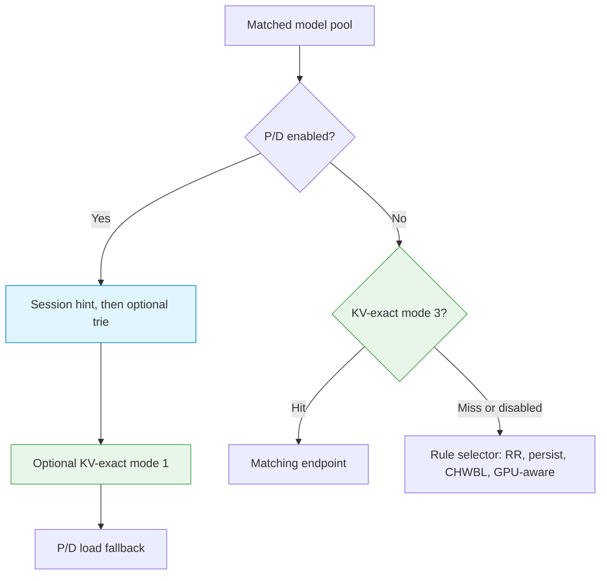

# Opt-in AI Routing Model

AI routing is never implicit. It is enabled per LB rule, only when that rule runs in fullproxy mode, and only for the fields you set — every other rule keeps behaving as a plain L4 load balancer.

---

## AI routing is per-rule and opt-in

The gateway does not switch into "AI mode" globally. Each LB rule decides on its own whether it inspects requests:

- **Turn it on where you want it.** A rule becomes AI-aware only when it is created with `mode: 4` (fullproxy) and an AI field such as `model_name` or a KV/CHWBL setting. Rules without those fields are ordinary L4 or L7 load-balancer rules.
- **Nothing is inferred.** The gateway will not start parsing request bodies, matching model names, or tracking KV caches because traffic "looks like" an LLM request. If you did not configure it on the rule, it does not happen.
- **Scope is the rule, not the box.** One gateway can run AI-aware rules and plain rules side by side. Enabling model routing on one VIP has no effect on any other.

!!! warning "Fullproxy is the prerequisite"
    All AI routing requires `mode: 4` (fullproxy). Only fullproxy terminates the connection and reassembles the HTTP request, which is what lets the gateway read headers and the JSON body. In DNAT, DSR, or other L4 modes the payload is never inspected, so `model_name`, KV routing, and CHWBL prefix hashing cannot apply. See [Running Modes](running-modes.md).

---

## The request-inspection model

Once a rule is in fullproxy mode with `model_name` configured, the gateway inspects each request to decide which backend pool serves it. Model selection is resolved in a fixed order:

1. **`X-Model` header** — if present, its value is the model name. It takes precedence over the body.
2. **JSON body `model` field** — for OpenAI-compatible requests, the `"model"` field in the body is used when no `X-Model` header is present.
3. **No model indicated** — the request is eligible for the wildcard pool.

The extracted model name is matched against the `model_name` on each LB rule sharing the VIP:

- **Exact match** routes to that rule's endpoint pool.
- **Wildcard pool** — a rule with `model_name: ""` (empty) catches any request that names no model, or whose model matches no specific rule with a wildcard fallback in place.
- **No match at all** — if the requested model matches no rule and no wildcard pool exists, the gateway returns **HTTP 503** (`model_unavailable`).

Model-name matching is **case-sensitive** and exact — `mistral-7b` and `MISTRAL-7B` are different models.

!!! danger "Use one model identity"
    Routing resolves `X-Model` before the body, while the current authorization check resolves
    the body before the header. Until those paths share one canonical value, reject requests
    where both are present and disagree. Otherwise a client can be authorized against one model
    and routed to another pool.

!!! warning "HTTP/2 is not feature-equivalent"
    Current HTTP/2 forwarding supplies no model to pool lookup, makes selector 9 round-robin,
    and does not connect selector 10, P/D, or KV-exact routing. Keep AI-aware rules on HTTP/1.1
    until an HTTP/2-capable release passes explicit model and selector tests.

### Worked example

Three rules on the same listener, VIP `10.10.10.254:2020`, each a distinct
`model_name` pool. A wildcard belongs to that same listener; placing it on another port
does not provide fallback for requests sent to port `2020`.

| Port | `model_name` | Backend pool |
|---|---|---|
| `2020` | `llama-70b` | `192.0.2.1:8080` |
| `2020` | `mistral-7b` | `198.51.100.1:8080` |
| `2020` | `""` (wildcard) | `203.0.113.1:8080` |

| Request | Resolves to |
|---|---|
| `X-Model: llama-70b` on port 2020 | llama pool |
| `{"model": "mistral-7b", ...}` on port 2020 | mistral pool |
| plain request, no model, on port 2020 | wildcard pool |
| `X-Model: llama-70b` **and** `{"model": "mistral-7b"}` | llama pool (header wins) |
| `X-Model: unknown-xyz`, no wildcard | **HTTP 503** `model_unavailable` |

### Configure a model-routing rule

Each model pool is its own LB rule with a distinct `model_name`. Create one per model, plus an optional wildcard rule.

!!! warning "Protect the management API"
    The `curl` examples use plain HTTP for an isolated lab. On a shared or production network,
    use an authenticated, TLS-protected management endpoint and load its authorization header
    from a permission-restricted file.

=== "curl"

    ```bash
    curl -s -X POST http://10.10.10.254:11111/netlox/v1/config/loadbalancer \
      -H "Content-Type: application/json" \
      -d '{
        "serviceArguments": {
          "externalIP": "10.10.10.254",
          "port": 2020,
          "protocol": "tcp",
          "mode": 4,
          "backend_protocol": "http1",
          "host": "10.10.10.254",
          "path_prefix": "/",
          "path_match_mode": "prefix",
          "model_name": "llama-70b"
        },
        "endpoints": [
          {"endpointIP": "192.0.2.1", "targetPort": 8080, "weight": 1}
        ]
      }'
    ```

=== "loxicmd"

    ```bash
    loxicmd create lb 10.10.10.254 --tcp=2020:8080 --endpoints=192.0.2.1:1 --mode=fullproxy --backend-protocol=http1 --host=10.10.10.254 --path-prefix=/ --path-match-mode=prefix --model-name=llama-70b
    ```

To add the wildcard catch-all, create another rule with the same VIP, port, protocol, host,
and path fields, and set `model_name` to the empty string `""`.

---

## Layered selection, at a high level

Model-name routing chooses *which pool* serves a request. Endpoint selection then depends on
the configured topology; there is not one universal ladder.



On P/D mode 1, session/trie choices precede KV-exact and the role-specific load fallback.
On role-less mode 3, a KV miss falls directly to the rule's `sel` algorithm; it does not enter
the P/D session, trie, or admission ladder. Without KV-exact, `sel: 3`, `8`, and `10` provide
session or content affinity without a live block inventory.

!!! tip "Go deeper"
    This is the high-level shape only. The full selection ladder — including the exact tier order, the block-hash matching contract, and the selection-law math — is covered in [Routing Hierarchy](../use-cases/routing-hierarchy.md). The `sel` algorithms that drive each layer are documented in [Load-Balancing Algorithms](lb-algorithms.md).

---

## Verify

List the rules on the VIP and confirm each carries the expected `model_name` and `mode: 4`:

=== "curl"

    ```bash
    curl -s http://10.10.10.254:11111/netlox/v1/config/loadbalancer/all
    ```

=== "loxicmd"

    ```bash
    loxicmd get lb
    ```

If you created only the named rule above and intentionally did not add a wildcard, send a known
and an unknown model to confirm matching and the 503 fall-through:

```bash
# Matches the llama pool
curl -s -H "X-Model: llama-70b" http://10.10.10.254:2020/

# Unknown model, no wildcard → HTTP 503 model_unavailable
curl -s -o /dev/null -w "%{http_code}\n" -H "X-Model: unknown-xyz" http://10.10.10.254:2020/
```

---

## Troubleshoot

**Requests are not being routed by model**

- Confirm the rule is `mode: 4` (fullproxy). L4 modes never read the body or headers, so model routing is silently inactive.
- Confirm `model_name` is set on the rule and matches exactly (case-sensitive) what the client sends in `X-Model` or the body `model` field.

**Every request returns HTTP 503 `model_unavailable`**

- No rule matched the requested model and no wildcard (`model_name: ""`) rule exists. Add a wildcard rule or correct the client's model name.

**Header and body disagree**

- The `X-Model` header always wins over the body `model` field. If a client sets both, routing follows the header.

---

## See also

- [Running Modes](running-modes.md) — `mode: 4` (fullproxy) and why it is required
- [Load-Balancing Algorithms](lb-algorithms.md) — the `sel` algorithms behind each selection layer
- [Routing Hierarchy](../use-cases/routing-hierarchy.md) — the full tiered selection ladder
- [Model Load Balancing](../ai-gateway/model-load-balancing.md) — per-model endpoint pools in the AI Gateway
- [Configuration Reference](../ai-gateway/configuration-reference.md) — every `serviceArguments` field
