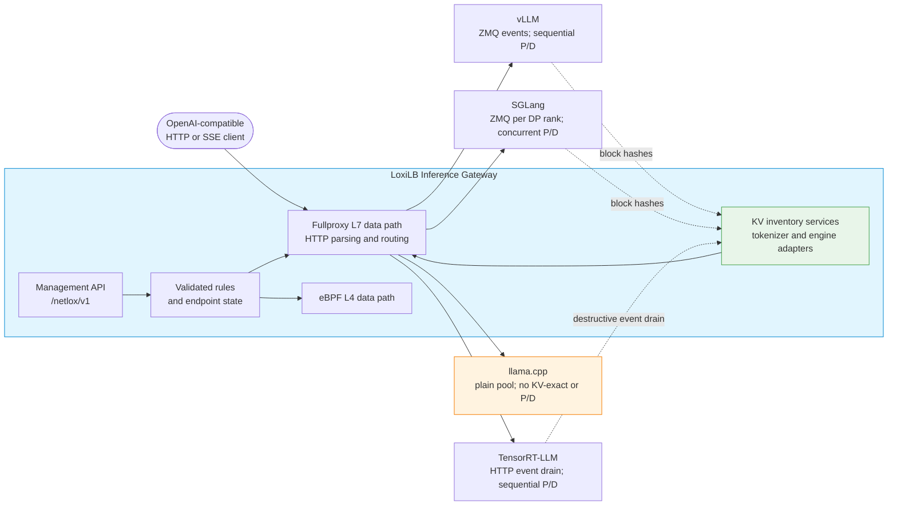

# Architecture

How the LoxiLB Inference Gateway sits in an LLM serving stack, and how its control plane and
data plane divide the work of inference-aware routing.

## The serving path

Clients speak OpenAI-compatible HTTP (and SSE for streaming) to a VIP on the gateway.
The L7 fullproxy (`mode: 4`) terminates the connection, inspects the request, selects a
model pool and endpoint, and proxies to vLLM, SGLang, TensorRT-LLM, or llama.cpp. The
engine determines the optional cache-event and P/D contract; the four engines are not
interchangeable.

The gateway is a single Go/eBPF binary. There is no Envoy, no ext-proc sidecar chain, and no
mandatory Kubernetes control plane — L4 through inference-aware L7 lives in one process.

## Control plane vs. data plane

The gateway splits cleanly into a control plane and a data plane.

**Control plane** — a GoLang process that owns configuration and routing intelligence:

- The **REST API** listens on port **11111** at `/netlox/v1/...`. Load balancers are created
  and listed at `/config/loadbalancer` and `/config/loadbalancer/all`. This is where every
  rule, endpoint, API key, and policy is programmed.
- The Go **KV inventory services** consume vLLM/SGLang ZMQ events or TensorRT-LLM's
  HTTP event drain and maintain per-rule, per-endpoint block-hash inventories. llama.cpp
  has no supported KV-event plane.
- The control plane validates engine/topology combinations and programs the rule into the
  packet and fullproxy data paths.

**Data plane** — where packets and bytes actually move:

- **eBPF** handles the L4 fast path (NAT modes, connection tracking) for classic load
  balancing, inherited unchanged from upstream loxilb.
- The **sockproxy / fullproxy** is a userspace HTTP proxy. When a rule runs in `mode: 4`,
  it terminates the client TCP/TLS connection, parses the request within its configured
  inspection limits, runs admission and endpoint selection, and manages the backend
  connection. Engine-specific P/D orchestration also runs in this serving path.

Sockmap acceleration can replace only the steady-state byte relay of an eligible plaintext
HTTP/1.1 service. It cannot coexist with `sse_mode`, P/D, any `api_key_auth` declaration, or an
attached L7 policy because those features require userspace on every request. HTTP/2 and h2c are
never accelerated. See [Sockmap Acceleration](../operations/sockmap-acceleration.md).

!!! note "Why AI routing needs the userspace proxy"
    L4 eBPF forwarding never sees HTTP — it makes its decision from the packet's 5-tuple before
    any request body arrives. Model-name routing, KV-cache-aware prefix matching, P/D request
    splitting, and SSE stream handling all require reading the HTTP request (and sometimes the
    body). That inspection happens in the userspace fullproxy, which is why **`mode: 4` is the
    prerequisite for every AI feature.** See [Running Modes](running-modes.md).

## Where AI routing hooks in

Inference-aware behavior is layered onto the fullproxy request path. For a request on an
AI-enabled rule, the gateway proceeds roughly as follows:

1. **Terminate and parse.** The fullproxy accepts the client connection (optionally
   terminating TLS per the rule's `security` mode) and reads the HTTP request.
2. **Credential admission.** The service's `api_key_auth` declaration decides
   whether Gateway authentication is absent, disabled-with-header-stripping,
   API-key-only, JWT-only, or API-key-or-JWT. This is independent of SSE and
   P/D. Management authentication is a separate control-plane decision.
3. **Model selection and authorization.** If `model_name` pools are configured, the requested model (from the
   `X-Model` header or the body `model` field) picks the endpoint pool; `""` is the catch-all.
   An attributed API key or JWT must also authorize the effective model.
4. **Quota admission.** Applicable key, user, user-model, tenant,
   tenant-model, shared-VIP, and default buckets must admit before dispatch.
5. **Endpoint selection.** The rule's `sel` algorithm chooses an endpoint within the pool.
   For LLM fleets this is typically CHWBL prefix affinity (`sel: 8`/`10`) or, when a KV-cache
   event stream is wired, engine-exact KV routing that places the request on the endpoint
   already holding the longest matching prompt prefix.
6. **P/D orchestration (optional).** With `pd_disagg_mode` enabled, the proxy applies the
   selected engine dialect: sequential vLLM prefill/decode, concurrent SGLang
   prefill/decode, or sequential TensorRT-LLM context/generation. llama.cpp P/D is
   rejected at rule creation.
7. **Stream relay and settlement.** With `sse_mode` enabled, the response is relayed as SSE with idle-timeout
   suppression while the stream is active, a wall-clock cap, and optional backend keepalive.
   Token reservations are released and measured usage is settled when the
   response completes.

The KV inventory services run alongside this path. As supported backends publish events, the
gateway updates its per-endpoint hash inventory so KV-exact selection can reflect observed
cache locality. Hash inventories contain compact hashes, not KV tensors.

## Coexistence with classic load balancing

Because AI fields are opt-in per rule, an inference-gateway node can host AI rules and classic
L4 rules side by side. A vLLM VIP (`mode: 4`, KV-aware) and a plain TCP service-type load
balancer can live on the same gateway; the classic rule uses the eBPF fast path. AI runtime
state such as KV inventories and circuit-breaker state has separate failover limitations; do
not infer stateful AI high availability from L4 cluster support alone. See
[HA Limitations](../operations/ha-limitations.md).

## Next

- [Running Modes](running-modes.md) — the `mode` enum and why `mode: 4` is the AI prerequisite.
- [LB Algorithms](lb-algorithms.md) — the `sel` selection policies, including CHWBL.
- [AI Gateway Overview](../ai-gateway/overview.md) — the full inference feature set.
- [Quickstart](../getting-started/quickstart.md) — a working rule end to end.
