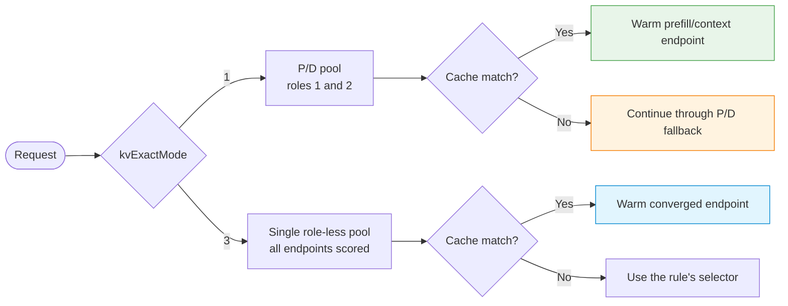

# Engine Capability Matrix

Use this matrix to separate three questions before writing configuration:

1. Does the schema accept this engine and rule shape?
2. Does the support catalog name this exact engine identity as a candidate or validated tuple?
3. Has the intended topology been verified on the deployed Linux/GPU environment?

An accepted engine name does not answer the other two questions.

## Exact support-catalog tuples

The tables below are generated from `engine-contracts/support-catalog.yaml` at Gateway commit
[`144118b532333b7ca4bfc4a82cb162878db5213e`](https://github.com/loxilb-io/loxilb-inference-gateway/commit/144118b532333b7ca4bfc4a82cb162878db5213e).
The catalog is embedded into the Gateway binary at build time; it is not an unsigned runtime
file. A newer catalog therefore requires a newer Gateway build or release.

| Engine tuple | Gateway release recorded by catalog | Profile | Promotion |
|---|---|---|---|
| vLLM `v0.23.0` | `v0.9.8.9-rc.1` | `vllm-kv-array-v1` | `candidate` |
| vLLM `v0.28.0` | `v0.9.8.9-rc.1` | `vllm-kv-map-v2` | `validated` |
| SGLang `v0.5.18` | `v0.9.8.9-rc.1` | `sglang-kv-rank-v1` | `validated` |
| TensorRT-LLM `v1.2.1` | `v0.9.8.9-rc.1` | `trtllm-kv-http-v1` | `candidate` |
| TensorRT-LLM `1.3.0rc24` | `v0.9.8.9-rc.1` | `trtllm-kv-http-preview-v1` | `validated` |
| llama.cpp `v0.3.0` | `v0.9.8.9-rc.1` | `llamacpp-nokv-v1` | `candidate` |

`candidate` is not a synonym for supported or runtime-qualified. The candidate entries above do
not carry a complete immutable engine identity and have at least one required evidence gate marked
`not_run` or `n_a`.

### Validated immutable identities

| Engine | Upstream revision | Exact image identity |
|---|---|---|
| vLLM `v0.28.0` | `2cf0a6915ce544dc493a0990f2ea38d81601128a` | `sha256:61fc8a896b0a4fbbbdc063bc4b0dbc25ce98e02b5050c24aeb7830ac02039b14` |
| SGLang `v0.5.18` | `71de97b264b04dcd514cf904003028aefe9775c8` | `sha256:9e148f5ac788e856a06166bd6347a831831eb9fcfab4d1770874823a7c29a1a1` |
| TensorRT-LLM `1.3.0rc24` | `1cef02e901be43081b1ba6d4981e94ed3bd9c1e8` | `sha256:a867619fd56c85225927dac27e2111ae90ff66e23c59d9c5f8b9f345577cab6d` |

These identities are indivisible tuples. A matching version string with a different revision,
platform digest, model profile, Gateway build, or topology is a new qualification target.

### Evidence gates recorded by the catalog

`S/F/Y/R` below means source, fixture, synthetic scenario, and real-engine evidence.

| Tuple | KV events `S/F/Y/R` | Prefix routing `S/F/Y/R` | P/D routing `S/F/Y/R` | Runtime probe `S/F/Y/R` |
|---|---|---|---|---|
| vLLM `v0.28.0` | `pass/pass/pass/pass` | `pass/pass/pass/pass` | `pass/pass/not_run/pass` | `pass/pass/pass/pass` |
| SGLang `v0.5.18` | `pass/pass/pass/pass` | `pass/pass/pass/pass` | `pass/pass/pass/pass` | `pass/pass/pass/pass` |
| TensorRT-LLM `1.3.0rc24` | `pass/pass/pass/pass` | `pass/pass/not_run/pass` | `pass/pass/pass/pass` | `pass/pass/not_run/pass` |
| vLLM `v0.23.0` candidate | `pass/pass/pass/not_run` | `pass/pass/pass/not_run` | `pass/pass/pass/not_run` | `pass/pass/not_run/not_run` |
| TensorRT-LLM `v1.2.1` candidate | `not_run/not_run/not_run/not_run` | `not_run/not_run/not_run/not_run` | `not_run/not_run/not_run/not_run` | `not_run/not_run/not_run/not_run` |
| llama.cpp `v0.3.0` candidate | `n_a/n_a/n_a/n_a` | `n_a/n_a/n_a/n_a` | `n_a/n_a/n_a/n_a` | `pass/pass/not_run/not_run` |

An individual `pass` does not promote a tuple. Only the catalog's `promotion` field is the support
status, and `not_run` is never treated as a pass.

## Implemented rule-shape summary

This table describes implemented/accepted shapes. It does not upgrade a candidate tuple to
validated status.

| Engine | Fullproxy load balancing | CHWBL | Single-pool KV-exact | P/D | Cache-event transport | Primary guardrail |
|---|---|---|---|---|---|---|
| vLLM | Yes | Yes | `kvExactMode: 3` | Sequential; `kvExactMode: 1` optionally adds KV-exact prefill selection | ZMQ | Match tokenizer, block size, hash algorithm, and hash seed. |
| SGLang | Yes | Yes | `kvExactMode: 3` | Concurrent dual-dispatch; `kvExactMode: 1` optionally adds KV-exact prefill selection | ZMQ, one consecutive port per DP rank | Match tokenizer, page size, engine hash contract, and rank port range. |
| TensorRT-LLM | Yes | Yes | `kvExactMode: 3` | Sequential context/generation; `kvExactMode: 1` optionally adds KV-exact context selection | Destructive HTTP drain on each endpoint's serving port | The Gateway must be the sole event consumer; `kvBlockSize` must match `tokens_per_block`. |
| llama.cpp | Yes | Yes | No | No | None | Do not configure KV-exact or P/D fields. Use CHWBL or session affinity. |

## How the two KV modes differ

`kvExactMode: 2` is reserved and is not an operational choice.

## Engine and hash coherence

Omit `kvHashAlgo` unless a tested deployment requires an explicit value. When omitted, the
Gateway selects the engine's coherent default.

| `kvEngineType` | Effective default | Explicit values accepted |
|---|---|---|
| `vllm` | `sha256_cbor` | `sha256_cbor`, `xxhash_cbor` |
| `sglang` | `sha256_sglang` | `sha256_sglang` |
| `trtllm` | `blockhash_trtllm` | `blockhash_trtllm` |
| `llamacpp` | None | None; any explicit KV hash algorithm is rejected |

!!! warning "A hash contract is all-or-nothing"
    A mismatched tokenizer or block size can make every lookup miss while requests still succeed
    through a fallback selector. Verify strict binding status, inventory, and hit metrics before
    claiming that KV-exact routing is active.

## P/D dialects

| Engine | Request order | Gateway behavior | Engine-to-engine state path |
|---|---|---|---|
| vLLM | Sequential | Sends prefill first, extracts KV transfer parameters, then sends decode | NIXL side channel |
| SGLang | Concurrent | Injects the same bootstrap rendezvous into both requests, dispatches both legs, drains prefill, and relays decode | Decode joins the selected prefill bootstrap service |
| TensorRT-LLM | Sequential | Sends `context_only`, extracts `disaggregated_params`, then sends `generation_only`; may finish after context | TensorRT-LLM opaque state transfer |
| llama.cpp | Not supported | P/D configuration is rejected | Not applicable |

## Scenario evidence map

The documentation contract freezes these committed scenario sources with the catalog and both
Swagger files. The links are definitions and reproducible gates, not a claim that this docs build
reran them.

| Scenario | Evidence class | What it can establish | Boundary |
|---|---|---|---|
| [`kv-profile-admission`](https://github.com/loxilb-io/loxilb-inference-gateway/tree/144118b532333b7ca4bfc4a82cb162878db5213e/cicd/kv-profile-admission) | Linux/mock contract scenario | Strict profile admission, refusal, and status vocabulary | Does not replace a real engine or GPU run |
| [`kv-mixed-version`](https://github.com/loxilb-io/loxilb-inference-gateway/tree/144118b532333b7ca4bfc4a82cb162878db5213e/cicd/kv-mixed-version) | Linux/mock compatibility scenario | Mixed-version rejection/fencing behavior | Not general HA qualification |
| [`kv-sglang-attest`](https://github.com/loxilb-io/loxilb-inference-gateway/tree/144118b532333b7ca4bfc4a82cb162878db5213e/cicd/kv-sglang-attest) | Linux/synthetic attestation | SGLang identity, geometry, and attestation paths | Not real SGLang performance or GPU proof |
| [`vllm-kvcache-routing-cpu`](https://github.com/loxilb-io/loxilb-inference-gateway/tree/144118b532333b7ca4bfc4a82cb162878db5213e/cicd/vllm-kvcache-routing-cpu) | Linux/CPU mock plus separate real-engine exit gate | Hash parity, event ingest, exact selection, failure twins | The in-tree mock alone cannot promote an upstream engine tuple |
| [`vllm-pd-admission-cpu`](https://github.com/loxilb-io/loxilb-inference-gateway/tree/144118b532333b7ca4bfc4a82cb162878db5213e/cicd/vllm-pd-admission-cpu) | Linux/CPU mock | Bounded P/D admission, queue, overflow, and independent counter/log/client oracles | No GPU or engine-transfer qualification |
| [`sockmap-fullproxy`](https://github.com/loxilb-io/loxilb-inference-gateway/tree/144118b532333b7ca4bfc4a82cb162878db5213e/cicd/sockmap-fullproxy) | Manual Linux scenario | Eligibility refusals, HTTP/1.1 equivalence, h2c fallback, integrity and control probes | Not wired into GitHub Actions; vendor-kernel safety must be qualified separately |

## Common rule requirements

- AI request inspection and P/D use fullproxy (`mode: 4`).
- P/D needs at least one `ep_role: 1` endpoint and one `ep_role: 2` endpoint.
- `kvExactMode: 1` is valid only with P/D.
- `kvExactMode: 3` is valid only without P/D.
- `kvEngineType` is immutable on an existing rule; change it by deleting and recreating the rule.
- SGLang `kvDpRankCount` is limited to eight ranks, and the last port in the consecutive ZMQ range must not exceed `65535`.
- TensorRT-LLM does not use `kvZmqPort` and does not accept `kvDpRankCount` greater than one.
- llama.cpp deliberately rejects the KV and P/D controls.
- `kvWarmupSec` is accepted for KV rules but its production start timestamp is currently not
  armed. Use health, subscriber, admission, and inventory signals as readiness gates.
- Cold-endpoint seeding applies to Tier-1.5 across supported KV engines. By default, every
  sixteenth hit can seed an eligible endpoint below the 16-block cold floor.

## Failure demotion contract

`cb_enable: true` enables the per-endpoint fullproxy circuit breaker; P/D rules also enable a
three-failure, 30-second breaker in the current rule path. In addition to connect failures,
three consecutive origin 5xx responses open an enabled breaker by default. The 5xx response is
still relayed to the current client; the open breaker changes later endpoint selection and is
not an automatic retry. `LLB_PD_ORIGIN_ERR_THRESHOLD=0` disables origin-5xx demotion.

## HTTP/2 evidence boundary

Current HTTP/2 tests cover bounded admission/authentication cases, multiplexing, selected
request/accounting lifecycles, h2c, and specific TLS/ALPN legs. They do **not** establish feature
parity for model-aware selection, selector 10, P/D, KV-exact routing, SSE, or engine transport.
Those engine features remain on the HTTP/1.1 fullproxy path unless an exact release adds and
qualifies a different contract.

Sockmap does not fill this gap. HTTP/2 and h2c connections are never accelerated, and AI rules
that declare per-request rewrites are ineligible for sockmap. See
[Sockmap Acceleration](../operations/sockmap-acceleration.md).

## Evidence limits

The exact tuple tables reproduce the embedded support catalog. The rule-shape and scenario tables
describe static contracts and committed validation sources. This docs update does not rerun
Linux, GPU, HA, or release qualification, and the catalog does not promise a particular
throughput, latency, or cache-hit rate. Validate the chosen immutable tuple and topology in a
representative environment before production use.

## See also

- [Choose an Inference Engine](../getting-started/choose-your-engine.md)
- [Model Profiles and KV-Exact Readiness](../ai-gateway/model-profiles-kv-readiness.md)
- [P/D Disaggregation](../ai-gateway/pd-disaggregation.md)
- [SGLang P/D Disaggregation](../ai-gateway/sglang-pd-disaggregation.md)
- [TensorRT-LLM Integration](../ai-gateway/tensorrt-llm-integration.md)
- [llama.cpp Integration](../ai-gateway/llamacpp-integration.md)
- [Sockmap Acceleration](../operations/sockmap-acceleration.md)
