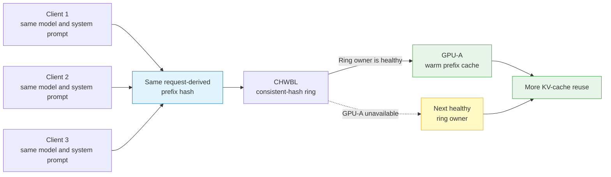
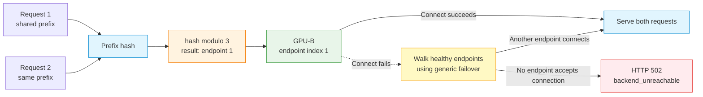
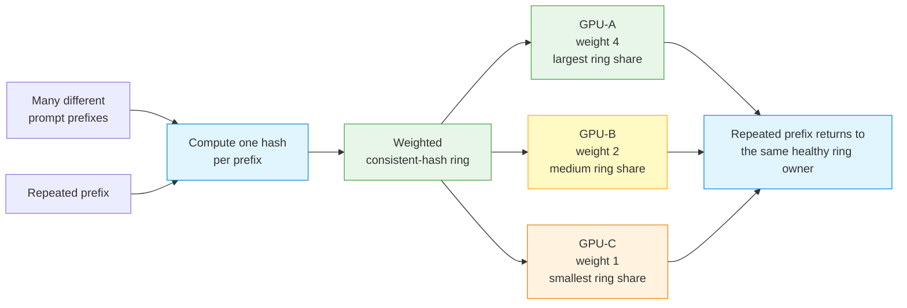

# Load-Balancing Algorithms

!!! warning "HTTP/2 selector boundary"
    The selector descriptions below apply to the HTTP/1.1 fullproxy path. HTTP/2 implements
    selector-8 CHWBL with a different rule: it can apply the load cap even when a prefix hash is
    present. Current HTTP/2 forwarding makes selectors 9 and 10 round-robin and does not connect
    P/D, KV-exact, or model-aware lookup. Validate HTTP/2 parity in the released artifact before
    enabling it.

The `sel` field on an LB rule chooses how the gateway picks a backend endpoint. This page covers the full `sel` enum and drills into the algorithms that matter for LLM serving — CHWBL, GPU-aware, weighted-round-robin-with-hash, and persist-based session affinity.

---

## The `sel` enum

`sel` is an integer on the LB rule's `serviceArguments`. It defaults to `0` (round-robin). The full enum:

| `sel` | Algorithm | AI-relevant | Summary |
|---|---|---|---|
| `0` | Round-robin (rr) | ✅ | Even rotation across endpoints. |
| `1` | Hash | — | Static tuple hash (L4). |
| `2` | Weighted round-robin (wrr) | ✅ | Rotation biased by endpoint `weight`. |
| `3` | Persist | ✅ | Session affinity — pins a session to one endpoint. |
| `4` | Least-connections (lc) | — | Fewest active connections wins. |
| `5` | N2 | — | Userspace selector for the SCTP N2 interface; requires fullproxy. |
| `6` | N3 | — | N3 interface selector; accepted only for UDP services. |
| `7` | reserved | — | Not used. |
| `8` | CHWBL | ✅ | Consistent hash with bounded loads — prompt/prefix-aware cache locality. |
| `9` | GPU-aware (topology-dependent) | ✅ | Plain pool: prefix/session modulo placement. P/D capacity-aware activation is currently release-blocked. |
| `10` | WRR-hash | ✅ | Weighted consistent hash — same prefix hashing as CHWBL, distributed by weight. |

!!! note "AI routing needs fullproxy"
    All of the AI-aware behaviors below require the rule to run in `mode: 4` (fullproxy) so the gateway can inspect HTTP bodies and headers. In any other mode the rule performs L4 load balancing only. See [Opt-in AI Routing Model](ai-routing-model.md) and [Running Modes](running-modes.md).

---

## Algorithms for LLM serving

Each advanced selector below combines its behavior, recommended use, a concrete HTTP/1.1
fullproxy scenario, and checks that an operator can run during validation.

### `sel: 0` — Round-robin

Rotates evenly across all healthy endpoints. It has no awareness of KV cache, GPU load, or session context, so every turn of a multi-turn conversation can land on a different GPU and pay a cold-cache recompute penalty.

**When to use for LLM serving:** stateless, single-shot completions where every backend is interchangeable and no prompt reuse is expected — for example a batch classification or embedding pool. As soon as conversations or shared system prompts enter the picture, prefer `sel: 8` or `sel: 3`.

### `sel: 2` — Weighted round-robin

Round-robin biased by each endpoint's `weight`. A backend with `weight: 3` receives roughly three times the requests of a `weight: 1` peer.

**When to use for LLM serving:** heterogeneous GPU fleets where you want a fixed traffic split — for example directing more traffic to larger-VRAM nodes — without cache or load feedback. It distributes *volume*, not *cache affinity*.

### `sel: 3` — Persist (session affinity)

Pins a logical session to a single backend so every request in that session reaches the GPU that already holds its context. The session key is taken from `session_header_name` (see [Session affinity](#session-affinity-sel-3) below). With no `session_header_name` set, persist falls back to source-IP stickiness.

**When to use for LLM serving:** conversational or agentic workloads that carry an explicit session identifier (a chat thread ID, an MCP session header, a cookie). It is the most direct way to keep a conversation's KV cache warm on one endpoint.

### `sel: 8` — CHWBL (consistent hash with bounded loads)

On HTTP/1.1, this selector hashes a stable feature of the request onto a consistent-hash ring.
When a real prefix hash is available, it preserves strict prefix affinity and skips unhealthy ring
owners; it does not apply the bounded-load spill check. When it instead uses a conversation or
fallback-derived key, the bounded-load ceiling can move selection away from an overloaded ring
owner. Adding or removing a backend remaps only part of the ring.

**When to use for LLM serving:** conversational and RAG workloads that benefit from strong prefix
locality without requiring clients to send a session header. Monitor hot shared prefixes because
strict prefix affinity can concentrate them on one endpoint. Tuning fields and their current
runtime boundary are covered in [CHWBL tuning](#chwbl-tuning-sel-8) below.

#### Example: shared support-agent prompt on equal GPUs

Three clients use the same model and support-agent system prompt. GPU-A, GPU-B, and GPU-C have
equal capacity, so reusing one GPU's warm KV cache matters more than evenly spreading these three
requests.



**Operator checks:**

- Replay the same prefix and use request or access logs to confirm that it reaches the same healthy
  endpoint.
- Alert on a hot shared prefix that concentrates requests on one GPU.
- Simulate an endpoint failure and verify selection of the next healthy ring owner, or HTTP 503
  when none is available.

### `sel: 9` — GPU-aware

The current fullproxy implementation has two distinct laws behind this historical name:

- On a **plain single pool**, a request with a prefix hash uses
  `prefix_hash % endpoint_count`; otherwise a conversation ID is hashed the same way, followed by
  a health-aware fallback when neither value is available. Pushed worker metrics are not read by
  this userspace selector.
- On a **P/D pool**, the intended capacity-aware branch exists, but its current activation gate
  checks the mutable endpoint cursor rather than the configured selector. A configured `sel: 9`
  therefore does not reliably activate it. Normal Tier 2 uses active connections plus queued
  requests.

The separate GPU status and worker-metrics APIs provide observability; they are not evidence of
least-loaded selection on the plain path. See
[vLLM Integration](../ai-gateway/vllm-integration.md).

!!! danger "P/D capacity-aware activation is currently release-blocked"
    Configuring `sel: 9` does not reliably enable the capacity-aware scorer. Do not claim that
    behavior until the activation gate is corrected and the exact release artifact passes an
    integration test. On HTTP/2, selector 9 reduces to round-robin.

**When to use for LLM serving:** use `sel: 9` only when you deliberately want plain-pool modulo
placement and have tested how endpoint additions, removals, and failures remap traffic. Prefer
CHWBL for a stable ring with bounded-load protection, round-robin for independent requests, and
the normal routing hierarchy for a P/D pool.

#### Example: deterministic placement in a plain GPU pool

A non-P/D pool has three equal GPUs. Two requests carry the same model and prompt prefix. The
resulting prefix hash maps to endpoint index `1` when divided by the three endpoints.



**Operator checks:**

- Replay the same prefix and confirm the same endpoint index while endpoint count and order remain
  unchanged.
- Add or remove a test endpoint and measure the wider remapping caused by modulo placement.
- Force connection failure and distinguish connection-exhaustion
  `502 backend_unreachable` from selection-time `503 no_healthy_backend`.

### `sel: 10` — WRR-hash (weighted consistent hash)

Uses the same prefix-hashing machinery as CHWBL, but distributes the virtual nodes on the ring proportionally to endpoint `weight`. You get CHWBL's prefix-cache locality *and* a deliberate, weight-driven traffic split across uneven backends.

On HTTP/1.1, a real prefix hash remains strictly affine to its weighted ring owner, subject to
health handling. The bounded-load check applies only when selection uses a conversation or
fallback-derived key.

**When to use for LLM serving:** mixed or transitional fleets where you want cache-aware routing but the endpoints are not equal — for example while draining an old GPU tier, or when blending large- and small-VRAM nodes under one VIP. Selector 10 uses endpoint weights, but submitted `chwbl_*` tuning values are not currently propagated to the proxy.

#### Example: weighted cache affinity across different-sized GPUs

GPU-A is the largest worker, GPU-B is medium, and GPU-C is smallest. Their endpoint weights are
`4`, `2`, and `1`, and many different prompt prefixes arrive over time.



**Operator checks:**

- Test many distinct prefixes; do not expect a small sample to produce an exact `4:2:1` request
  ratio.
- Replay one prefix and confirm that it returns to the same healthy ring owner.
- Read back the configured endpoint weights and verify the intended static ownership distribution;
  weight is not a live GPU-load signal.

---

## CHWBL tuning (`sel: 8`)

The API accepts the CHWBL knobs for `sel: 8` and `sel: 10`, but the current rule-to-data-plane
path does not propagate them. The live proxy uses mean-load factor `175`, replication `256`,
prefix flags `0`, and cache-salt enforcement disabled. Treat the fields below as an intended
configuration contract, not working production tuning, until runtime metrics or a distribution
test proves propagation in the released artifact.

| Field | Type | Default | Range / values | What it controls |
|---|---|---|---|---|
| `chwbl_prefix_hash_level` | int | `1` | `1`, `2`, `3` | Stored/read back; the runtime currently derives prefix scope from request content. |
| `chwbl_prefix_hash_flags` | int | `0` | `0`–`255` bitflags | Stored/read back; the runtime currently programs flags `0`. |
| `chwbl_mean_load_factor` | int | schema `125`; runtime `175` | `100`–`300` | Intended bounded-load ceiling; currently not propagated to the proxy. |
| `chwbl_replication` | int | schema `100`; runtime `256` | `1`–`1024` | Intended vnode count; currently not propagated to the proxy. |
| `chwbl_enable_cache_salt` | bool | `false` | — | Intended salt requirement; currently not propagated, so it must not be used as a tenant-isolation control. |

!!! danger "Do not claim strict tenant isolation from CHWBL salt"
    Prefix scope is inferred from request content and the runtime salt switch remains off.
    Separate untrusted tenants into independently authorized pools or listeners. A hash input is
    an affinity hint, not an authorization boundary.

### `chwbl_prefix_hash_flags` bits

These bits describe the API contract. The current proxy receives flags `0` and infers prefix
scope from each request; setting a nonzero value does not currently change the live hash input.

| Bit | Value | Feature |
|---|---|---|
| 0 | `1` | LoRA adapter |
| 1 | `2` | Image input |
| 2 | `4` | Audio input |
| 3 | `8` | Cache salt |
| 4 | `16` | Tools / function definitions |
| 5 | `32` | Session |
| 6 | `64` | RAG template |
| 7 | `128` | RAG documents |

For example, the schema defines `192` as bits 6 and 7. This is descriptive API metadata only in
the current build; setting it does not change the live hash input.

### Configure CHWBL

!!! warning "Protect the management API"
    The `curl` examples use plain HTTP for an isolated lab. In production, use an authenticated,
    TLS-protected management endpoint and keep authorization values out of command arguments.

=== "curl"

    ```bash
    curl -s -X POST http://10.10.10.254:11111/netlox/v1/config/loadbalancer \
      -H "Content-Type: application/json" \
      -d '{
        "serviceArguments": {
          "externalIP": "10.10.10.254",
          "port": 8080,
          "protocol": "tcp",
          "mode": 4,
          "sel": 8,
          "backend_protocol": "http1"
        },
        "endpoints": [
          {"endpointIP": "192.0.2.1", "targetPort": 8080, "weight": 1},
          {"endpointIP": "198.51.100.1", "targetPort": 8080, "weight": 1},
          {"endpointIP": "203.0.113.1", "targetPort": 8080, "weight": 1}
        ]
      }'
    ```

=== "loxicmd"

    ```bash
    loxicmd create lb 10.10.10.254 --tcp=8080:8080 --endpoints=192.0.2.1:1,198.51.100.1:1,203.0.113.1:1 --mode=fullproxy --select=chwbl --backend-protocol=http1
    ```

---

## Session affinity (`sel: 3`)

For clients that carry an explicit session identifier, `sel: 3` (persist) pins each session to one backend. The `session_header_name` field tells the gateway where to read the session key from. It supports four extraction methods:

| `session_header_name` value | Extraction | Example client |
|---|---|---|
| `X-Session-ID` (any header name) | Full header value | Custom agents, MCP (`mcp-session-id`) |
| `cookie:JSESSIONID` | Named cookie from the `Cookie:` header | Java / Spring web apps |
| `query:session_id` | Named parameter from the URL query string | REST clients with URL-encoded sessions |
| `basic-auth` | Username from an `Authorization: Basic` header | Internal per-user services |

If `session_header_name` is empty and `sel: 3` is set, persistence falls back to source-IP stickiness.

=== "curl"

    ```bash
    curl -s -X POST http://10.10.10.254:11111/netlox/v1/config/loadbalancer \
      -H "Content-Type: application/json" \
      -d '{
        "serviceArguments": {
          "externalIP": "10.10.10.254",
          "port": 8080,
          "protocol": "tcp",
          "mode": 4,
          "sel": 3,
          "backend_protocol": "http1",
          "session_header_name": "X-Session-ID"
        },
        "endpoints": [
          {"endpointIP": "192.0.2.1", "targetPort": 8080, "weight": 1},
          {"endpointIP": "198.51.100.1", "targetPort": 8080, "weight": 1},
          {"endpointIP": "203.0.113.1", "targetPort": 8080, "weight": 1}
        ]
      }'
    ```

=== "loxicmd"

    ```bash
    loxicmd create lb 10.10.10.254 --tcp=8080:8080 --endpoints=192.0.2.1:1,198.51.100.1:1,203.0.113.1:1 --mode=fullproxy --select=persist --backend-protocol=http1 --session-header-name=X-Session-ID
    ```

---

## Verify

List the LB rules and confirm the `sel` value in effect:

=== "curl"

    --8<-- "snippets/common/load-balancer-readback-rest.md"

=== "loxicmd"

    --8<-- "snippets/common/load-balancer-readback-cli.md"

---

## Troubleshoot

**Uneven distribution across endpoints**

- Confirm the intended `sel` value on the rule via `GET /config/loadbalancer/all`.
- For `sel: 2` or `sel: 10`, check that endpoint `weight` values reflect the split you expect.
- For HTTP/1.1 `sel: 8` or `sel: 10`, a hot shared prefix concentrating on one endpoint is expected
  because real prefix hashes bypass bounded-load spill. For non-prefix keys, the current proxy uses
  factor 175 and replication 256; changing the stored REST fields does not tune them.

**CHWBL / WRR-hash knobs appear to have no effect**

- Verify `sel` is `8` or `10`, then test the observed distribution. The `chwbl_*` fields are
  stored but are not currently propagated to the proxy.
- Confirm the rule is in `mode: 4` (fullproxy); L4 modes cannot inspect the request body to compute prefix hashes.

**Session not sticking under `sel: 3`**

- Verify `session_header_name` matches exactly what the client sends (cookie and query names are case-sensitive).
- With no `session_header_name`, persistence is source-IP based — clients behind a shared NAT will collapse onto one endpoint.

**GPU-aware (`sel: 9`) sending everything to one GPU**

- On a plain pool, repeated prefixes are deliberately mapped by modulo and can concentrate
  traffic. Pushed worker metrics do not change that law. Use CHWBL for bounded prefix affinity or
  round-robin for independent requests. Do not diagnose P/D capacity scoring from selector 9 until
  its activation gate is corrected; normal P/D Tier 2 uses active connections plus queued requests.
  See [vLLM Integration](../ai-gateway/vllm-integration.md).

---

## See also

- [Opt-in AI Routing Model](ai-routing-model.md) — how per-rule AI routing is enabled
- [Running Modes](running-modes.md) — why `mode: 4` (fullproxy) is required
- [Routing Hierarchy](../use-cases/routing-hierarchy.md) — the layered prefix → KV → load selection ladder in depth
- [LLM Routing](../ai-gateway/llm-routing.md) — CHWBL and selector-9 topology behavior in the AI Gateway
- [Configuration Reference](../ai-gateway/configuration-reference.md) — every `serviceArguments` field
