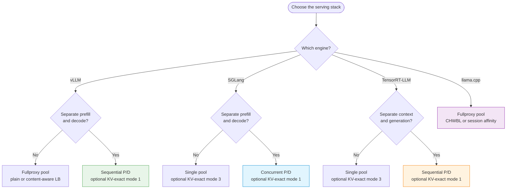

# Choose an Inference Engine

Choose the serving engine and topology together. The engine determines the request dialect and cache-event transport; the topology determines whether one worker serves the full request or separate workers handle prefill and decode.

## Before you choose

Collect these facts about the deployment:

1. Does the serving stack already run vLLM, SGLang, TensorRT-LLM, or llama.cpp?
2. Is it a single pool, or are prefill and decode workers already separated?
3. Does the engine expose cache events that the gateway can consume?
4. Can one gateway be the only consumer of a destructive event endpoint?
5. Are model, tokenizer, block size, and engine build consistent across every endpoint in the pool?

## Recommended starting point

| Situation | Start with | Why |
|---|---|---|
| Existing vLLM fleet | vLLM with the fleet's current topology | It keeps the engine's existing OpenAI and KV-transfer contracts. |
| SGLang workers with local radix caches | SGLang single pool with CHWBL; add `kvExactMode: 3` after hash parity is verified | The simple path works before the cache-event plane is introduced. |
| SGLang prefill/decode deployment | SGLang P/D | The gateway concurrently dispatches both legs and supplies the bootstrap rendezvous fields. |
| TensorRT-LLM deployment | Plain fullproxy first; then add KV-exact or P/D | Its event endpoint is destructive, so ownership and block-size admission must be correct first. |
| GGUF models served by `llama-server` | llama.cpp with CHWBL (`sel: 8`) | llama.cpp has no supported gateway KV-event or P/D contract. |

!!! tip "Add one capability at a time"
    First prove health-checked fullproxy routing. Then add content affinity, P/D, or KV-exact routing. This makes failures attributable to one configuration change.

## Non-interchangeable settings

- `kvEngineType` identifies the engine: `vllm`, `sglang`, `trtllm`, or `llamacpp`.
- `kvExactMode` identifies the endpoint topology, not the engine: `1` is a P/D pool and `3` is a role-less single pool.
- `kvExactMode: 1` requires `pd_disagg_mode: true`.
- `kvExactMode: 3` requires fullproxy and cannot be combined with P/D.
- An omitted `kvHashAlgo` lets the gateway choose the coherent engine default. This is the safest default.
- One rule represents one engine. To change `kvEngineType`, delete and recreate the rule.
- `kvWarmupSec` is currently inert. Verify endpoint health, event connectivity, and nonzero
  inventory instead of assuming a configured delay made a pool ready.
- `cb_enable` and origin-5xx demotion improve later endpoint selection; they do not retry or
  mask the current origin response.

## Security baseline

- Keep the management API on a trusted network. The examples use plain HTTP only to make an isolated lab easy to reproduce.
- Use TLS for production client traffic and protect backend traffic according to the deployment's trust boundaries.
- Never put API keys, model repository credentials, or private endpoint addresses in committed configuration examples.
- Treat content affinity as a routing function, not an authorization or tenant-isolation boundary.
- Avoid verbose payload logging when prompts can contain sensitive data.

## Next steps

- Review the [engine capability matrix](../concepts/engine-capability-matrix.md).
- For SGLang P/D, follow [SGLang P/D Disaggregation](../ai-gateway/sglang-pd-disaggregation.md).
- For TensorRT-LLM, follow [TensorRT-LLM Integration](../ai-gateway/tensorrt-llm-integration.md).
- For llama.cpp, follow [llama.cpp Integration](../ai-gateway/llamacpp-integration.md).
