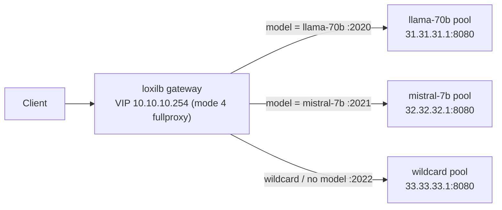

# Quickstart

Route OpenAI-compatible traffic to per-model backend pools in one sitting. You
will create three L7 load-balancer rules — one per model — and watch the gateway
pick the backend from the requested model name, carried either in an `X-Model`
header or in the JSON request body. This walkthrough is built from the runnable
`ai-model-routing` scenario, so every command is copy-pasteable.

!!! note "Before you start"
    Have the gateway running with its REST API reachable on port **11111** —
    see [Installation](installation.md). This page uses the scenario's lab
    addresses; substitute your own VIP and backend IPs as needed.

## What you will build

A single VIP (`10.10.10.254`) fronting three model pools. Each pool is a
separate L7 rule on its own port, distinguished by `model_name`:

| Port | `model_name`   | Backend pool           | Routes when the request asks for… |
|------|----------------|------------------------|-----------------------------------|
| 2020 | `llama-70b`    | `31.31.31.1:8080`      | model `llama-70b`                 |
| 2021 | `mistral-7b`   | `32.32.32.1:8080`      | model `mistral-7b`                |
| 2022 | `""` (wildcard)| `33.33.33.1:8080`      | any model, or no model at all     |

The gateway reads the model from the `X-Model` header **or** the `"model"` field
of an OpenAI-compatible JSON body. When both are present, the header wins. A
request that matches no rule and has no wildcard to fall back to gets an HTTP
**503** with a `model_unavailable` body.



## Step 1 — Start the gateway and three backends

Bring up the gateway (see [Installation](installation.md)) and three
OpenAI-compatible HTTP backends. Any HTTP server on port `8080` works; in the
lab these are minimal mock servers that echo a distinct body
(`server-llama`, `server-mistral`, `server-wild`) so you can tell which pool
answered.

- Gateway VIP: `10.10.10.254`, REST API on `:11111`
- Backend 1: `31.31.31.1:8080` — answers `server-llama`
- Backend 2: `32.32.32.1:8080` — answers `server-mistral`
- Backend 3: `33.33.33.1:8080` — answers `server-wild`

Confirm the REST API is up before configuring:

```bash
curl -sf http://10.10.10.254:11111/netlox/v1/version && echo "  API ready"
```

## Step 2 — Create the three routing rules

Each rule is one `POST` to `/config/loadbalancer`. The `serviceArguments` are
taken verbatim from the scenario: `mode: 4` selects the L7 fullproxy required
for model routing, `sel: 0` is round-robin within the pool, and
`host` + `path_prefix: "/"` + `path_match_mode: "prefix"` scope the match so the
model key resolves correctly. `model_name` is the model this rule serves; an
empty `model_name` (`""`) makes the rule a **wildcard** catch-all.

=== "curl"

    ```bash
    # Rule 1 — port 2020 → llama-70b pool
    curl -s -X POST http://10.10.10.254:11111/netlox/v1/config/loadbalancer \
      -H "Content-Type: application/json" \
      -d '{
        "serviceArguments": {
          "externalIP":      "10.10.10.254",
          "port":            2020,
          "protocol":        "tcp",
          "sel":             0,
          "mode":            4,
          "host":            "10.10.10.254",
          "path_prefix":     "/",
          "path_match_mode": "prefix",
          "model_name":      "llama-70b",
          "inactiveTimeOut": 30
        },
        "endpoints": [
          {"endpointIP": "31.31.31.1", "targetPort": 8080, "weight": 1}
        ]
      }'

    # Rule 2 — port 2021 → mistral-7b pool
    curl -s -X POST http://10.10.10.254:11111/netlox/v1/config/loadbalancer \
      -H "Content-Type: application/json" \
      -d '{
        "serviceArguments": {
          "externalIP":      "10.10.10.254",
          "port":            2021,
          "protocol":        "tcp",
          "sel":             0,
          "mode":            4,
          "host":            "10.10.10.254",
          "path_prefix":     "/",
          "path_match_mode": "prefix",
          "model_name":      "mistral-7b",
          "inactiveTimeOut": 30
        },
        "endpoints": [
          {"endpointIP": "32.32.32.1", "targetPort": 8080, "weight": 1}
        ]
      }'

    # Rule 3 — port 2022 → wildcard pool (model_name "")
    curl -s -X POST http://10.10.10.254:11111/netlox/v1/config/loadbalancer \
      -H "Content-Type: application/json" \
      -d '{
        "serviceArguments": {
          "externalIP":      "10.10.10.254",
          "port":            2022,
          "protocol":        "tcp",
          "sel":             0,
          "mode":            4,
          "host":            "10.10.10.254",
          "path_prefix":     "/",
          "path_match_mode": "prefix",
          "model_name":      "",
          "inactiveTimeOut": 30
        },
        "endpoints": [
          {"endpointIP": "33.33.33.1", "targetPort": 8080, "weight": 1}
        ]
      }'
    ```

=== "loxicmd"

    ```bash
    # Rule 1 — port 2020 → llama-70b pool
    loxicmd create lb 10.10.10.254 --tcp=2020:8080 --endpoints=31.31.31.1:1 --mode=fullproxy --host=10.10.10.254 --path-prefix=/ --path-match-mode=prefix --model-name=llama-70b --inatimeout=30

    # Rule 2 — port 2021 → mistral-7b pool
    loxicmd create lb 10.10.10.254 --tcp=2021:8080 --endpoints=32.32.32.1:1 --mode=fullproxy --host=10.10.10.254 --path-prefix=/ --path-match-mode=prefix --model-name=mistral-7b --inatimeout=30

    # Rule 3 — port 2022 → wildcard pool (model_name "")
    loxicmd create lb 10.10.10.254 --tcp=2022:8080 --endpoints=33.33.33.1:1 --mode=fullproxy --host=10.10.10.254 --path-prefix=/ --path-match-mode=prefix --inatimeout=30
    ```

!!! tip "Field casing matters"
    `model_name`, `path_prefix`, `path_match_mode`, and `inactiveTimeOut` must
    be spelled exactly as shown. A mis-cased field is silently ignored, which
    looks like a routing miss rather than an error.

## Step 3 — Test model-name routing

### Route by `X-Model` header

Send the model in the `X-Model` header to the `llama-70b` rule on port 2020:

```bash
curl -s -H "X-Model: llama-70b" http://10.10.10.254:2020/
# → server-llama
```

### Route by JSON body `model` field

Omit the header and let the gateway read the model from an OpenAI-compatible
body. This request hits the `mistral-7b` rule on port 2021:

```bash
curl -s -X POST http://10.10.10.254:2021/ \
  -H "Content-Type: application/json" \
  -d '{"model":"mistral-7b","messages":[{"role":"user","content":"hi"}]}'
# → server-mistral
```

!!! note "Header overrides body"
    If both `X-Model` and a JSON `"model"` are present, the header wins. Sending
    `X-Model: llama-70b` with a body of `"model":"mistral-7b"` to port 2020
    routes to the **llama** pool.

### Wildcard fallback

The port 2022 rule has `model_name: ""`, so it serves any request — including
one with no model at all:

```bash
curl -s http://10.10.10.254:2022/
# → server-wild
```

An empty `X-Model` header falls through to the wildcard the same way:

```bash
curl -s -H "X-Model: " http://10.10.10.254:2022/
# → server-wild
```

### No-match returns 503

Port 2020 serves only `llama-70b` and has no wildcard behind it. A request for a
model it does not serve gets an HTTP **503** with a `model_unavailable` body:

```bash
curl -s -w "\n%{http_code}\n" -H "X-Model: unknown-xyz" http://10.10.10.254:2020/
# → ...model_unavailable...
# → 503
```

!!! note "Model matching is case-sensitive"
    `model_name` matches exactly. A request for `MISTRAL-7B` will not match a
    rule configured for `mistral-7b` — it is treated as a different model and
    misses.

## Step 4 — Verify the configuration

List every rule the gateway holds with `GET /config/loadbalancer/all`. You
should see all three services, each with its `model_name` and single endpoint:

=== "curl"

    ```bash
    curl -s http://10.10.10.254:11111/netlox/v1/config/loadbalancer/all
    ```

=== "loxicmd"

    ```bash
    loxicmd get lb
    ```

Pipe it through `jq` to confirm the model-to-port mapping at a glance:

```bash
curl -s http://10.10.10.254:11111/netlox/v1/config/loadbalancer/all \
  | jq '.lbAttr[].serviceArguments | {port, model_name, mode}'
```

## Troubleshoot

| Symptom | Likely cause | Fix |
|---------|--------------|-----|
| Request hangs or connection refused | Gateway not up, or port `11111`/VIP unreachable | Re-check `GET /netlox/v1/version`; confirm the VIP is bound to the gateway node |
| Every request lands on the wrong pool | `mode` not `4`, or a mis-cased field silently dropped | Recreate the rule with `mode: 4` and exact field names |
| Expected 200 but got 503 `model_unavailable` | Requested model matches no rule and no wildcard covers that port | Add a rule for that model, or route through the wildcard port |
| Rule missing from `/config/loadbalancer/all` | POST rejected (bad JSON / duplicate key) | Re-run the POST and check its response body |

## Next steps

- [Model Load Balancing](../ai-gateway/model-load-balancing.md) — model-name
  routing in depth, including multi-pool and wildcard strategies.
- [LLM Routing](../ai-gateway/llm-routing.md) — CHWBL prefix-cache affinity and
  GPU-aware selection.
- [Configuration Reference](../ai-gateway/configuration-reference.md) — every
  `serviceArguments` field, default, and enum.
