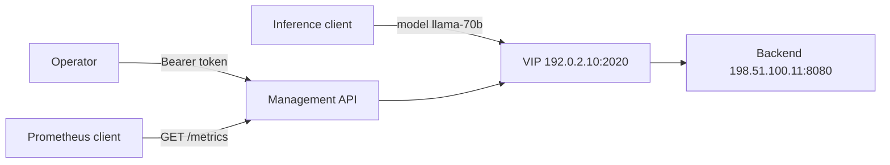

# Quickstart

Build one model-aware service through the complete beginner path: install,
readiness, management authentication, rule creation, traffic, metrics, and
cleanup. The configuration and traffic steps use the public
`ai-model-routing` scenario; operational steps are checked against the frozen
Gateway Swagger union and CLI contract.

!!! warning "Choose a compatible version pair"
    The readiness route is implemented on current Gateway `main`, not Gateway
    `v0.9.8.9-rc.1`. `loxicmd get ready` is present in CLI
    `v0.9.8.9-rc.2`, but it still needs a compatible Gateway main build. If you
    deploy the Gateway release, use `GET /version` as a process-liveness probe
    and do not treat it as configuration readiness.

## What you will build

- Management API: `https://gateway.example.com/netlox/v1`
- Data-plane VIP: `192.0.2.10:2020`
- Model: `llama-70b`
- Backend: `198.51.100.11:8080`
- Rule mode: fullproxy (`mode: 4`)
- Credential policy: omitted for this isolated data-plane lab

The addresses are documentation placeholders. Replace them with your own
reachable addresses before running the commands.

## 1. Install

**Example status:** `verified` for documentation syntax and the published
container/startup contract; Linux data-plane execution is not performed by the
documentation checks.

--8<-- "snippets/getting-started/01-install.md"

## 2. Check readiness

**Example status:** `verified` against current-main Swagger, CLI
`v0.9.8.9-rc.2`, and the frozen readiness contract. This is source/static
evidence, not a live Linux result.

--8<-- "snippets/getting-started/02-readiness.md"

## 3. Verify management authentication

**Example status:** `verified` against the management-auth contract. The
negative request is mandatory: an authenticated success alone cannot prove the
listener is protected.

--8<-- "snippets/getting-started/03-authentication.md"

!!! note "Management and inference credentials are separate"
    The bearer token above protects configuration on port `11111`. It is not an
    inference API key or JWT. This lab deliberately omits `api_key_auth`, so a
    backend-owned `X-Api-Key` passes through unchanged. Follow
    [Data-Plane Authentication and JWT](../security/data-plane-jwt-auth.md)
    before exposing a protected inference VIP.

## 4. Create one model rule

**Example status:** `verified` against the Swagger request schema, CLI flags,
and the public model-routing scenario. Run either the REST tab or the CLI tab,
not both.

--8<-- "snippets/getting-started/04-create.md"

## 5. Send traffic

**Example status:** `verified` against the public model-routing scenario. The
backend marker is the independent delivery oracle; HTTP `200` without the
expected marker is not a pass.

--8<-- "snippets/getting-started/05-traffic.md"

## 6. Inspect metrics

**Example status:** `verified` against the frozen release-scope metric
manifest and current writer mapping. The documentation check validates the
name and labels; it does not claim a live scrape occurred on your host.

--8<-- "snippets/getting-started/06-metrics.md"

## 7. Clean up

**Example status:** `verified` against the exact model-keyed REST and CLI
delete contracts. Run the cleanup form that matches the create form you chose.

--8<-- "snippets/getting-started/07-cleanup.md"

## REST-only surfaces

Do not invent CLI flags for surfaces the frozen CLI does not implement:

| Surface | Supported path |
|---|---|
| JWT profile CRUD and `jwt` / `apikey-or-jwt` rule binding | REST-only |
| Global/rule-default and user/user-model QoS CRUD | REST-only |
| Model-profile discovery and `kvexactstatus` | REST-only |
| `kvModelProfile` and `kvExactApiMode` | REST-only |
| Capability readiness and `sockmapreset` | REST-only |

The [CLI reference](../reference/cli.md#rest-only-capability-matrix) carries the
canonical compatibility matrix.

## Next steps

- [Model Load Balancing](../ai-gateway/model-load-balancing.md) explains
  multi-pool and wildcard routing.
- [Management API Authentication](../security/management-api-authentication.md)
  covers supported operator authentication modes.
- [Data-Plane Authentication and JWT](../security/data-plane-jwt-auth.md)
  adds inference credentials without confusing the two trust planes.
- [Monitoring and Metrics](../operations/monitoring.md) defines activation and
  evidence limits for every metric family.
- [Verification Status](../reference/verification-status.md) explains why
  source/static, CI, Linux runtime, GPU, HA, and release evidence are separate.
