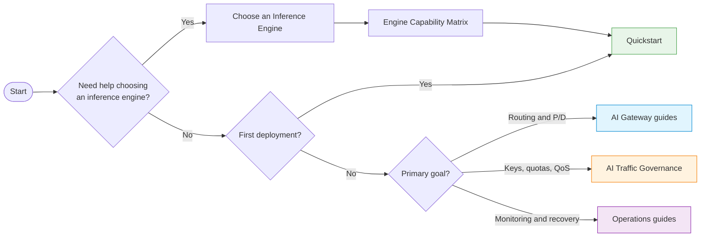

# LoxiLB Inference Gateway

!!! note "Illustrative mutation fragments"
    The management mutations on this page are non-standalone fragments. Follow
    the [mutating example contract](reference/example-quality-contract.md) and
    the complete [quickstart lifecycle](getting-started/quickstart.md) before adapting them.

An inference-aware L4/L7 load balancer for LLM serving fleets — the same GoLang/eBPF
data path as [loxilb](https://github.com/loxilb-io/loxilb), extended with routing that
understands the distinct serving contracts of vLLM, SGLang, TensorRT-LLM, and llama.cpp.

## What it is

The LoxiLB Inference Gateway is a fork of loxilb that adds AI-inference routing on top of
loxilb's proven cloud-native load-balancing data path. A single gateway serves both classic
L4/L7 traffic and modern LLM inference traffic, so you do not run a separate proxy tier for
your model fleet.

Modern LLM serving creates load-balancing problems that classic L4/L7 policies cannot see:
KV-cache locality dominates time-to-first-token, prefill and decode phases scale differently,
and request cost varies by orders of magnitude with prompt content. The gateway solves these
at the traffic layer, speaking the serving engines' native contracts rather than approximating
them.

!!! info "License"
    The LoxiLB Inference Gateway is licensed under the **Apache License 2.0**, the same as
    upstream loxilb.

!!! note "Every AI feature is opt-in"
    AI routing is enabled per load-balancer rule. With no AI fields set, the gateway behaves
    exactly like upstream loxilb. All inference-aware behavior requires the L7 fullproxy data
    path (`mode: 4`) — see [Running Modes](concepts/running-modes.md).

## Key capabilities

| Capability | What it does |
|---|---|
| **Engine-aware integration** | Validate and route vLLM, SGLang, TensorRT-LLM, and llama.cpp rule shapes without pretending that every engine supports the same cache-event or P/D features. |
| **Model-name routing** | Route by the requested model (`X-Model` header or body `model` field) to per-model endpoint pools; `""` is the catch-all pool. |
| **KV-cache-aware routing** | Send each request to the endpoint whose KV-cache already holds the longest prefix of the prompt — either zero-engine-change prefix-hash affinity (CHWBL) or engine-exact routing fed by the engines' KV-cache event streams. |
| **P/D disaggregation** | L7-aware splitting of each request across prefill and decode endpoint pools with NIXL KV-transfer coordination and session affinity. |
| **SSE streaming** | SSE-aware proxying that suppresses idle timeouts while a streaming response is active, with a wall-clock runaway cap and backend keepalive for long streams. |
| **AI traffic governance** | On fullproxy rules, an independent five-state credential policy selects keyless, API-key, JWT, or either credential; model authorization and scoped request/token quotas run before dispatch. Byte-rate QoS remains separate. The development contract must be qualified against the deployed image. |
| **CHWBL / GPU-aware algorithms** | Consistent-hash-with-bounded-load selection (`sel: 8`), weighted CHWBL (`sel: 10`) for heterogeneous GPUs, and GPU-aware selection (`sel: 9`). |
| **MCP gateway** | Session-sticky proxying of Model Context Protocol server pools, keyed on the `mcp-session-id` header. |
| **OPA L4 policy** | Optional external Open Policy Agent watcher for L4 admission policy. |

Load-balancer rule features use the management API on port **11111** under
`/netlox/v1/config/loadbalancer`; keys, quotas, QoS, logs, and authentication use their own
`/netlox/v1` operations. See the [AI Gateway Overview](ai-gateway/overview.md),
[API Reference](reference/api.md), and [Configuration Reference](ai-gateway/configuration-reference.md)
before automating these operations.

## Choose a starting path



## Who this is for

- **Teams operating an LLM serving fleet** (vLLM, SGLang, TensorRT-LLM, or llama.cpp) that need cache-locality-aware
  routing, prefill/decode disaggregation, or a single multi-tenant OpenAI-compatible endpoint.
- **Platform teams** who want one gateway for both classic Kubernetes/telco load balancing and
  inference-aware routing, without an Envoy + ext-proc sidecar chain.
- **Operators of MCP server fleets** needing stable, session-sticky, TLS-terminating endpoints.

If you only need the base cloud-native load balancer with no AI routing, use
[upstream loxilb](https://github.com/loxilb-io/loxilb) directly — this repository is the same
load balancer with inference-aware routing built in.

## A first rule

A pool of identical vLLM replicas behind one OpenAI-compatible VIP, with CHWBL prefix affinity
(`sel: 8`) on the L7 fullproxy (`mode: 4`):

=== "curl"

    ```bash
    export GATEWAY_API="http://192.0.2.10:11111"

    curl --fail-with-body -sS -X POST "$GATEWAY_API/netlox/v1/config/loadbalancer" \
      -H 'Content-Type: application/json' -d '{
      "serviceArguments": {
        "externalIP": "192.0.2.20", "port": 8080, "protocol": "tcp",
        "sel": 8, "mode": 4, "host": "192.0.2.20" },
      "endpoints": [
        { "endpointIP": "198.51.100.11", "targetPort": 8000, "weight": 1 },
        { "endpointIP": "198.51.100.12", "targetPort": 8000, "weight": 1 } ]}'
    ```

=== "loxicmd"

    ```bash
    loxicmd create lb 192.0.2.20 --tcp=8080:8000 --endpoints=198.51.100.11:1,198.51.100.12:1 --select=chwbl --mode=fullproxy --host=192.0.2.20
    ```

The example uses documentation-only addresses. Replace them with your management endpoint, VIP,
and backend addresses. If management authentication is enabled, add the deployment's bearer
header without placing the token directly in shell history. The current proxy uses fixed CHWBL
runtime constants; stored `chwbl_*` tuning fields do not change them yet.

## Where to go next

- **[Getting Started → Installation](getting-started/installation.md)** — run the gateway.
- **[Getting Started → Quickstart](getting-started/quickstart.md)** — a working model-routing
  rule end to end.
- **[Getting Started → Choose an Inference Engine](getting-started/choose-your-engine.md)** — select an engine and supported topology before adding advanced controls.
- **[Concepts → Engine Capability Matrix](concepts/engine-capability-matrix.md)** — compare engine-specific KV-event and P/D support.
- **[Concepts → Architecture](concepts/architecture.md)** — how the gateway sits in an LLM
  serving stack.
- **[Concepts → Running Modes](concepts/running-modes.md)** — why `mode: 4` (fullproxy) is the
  prerequisite for every AI feature.
- **[AI Gateway](ai-gateway/overview.md)** — model routing, KV-cache routing, P/D, SSE, MCP.
- **[AI Traffic Governance](ai-gateway/ai-traffic-governance.md)** — configure and verify API keys, model authorization, RPS, and token quotas.
- **[LLM Integration Use-Cases](use-cases/kv-cache-aware-routing.md)** — flagship, end-to-end
  routing walkthroughs for vLLM and SGLang.
- **[Management & UI](management/overview.md)** — the web dashboard ([LoxiLB UI](management/loxilb-ui.md)),
  the fleet management API ([LoxiLB OAM](management/loxilb-oam.md)), and how to deploy them
  together as a [management plane](management/management-plane.md).
- **[Operations → Monitoring](operations/monitoring.md)** — the Prometheus + Grafana stack with
  provisioned dashboards and alerts.
- **[Security → Management API Authentication](security/management-api-authentication.md)** — separate operator credentials from inference API keys and review current release blockers.
- **[Operations → AI Key Store](operations/ai-key-store.md)** — provision, protect, back up, and diagnose the development PostgreSQL key store.
- **[Operations → Persistence, Backup, and Restore](operations/backup-restore.md)** — prove no-mutation dry-run, commit write-through, restart readback, rollback, quarantine, and lineage.
- **[Operations → Readiness, Capabilities, Diagnostics, and Maintenance](operations/readiness-diagnostics-maintenance.md)** — interpret configuration recovery readiness, preflight optional capabilities, and use the configuration-write maintenance gate safely.
- **[Operations → Appliance CLI](operations/appliance-cli.md)** — keep Gateway configuration recovery separate from whole-appliance backup, update, rollback, and factory reset.
- **[Operations → HA & Upgrade Limitations](operations/ha-limitations.md)** — understand which state is synchronized, rebuilt, or lost during promotion.

## Where it fits (scope and non-goals)

The gateway is a self-contained inference gateway: one Go/eBPF binary covers L4 through
inference-aware L7. It load-balances **your** engines — it is not a multi-provider SaaS proxy
(for federating hosted APIs, tools like LiteLLM compose in front of or behind it), and it is
not an orchestrator (it does not schedule or scale engine pods). It is the traffic layer.
