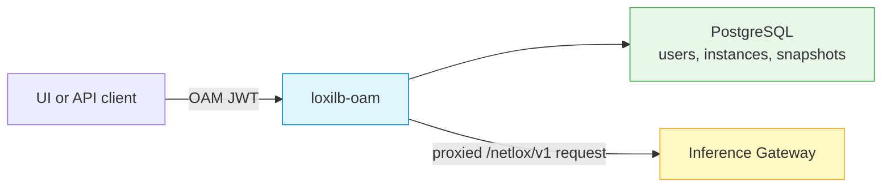

# LoxiLB OAM API

The Operations, Administration & Management (OAM) service is a Go REST API for
centralized users, RBAC, registered Gateway instances, proxy operations,
configuration snapshots, logs, alerts, and lifecycle functions. It uses
PostgreSQL and has an independent release and identity boundary from the
Gateway.

Repository: [loxilb-io/loxilb-oam](https://github.com/loxilb-io/loxilb-oam) ·
License: Apache-2.0 · API base `/oam` on port `8080`.

## Architecture



OAM supports `admin`, `operator`, and `viewer` roles and resolves proxy
capability through its own database. Gateway management authorization is an
additional decision; see [OAM-to-Gateway authentication](#oam-to-gateway-authentication).

## Prerequisites

- Go `>= 1.25.0` for source builds;
- PostgreSQL `>= 18` for the current OAM source (Compose pins its own database
  image; validate the selected release's exact requirement);
- Docker Engine with Compose v2 for the documented container deployment;
- an immutable OAM image matched to the Gateway release you have qualified.

## Deploy OAM with PostgreSQL

For OAM without the UI:

```bash
git clone https://github.com/loxilb-io/loxilb-oam.git
cd loxilb-oam
cp .env.example .env
```

Set the required values in `.env`:

| Variable | Required | Purpose |
|---|---:|---|
| `OAM_JWT_SECRET` | yes | JWT signing secret |
| `OAM_DEFAULT_ADMIN_PASSWORD` | yes | Initial admin password; change after first login |
| `DB_PASSWORD` | yes | Password for the bundled PostgreSQL `oamuser` |
| `SNAPSHOT_ENC_KEY` | production | Base64-encoded 32-byte AES-256 snapshot-encryption key |
| `OAM_ALLOWED_ORIGINS` | production | Exact browser origin allowlist |
| `OAM_TRUSTED_PROXIES` | behind a proxy | Only proxy IPs/CIDRs whose `X-Forwarded-For` may affect rate limiting and lockout |

Generate independent JWT, database, and snapshot-key values without committing
them:

```bash
openssl rand -base64 48
openssl rand -base64 48
openssl rand -base64 32
```

Create the bootstrap administrator password with your password manager. The
fresh-database policy requires at least nine characters, including upper case,
lower case, a digit, and a special character, and rejects any character
repeated three times in a row.

Then start and verify:

```bash
docker compose up -d
docker compose ps
curl --fail-with-body --silent --show-error \
  http://127.0.0.1:8080/oam/health | jq .
```

The root Compose stack publishes OAM and PostgreSQL for API-only evaluation.
For a production-style UI/OAM bundle with only the TLS edge exposed, use
[Deploy the Management Plane](management-plane.md).

!!! danger "Snapshots require an encryption and recovery plan"
    OAM instance snapshots can contain IPsec pre-shared keys and certificate
    private keys. Without `SNAPSHOT_ENC_KEY`, OAM stores them unencrypted. Keep
    the key in a secret manager, back it up separately from PostgreSQL, and
    test that a database restore plus the correct key can decrypt a snapshot.

## Run from source

```bash
make build
export OAM_JWT_SECRET="<SECRET_FROM_SECRET_MANAGER>"
export OAM_DEFAULT_ADMIN_PASSWORD="<BOOTSTRAP_SECRET>"
export DB_PASSWORD="<DATABASE_SECRET>"
./loxilb-oam \
  -db-user=oamuser \
  -db-host=127.0.0.1 \
  -db-port=5432 \
  -db-name=loxioam \
  -port=8080
```

Do not put real secrets in shell history in production; the variables above
show required names only. Use your deployment secret-injection mechanism.

Current database defaults are `oamuser`, `127.0.0.1`, port `5432`, database
`loxioam`. `DB_USER`, `DB_PASSWORD`, `DB_HOST`, `DB_PORT`, and `DB_NAME` supply
the same values through the environment; explicit flags take precedence.

## Configuration reference

| Variable | Default | Purpose |
|---|---|---|
| `OAM_JWT_SECRET` | required | JWT signing secret |
| `OAM_DEFAULT_ADMIN_PASSWORD` | required | Fresh-database admin bootstrap secret |
| `DB_PASSWORD` | required | PostgreSQL password; `OAM_DB_PASSWORD` is a legacy alias |
| `SNAPSHOT_ENC_KEY` | unset | Snapshot AES-256-GCM key; unset means unencrypted storage |
| `OAM_ALLOWED_ORIGINS` | wildcard | Comma-separated CORS allowlist; wildcard is development-only |
| `OAM_TRUSTED_PROXIES` | none | Trusted proxy peers for client-IP derivation |
| `OAM_TOKEN_TTL_MINUTES` | `480` | JWT/API-token lifetime for the bare binary |
| `TOKEN_EXPIRATION` | `480` | Compose entrypoint token lifetime setting |
| `OAM_INSTANCE_CA_BUNDLE` | unset | CA bundle for managed-Gateway TLS |
| `OAM_INSTANCE_TLS_INSECURE` | `false` | Skip Gateway certificate verification; development-only |
| `OAM_DOCKER_TLS` | `false` | Use TLS for Docker Engine lifecycle access |
| `OAM_DOCKER_PORT` | `2375` | Docker Engine API port |
| `OAM_DOCKER_CERT_PATH` | unset | Docker Engine client certificate directory |

OAuth login has been removed from the current source. Do not carry old
`OAM_OAUTH_*` variables into a new deployment.

## OAM-to-Gateway authentication

Register a TLS Gateway endpoint as:

```text
https://<gateway-host>:8091/netlox/v1
```

Set `OAM_INSTANCE_CA_BUNDLE` to the CA that issued the Gateway certificate and
keep `OAM_INSTANCE_TLS_INSECURE=false`.

!!! danger "OAM JWTs are not Gateway credentials"
    OAM authenticates and authorizes the caller, then forwards the request's
    `Authorization` header. It does not translate an OAM JWT into a Gateway
    user-service, OAuth, or manual token. An authenticated Gateway can reject
    the proxy request with `401`. An unauthenticated Gateway accepts requests
    from any reachable client, allowing OAM bypass. Validate an approved
    credential integration and restrict the Gateway listener before production.

Under OAM's role policy, reads are available to its configured roles and
mutations require its write capability. Gateway authorization may be stricter.
TLS protects the connection; it does not authorize the operation.

## Kubernetes boundary

The current OAM repository marks its Kubernetes manifests pre-release and not
supported for the current release because mandatory secrets are not fully
wired. Use the documented Compose deployment until a supported Kubernetes
release is published and validated. Do not promote the existing manifests by
only filling placeholders.

## Verify after deployment

1. Confirm `/oam/health` and the OAM version from the pinned image.
2. Log in with the bootstrap admin and change its password immediately.
3. Confirm the exact UI origin is allowed and the edge proxy is the only trusted
   `X-Forwarded-For` source.
4. Register a non-production Gateway over verified TLS.
5. Test a read as viewer and a reversible change as operator/admin.
6. Confirm the Gateway independently accepted the credential path.
7. Capture and restore a synthetic configuration snapshot, then test database
   recovery with the encryption key.

## Troubleshooting

| Symptom | Check | Corrective action |
|---|---|---|
| OAM exits at startup | Required secret or database connection | Read sanitized startup logs; set the missing value through secret management |
| PostgreSQL authentication fails after changing `.env` | Existing volume retains the original database password | Use the database's controlled password-rotation procedure; do not delete a production volume |
| All users appear to share one rate-limit identity | Trusted proxy list is empty/incorrect behind an edge | Set `OAM_TRUSTED_PROXIES` to only the actual proxy peers |
| Snapshot encryption warning | `SNAPSHOT_ENC_KEY` unset | Set and escrow a valid base64 32-byte key before capturing sensitive snapshots |
| Gateway proxy TLS error | CA/SAN mismatch | Correct the Gateway certificate and `OAM_INSTANCE_CA_BUNDLE`; never use insecure verification in production |
| Gateway proxy returns `401` | OAM JWT is not accepted by Gateway | Validate the independent Gateway management credential path |

## See also

- [Deploy the Management Plane](management-plane.md)
- [LoxiLB UI](loxilb-ui.md)
- [Management API Authentication](../security/management-api-authentication.md)
- [Configuration Backup and Restore](../operations/backup-restore.md)
