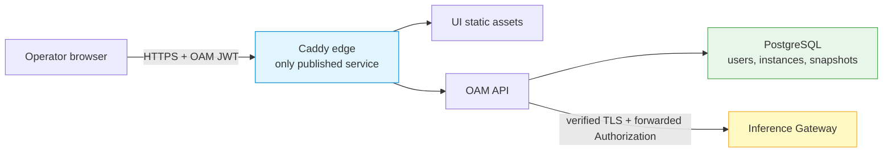
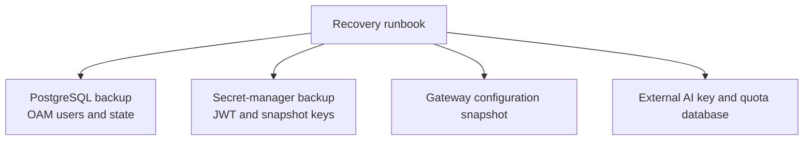

# Deploy the Management Plane (UI + OAM)

The management-plane bundle runs the LoxiLB UI, the OAM API, PostgreSQL, and a
Caddy edge on one Docker Compose host. Use it first in a staging environment.
Production use requires pinned releases, verified backups, restricted network
access, and an approved OAM-to-Gateway authentication design.

!!! note "Audience"
    This guide is for AI-infrastructure and DevOps engineers deploying a
    browser-based control point for one or more Inference Gateway instances.

The bundle is maintained in the
[`loxilb-oam/deploy/compose`](https://github.com/loxilb-io/loxilb-oam/tree/main/deploy/compose)
directory.

## Architecture and security boundaries



| Service | Purpose | Production exposure |
|---|---|---|
| `caddy` | Serves the UI at `/netlox/`, proxies `/api/oam/*`, and terminates edge TLS | Ports 80/443, adjusted with `HTTP_PORT` and `HTTPS_PORT` |
| `oam-loxilb` | OAM API and OAM RBAC | Internal only in the production overlay |
| `postgres` | OAM users, instances, snapshots, and management state | Isolated internal network in the production overlay |
| `ui-assets` | One-shot job that copies the UI build into the volume served by Caddy | None |

OAM authenticates the browser and applies OAM RBAC. It then forwards the
request's `Authorization` header to the Gateway; it does not exchange an OAM
JWT for a Gateway user-service, OAuth, or manual token. TLS protects the
connection but does not authorize the operation.

!!! danger "Validate Gateway authorization before production"
    If Gateway management authentication is enabled, an OAM JWT can be rejected
    with `401` unless the releases share an approved credential integration. If
    Gateway authentication is disabled, any network client that can reach its
    management listener can bypass OAM. Restrict that listener and test both
    successful access and denied bypass access before promotion.

## Prerequisites

- A Linux host with Docker Engine and Docker Compose v2.
- Git and registry access for the selected OAM and UI images.
- Ports 80 and 443 free, or approved alternative edge ports.
- At least one staging Gateway reachable from OAM over verified TLS.
- Release tags for OAM and UI that are compatible with the qualified Gateway.
- A secret manager and a PostgreSQL backup destination.

## 1. Get the deployment files

```bash
git clone https://github.com/loxilb-io/loxilb-oam.git
cd loxilb-oam/deploy/compose
cp .env.example .env
```

The development overlay builds OAM from this checkout but still pulls the UI
image. Point `UI_IMAGE` and `UI_TAG` at a reviewed image; a sibling UI source
checkout is not required.

## 2. Configure secrets and release pins

Generate independent JWT, database, and snapshot-key values and store them
through your normal secret process:

```bash
openssl rand -base64 48
openssl rand -base64 48
openssl rand -base64 32
```

Assign the outputs to `OAM_JWT_SECRET`, `DB_PASSWORD`, and
`SNAPSHOT_ENC_KEY`, respectively. Create `OAM_DEFAULT_ADMIN_PASSWORD` with a
password manager: the fresh-database policy requires at least nine characters,
including upper case, lower case, a digit, and a special character, and rejects
any character repeated three times in a row. Never paste a production secret
into documentation, a ticket, or a committed `.env` file.

| Variable | Requirement | Purpose |
|---|---:|---|
| `DB_PASSWORD` | required | Password for the bundled PostgreSQL `oamuser` |
| `OAM_JWT_SECRET` | required | OAM JWT signing secret |
| `OAM_DEFAULT_ADMIN_PASSWORD` | required | Bootstrap admin password; change it after first login |
| `SNAPSHOT_ENC_KEY` | production | Base64-encoded 32-byte AES-256 snapshot encryption key |
| `OAM_ALLOWED_ORIGINS` | production | Exact browser-origin allowlist |
| `OAM_TRUSTED_PROXIES` | review | Only proxy IPs/CIDRs whose forwarded client IP OAM may trust |
| `OAM_TAG` | production | Pinned, verified OAM release tag |
| `UI_TAG` | production | Pinned, verified UI release tag |

Set release placeholders to releases approved by your organization; do not
copy the mutable defaults into production:

```dotenv
OAM_TAG=<OAM_RELEASE_TAG>
UI_TAG=<UI_RELEASE_TAG>
```

Before deployment, verify that both exact image references are pullable and
record their resolved digests:

```bash
docker manifest inspect ghcr.io/loxilb-io/loxilb-oam:<OAM_RELEASE_TAG>
docker manifest inspect ghcr.io/loxilb-io/loxilb-ui:<UI_RELEASE_TAG>
```

!!! warning "Protect the snapshot encryption key"
    OAM snapshots can contain IPsec pre-shared keys and certificate private
    keys. Without `SNAPSHOT_ENC_KEY`, those values are stored unencrypted in
    PostgreSQL. Back up the encryption key separately from the database and
    test that the restored service can decrypt a synthetic snapshot.

## 3. Configure the edge certificate

For a private or operator-supplied certificate, generate a test certificate or
place the reviewed certificate and key in `certs/edge/`, then configure:

```dotenv
SITE_ADDRESS=https://management.example.com
EDGE_TLS=tls /certs/edge/cert.pem /certs/edge/key.pem
```

The repository helper can generate a local test certificate with a DNS name or
IP subject alternative name:

```bash
scripts/generate-edge-certs.sh management.example.com
```

Trust the issuing CA on operator clients. Do not use `curl -k` as a production
health check. Caddy automatic HTTPS is also possible for a publicly resolvable
name, but DNS, firewall, and certificate issuance are deployment-specific and
must be validated by the operator.

## 4. Start the stack

For an initial, non-production evaluation, build OAM from the checkout and use
the pinned UI image configured above:

```bash
docker compose \
  -f docker-compose.yml \
  -f docker-compose.dev.yml \
  up --build -d
```

The development overlay publishes PostgreSQL and OAM debug ports and defaults
to insecure verification of managed-Gateway certificates. Do not promote this
topology to production.

For a production-style topology, use only pinned images and the production
overlay:

```bash
docker compose \
  -f docker-compose.yml \
  -f docker-compose.prod.yml \
  up -d
```

The production overlay requires both tags and isolates PostgreSQL. Only Caddy
publishes host ports.

## 5. Verify the management plane

Use the same overlay in every follow-up command. The example below uses the
production overlay:

```bash
docker compose \
  -f docker-compose.yml \
  -f docker-compose.prod.yml \
  ps

curl --fail-with-body --silent --show-error \
  https://management.example.com/healthz

curl --fail-with-body --silent --show-error \
  https://management.example.com/api/oam/health | jq .
```

Then browse to `https://management.example.com/netlox/`, sign in with the
bootstrap administrator account, and change its password immediately.

## 6. Protect the Gateway connection

1. Issue each Gateway a server certificate whose SAN matches the hostname or
   IP that OAM will register.
2. Start the Gateway with TLS and restrict its management listener to the OAM
   network path.
3. Mount the issuing CA into OAM and set:

   ```dotenv
   OAM_INSTANCE_CA_BUNDLE=/etc/loxilb-oam/certs/instance-ca.pem
   OAM_INSTANCE_TLS_INSECURE=false
   ```

4. Register the Gateway using its verified endpoint:

   ```text
   https://<gateway-host>:8091/netlox/v1
   ```

5. Test an allowed read, a reversible authorized change, a denied request from
   an insufficient OAM role, and a direct bypass attempt to the Gateway.
6. Confirm in both OAM and Gateway audit logs which identity and operation were
   recorded.

Do not use plain HTTP on port 11111 or
`OAM_INSTANCE_TLS_INSECURE=true` outside an isolated evaluation environment.

## Backup and recovery

The management plane and Gateway have separate recovery domains:



- Back up PostgreSQL with a database-consistent method and test restoring it.
- Escrow `OAM_JWT_SECRET`, `SNAPSHOT_ENC_KEY`, edge private keys, and Gateway
  trust material using the organization's secret-recovery process.
- Capture and validate each Gateway's configuration separately; the Gateway
  snapshot API does not back up OAM PostgreSQL or the external AI key store.
- Back up any external PostgreSQL deployment used for AI keys and tenant quotas
  through its own procedure.
- Restore into an isolated environment and verify OAM snapshot decryption,
  Gateway configuration, RBAC, and audit continuity before declaring recovery
  successful.

`docker compose down` preserves named volumes. Adding `-v` deletes the bundled
PostgreSQL and other named volumes; do not run it against a production project
unless the data has been recovered elsewhere and destruction is intended.

## Troubleshooting

| Symptom | Check | Corrective action |
|---|---|---|
| Stack rejects the configuration | A required secret or production tag is empty | Inspect the sanitized Compose error and set the missing value through secret management |
| PostgreSQL authentication fails after changing `.env` | The existing volume retains its initialized credentials | Rotate the database password using a controlled PostgreSQL procedure; do not delete the volume |
| UI loads but API calls fail | Edge route, OAM health, or CORS allowlist | Check `/api/oam/health`, Caddy logs, and the exact `OAM_ALLOWED_ORIGINS` value |
| Every user appears under one rate-limit identity | Incorrect trusted-proxy configuration | Set `OAM_TRUSTED_PROXIES` to only the actual edge proxy addresses/CIDRs |
| Registered Gateway is unreachable | DNS, routing, certificate SAN, or CA mismatch | Test from the OAM network and correct the certificate or `OAM_INSTANCE_CA_BUNDLE` |
| OAM proxy returns `401` | OAM JWT is not an accepted Gateway credential | Validate the independent Gateway management authentication design; do not disable authorization as a workaround |
| Browser rejects the edge certificate | Untrusted issuer or hostname mismatch | Install the approved CA chain or reissue a certificate with the correct SAN |

## See also

- [Management & UI Overview](overview.md)
- [LoxiLB OAM API](loxilb-oam.md)
- [LoxiLB UI](loxilb-ui.md)
- [Management API Authentication](../security/management-api-authentication.md)
- [Configuration Backup and Restore](../operations/backup-restore.md)
