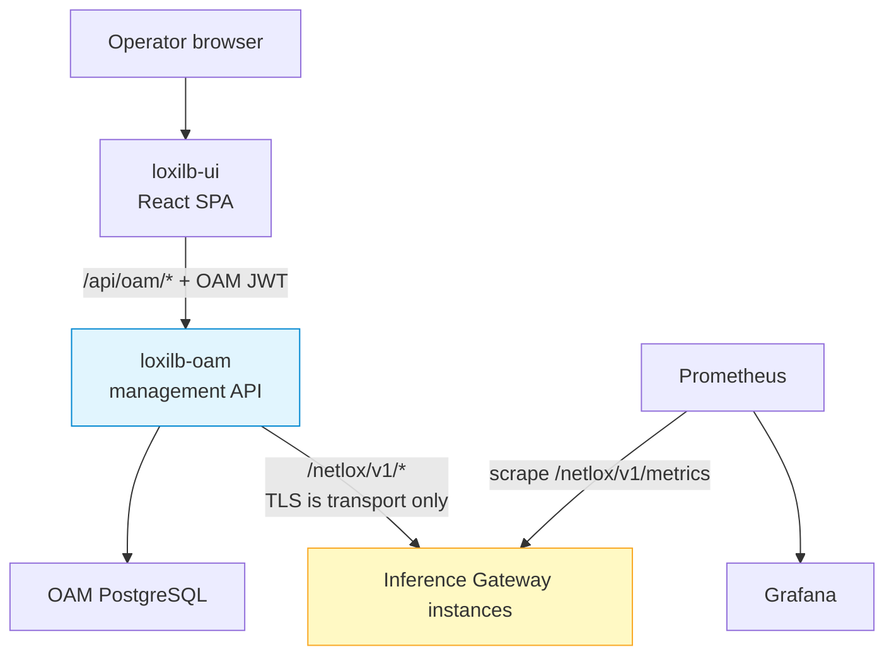

# Management & UI Overview

The LoxiLB Inference Gateway ecosystem includes a web dashboard, a
multi-instance management API, and a Prometheus/Grafana monitoring stack. Each
component has its own release and security boundary; qualify the exact
UI/OAM/Gateway combination before using it for production changes.

!!! note "Audience"
    Platform teams and AI-infrastructure operators deploying the gateway in production and looking for day-2 tooling: UI, central management, and observability.

---

## The components

| Component | What it gives you | Repository | License |
|-----------|-------------------|------------|---------|
| **LoxiLB UI** | Web dashboard for supported L4/L7, AI Gateway, networking, security, snapshot, and monitoring surfaces; visible capabilities depend on the selected UI/OAM/Gateway releases | [loxilb-io/loxilb-ui](https://github.com/loxilb-io/loxilb-ui) | MIT |
| **LoxiLB OAM** | Central management API for a fleet: OAM user authentication/RBAC, proxying, snapshot storage, and lifecycle functions. Gateway authentication remains a separate boundary. | [loxilb-io/loxilb-oam](https://github.com/loxilb-io/loxilb-oam) | Apache-2.0 |
| **Monitoring stack** | Prometheus + Grafana with six provisioned dashboards (Overview, L4, L7, AI Gateway, Security, Bootstrap) and a production alert-rule set | [loxilb-io/loxilb-inference-gateway](https://github.com/loxilb-io/loxilb-inference-gateway/tree/main/deploy/monitoring) (`deploy/monitoring/`) | Apache-2.0 |

The UI never talks to a gateway directly: the browser calls the OAM API
(`/api/oam/*`), and OAM applies its RBAC before proxying to a registered
Gateway. OAM currently forwards the caller's `Authorization` header; it does
not translate an OAM JWT into a Gateway user-service, OAuth, or manual token.
If Gateway management authentication is enabled, validate a supported
credential integration before production. If it is disabled, restrict the
Gateway listener so operators cannot bypass OAM. TLS authenticates/encrypts the
connection but does not authorize an API mutation.

The monitoring stack is independent of both and scrapes the Gateway metrics
endpoint directly.

---

## Which pieces do you need?

| You want | Deploy | Guide |
|----------|--------|-------|
| Dashboards, metrics, and alerts for the gateway | Monitoring stack only | [Monitoring & Metrics](../operations/monitoring.md) |
| A web UI to configure and operate one or more gateways | Management plane (UI + OAM + PostgreSQL, one `docker compose up`) | [Deploy the Management Plane](management-plane.md) |
| Everything | Both — they are independent and compose cleanly | Both guides |
| Only the management API (headless, your own tooling on top) | OAM standalone | [LoxiLB OAM API](loxilb-oam.md) |

!!! tip "Start with the management-plane bundle in a staging environment"
    The [management-plane bundle](management-plane.md) is the shortest path to
    evaluate the UI: one Compose file brings up UI, OAM, and PostgreSQL behind a TLS
    edge. Promote it only after release pinning, backup/restore tests, and the
    OAM-to-Gateway authentication boundary are validated.

---

## Ports at a glance

| Service | Port | Notes |
|---------|------|-------|
| Management-plane edge (Caddy: UI + OAM) | 80 / 443 | UI at `/netlox/`, API at `/api/oam/*` |
| OAM API (standalone) | 8080 | REST base path `/oam`; Swagger UI at `/oam/swagger/index.html` |
| LoxiLB UI (standalone Compose) | 3000 / 3443 | HTTP / HTTPS |
| Gateway REST API | 11111 (plain) / 8091 (TLS) | What OAM registers and proxies to |
| Prometheus | 9090 | Host-network container on the gateway host |
| Grafana | 3000 | Host-network container on the gateway host |

!!! warning "Port 3000 collision"
    The standalone UI Compose stack and the monitoring stack's Grafana both default to port 3000. If you run them on the same host, change one of them — for example publish the UI on a different host port, or front the UI with the management-plane bundle (ports 80/443) instead.

## See also

- [Deploy the Management Plane](management-plane.md) — the recommended step-by-step install.
- [LoxiLB UI](loxilb-ui.md) — features, standalone deployment, configuration reference.
- [LoxiLB OAM API](loxilb-oam.md) — standalone deployment, security model, configuration reference.
- [Management API Authentication](../security/management-api-authentication.md) — Gateway-side authentication and authorization boundary.
- [Monitoring & Metrics](../operations/monitoring.md) and [Grafana Dashboards](../operations/observability-metrics-grafana.md) — the observability stack.
