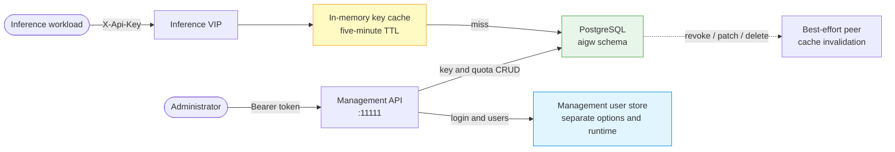

# AI Key Store Operations

The AI Gateway stores data-plane API keys and tenant quotas in a dedicated
PostgreSQL schema. This store is independent of the management user service:
its availability controls key/quota CRUD and evaluation on fullproxy services
that declare Gateway-owned authentication, not operator login. `api_key_auth`
is independent of SSE and P/D. A rule that omits it preserves a backend-owned
`X-Api-Key`; `disabled` strips that header; `required` validates it.

!!! warning "Development-source behavior"
    The independent PostgreSQL store and peer invalidation described here are implemented in the
    current development source but have not completed release qualification. Confirm the options,
    schema, and failure behavior against the exact image you deploy.

## Architecture and boundary



The Gateway qualifies every data-plane table with schema `aigw` and uses its
own PostgreSQL role and connection pool. The runtime creates these tables after
verifying that the schema already exists and the role has `USAGE` and `CREATE`:

- `aigw.api_keys`;
- `aigw.tenant_rate_limits`;
- `aigw.tenant_model_rate_limits`;
- `aigw.user_rate_limits` and `aigw.user_model_rate_limits`;
- `aigw.rate_limit_defaults`.

Only a SHA-256 hash of each API key is stored. The opaque `key_id` is generated
independently from the secret, so the identifier does not disclose key
material.

!!! danger "Plane separation is not management authentication"
    A configured key store does not secure port `11111`. If no user, OAuth, or manual-token
    management mode is enabled, the current authorizer permits key and quota CRUD without a
    credential. Configure and verify management authentication separately.

## Provision the schema and role

The repository provides `scripts/aigw-db-bootstrap.sql`. Run it as the database
owner; the Gateway's restricted role must not be able to create its own role or
schema.

Supply passwords through the environment or secret injection, not literal SQL
or command-line flags:

```bash
export AIGW_DB_PASSWORD="$DATA_PLANE_STORE_PASSWORD"
export AIGW_MGMT_DB_PASSWORD="$RESERVED_MANAGEMENT_STORE_PASSWORD"

psql -v ON_ERROR_STOP=1 \
  --username "$POSTGRES_OWNER" \
  --dbname "$POSTGRES_DATABASE" \
  --file scripts/aigw-db-bootstrap.sql

unset AIGW_DB_PASSWORD AIGW_MGMT_DB_PASSWORD
```

The script is idempotent and rotates the two login-role passwords when re-run.
It creates both `aigw` and `aigw_mgmt` schemas and removes direct cross-schema
grants.

!!! note "Current management-store boundary"
    The current Gateway user-service runtime still uses the separate `--database*` management
    store. Although the bootstrap script reserves `aigw_mgmt`, do not claim or assume that operator
    users and tokens have migrated to PostgreSQL until the deployed runtime options and code show
    that wiring.

Verify ownership and least privilege with deployment-specific role names. The
data-plane role must be able to create in `aigw`, must not be able to use
`aigw_mgmt`, and should not be able to create objects in `public`. Table access
inside another schema must also be tested; schema `USAGE` alone does not grant
table `SELECT`. PostgreSQL versions that grant `CREATE` on `public` through the
`PUBLIC` pseudo-role require a database-level hardening decision: revoking a
grant from `aigwuser` alone does not remove an inherited `PUBLIC` grant.

## Configure the Gateway

| Option | Required | Default | Purpose |
|---|---:|---|---|
| `--aikey-db-host` | Yes | none | Enables construction of the AI-key service and names the PostgreSQL host |
| `--aikey-db-port` | No | `5432` | PostgreSQL port |
| `--aikey-db-user` | Yes | none | Restricted role that owns or can use `aigw` |
| `--aikey-db-name` | Yes | none | Database containing the `aigw` schema |
| `--aikey-db-password-file` | Recommended | none | File containing the store password |
| `AIGW_DB_PASSWORD` | Alternative | none | Password source only when no password file is named |
| `--aikey-db-ssl` | Production | off | Require verified TLS to PostgreSQL |
| `--aikey-db-ssl-ca-cert-file` | With TLS | none | CA that issued the PostgreSQL server certificate |
| `--aikey-db-ssl-client-cert-file` | With TLS | none | Client certificate |
| `--aikey-db-ssl-client-key-file` | With TLS | none | Client private key |

Mount the password as a restricted secret file:

```text
--aikey-db-host=postgres.example.internal
--aikey-db-port=5432
--aikey-db-user=aigwuser
--aikey-db-name=gateway
--aikey-db-password-file=/run/secrets/aigw-db-password
--aikey-db-ssl
--aikey-db-ssl-ca-cert-file=/run/secrets/postgres-ca.crt
--aikey-db-ssl-client-cert-file=/run/secrets/postgres-client.crt
--aikey-db-ssl-client-key-file=/run/secrets/postgres-client.key
```

When a password file is named, it takes precedence over the environment. An
unreadable or empty file is an error; the Gateway does not silently fall back
to `AIGW_DB_PASSWORD`. This makes a broken secret mount visible instead of
turning it into an ambiguous database-authentication failure.

With `--aikey-db-ssl`, the current client uses verified TLS with hostname
verification, a client certificate, TLS 1.2 or newer, and no plaintext
fallback. The server certificate SAN must match `--aikey-db-host`.

## Upgrade from the former shared store

The development source no longer reads API keys or tenant quotas from the
management user-service database and no longer creates those tables there.
There is no automatic data migration.

!!! danger "Do not upgrade with only `--userservice`"
    An upgraded Gateway with `--userservice` but no `--aikey-db-host` has management login but no
    AI-key store. Key/quota CRUD returns `503`; a service declaring `api_key_auth: required`
    also returns `503 policy_store_unavailable` before backend dispatch. A service that omitted
    the declaration remains keyless by contract. Treat either unintended state as an
    exposure-blocking configuration error.

Choose one migration strategy:

- **Reissue keys (recommended):** provision PostgreSQL, create new scoped keys,
  distribute them through the secret manager, switch workloads, and delete the
  old records after verification.
- **Controlled row migration:** move `api_keys`, `tenant_rate_limits`, and
  `tenant_model_rate_limits` into schema `aigw`. Preserve `key_hash` if existing
  raw credentials must continue to work, normalize timestamps to explicit UTC,
  convert enabled values to PostgreSQL booleans, replace nullable numeric values
  with intentional values, and resolve duplicate hashes before import because
  the new store enforces uniqueness.

Take an encrypted backup, rehearse the transformation outside production, and
compare row counts and tenant/model summaries without printing hashes or raw
keys. Legacy public identifiers may have different security properties from
new independently generated key IDs; reissue when that distinction matters.

## Startup and outage behavior

| State | Key/quota management API | Inference key validation |
|---|---|---|
| `--aikey-db-host` unset; `api_key_auth: required` | `503 ai_key_store_unconfigured` | `503 policy_store_unavailable`; backend receipt delta `0` |
| Store configured and healthy; `required` fullproxy rule | CRUD succeeds | Cache hit or PostgreSQL lookup; unknown key `401`, disallowed model `403` |
| Store healthy; `api_key_auth` omitted | CRUD succeeds | Gateway does not validate or strip backend-owned `X-Api-Key` |
| Store healthy; `api_key_auth: disabled` | CRUD succeeds | No validation; Gateway strips `X-Api-Key` |
| Store configured but unavailable before an answer is cached | `503 ai_key_store_unavailable` | `503 policy_store_unavailable`; do not misclassify as an invalid key |
| Store becomes unreachable after a confirmed answer was cached | Store-backed CRUD fails; an unclassified driver error may surface as a generic service error | Cached/last-known-good entries remain usable under their cache contract; unknown evaluation fails closed |
| Store reconnects | CRUD resumes after the reconnect path attaches the pool | New misses can validate again |

!!! danger "Declaration determines the no-store posture"
    No store does not silently downgrade a `required` rule: it fails closed with `503`. An omitted
    or `disabled` rule intentionally has no API-key validation dependency. Verify the exact
    declaration by read-back instead of inferring it from store health, SSE, or P/D flags.

Per-key `tokens_per_min` is actively consumed by the implementation and its
unit/integration tests. The frozen primary Swagger text is stale and calls it
stored-only metadata, while the companion PATCH description says it is
enforced. Do not present this implemented behavior as a released support
guarantee until the primary contract is corrected and qualified. The complete
ladder is documented in [AI Quotas and QoS](ai-qos.md).

The management handlers expose unconfigured and unavailable as separate `503`
error codes because they require different operator actions. The inference
path deliberately returns the same `401 invalid_api_key` for unknown,
disabled, expired, malformed, or store-miss failures so it does not reveal key
existence.

## Cache and revocation behavior

Key and quota entries have a five-minute in-memory TTL. Cache hits avoid a
database call. A disable, allow-list change, or delete performs these actions:

1. Resolve the stored key hash by `key_id`.
2. Apply the database mutation.
3. Evict local cache entries by both key hash and key ID.
4. Send a bounded, concurrent invalidation request to configured peers.

Peer invalidation is best-effort. The local mutation does not fail merely
because a peer is unreachable. A peer that does not receive the notice may
continue honoring its cached copy until TTL expiry. Protect the peer
synchronization network using deployment-supported controls and do not use the
best-effort fan-out as proof of instantaneous cluster-wide revocation.

## Production validation gates

Run these checks in a non-production tenant before exposure:

1. With management authentication enabled, omit the bearer credential from an
   invalid-body key creation. Authentication must run before body validation,
   returning `401`:

   --8<-- "snippets/common/unauthenticated-key-create.md"

2. Authenticate as an administrator and list the test tenant. The response
   must be `200` and must not contain `raw_key` or `key_hash`.
3. Create a narrowly scoped test key and move the returned secret immediately
   into a secret manager.
4. Create or select a `mode: 4` test rule with `api_key_auth: required` and
   read the declaration back exactly.
5. On that rule, send an inference request without or with an unknown
   `X-Api-Key`; require `401 invalid_api_key` and confirm the unique backend
   receipt counter does not change.
6. Disable the test key with `PATCH`; require subsequent use on the same gated
   rule to return `401`.
7. In a multi-node lab, warm the key on that gated rule through every peer
   before disabling it, then verify every peer denies it. Record any
   TTL-bounded convergence separately.
8. Delete the test key and remove all temporary header and response files.
9. In a separate outage probe, make the policy unevaluable; require
   `503 policy_store_unavailable` and another backend receipt delta of `0`.

## Troubleshooting

| Symptom | Check | Corrective action |
|---|---|---|
| `ai_key_store_unconfigured` | Is `--aikey-db-host` present in the running process configuration? | Add the complete store configuration and restart safely |
| `ai_key_store_unavailable` | Password source, network reachability, schema preflight, and TLS files | Repair the dependency; wait for reconnect; do not bypass enforcement |
| Preflight says schema does not exist | Bootstrap ran against a different database or only as an init hook on an existing volume | Run the shipped bootstrap explicitly against the selected database |
| Preflight says schema is inaccessible | Gateway role lacks `USAGE` or `CREATE` on `aigw` | Correct grants as the database owner; do not grant broad `public` access |
| TLS hostname verification fails | Certificate SAN does not cover `--aikey-db-host` | Reissue the certificate or use its verified DNS name |
| A revoked key works on one peer | Peer invalidation did not arrive or the peer is older | Isolate that peer and wait at least the cache TTL; validate peer compatibility |
| Key list shows `enabled: false` | Key is soft-disabled, not deleted | Re-enable deliberately with `PATCH` or permanently delete after review |

## Related pages

- [API Key Management](../ai-gateway/api-key-management.md)
- [AI Traffic Governance](../ai-gateway/ai-traffic-governance.md)
- [Management API Authentication](../security/management-api-authentication.md)
- [Data-Plane Authentication and JWT](../security/data-plane-jwt-auth.md)
- [HA and Upgrade Limitations](ha-limitations.md)
