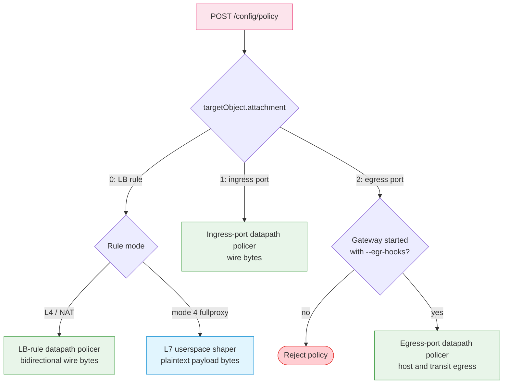

# AI Quotas and QoS

--8<-- "snippets/common/mutation-fragment-notice.md"

LoxiLB provides request and token admission controls plus network byte-rate
controls. This page explains where each control runs and gives repeatable
attach, measure, detach, and recovery procedures.

## Enforcement paths



The attachment value selects the object. Attachment `0` then branches on LB
rule mode: L4/NAT rules drop excess packets in the datapath, while fullproxy
rules pace payload bytes in userspace.

| Attachment | `polObjName` | Enforcement | Important condition |
|---:|---|---|---|
| `0` | IPv4 `VIP:PORT:PROTO`; IPv6 `[VIP]:PORT:PROTO` for L4 | L4 policer or fullproxy L7 shaper | Fullproxy shaping currently accepts IPv4 rule keys only |
| `1` | Ingress port name | Ingress port policer | Verify the named port resolves and enforcement becomes active |
| `2` | Egress port name | Host-originated and transit-egress policer | Gateway must run with `--egr-hooks`; verify the named port resolves |

!!! warning "An accepted policy may still be pending its target"
    A missing LB rule or port is not always a create-time error. The Gateway can retain the
    policy and retry synchronization. After every attach, read the policy back and prove the
    expected rate with a new test flow or the fullproxy shaper metrics before treating it as
    enforced.

!!! note "IPv6 applies to the L4 policer, not the current fullproxy shaper"
    Bracketed IPv6 keys are valid for attachment-0 L4 policies. The current fullproxy userspace
    shaper supports IPv4 rule keys only; an IPv6 fullproxy rule cannot use this shaper path.

These policies are independent from API-key and tenant request-per-second
(RPS) limits and token-per-minute (TPM) quotas. See
[AI Traffic Governance](../ai-gateway/ai-traffic-governance.md) for admission
controls.

## Request and token quota ladder

Request/token admission and network byte shaping are different systems. An
attributed request must pass every applicable RPS bucket. Token reservation
and settlement charge every applicable TPM bucket.

| Scope | Identity source | Resolution and isolation |
|---|---|---|
| Key | Validated `X-Api-Key` | Key RPS and the implementation's post-response TPM debt latch are active; primary Swagger text must be corrected before this becomes a published support guarantee |
| User | Verified JWT tenant plus user claim | Explicit user row, otherwise rule/global user default, otherwise unlimited |
| User + model | Verified JWT user and effective model | Explicit pair only; debt must not affect another model or user |
| Tenant | API-key tenant or verified JWT tenant | Explicit tenant row, otherwise rule/global tenant default, otherwise unlimited; caps the sum of its users/keys |
| Tenant + model | Tenant and effective model | Explicit pair only; combines with the aggregate tenant bucket |
| Shared VIP | Service identity | Opt-in `vip_shared_rps` for keyless traffic; `vip_shared_tpm` is charged by token-metered traffic on the service |
| Defaults | `global` and optional `rule_ident` | Rule fields override global fields individually; a zero field falls through |

An explicit user or tenant row wins for its dimension even when it is looser
than the default. All-zero user/default rows are rejected; use `DELETE` to
remove them. Removing an explicit row makes that identity fall through to its
default, not necessarily to unlimited.

The JWT arm supplies tenant/user identities. API-key traffic supplies a tenant
and key but no user. Keyless traffic has neither and consults only the optional
shared-VIP bucket.

### Configure user and default rows through REST

`loxicmd` does not currently expose user or defaults CRUD. Use the management
REST API and a protected header file.

```bash
curl --fail-with-body --silent --show-error \
  --request POST "$CONTROL_API/config/ai/user/ratelimit" \
  --header @control-plane.headers \
  --header 'Content-Type: application/json' \
  --data '{
    "tenant_id": "team-a",
    "user_id": "user-123",
    "rps": 5,
    "burst_size": 10,
    "tokens_per_min": 12000,
    "model_limits": [
      {"model": "example-chat-model", "tokens_per_min": 4000}
    ]
  }'

curl --fail-with-body --silent --show-error \
  --request POST "$CONTROL_API/config/ai/ratelimit/defaults" \
  --header @control-plane.headers \
  --header 'Content-Type: application/json' \
  --data '{
    "scope": "rule",
    "rule_ident": "192.0.2.20:8443",
    "default_user_rps": 2,
    "default_user_tpm": 6000,
    "default_tenant_rps": 20,
    "default_tenant_tpm": 60000,
    "vip_shared_rps": 10,
    "vip_shared_tpm": 30000
  }'
```

Expected result: `204` for each mutation. Read the rows back and compare every
field before testing traffic:

```bash
curl --fail-with-body --silent --show-error \
  --header @control-plane.headers \
  "$CONTROL_API/config/ai/user/ratelimit/team-a/user-123" | jq .

curl --fail-with-body --silent --show-error \
  --get "$CONTROL_API/config/ai/ratelimit/defaults/rule" \
  --header @control-plane.headers \
  --data-urlencode 'rule_ident=192.0.2.20:8443' | jq .
```

### Fail-open and fail-closed boundaries

| Evaluation state | Decision |
|---|---|
| Credential/tenant/user identity exists but its explicit/default limit is unknowable and no last-known-good answer exists | `503 policy_store_unavailable`; no backend delivery |
| Keyless traffic and optional shared-VIP defaults are unknowable | Fail open for that optional bucket; do not invent an outage for a service that may never have enabled it |
| Cached or last-known-good row exists during store outage | Continue with that confirmed row until its cache/outage contract expires or is replaced |
| Token state warming from peers | `429 token_quota_warming` during the bounded warm-up window |
| Warm-up deadline expires without peer state | Compatibility path fails open and increments the cold-open metric |

For every denial, use a unique nonce and require backend receipt delta `0`.
After exhausting one user or model, probe an unrelated user and model and
require no denial-counter or receipt change attributable to the exhausted
identity. That unrelated-identity probe is the independent oracle that the
bucket did not bleed across scopes.

### Remove the test rows

```bash
curl --fail-with-body --silent --show-error \
  --request DELETE \
  --header @control-plane.headers \
  "$CONTROL_API/config/ai/user/ratelimit/team-a/user-123"

curl --fail-with-body --silent --show-error \
  --request DELETE \
  --get "$CONTROL_API/config/ai/ratelimit/defaults/rule" \
  --header @control-plane.headers \
  --data-urlencode 'rule_ident=192.0.2.20:8443'
```

Expected result: `204`. A later per-user read returns `404`; the identity then
uses matching defaults if they remain. Verify the intended fallback instead of
assuming delete means unlimited.

## Units and behavior

| Field or metric | Unit | Notes |
|---|---|---|
| `committedInfoRate` | Megabits per second (Mbps) | Minimum 8 Mbps; converted internally to bits per second |
| `peakInfoRate` | Mbps | `0` is valid for a single-rate policy |
| `committedBlkSize` | Bytes | Configured burst depth; defaults apply when omitted |
| Tier-0 L4/port metering | L3 wire bytes | Excess traffic is policed, normally by dropping packets |
| Tier-1 fullproxy metering | Plaintext payload bytes | Traffic is paced; TLS framing and L3 overhead are not counted |
| `loxilb_proxy_qos_cir_bytes_per_second` | Bytes per second | API Mbps divided by 8; 16 Mbps exports as 2,000,000 B/s |
| `loxilb_proxy_qos_cbs_bytes` | Bytes | Effective shaper burst depth |

The fullproxy upload and download directions have independent buckets. Each
enabled direction refills at the full configured CIR; the rate is not divided
between directions.

## Prerequisites

- A configured LB rule or port that you can safely test.
- A control-plane identity authorized to create and delete policies.
- A traffic generator such as `iperf3` for L4 tests or `curl` for fullproxy
  payload tests.
- Baseline throughput comfortably above the intended policy rate.
- Metrics enabled if you want to validate fullproxy shaper counters.

Use a staging service first. A policer can drop traffic immediately, and a
bad port or rule choice can affect unrelated workloads.

The examples use a protected management header file:

--8<-- "snippets/common/control-api-header.md"

## Lab 1 — Rule-attached L4 policer

### Baseline

Measure both client-to-backend and reverse traffic through the target NAT LB
rule. Record the baseline before attaching anything:

```bash
iperf3 --client 192.0.2.10 --port 2020 --time 10
iperf3 --client 192.0.2.10 --port 2020 --time 10 --reverse
```

Replace `192.0.2.10` with your test VIP. Stop if the baseline is already near
the planned CIR; the lab would not distinguish policy enforcement from an
unhealthy path.

### Attach

This policy attaches 10 Mbps to an IPv4 TCP rule:

```bash
curl --fail-with-body --silent --show-error \
  --request POST "$CONTROL_API/config/policy" \
  --header @control-plane.headers \
  --header 'Content-Type: application/json' \
  --data '{
    "policyIdent": "example-rule-policy",
    "policyInfo": {
      "type": 0,
      "committedInfoRate": 10,
      "peakInfoRate": 10,
      "committedBlkSize": 125000
    },
    "targetObject": {
      "attachment": 0,
      "polObjName": "192.0.2.10:2020:tcp"
    }
  }'
```

For IPv6, include brackets: `[2001:db8::10]:2020:tcp`. A bare IPv6 address is
ambiguous and is rejected for an LB-rule attachment.

### Measure and recover

Open **new** test connections and repeat both directions. Throughput should
fall toward the configured rate and remain bounded for the whole flow. Then
detach and confirm the baseline returns:

```bash
curl --fail-with-body --silent --show-error \
  --request DELETE \
  --header @control-plane.headers \
  "$CONTROL_API/config/policy/ident/example-rule-policy"

iperf3 --client 192.0.2.10 --port 2020 --time 10
iperf3 --client 192.0.2.10 --port 2020 --time 10 --reverse
```

Successful recovery proves the policy is no longer attached. It does not
prove an exact production throughput value; transport overhead, burst depth,
round-trip time, and the test host influence measurements.

## Lab 2 — Egress port policer

Attachment `2` covers host-originated traffic and transit traffic after the
forwarding decision selects the actual egress port.

!!! warning "Start with `--egr-hooks`"
    The API rejects an egress attachment if the Gateway was not started with
    `--egr-hooks`. This prevents a policy from being accepted when no egress
    hook could enforce it.

### Baseline and attach

Measure a host-originated upload from the Gateway and a transit upload through
the LB rule. Then attach the policy to the backend-facing port:

```bash
curl --fail-with-body --silent --show-error \
  --request POST "$CONTROL_API/config/policy" \
  --header @control-plane.headers \
  --header 'Content-Type: application/json' \
  --data '{
    "policyIdent": "example-egress-policy",
    "policyInfo": {
      "type": 0,
      "committedInfoRate": 10,
      "peakInfoRate": 10,
      "committedBlkSize": 125000
    },
    "targetObject": {
      "attachment": 2,
      "polObjName": "backend-facing-port"
    }
  }'
```

Expected result: missing egress hooks are rejected. A missing named port can leave the policy
pending instead of returning an error, so confirm read-back and enforcement on the intended
egress port.

### Measure, detach, and clean up

Repeat both baseline transfers. Host-originated and transit uploads leaving
through the named port should be bounded. Traffic leaving another port should
not be charged to this policy.

```bash
curl --fail-with-body --silent --show-error \
  --request DELETE \
  --header @control-plane.headers \
  "$CONTROL_API/config/policy/ident/example-egress-policy"
```

Confirm both traffic classes recover. If they do not, verify the policy is
gone and inspect the actual forwarding egress port before changing another
policy.

## Lab 3 — Fullproxy bidirectional L7 shaper

An attachment-0 policy on a `mode: 4` rule does not install an L4 NAT policer.
It configures the fullproxy relay to pace plaintext payload bytes.

### Baseline and attach

Measure a sufficiently large upload and download through the fullproxy VIP.
Small probes can fit entirely inside the burst and will not show the steady
rate.

Attach a 16 Mbps policy:

```bash
curl --fail-with-body --silent --show-error \
  --request POST "$CONTROL_API/config/policy" \
  --header @control-plane.headers \
  --header 'Content-Type: application/json' \
  --data '{
    "policyIdent": "example-fullproxy-shaper",
    "policyInfo": {
      "type": 0,
      "committedInfoRate": 16,
      "peakInfoRate": 16,
      "committedBlkSize": 250000
    },
    "targetObject": {
      "attachment": 0,
      "polObjName": "192.0.2.20:2020:tcp"
    }
  }'
```

Large uploads and downloads should approach 2,000,000 bytes per second after
the initial burst. Upload and download are independently metered.

### Verify with metrics

```bash
curl --fail-with-body --silent --show-error \
  "$CONTROL_API/metrics" | grep '^loxilb_proxy_qos_'
```

Every series uses `vip`, `port`, `proto`, and `direction` labels.

| Metric | Type | Unit and interpretation |
|---|---|---|
| `loxilb_proxy_qos_bytes_passed_total` | Counter | Plaintext payload bytes granted |
| `loxilb_proxy_qos_bytes_delayed_total` | Counter | Granted bytes that waited through at least one park/resume cycle |
| `loxilb_proxy_qos_parks_total` | Counter | Reader pause events caused by an empty bucket |
| `loxilb_proxy_qos_park_seconds_total` | Counter | Summed wall time for parks that later resumed, in seconds |
| `loxilb_proxy_qos_parked_connections` | Gauge | Readers currently paused |
| `loxilb_proxy_qos_tokens_bytes` | Gauge | Current bucket level in bytes |
| `loxilb_proxy_qos_cir_bytes_per_second` | Gauge | Configured refill rate in bytes/s |
| `loxilb_proxy_qos_cbs_bytes` | Gauge | Effective burst depth in bytes |

`bytes_delayed_total / bytes_passed_total` estimates the fraction of payload
that encountered shaping. `park_seconds_total / parks_total` estimates mean
resume delay. Avoid dividing raw counters without applying `rate()` over the
same interval in Prometheus.

### SSE and timeout behavior

Time spent paused by the shaper is excluded from idle and stream-duration
reaping. This prevents configured shaping from manufacturing an SSE timeout.
Genuinely slow unshaped streams remain subject to their configured duration
limit.

### Detach and confirm series removal

```bash
curl --fail-with-body --silent --show-error \
  --request DELETE \
  --header @control-plane.headers \
  "$CONTROL_API/config/policy/ident/example-fullproxy-shaper"
```

Confirm upload and download recover. After the metrics collection interval,
series for the detached shaped service should disappear rather than freeze at
their previous values.

## Troubleshooting

| Symptom | Evidence | Likely cause and correction |
|---|---|---|
| Policy is rejected | API error mentions attachment | Use only attachment `0`, `1`, or `2`; verify the request shape |
| Policy is accepted but target is absent | Policy read-back exists; traffic is unchanged | Create/correct the target rule or port, then wait for synchronization and re-test |
| Egress policy is rejected | Error mentions egress hooks | Restart through the approved deployment process with `--egr-hooks`, then retry |
| Policy is accepted but traffic is unchanged | Baseline and new-flow measurement | Verify the policy targets the real rule/port and that the test exceeds burst depth |
| Fullproxy traffic drops instead of pacing | Rule read-back | Confirm the target is the intended `mode: 4` rule |
| IPv6 fullproxy rule is not shaped | Rule address family | The current L7 shaper is IPv4-only; use a supported IPv4 service or an independently validated control |
| Metric CIR looks eight times smaller than API CIR | Compare units | Expected: API uses Mbps, shaper metric uses bytes/s |
| Shaper metrics are absent | Rule mode, attachment, scrape timing | Metrics exist only for actively shaped fullproxy services; wait for collection after attach |
| Traffic remains slow after detach | Policy list and independent baseline | Confirm delete succeeded, use a new connection, and isolate backend/network bottlenecks |

## HA and security boundaries

- Policy configuration must be identical on both nodes. Verify the effective
  policy and target object on each node before promotion.
- Runtime policer and shaper token buckets are node-local. Promotion rebuilds
  or resets that transient state, so a newly active node can begin with fresh
  burst credit.
- Key, user, user-model, tenant, tenant-model, and shared-VIP token buckets
  require same-version quota-state exchange. Treat mixed-version promotion as
  unsafe until a two-node scenario proves scope/version compatibility.
- Single-node functional scenarios do not prove quota or rate-limit failover, cross-node
  bucket continuity, or connection migration.
- Active TCP, TLS, and SSE connections are not transferred to another process;
  clients must reconnect.
- Restrict policy CRUD to least-privileged operators. A policy can degrade or
  interrupt service even though it does not contain a credential.
- Do not expose raw headers, prompts, credentials, private addresses, or
  customer labels in troubleshooting output.

See [HA and Upgrade Limitations](ha-limitations.md) before changing a peer
pair.

## Final cleanup checklist

1. Delete every temporary policy by `policyIdent`.
2. Confirm the policy no longer appears in policy read-back.
3. Open new upload and download connections and confirm baseline recovery.
4. Confirm fullproxy shaper series disappear after collection refresh.
5. Remove local header files and unset secret-bearing variables.

--8<-- "snippets/common/control-api-cleanup.md"

## What these labs do not prove

They validate attachment behavior, directional enforcement, detach recovery,
and metric units on one Gateway. They do not establish a production service
level, two-node failover behavior, or seamless rolling upgrades.
