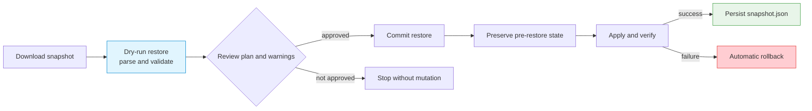

# Configuration Backup and Restore

Use the Gateway snapshot API to capture live configuration, validate a restore
without changing traffic, commit the reviewed document, and persist the result
for restart recovery. This procedure covers the Gateway's built-in snapshot;
it does not replace database backup for external identity, API-key, or tenant
quota stores.

## What the snapshot contains

Snapshot schema `1.0` covers these configuration domains:

- endpoints, load balancers, firewall rules, policies, and mirrors;
- sessions, session ULCL, IP filters, and security rate limits;
- BFD, BGP, and IPsec configuration.

The document's `excluded_domains` marker lists `cluster`, `conntrack`,
`ai_keys`, and `interface`. Tenant limits stored with AI keys and management
identity databases are also outside the named snapshot domains. Inventory and
back up those sources separately. Do not infer coverage for any configuration
family that is not listed above merely because it is visible in another API.

!!! danger "Treat every snapshot as sensitive"
    A snapshot can contain network topology, policy, certificate/private-key,
    and IPsec key material. Download it only over a protected management channel,
    store it with owner-only permissions, encrypt backups at rest, and never
    attach an unredacted snapshot to a public issue or test report.

## How restore protects the running Gateway



`POST /config/restore` defaults to `dry-run`. A commit must be explicit. During
a restore, other mutating configuration calls are rejected with `503` and a
`Retry-After` header. A concurrent snapshot, restore, or persist request is
rejected with `409`. Clients should wait and retry rather than bypassing this
single-writer protection.

## Before you begin

1. Use an immutable, approved Gateway image on the source and target.
2. Send requests through the protected management API and use an identity
   permitted to change configuration.
3. Keep a persistent mount for the configured directory. Its default is
   `/etc/loxilb`.
4. Pause automated configuration writers for the maintenance window.
5. Verify backend health and save an independent inventory of external stores.

The examples keep credentials in an owner-readable header file:

```bash
export CONTROL_API="https://gateway.example.com/netlox/v1"
install -m 600 /dev/null ./control-plane.headers
printf 'Authorization: Bearer %s\n' "$CONTROL_PLANE_TOKEN" > ./control-plane.headers
```

## Step 1: Download and inspect a snapshot

```bash
umask 077
curl --fail-with-body --silent --show-error \
  --header @control-plane.headers \
  --output gateway-snapshot.json \
  "$CONTROL_API/config/snapshot"

jq -e '.schema_version == "1.0" and (.checksum | length > 0)' \
  gateway-snapshot.json
```

You can request a subset with a comma-separated `components` query, but a
full-instance recovery requires the complete document. Preserve the original
file unchanged; editing content invalidates its checksum.

## Step 2: Run a dry-run restore

```bash
curl --fail-with-body --silent --show-error \
  --request POST \
  --header @control-plane.headers \
  --header 'Content-Type: application/json' \
  --data-binary @gateway-snapshot.json \
  "$CONTROL_API/config/restore?mode=dry-run" \
  | tee restore-dry-run.json

jq . restore-dry-run.json
```

Review the returned per-domain plan, compatibility flag, schema/source version,
errors, and result. Dry-run performs no configuration mutation. Stop if the
source version, planned deletes, or errors do not match the approved change.

## Step 3: Commit the reviewed snapshot

```bash
curl --fail-with-body --silent --show-error \
  --request POST \
  --header @control-plane.headers \
  --header 'Content-Type: application/json' \
  --data-binary @gateway-snapshot.json \
  "$CONTROL_API/config/restore?mode=commit" \
  | tee restore-commit.json

jq . restore-commit.json
```

A successful commit triggers a write-through to `snapshot.json`. Inspect the
response's `errors` array even when `result` is `ok`: if persistence fails, the
live restore remains applied but is not guaranteed to survive a restart until
a later `POST /config/persist` succeeds. If apply or verify fails, the engine
attempts to restore the preserved pre-restore state. Treat a `ROLLBACK-FAILED`
result as an incident: isolate the node from new traffic, retain sanitized logs
and both snapshots, and rebuild from a known-good image and reviewed
configuration.

## Step 4: Verify the data plane

Do not stop at a successful API result:

1. read back critical load balancers, endpoints, policies, and certificates;
2. check endpoint health and send a small authorized inference request;
3. inspect new `401`, `403`, `429`, `5xx`, and restore errors;
4. confirm the expected snapshot and restore metrics;
5. restart only in a maintenance window, then repeat the checks.

## Persist current live configuration

Auto-persist is on by default and coalesces successful mutations before writing
`snapshot.json`. To force an immediate atomic write:

```bash
curl --fail-with-body --silent --show-error \
  --request POST \
  --header @control-plane.headers \
  "$CONTROL_API/config/persist" \
  | jq .
```

The Gateway writes a temporary file and renames it into place with mode `0600`.
The containing directory and backup destination still require appropriate
ownership and access controls. If `--config-auto-persist=off` is selected, make
explicit persist calls part of every approved change procedure.

## Restart and legacy-file behavior

At startup the Gateway restores `snapshot.json`. When both that file and legacy
`*.txt` artifacts exist, the newest configuration source wins. If snapshot boot
restore fails, the file is quarantined with a `.failed-<timestamp>` suffix and
the legacy path can be used. Investigate the failure; do not silently copy the
quarantined file back into service.

## Monitor backup and restore

| Metric | What to watch |
|---|---|
| `loxilb_snapshot_total{trigger}` | Captures produced by `manual`, `write-through`, and `pre-restore`; the precreated `scheduled` and `pre-upgrade` labels are reserved and remain zero because no current automatic producer invokes them |
| `loxilb_restore_total{mode,result}` | Dry-run, commit, and boot outcomes, including rollback failures |
| `loxilb_restore_duration_seconds` | Restore duration changes |
| `loxilb_last_restore_timestamp_seconds` | Last successful commit or boot restore |
| `loxilb_boot_config_conflict_total` | Boots that had to arbitrate snapshot and legacy files |

Alert on any `result="ROLLBACK-FAILED"`, repeated boot conflicts, or a missing
successful boot/commit timestamp after a planned recovery.

## Current validation boundary

The API implements staged validation, preservation, rollback, atomic persist,
and boot replay. These controls do not prove that a particular release, plugin,
hardware target, or multi-node promotion preserves every deployment-specific
dependency. Qualify backup and restore with the exact immutable image and
configuration used in production.

## See also

- [HA and Upgrade Limitations](ha-limitations.md)
- [Monitoring and Metrics](monitoring.md)
- [Audit Log](audit-log.md)
- [Management API Authentication](../security/management-api-authentication.md)
