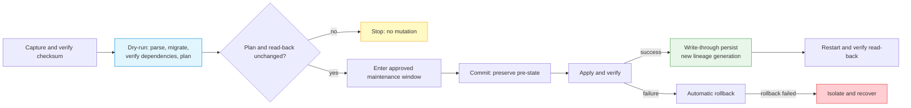

# Configuration Persistence, Backup, and Restore

--8<-- "snippets/common/mutation-fragment-notice.md"

Use the Gateway lifecycle APIs to capture live configuration, prove a restore
plan without mutation, commit the reviewed document, and persist the resulting
state for restart recovery. This is a **Gateway configuration** lifecycle. It
does not restore the appliance operating system, product packages, OAM
database, or external identity and quota stores.

## Availability and evidence boundary

| Surface | Immutable release status | Current-main status |
|---|---|---|
| Gateway `snapshot` / `restore` / `persist` | Gateway `v0.9.8.9-rc.1` exposes schema `1.0` | Gateway main exposes schema `1.6`, dependency manifests, lineage generations, write-through disposition, boot profiles, and readiness evidence |
| `loxicmd get snapshot`, `create restore`, `create persist` | Present in CLI `v0.9.8.9-rc.2` | Present |
| `ready`, `diagnostics`, `maintenance` Gateway APIs | Not present in Gateway `v0.9.8.9-rc.1` | Implemented on Gateway main |

The examples below target the current-main Gateway contract and the CLI
`v0.9.8.9-rc.2` command surface. A green CLI command test does not make a
Gateway main-only API part of `v0.9.8.9-rc.1`. Pin a compatible Gateway build
and inspect `/version` before using the procedure.

## What a snapshot covers

Current schema `1.6` records `included_domains`, `excluded_domains`, a checksum,
and recovery-dependency identities. Full current-main captures can include
endpoint, JWT profile, load-balancer, KV-exact binding, L7 policy, firewall,
policy, mirror, session, session-ULCL, IP filter, security-rate, BFD, BGP,
IPsec, CORS, tracing, and certificate metadata domains.

Do not infer coverage from that list alone:

- a partial capture contains only its declared `included_domains`;
- `excluded_domains` is an explicit honesty marker for state the snapshot does
  not own;
- external API-key, management-identity, and other stores are referenced by
  identity and readiness, not copied into the document;
- runtime-only state such as conntrack and open inference streams is not a
  configuration backup;
- certificate and secret recovery can depend on node-local protected material.

!!! danger "Treat every snapshot as sensitive"
    A snapshot can disclose topology and policy and can reference protected
    material. Download it only over an authenticated management channel, use
    owner-only storage, encrypt backups at rest, and never attach an unredacted
    document to a public issue or report.

## Restore state machine



`POST /config/restore` defaults to `dry-run`; mutation requires explicit
`mode=commit`. Dry-run proves parsing, schema compatibility, declared
dependency checks, and the replacement plan. It does **not** run every
apply-time check and therefore cannot guarantee commit success.

During snapshot or restore, another lifecycle operation receives `409`. Other
mutating configuration requests receive `503` plus `Retry-After` while restore
holds the write freeze. Requests already in flight when the freeze begins are
not interrupted.

## Before you begin

1. Pin the Gateway image or commit and CLI binary used for the operation.
2. Confirm `GET /status/ready` exists on that Gateway tuple; a `404` indicates
   the released `rc.1` surface or another incompatible build.
3. Pause external configuration writers and choose a maintenance window.
4. Inventory external recovery dependencies and back them up independently.
5. Record independent pre-change read-back for critical rules and endpoints.
6. Keep the Gateway config directory on persistent, access-controlled storage.

Create protected management credentials for the examples:

```bash
export CONTROL_API="https://gateway.example.com/netlox/v1"
install -m 600 /dev/null ./control-plane.headers
printf 'Authorization: Bearer %s\n' "$CONTROL_PLANE_TOKEN" > ./control-plane.headers
install -m 600 /dev/null ./gateway.token
printf '%s\n' "$CONTROL_PLANE_TOKEN" > ./gateway.token
```

## Step 1: Prove readiness and capture identity

```bash
curl --silent --show-error \
  --header @control-plane.headers \
  --output ready-before.json \
  --write-out '%{http_code}\n' \
  "$CONTROL_API/status/ready"

jq -e '.ready == true and (.reasons | length == 0)' ready-before.json
```

Readiness here means configuration recovery is evaluable: boot replay settled,
required dependencies passed their implemented checks, and no auto-persist
failure streak remains. It is not proof of inference success, GPU health, or
HA synchronization.

## Step 2: Download and verify a snapshot

```bash
umask 077
loxicmd get snapshot \
  --token-file ./gateway.token \
  --strict \
  --file gateway-snapshot.json

jq -e '
  .kind == "loxilb-snapshot" and
  (.schema_version | length > 0) and
  (.checksum | startswith("sha256:")) and
  (.included_domains | length > 0)
' gateway-snapshot.json
```

`get snapshot` checks the document's own checksum before atomically replacing
the destination with a mode-`0600` file. A bare capture has generation `0` or
no `generation`; only persistence assigns a position in the node's durable
lineage.

## Step 3: Dry-run and prove no mutation

Capture a stable read-only oracle before and after the dry-run. Choose objects
that the planned restore would replace; the abbreviated example uses the
load-balancer list.

```bash
curl --fail-with-body --silent --show-error \
  --header @control-plane.headers \
  "$CONTROL_API/config/loadbalancer/all" \
  | jq -S . > lb-before.json

loxicmd create restore \
  --token-file ./gateway.token \
  --file gateway-snapshot.json \
  --strict \
  --output json \
  > restore-dry-run.json

jq -e '
  .kind == "CommandResult" and
  .command == "create.restore" and
  .success == true and
  .code == "OK" and
  .data.restore.mode == "dry-run"
' restore-dry-run.json

curl --fail-with-body --silent --show-error \
  --header @control-plane.headers \
  "$CONTROL_API/config/loadbalancer/all" \
  | jq -S . > lb-after-dry-run.json

cmp lb-before.json lb-after-dry-run.json
```

Review `plan`, `warnings`, `errors`, `external_dependencies`, source/current
versions, and any planned deletes. Stop if the tuple or plan differs from the
approved change.

## Step 4: Commit and verify write-through

```bash
loxicmd create restore \
  --token-file ./gateway.token \
  --file gateway-snapshot.json \
  --commit \
  --strict \
  --output json \
  > restore-commit.json

jq -e '
  .success == true and
  .code == "OK" and
  .data.restore.mode == "commit" and
  .data.restore.result == "ok" and
  .data.restore.persisted == true and
  (.data.restore.persisted_generation > 0)
' restore-commit.json
```

An HTTP `200` alone is insufficient. Inspect `result`, `errors`, `persisted`,
and `persisted_generation` together. If apply/verify fails, the Gateway tries
to restore the preserved pre-state. A `ROLLBACK-FAILED` result means the node
is not in a known state: isolate it and recover from a known-good image and
reviewed backup. If the live restore succeeds but write-through fails, the CLI
returns exit `8` (`PARTIAL`); do not restart until a later persist succeeds.

## Step 5: Persist an approved live state

Auto-persist is enabled by default and coalesces successful mutations after a
quiet interval. Force an immediate atomic write when an operational checkpoint
is required:

```bash
loxicmd create persist \
  --token-file ./gateway.token \
  --strict \
  --output json \
  > persist-result.json

jq -e '
  .success == true and
  .code == "OK" and
  .data.persist.result == "ok" and
  (.data.persist.generation > 0) and
  (.data.persist.checksum | startswith("sha256:"))
' persist-result.json
```

The Gateway writes a temporary file and renames it to
`{config-path}/snapshot.json` with mode `0600`. If
`--config-auto-persist=off` is selected, every approved mutation procedure
must include an explicit persist and identity check.

## Step 6: Restart and prove durable read-back

Use the deployment's approved restart mechanism; this guide does not prescribe
a container, systemd, or appliance restart command. After restart:

```bash
loxicmd get ready \
  --token-file ./gateway.token \
  --output json \
  > ready-after-restart.json

jq -e '
  .ready == true and
  .boot.snapshot_found == true and
  .boot.succeeded == true and
  (.boot.generation > 0) and
  (.reasons | length == 0)
' ready-after-restart.json
```

Then repeat exact object read-back and a small authorized data-plane request.
The CLI prints the raw `ReadyStatus` body for `get ready -o json`; unlike
restore/persist/maintenance commands, it does not wrap that body in
`CommandResult`.

## Boot profiles, quarantine, and lineage

| Condition | `compat` profile | `strict` profile |
|---|---|---|
| Valid `snapshot.json` | Restore it and report the applied generation | Same |
| Snapshot restore fails | Quarantine the file and replay legacy `*.txt` configuration; readiness remains degraded | Quarantine the file and boot without legacy fallback pending operator recovery |
| No snapshot exists | Use the legacy boot path | Use the legacy boot path; `strict` changes failed-snapshot fallback, not the no-snapshot path |

A failed file is preserved with a `.failed-<timestamp>` suffix. Do not copy it
back into service. The next persistence generation is greater than every
parseable active or quarantined lineage file, so quarantine does not silently
reset generation numbering.

## Failure-injection expectations

The Gateway source includes negative persistence scenarios for malformed and
incompatible documents, missing/divergent recovery dependencies, subsystem
startup ordering, secret drift, write failure/ENOSPC, boot quarantine, and
restore storms. Treat these as CI evidence for the cited source revision, not
as proof for an installed host. An acceptance run should retain:

| Injection | Required observable result | Mutation rule |
|---|---|---|
| Corrupt checksum or unsupported schema | `400` / CLI exit `6` | No configuration mutation |
| Required external dependency unavailable | Restore refused before planning/apply | No configuration mutation |
| Apply failure with successful rollback | `500`, `result=rolled-back`, CLI exit `7` | Pre-state restored |
| Apply and rollback failure | `500`, `result=ROLLBACK-FAILED`, CLI exit `8` | State unknown; isolate |
| Persist storage full | persist failure or committed restore with `persisted=false`, CLI exit `7` or `8` as applicable | Never claim restart durability |
| Boot restore failure | Quarantine path and degraded readiness reason | Do not silently report ready |

## Exit and JSON contract

Lifecycle automation must branch on both process exit and structured output:

| Exit | Code | Meaning for this workflow |
|---:|---|---|
| `0` | `OK` | Verified success |
| `2` | `INVALID_ARGUMENT` | Correct invocation |
| `3` | `AUTH` | Correct credential/privilege |
| `4` | `PRECONDITION` | Repair state or dependency first |
| `5` | `UNAVAILABLE` | Bounded retry may be safe |
| `6` | `CONTRACT_MISMATCH` | Use compatible CLI/Gateway or document |
| `7` | `FAILED` | Failure with no confirmed net mutation |
| `8` | `PARTIAL` | State changed or outcome is unknown; never auto-retry |

## Current validation boundary

The procedures and examples are statically checked against Gateway main
Swagger and CLI `v0.9.8.9-rc.2`/main command goldens. They do not establish an
installed-host restart, Linux datapath, GPU, HA, or release qualification.

## See also

- [Readiness, Capabilities, Diagnostics, and Maintenance](readiness-diagnostics-maintenance.md)
- [Appliance Lifecycle CLI](appliance-cli.md)
- [HA and Upgrade Limitations](ha-limitations.md)
- [Monitoring and Metrics](monitoring.md)
- [Management API Authentication](../security/management-api-authentication.md)
