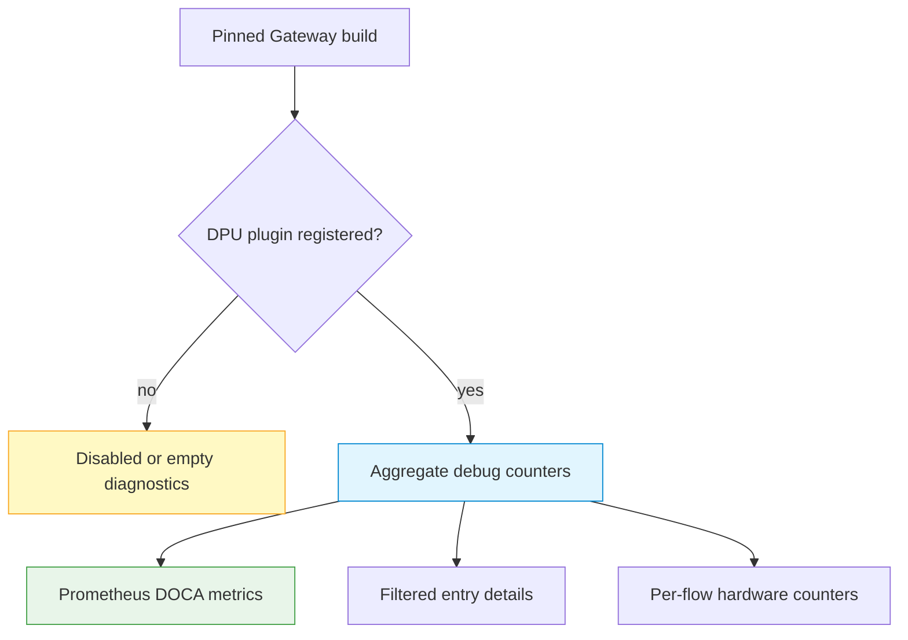

# DPU Offload Observability

The Gateway exposes read-only diagnostics for optional NVIDIA DOCA DPU
offload. Standard release Dockerfiles do not build with `HAVE_DOCA=1`; on a
normal CPU/eBPF deployment these APIs can return disabled or empty state. Use
them to verify an explicitly qualified DPU build, not to infer hardware support
from the OpenAPI specification.

## Observability layers



Prefer aggregate metrics for continuous monitoring. Per-entry APIs enumerate
flow or table state and should be used only for bounded diagnostics.

## Access requirements

The raw DPU routes pass through management authentication when a management
auth mode is configured. Use an administrator identity, TLS, and a restricted
management network. The responses can reveal flow keys, endpoints, service
names, MAC addresses, routes, and hardware activity; never expose them to
tenants or a public diagnostics service.

```bash
export CONTROL_API="https://gateway.example.com/netlox/v1"
install -m 600 /dev/null ./control-plane.headers
printf 'Authorization: Bearer %s\n' "$CONTROL_PLANE_TOKEN" > ./control-plane.headers
```

## Step 1: Read aggregate state

```bash
curl --fail-with-body --silent --show-error \
  --header @control-plane.headers \
  "$CONTROL_API/config/dpu/debug" | jq .
```

Important fields include:

| Field | Meaning |
|---|---|
| `enabled` | DPU manager/plugin state reported by the running build |
| `plugins` | Registered plugin names |
| `offload_success`, `offload_failure`, `offload_active` | Aggregate operation and active-flow counters |
| `offload_*_by_pipe` | Breakdown for CT, UDP CT, route, FDB, and ACL families |
| `circuit_breaker_open` | Whether a registered plugin reports its offload circuit breaker open |

An empty or disabled response is not an error on a non-DPU build. It also does
not prove that the eBPF fallback path has been exercised; send representative
traffic and verify data-plane behavior separately.

## Step 2: Inspect a bounded filtered set

Supplying any of `pipe`, `svc`, `ep`, or `limit` uses the filtered detail path:

```bash
curl --fail-with-body --silent --show-error \
  --get \
  --header @control-plane.headers \
  --data-urlencode 'pipe=ct_fwd_5tuple' \
  --data-urlencode 'svc=inference-service' \
  --data-urlencode 'limit=50' \
  "$CONTROL_API/config/dpu/debug" | jq .
```

`limit` defaults to `200` and is clamped at `2000`. Supported pipe filters are
`rss`, `to_kernel`, `egress_dispatch`, `ct_fwd_5tuple`, `ct_rev_5tuple`,
`root_l3l4_dispatch`, `fdb_l2`, `deny`, and `allow`. Invalid pipe or endpoint
input returns `400`; an uninitialized manager returns `503` on the filtered
path.

Use `flows=1` only when per-flow, FDB, route, and ACL arrays are required:

```bash
curl --fail-with-body --silent --show-error \
  --header @control-plane.headers \
  "$CONTROL_API/config/dpu/debug?flows=1" | jq .
```

This path is more expensive than the aggregate response. Do not poll it as a
dashboard source.

## Step 3: Read hardware counters

```bash
curl --fail-with-body --silent --show-error \
  --header @control-plane.headers \
  "$CONTROL_API/config/dpu/hwcounters" | jq .
```

The response contains `flows`, `total_flows`, parsed protocol/source/destination
fields, and packet/byte counters. With no provider registered it returns an
empty list and `total_flows: 0`.

## Prometheus metrics

DPU metric families are registered when a DPU plugin attaches; absence on a
non-DPU deployment is expected. Core signals include:

| Metric | Meaning |
|---|---|
| `doca_offload_active_flows` | Current hardware-offloaded flows |
| `doca_offload_attempts_total` | Offload attempts |
| `doca_offload_failures_total` | Offload failures |
| `doca_circuit_breaker_state` | `0` closed, `1` open |
| `doca_pipe_hw_pkts_total{pipe,direction}` | Delta-tracked hardware packets by pipe and direction |
| `doca_pipe_hw_bytes_total{pipe,direction}` | Delta-tracked hardware bytes by pipe and direction |
| `doca_ct_pipe_utilization{pipe}` | Go-tracked CT entries divided by configured capacity; not a direct hardware occupancy reading |
| `loxilb_doca_collector_query_errors_total` | Hardware-counter collection errors |
| `loxilb_doca_egress_counters_available` | Whether the selected hardware path reports egress counters |

Alert on failure-rate increases, circuit breaker opening, unexpected loss of a
previously present family, and collector errors. Correlate metrics with the
debug endpoint and real traffic; zero counters can mean no traffic, no plugin,
unsupported counters, or a collection problem.

## Disruptive debug actions

`POST /config/dpu/debug` supports plugin `unregister` and circuit-breaker
`cb_force` actions. They unload offload state or deliberately force fallback
behavior and are intended for controlled testing.

!!! danger "Do not run debug actions during normal production traffic"
    Use a maintenance window, drain traffic, capture the pre-change state, and
    have a tested recovery procedure. Restrict POST access more tightly than
    read-only monitoring. This guide intentionally does not provide copy-paste
    commands for destructive debug actions.

## Production qualification checklist

- pin the Gateway image and match it to the DPU SDK, firmware, drivers, and
  supported hardware;
- verify successful plugin registration and expected pipe inventory;
- test offload and eBPF fallback with representative TCP, UDP, routing, FDB,
  firewall, and QoS behavior that is in deployment scope;
- test circuit-breaker transition and recovery without using live tenant data;
- compare software and hardware packet/byte evidence and document expected
  counter gaps;
- measure per-entry query cost at the deployment's maximum flow count;
- validate restart, upgrade, and rollback on the physical target.

Repository implementation and API schemas do not replace vendor/hardware
qualification. Publish performance or HA claims only from reproducible tests on
the same hardware/software bill of materials.

## See also

- [Monitoring and Metrics](monitoring.md)
- [HA and Upgrade Limitations](ha-limitations.md)
- [Management API Authentication](../security/management-api-authentication.md)
