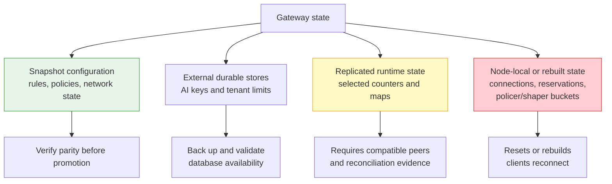

# HA and Upgrade Limitations

High availability (HA) must be evaluated by state category. A synchronized
configuration, a replicated counter, and an active client connection have
different failover behavior. Current single-node scenarios and unit tests are
not proof of two-node failover.

## State categories

| Category | Examples | Operator expectation |
|---|---|---|
| Snapshot configuration | Endpoints, LB/firewall/policy rules, sessions, BFD/BGP/IPsec | Keep both nodes consistent; dry-run the approved snapshot and verify read-back |
| External durable store | AI API keys; tenant, user, model, and defaults rows in the AI key PostgreSQL store; management identities in their configured store | Back up independently, restrict access, and verify every node reaches the same intended source of truth |
| JWT profile and key lifecycle | Profile desired configuration plus node-local fetched JWKS snapshot and refresh timers | Keep profiles identical; each node must fetch and prove its own usable keyset |
| Replicated runtime | Token-quota state exchanged between compatible peers | Do not assume completeness after restart or mixed-version operation |
| Node-local or rebuilt | In-flight reservations, policer/shaper token buckets, active TCP/TLS/SSE connections | State can reset; clients retry or reconnect |

## Connection behavior during promotion

Active TCP, TLS, HTTP, and Server-Sent Events (SSE) connections are not moved
from one Gateway process to another. Promotion changes where new connections
arrive. Existing connections on a failed or stopped node terminate, and clients
must reconnect.

Use clients with bounded retries, exponential backoff, idempotency where the
application supports it, and timeouts appropriate for inference requests. A
retry can create duplicate work if the backend processed the original request
before the client lost the response.

## Current xSync boundary

With clustering configured and the default `--rpc=netrpc` mode, xSync starts
two peer listeners:

| Listener | Current use | Transport boundary |
|---|---|---|
| TCP `22222` | Connection-tracking synchronization through Go `net/rpc` | Plain HTTP/RPC; no built-in peer authentication |
| TCP `22223` | Sockproxy sessions, rate-limiter state, and API-key cache invalidation through gRPC | gRPC uses insecure transport credentials; no built-in peer authentication |

Both servers bind to all addresses. Block these ports at every untrusted
interface and allow only the exact peer addresses through a host firewall or a
separately authenticated and encrypted network. The Gateway does not currently
offer an xSync TLS or peer-token option that can substitute for that network
control.

`--rpc=grpc` starts the main gRPC service on `22222`, but the current startup
path does not also start the dedicated `22223` sockproxy server while the
sockproxy client continues to target `22223`. Do not select that mode for
sockproxy HA without release-specific end-to-end evidence.

The sockproxy synchronizer batches session/conversation events and pushes
rate-limiter state to compatible peers. Queues are bounded: overload uses
drop-oldest behavior, and a batch can be dropped after retry exhaustion. This
is eventual best-effort synchronization, not a consensus or transaction log.

The code includes a paged `GetSockproxySnapshot` pull implementation, but the
current production `MASTER` transition hook starts peer consumers without
calling that pull. Its present call sites are tests. Therefore a promoted node
must not be assumed to reconcile missed sockproxy sessions automatically before
serving. Validate actual peer state or drain/rebuild it through the release's
approved procedure.

Watch these signals during every failover exercise:

- `loxilb_sockproxy_sync_overflow_total{kind}` for ring/queue loss;
- `loxilb_sockproxy_sync_drop_total{reason}` for retry-exhausted batches;
- `loxilb_sockproxy_sync_apply_errors_total` and
  `loxilb_sockproxy_sync_health_reject_total{reason}` for receiver rejection;
- `loxilb_sockproxy_sync_push_latency_seconds{peer,rpc}` and
  `loxilb_sockproxy_sync_inflight_rpc{peer}` for a slow peer path;
- `loxilb_sockproxy_sync_conflict_total{outcome}` for active-active conflict
  resolution;
- `loxilb_sockproxy_sync_peer_scope_version{peer}` for the quota-state wire
  scope observed from each peer.

Metric presence confirms that instrumentation is registered. It does not prove
that the peer link is complete, private, or loss-free.

## Token-quota mixed-version boundary

Peers must run the same quota wire semantics for key, user, user-model,
tenant, tenant-model, and shared-VIP buckets. A rolling upgrade across the
quota-state format change is unsupported while token quotas are enabled. A
newer peer can send a drain-time timestamp that an older peer interprets as a
very large consumed-token count, causing erroneous `429` denials until the
entry expires.

Request-rate limiting, API-key authentication, and model authorization do not
share this specific incompatibility. The restriction applies to peers
exchanging token-quota state. A standalone Gateway is not affected by peer
wire compatibility.

The peer-scope gauge makes the observed scope visible; it does not make mixed
versions compatible. Require the expected value on every peer and an immutable
same-version build identity before enabling quota exchange. The frozen public
scenario contains same-scope and mismatch assertions, but it is not wired to a
public GitHub workflow at the frozen commit and this docs change does not run a
two-node HA test. See [Verification Status](../reference/verification-status.md).

## Safe peer upgrade procedure

Prefer upgrading both peers together inside an approved maintenance window. If
nodes must be upgraded one at a time:

1. Inventory every key, user, user-model, tenant, tenant-model, defaults, and
   shared-VIP token limit on both peers. Per-key TPM is implemented but its
   primary Swagger contract remains stale; record it without presenting it as
   release-qualified support.
2. Disable every active token-quota scope before upgrading the first node.
3. Confirm both peers read back quotas as disabled.
4. Wait for old in-memory quota entries to age out. The normal default idle
   horizon is about ten minutes, but deployments can extend it; use the
   configured value and operational evidence rather than a fixed sleep.
5. Upgrade the first node and verify health, version, configuration parity,
   logs, and metrics without re-enabling quotas.
6. Upgrade the second node and repeat the checks.
7. Confirm both nodes run the same immutable build and product flavor.
8. Restore tenant and per-model quotas from the reviewed inventory.
9. Send a low-rate authorized request and verify token accounting and denial
   metrics before returning normal traffic.

!!! danger "Ordering matters"
    Disabling quotas does not retract state that an old peer already holds.
    Upgrading immediately after the configuration change can still expose the
    incompatible entry. Wait for expiry and verify before proceeding.

## Promotion checklist

Before planned promotion:

- compare snapshot-covered rules/endpoints/policies on both nodes and verify the
  approved configuration checksum;
- verify the external AI key store is available and that each node reads the
  same key, user, tenant, model, and defaults records without exporting credentials;
- verify every JWT profile reports a usable JWKS snapshot on each node; a
  profile list alone is only desired configuration;
- confirm certificate validity and trust configuration without printing key
  material;
- verify the same Gateway version and immutable image identity;
- confirm endpoint health and inference-engine compatibility;
- inspect `loxilb_ai_token_quota_cold_open_total` and quota utilization;
- expect QoS buckets and in-flight quota reservations to restart locally;
- verify clients can reconnect and retry safely;
- keep a rollback image, reviewed Gateway snapshot, and separately tested
  database backup available.

After promotion:

- send a small authenticated request for each critical model;
- confirm expected route and backend health;
- check new `401`, `403`, `429`, `502`, and `503` rates;
- compare scoped and host CPU gauges;
- verify quota and shaper metrics are plausible, not merely present;
- inspect sanitized logs for state-warmup, peer, policy, and endpoint errors.

## What current evidence does not prove

Do not publish or operate under these assumptions without dedicated two-node
evidence:

- a promoted node always pulls a complete snapshot before serving;
- the Gateway snapshot contains or restores external API-key, tenant-quota, or
  management-user databases;
- peer synchronization is authenticated or confidential by the Gateway;
- a JWKS snapshot fetched on one node is replicated to another node;
- quota, QoS, KV, and session state survive promotion without gaps;
- mixed-version rolling upgrades are seamless with quotas enabled;
- active connections migrate transparently;
- a green single-node CI run or mock scenario proves multi-node quota and rate-limit failover.

These are release gates, not implied capabilities.

## Security boundaries

- Permit peer TCP ports `22222` and `22223` only between the intended nodes.
  Provide authentication and encryption outside the current Gateway xSync
  transport, and verify the effective firewall/VPN policy from both allowed and
  denied sources.
- Limit snapshot, restore, policy, and quota operations to least-privileged
  administrative identities.
- Treat configuration snapshots as sensitive: they can reveal topology,
  policy, and IPsec key/certificate material. Protect database backups under
  separate credential and retention controls.
- Never paste bearer tokens, API keys, private keys, database credentials,
  private addresses, or unredacted prompts into upgrade evidence.
- Use immutable artifacts. A mutable tag makes peer compatibility and rollback
  evidence ambiguous.

## Failure symptoms

| Symptom after restart or promotion | Likely category | First action |
|---|---|---|
| Existing SSE streams disconnect | Node-local connection | Confirm client reconnect behavior; do not expect migration |
| Temporary extra bandwidth burst | Node-local QoS bucket | Verify policy configuration and observe the fresh bucket |
| Sudden quota `429` after mixed-version contact | Replicated incompatible quota state | Disable quotas, isolate incompatible peers, and follow the safe upgrade procedure |
| Quota under-enforcement after cold start | Missing replicated state | Inspect cold-open metric and peer-state logs; limit traffic until understood |
| Missing LB rule or endpoint | Configuration parity | Compare read-back and restore through the approved configuration source |
| Keys or tenant limits missing on one node | External store connectivity or cache invalidation | Verify database source of truth, TLS, connectivity, and a fresh authorized read |
| Authentication or TLS failure on the promoted node | Configuration/secret parity | Verify certificate chain, key references, clock, and access policy securely |

## Rollback

Rollback is safe only when it does not reconnect an older peer to incompatible
quota state.

1. Keep token quotas disabled.
2. Stop or isolate the incompatible peer relationship.
3. Restore the previous immutable build and reviewed configuration.
4. Verify both nodes are version-compatible before restoring peer exchange.
5. Wait for incompatible quota entries to expire if they may still exist.
6. Validate authentication, routing, metrics, and a small inference request.
7. Re-enable quotas only after both peers are compatible and stable.

Record sanitized timestamps, versions, configuration checksums, HTTP outcomes,
and metric deltas. Do not record credentials or customer request content.

## Related pages

- [AI Traffic Governance](../ai-gateway/ai-traffic-governance.md)
- [AI Quotas and QoS](ai-qos.md)
- [Monitoring and Metrics](monitoring.md)
- [Configuration Backup and Restore](backup-restore.md)
- [Verification Status](../reference/verification-status.md)
- [Troubleshooting](troubleshooting.md)
