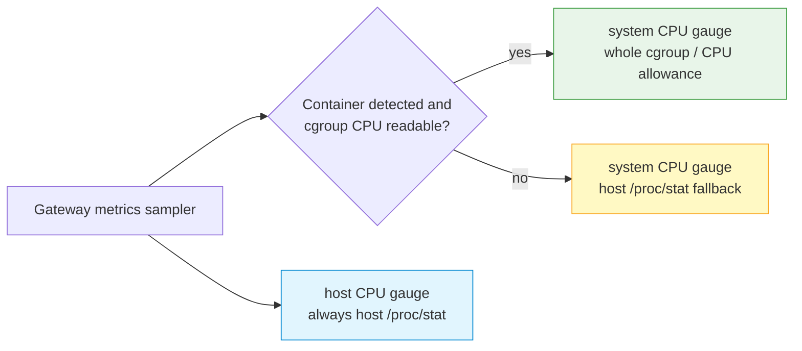

# Monitoring and Metrics

LoxiLB exposes Prometheus metrics for load balancing, system pressure, AI
admission, token quotas, engine-specific routing, and fullproxy QoS. Use the
metrics to distinguish Gateway pressure from host pressure and policy denials
from backend failures.

For the complete generated list of 197 release-scope families, exact labels,
activation classes, and evidence status, see the
[Metrics Reference](../reference/metrics.md). The catalog records source
evidence; a raw scrape and controlled stimulus are still required for a
deployment claim.

## Enable and scrape metrics

Metrics collection is disabled by default. Enable it at process startup with `-p` or
`--prometheus`, or dynamically through the authenticated control plane. While disabled,
`/metrics` returns `503`.

```bash
export CONTROL_API="https://gateway.example.com/netlox/v1"
install -m 600 /dev/null ./control-plane.headers
printf 'Authorization: Bearer %s\n' "$CONTROL_PLANE_TOKEN" > ./control-plane.headers

curl --fail-with-body --silent --show-error \
  --request POST \
  --header @control-plane.headers \
  "$CONTROL_API/config/metrics"

curl --fail-with-body --silent --show-error \
  --header @control-plane.headers \
  "$CONTROL_API/config/metrics" | jq .
```

The Prometheus scrape route is `GET /netlox/v1/metrics`. Its current API
contract explicitly exempts it from bearer authentication so Prometheus can
scrape without a short-lived user token.

!!! warning "Unauthenticated does not mean public"
    Metrics expose service, model, tenant, endpoint, and policy activity.
    Restrict the listener with network policy, firewall rules, or a trusted
    monitoring proxy. Use TLS across untrusted networks and keep tenant/model
    labels free of secrets or personal information.

```yaml
scrape_configs:
  - job_name: loxilb-inference-gateway
    metrics_path: /netlox/v1/metrics
    scrape_interval: 10s
    scheme: https
    static_configs:
      - targets: ["gateway.example.com"]
```

The bundled monitoring stack and dashboards are available under the public
repository's `deploy/monitoring/` directory. Review image versions, network
bindings, credentials, and TLS settings before using it outside a lab.

## CPU scope: Gateway container versus host



| Metric | Container behavior | Bare-metal behavior |
|---|---|---|
| `loxilb_system_cpu_utilization_percent` | Whole Gateway cgroup/container CPU usage as a percentage of its allowed CPU cores | Whole host CPU usage |
| `loxilb_host_cpu_utilization_percent` | Whole host CPU usage | Whole host CPU usage |

The system gauge is not necessarily the LoxiLB process alone: helper processes
in the same cgroup contribute. An explicit container CPU quota defines the
allowance; otherwise available/affinity-constrained cores are used. The value
is clamped to 0–100 percent.

If a container is detected but cgroup v1/v2 accounting is unreadable, the
system gauge falls back to host `/proc/stat`. On bare metal the two gauges are
therefore expected to be equal.

Use both gauges together:

```promql
loxilb_system_cpu_utilization_percent
loxilb_host_cpu_utilization_percent
```

- Scoped high, host moderate: Gateway container/cgroup is near its allowance.
- Scoped low, host high: another host workload may be causing contention.
- Equal values: bare metal or cgroup fallback; confirm the startup log's CPU
  accounting source before attributing pressure.

## AI access and request metrics

| Metric | Type | Labels | Meaning |
|---|---|---|---|
| `loxilb_ai_requests_total` | Counter | `model`, `tenant`, `status`, `outcome` | Completed SSE inference streams use `outcome="completed"`; admission denials use `outcome="denied"`. Non-SSE successes are not counted here. |
| `loxilb_ai_request_duration_seconds` | Histogram | `model`, `tenant` | Duration recorded when an SSE inference stream completes; non-SSE requests are not observed |
| `loxilb_ai_active_streams` | Gauge | `model` | Active SSE streams |
| `loxilb_ai_rate_limit_hits_total` | Counter | `tenant`, `reason` | RPS and token-quota denials |
| `loxilb_ai_model_not_allowed_total` | Counter | `model`, `tenant` | Model authorization denials |

Denials are recorded at the decision point. Do not assume a generic completed
request query includes every pre-dispatch denial; use the dedicated denial
counters when alerting on `403` and `429`.

## JWT and policy-store metrics

| Metric | Type | Labels | Meaning |
|---|---|---|---|
| `loxilb_ai_jwt_validation_total` | Counter | `tenant`, `reason` | Bearer verdicts; `allowed` is admission, while denial reasons use the closed client error-code set. Tenant `-` means no verified tenant was available. |
| `loxilb_ai_jwks_refresh_total` | Counter | `profile`, `outcome` | JWKS fetch attempts; outcome is `success` or `failure` |
| `loxilb_ai_jwks_keys` | Gauge | `profile` | Usable verification keys in the current snapshot |
| `loxilb_ai_jwks_usable` | Gauge | `profile` | `1` only when a fetched keyset is inside the staleness cutoff |
| `loxilb_ai_jwks_last_success_timestamp_seconds` | Gauge | `profile` | Last successful fetch time; absent before the first success |
| `loxilb_ai_policy_store_unavailable_total` | Counter | none | Requests refused `503` because a required credential or quota policy could not be evaluated |

A rising JWKS failure counter with a flat success counter is a warning while
the last-known-good keyset still admits traffic. Alert before
`loxilb_ai_jwks_usable` becomes `0`. Do not treat an absent last-success series
as a zero timestamp; it means no fetch has succeeded.

```promql
# JWT decisions by tenant and closed reason code
sum by (tenant, reason) (
  rate(loxilb_ai_jwt_validation_total[5m])
)

# JWKS refresh failures by profile
sum by (profile) (
  rate(loxilb_ai_jwks_refresh_total{outcome="failure"}[5m])
)

# Profiles whose currently cached keyset is unusable
loxilb_ai_jwks_usable == 0
```

## Token quota metrics

| Metric | Type | Meaning |
|---|---|---|
| `loxilb_ai_tokens_consumed_total{model,tenant,kind}` | Counter | Tokens charged; `kind` is `prompt` or `completion` |
| `loxilb_ai_tokens_estimated_total{model,tenant}` | Counter | Tokens charged from the estimate path |
| `loxilb_ai_tokens_missing_total{model,tenant}` | Counter | Completed responses without readable usage |
| `loxilb_ai_token_quota_denied_total{tenant}` | Counter | Requests denied by token quota |
| `loxilb_ai_token_quota_utilization{tenant}` | Gauge | Aggregate spent fraction after continuous refill |
| `loxilb_ai_token_quota_limit_tokens{tenant}` | Gauge | Aggregate TPM limit |
| `loxilb_ai_token_quota_model_utilization{tenant,model}` | Gauge | Model-specific spent fraction |
| `loxilb_ai_token_quota_model_limit_tokens{tenant,model}` | Gauge | Model-specific TPM limit |
| `loxilb_ai_user_token_quota_utilization{tenant,user}` / `_limit_tokens` | Gauge | User TPM state and last charged limit |
| `loxilb_ai_user_model_token_quota_utilization{tenant,user,model}` / `_limit_tokens` | Gauge | User-and-model TPM state |
| `loxilb_ai_key_token_quota_utilization{key_id}` / `_limit_tokens` | Gauge | Implemented per-key TPM state; primary Swagger text is stale and release support remains pending convergence |
| `loxilb_ai_vip_token_quota_utilization{service}` / `_limit_tokens` | Gauge | Shared service TPM state |
| `loxilb_ai_token_quota_cold_open_total` | Counter | Quota service began with empty state because no peers were available, peer warmup was disabled, or peer warmup timed out |

Utilization can exceed `1` while a completed response has created post-hoc
debt. It decays as the smooth bucket refills. Aggregate and model gauges are
separate admission gates and must not be added together.

Useful queries:

```promql
# Tokens charged per second, split by count source kind
sum by (kind) (rate(loxilb_ai_tokens_consumed_total[5m]))

# Estimated-accounting share; clamp avoids division by zero
sum(rate(loxilb_ai_tokens_estimated_total[5m]))
/
clamp_min(sum(rate(loxilb_ai_tokens_consumed_total[5m])), 1)

# Remaining aggregate headroom in tokens
loxilb_ai_token_quota_limit_tokens
* (1 - loxilb_ai_token_quota_utilization)
```

## Fullproxy QoS metrics

The `loxilb_proxy_qos_*` family exists only for an actively shaped fullproxy
service. Every series uses `vip`, `port`, `proto`, and `direction` labels;
`direction` is `upload` or `download`.

| Metric | Type | Unit |
|---|---|---|
| `loxilb_proxy_qos_bytes_passed_total` | Counter | Plaintext payload bytes |
| `loxilb_proxy_qos_bytes_delayed_total` | Counter | Payload bytes that waited |
| `loxilb_proxy_qos_parks_total` | Counter | Pause events |
| `loxilb_proxy_qos_park_seconds_total` | Counter | Seconds for parks that resumed |
| `loxilb_proxy_qos_parked_connections` | Gauge | Connections currently paused |
| `loxilb_proxy_qos_tokens_bytes` | Gauge | Bucket level in bytes |
| `loxilb_proxy_qos_cir_bytes_per_second` | Gauge | Committed rate in bytes/s |
| `loxilb_proxy_qos_cbs_bytes` | Gauge | Burst depth in bytes |

The policy API configures Mbps, while the shaper CIR metric exports bytes/s.
For example, 16 Mbps is 2,000,000 bytes/s. Do not multiply the metric by eight
unless the panel is deliberately converting it to bits/s and labels the result
accordingly.

```promql
# Payload throughput in bytes/s
sum by (vip, port, direction) (
  rate(loxilb_proxy_qos_bytes_passed_total[5m])
)

# Fraction of passed payload that encountered shaping
sum by (vip, port, direction) (
  rate(loxilb_proxy_qos_bytes_delayed_total[5m])
)
/
clamp_min(
  sum by (vip, port, direction) (
    rate(loxilb_proxy_qos_bytes_passed_total[5m])
  ), 1
)
```

Detached services disappear from this metric family after the collection
refresh. A frozen series after detach is not the expected representation.

## Engine and P/D metrics

| Metric | Meaning |
|---|---|
| `loxilb_ai_engine_info{service,engine}` | Engine identity currently emitted only for llama.cpp rules |
| `loxilb_ai_llamacpp_probe_warnings_total{service,kind}` | llama.cpp `/props` findings such as model/build/slot mismatch, sleeping, or unanswered |
| `loxilb_ai_pd_requests_total{model,phase,status}` | One terminal P/D outcome: complete/success; prefill timeout/error/rejected; decode timeout/error; or defensive unknown/error |
| `loxilb_ai_pd_prefill_duration_seconds{model}` | Observed prefill phase duration when known |
| `loxilb_ai_pd_decode_ttft_seconds{model}` | Decode time to first token/byte when known |
| `loxilb_ai_pd_kv_params_found_total{model}` | A completed prefill response carried `kv_transfer_params` |
| `loxilb_ai_pd_kv_params_missing_total{model}` | A prefill response was actually inspected but lacked `kv_transfer_params`; prefill failures do not increment it |
| `loxilb_ai_pd_session_hits_total{model}` | Tier-0 P/D session-stickiness selections |
| `loxilb_ai_pd_tier_selected_total{tier,model}` | Successful terminal prefill selections by `tier0`, `tier1`, `tier15`, or `tier2`; pre-routing admission outcomes increment nothing |
| `loxilb_pd_admission_shed_total` | Every eligible prefill endpoint was at its in-flight cap and queueing was disabled; request refused |
| `loxilb_pd_admission_queued_total` | Request parked in a per-endpoint FIFO because the pool was capped and queueing was enabled |
| `loxilb_pd_admission_overflow_shed_total` | Pool and eligible per-endpoint FIFOs were full; overflow request refused |
| `loxilb_pd_sg_prefill_abort_decode_total` | SGLang prefill failure aborted the decode leg |
| `loxilb_pd_sg_decode_close_drain_total` | SGLang decode failure closed the prefill drain leg |
| `loxilb_pd_sg_room_retry_total` | SGLang pair retried with a new bootstrap room |
| `loxilb_pd_sg_prefill_reject_relay_total` | SGLang prefill 4xx relayed and decode aborted |
| `loxilb_pd_sg_oversize_reject_total` | SGLang request rejected because bootstrap injection was impossible |
| `loxilb_pd_trt_ctx_early_exit_total` | TensorRT-LLM context stage completed the request without generation stage |
| `loxilb_pd_cb_flips_total` | All P/D circuit-breaker state transitions; correlate a rate increase with endpoint health and status |
| `loxilb_pd_cb_proactive_heal_total` | Open-to-half-open transitions initiated by the periodic health pass |
| `loxilb_pd_connect_failover_total` | Prefill TCP-connect failures successfully retried on another healthy prefill endpoint |
| `loxilb_pd_prefill_ep_died_total` | Prefill connections that died mid-request and returned `503` |
| `loxilb_pd_decode_ep_died_total` | Decode connect failures or EOF before response relay |

An engine info series proves the rule identity was registered; it does not
prove backend correctness or traffic success. A successful connect-failover
counter also does not prove that origin HTTP `5xx` responses were hidden:
correlate circuit transitions and endpoint-death counters with
`loxilb_proxy_http_responses_by_status_total`, endpoint health, logs, and the
client-visible result.

For `loxilb_ai_pd_requests_total`, alert on the typed `phase` and `status` pair rather than an
HTTP-code guess. Reconcile `tier_selected` only against successfully selected P/D requests;
parked and refused admission events belong to the three admission families and intentionally do
not choose a routing tier.

### Worker scrape metrics

`loxilb_ai_worker_scrape_total{result}` records the outcome of worker metric
collection. The closed result set is `ok`, `unreachable`, `http_error`,
`body_error`, `unparseable`, `bad_request`, and `unknown`. Treat each class as
a distinct failure stage rather than collapsing every non-`ok` result into
backend unavailability.

```promql
# Worker scrape attempts by result
sum by (result) (
  rate(loxilb_ai_worker_scrape_total[5m])
)

# Fraction of worker scrapes that did not complete successfully
sum(rate(loxilb_ai_worker_scrape_total{result!="ok"}[5m]))
/
clamp_min(sum(rate(loxilb_ai_worker_scrape_total[5m])), 1)
```

These counters prove the collection path classified an attempt; they do not
prove that a worker's reported values were fresh or that inference traffic
reached that worker. Correlate them with worker-series freshness, endpoint
health, and an independent backend receipt.

## Relay cache and backpressure metrics

The fullproxy relay cache is bounded per connection but not by one aggregate
process-wide cap. Slow backends and many concurrent request bodies can therefore
raise total cached bytes even when no single connection reaches its watermark.

| Metric | Meaning |
|---|---|
| `loxilb_proxy_cache_bytes` | Relay payload bytes currently cached across all connections |
| `loxilb_proxy_cache_bytes_max_conn` | Largest cache held by one connection |
| `loxilb_proxy_cache_conns_queued` | Connections currently holding cached relay payload |
| `loxilb_proxy_cache_backpressure_ratio` | Fraction of connections with active cache backpressure |
| `loxilb_proxy_cache_high_water_events_total` | Per-connection high-water activations |
| `loxilb_proxy_cache_drain_partial_total` | Partial drains caused by socket flow control |
| `loxilb_proxy_graceful_close_total` | Graceful closes that drained pending cached data |

The normal per-connection watermark is 12 MiB and the chunked watermark is
768 KiB. `loxilb_proxy_cache_bytes_max_conn` approaching the applicable value
means one connection is near backpressure; rising aggregate bytes with a low
maximum points to concurrency rather than a single oversized body.

```promql
# Mean cached payload per queued connection
loxilb_proxy_cache_bytes
/
clamp_min(loxilb_proxy_cache_conns_queued, 1)

# New high-water activations
rate(loxilb_proxy_cache_high_water_events_total[5m])
```

## Configuration recovery metrics

| Metric | Meaning |
|---|---|
| `loxilb_snapshot_total{trigger}` | Captures produced by `manual`, `write-through`, and `pre-restore`; `scheduled` and `pre-upgrade` series are precreated/reserved and remain zero because no current producer invokes those triggers |
| `loxilb_restore_total{mode,result}` | Dry-run, commit, and boot restore outcomes |
| `loxilb_restore_duration_seconds` | Restore pipeline duration |
| `loxilb_last_restore_timestamp_seconds` | Last successful committed or boot restore |
| `loxilb_boot_config_conflict_total` | Boot arbitration between snapshot and legacy files |

Page immediately on a new
`loxilb_restore_total{result="ROLLBACK-FAILED"}`. Investigate repeated conflict
increments and rejected/error restore results. See
[Configuration Backup and Restore](backup-restore.md) for the procedure.

## Peer synchronization metrics

The xSync metric family exposes loss and receiver-side rejection on the
sockproxy peer path:

| Metric | Meaning |
|---|---|
| `loxilb_sockproxy_sync_overflow_total{kind}` | Inbound event or per-peer outbound queue overflow; events/batches use drop-oldest behavior |
| `loxilb_sockproxy_sync_drop_total{reason}` | Batch dropped after retry exhaustion |
| `loxilb_sockproxy_sync_apply_errors_total` | Receiver could not apply a synchronized entry |
| `loxilb_sockproxy_sync_health_reject_total{reason}` | Receiver rejected an entry through its local endpoint-health gate |
| `loxilb_sockproxy_sync_conflict_total{outcome}` | Active-active conflict-resolution result |
| `loxilb_sockproxy_sync_push_latency_seconds{peer,rpc}` | Sender-side RPC latency |
| `loxilb_sockproxy_sync_inflight_rpc{peer}` | Currently in-flight synchronization RPCs |
| `loxilb_sockproxy_sync_peer_scope_version{peer}` | Quota-state wire scope version reported for the peer; equality is required before treating quota synchronization as compatible |

Page on new overflow, retry-exhausted drops, or apply errors during normal
load. A quiet metric does not prove that a peer is connected: correlate with
peer state, network evidence, and a controlled state change. Current xSync
ports do not authenticate or encrypt peers themselves; see
[HA and Upgrade Limitations](ha-limitations.md).

## Sockmap observability boundary

The release-scope manifest contains no dedicated sockmap Prometheus family, so
there is no valid sockmap-specific PromQL to document. Verify acceleration with
the `sockmap_stats` BPF map, active-map state, the reset operation, byte
equivalence, and an `off` control as described in
[Sockmap Acceleration](sockmap-acceleration.md). Do not substitute the
`loxilb_sockproxy_sync_*` peer-synchronization family: it describes xSync, not
sockmap accelerator engagement.

## OPA and optional DPU metrics

OPA watcher signals are
`loxilb_opa_watcher_syncs_total{status}`,
`loxilb_opa_sync_duration_seconds`, `loxilb_opa_firewall_rules`, and
`loxilb_opa_circuit_breaker_state` (`0` closed, `1` open, `2` half-open). The
watcher is currently an experimental security integration; read its
[production boundary](../security/opa-l4.md) before using these signals.

DPU/DOCA metrics are registered only after a DPU plugin attaches. Core signals
include `doca_offload_active_flows`, `doca_offload_attempts_total`,
`doca_offload_failures_total`, `doca_circuit_breaker_state`, and
`doca_pipe_hw_bytes_total{pipe,direction}`. Absence on a standard non-DPU image
is expected. See [DPU Offload Observability](dpu-offload.md).

## Core health metrics

| Metric | Type | Meaning |
|---|---|---|
| `loxilb_healthy_endpoints` | Gauge | Endpoints passing configured health checks |
| `loxilb_unhealthy_endpoints` | Gauge | Endpoints failing health checks |
| `loxilb_lb_rules` | Gauge | Configured LB rules |
| `loxilb_active_conntrack_entries` | Gauge | Sampled active connection-tracking entries |
| `loxilb_proxy_http_ttfb_seconds` | Histogram | Fullproxy time to first byte |

Some metric families are created only after the corresponding feature or
traffic path is used. Send one safe warm-up request before declaring a series
missing.

## Verify end to end

```bash
curl --fail-with-body --silent --show-error "$CONTROL_API/metrics" \
  | grep -E '^loxilb_(system_cpu|host_cpu|healthy_endpoints|lb_rules)'
```

Then verify Prometheus:

```promql
up{job="loxilb-inference-gateway"}
```

The result should be `1`. Open the provisioned dashboards and compare one
panel with the raw series before relying on its units or aggregation.

## Troubleshooting

| Symptom | Likely cause | Action |
|---|---|---|
| `/metrics` returns `503` | Metrics are disabled | Enable through `/config/metrics` and retry |
| `/metrics` returns `401` | A proxy or deployment policy is adding auth | Check the actual request path; current Gateway route itself is auth-exempt |
| Expected series is absent | Feature unused or lazy registration | Generate one safe request and confirm feature configuration |
| System CPU looks like host CPU in a container | Cgroup accounting unreadable | Check CPU-source startup log and cgroup mounts/permissions |
| Host CPU high, scoped CPU low | Unrelated host workload | Inspect host processes and scheduling pressure before restarting Gateway |
| Quota usage seems doubled | Aggregate and model gauges were summed | Display them as separate gates |
| JWT requests switch from success to `503` | JWKS never fetched or last-known-good set became stale | Compare usable, keys, last-success, and refresh outcomes for the profile |
| `401 invalid_api_key` rises with no store alert | Unknown/disabled/expired client key | Investigate credential lifecycle; do not classify as a store outage |
| `policy_store_unavailable_total` rises | Required policy cannot be evaluated | Restore the key/JWKS/quota dependency and verify backend receipt delta remains `0` |
| QoS rate is eight times smaller than API number | Bits-versus-bytes mismatch | API is Mbps; shaper metric is bytes/s |
| llama.cpp warning rate increases | Fleet consistency or sleeping endpoint | Inspect `kind` and compare endpoint `/props` safely |
| Aggregate relay cache rises while max-connection cache stays low | Many concurrent slow drains | Correlate queued connections, backpressure ratio, backend latency, and memory |
| Restore result is `ROLLBACK-FAILED` | Commit and automatic rollback both failed | Isolate the node and follow the recovery procedure |
| xSync overflow or drop counter increases | Slow/unreachable peer or event pressure | Restrict promotion, inspect peer reachability and push latency, and verify state before serving |
| DPU metrics are absent | No plugin attached or non-DPU build | Verify the immutable build and plugin state before treating it as a scrape fault |

## Security and cleanup

Use low-cardinality, non-secret labels. Restrict Prometheus and Grafana access,
change default credentials, validate TLS, and apply retention appropriate for
tenant activity metadata. Remove temporary header files after management calls:

```bash
rm -f ./control-plane.headers
unset CONTROL_PLANE_TOKEN
```

## Related pages

- [Grafana Dashboards](observability-metrics-grafana.md)
- [AI Traffic Governance](../ai-gateway/ai-traffic-governance.md)
- [AI Quotas and QoS](ai-qos.md)
- [Data-Plane Authentication and JWT](../security/data-plane-jwt-auth.md)
- [Configuration Backup and Restore](backup-restore.md)
- [Application and L4 Tracing](tracing.md)
- [DPU Offload Observability](dpu-offload.md)
- [Troubleshooting](troubleshooting.md)
- [Metrics Reference](../reference/metrics.md)
- [Verification Status](../reference/verification-status.md)
