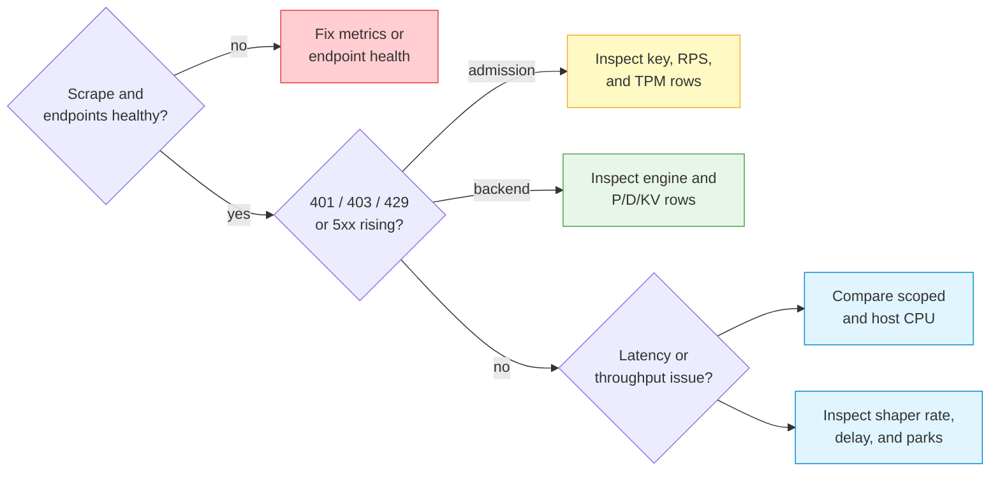

# Grafana Dashboards and Observability

The bundled LoxiLB AI dashboard combines request health, P/D routing,
KV-cache behavior, token quotas, and fullproxy shaping. This page explains how
to read the panels without mixing scopes or units.

## Prerequisites

- Enable Gateway metrics and confirm the raw endpoint returns Prometheus text.
- Scrape at about 10 seconds, matching the Gateway's periodic snapshot cycle.
- Provision the public dashboard from
  `deploy/monitoring/grafana/dashboards/loxilb-ai.json`.
- Restrict Grafana and Prometheus to authorized operators and use TLS across
  untrusted networks.

See [Monitoring and Metrics](monitoring.md) for endpoint and network-security
setup.

## Dashboard reading order



Start with availability and status classes. A latency panel alone cannot tell
whether a request was denied before dispatch, failed at a backend, or was
deliberately paced.

## Dashboard variables

The AI dashboard filters by Prometheus data source, Gateway instance, model,
and tenant. Apply the narrowest useful filter before investigating a tenant or
model.

Do not place credentials, prompts, personal information, or customer secrets
in model and tenant identifiers. These values become metric labels and can be
stored by Prometheus for the retention period.

## Token quota row

The dashboard includes a token-quota row with:

- consumption rate by `kind` and model;
- aggregate and model utilization;
- quota denials;
- estimated tokens and responses missing usage;
- remaining aggregate headroom;
- cold-open events after node startup.

### Correct PromQL patterns

```promql
# Charged tokens by kind
sum by (kind) (
  rate(loxilb_ai_tokens_consumed_total{
    model=~"$model", tenant=~"$tenant", instance=~"$instance"
  }[$__rate_interval])
)

# Aggregate tenant utilization: fraction, not percent
loxilb_ai_token_quota_utilization{
  tenant=~"$tenant", instance=~"$instance"
}

# Model utilization must keep the model label
loxilb_ai_token_quota_model_utilization{
  tenant=~"$tenant", model=~"$model", instance=~"$instance"
}

# Remaining aggregate tokens
loxilb_ai_token_quota_limit_tokens{
  tenant=~"$tenant", instance=~"$instance"
}
* (1 - loxilb_ai_token_quota_utilization{
  tenant=~"$tenant", instance=~"$instance"
})
```

Do not sum aggregate and model utilization. Each is a separate gate over the
same request. A value of `1` means 100 percent utilized; utilization can exceed
`1` during post-response debt.

An increase in `loxilb_ai_tokens_estimated_total` or
`loxilb_ai_tokens_missing_total` means the estimate path is accounting for
responses without readable usage. Enforcement remains active, but operators
should check engine response compatibility.

## L7 byte-shaper row

The dashboard includes per-VIP, port, and direction panels for:

- payload throughput;
- configured committed information rate (CIR);
- delayed-byte ratio;
- park rate and mean park duration;
- currently parked connections;
- bucket tokens and committed burst size (CBS).

### Unit-safe PromQL

```promql
# Payload throughput, bytes per second
sum by (vip, port, direction) (
  rate(loxilb_proxy_qos_bytes_passed_total{
    instance=~"$instance"
  }[$__rate_interval])
)

# Configured CIR, already bytes per second
max by (vip, port, direction) (
  loxilb_proxy_qos_cir_bytes_per_second{instance=~"$instance"}
)

# Delayed payload fraction
sum by (vip, port, direction) (
  rate(loxilb_proxy_qos_bytes_delayed_total{
    instance=~"$instance"
  }[$__rate_interval])
)
/
clamp_min(
  sum by (vip, port, direction) (
    rate(loxilb_proxy_qos_bytes_passed_total{
      instance=~"$instance"
    }[$__rate_interval])
  ), 1
)

# Mean resumed park duration in seconds
sum by (vip, port, direction) (
  rate(loxilb_proxy_qos_park_seconds_total{
    instance=~"$instance"
  }[$__rate_interval])
)
/
clamp_min(
  sum by (vip, port, direction) (
    rate(loxilb_proxy_qos_parks_total{
      instance=~"$instance"
    }[$__rate_interval])
  ), 0.001
)
```

The policy API uses Mbps. The shaper dashboard uses bytes/s. If a panel
converts to bits/s, multiply by eight and label it explicitly. Plaintext
fullproxy payload metrics are not equivalent to Tier-0 L3 wire-byte counters.

Series disappear after a fullproxy policy is detached. A no-data result can
therefore mean “no shaped service,” not a scrape failure; check `up` and other
Gateway metrics before alerting.

## Relay cache and backpressure row

Add three panels: aggregate cached bytes, maximum bytes on one connection, and
queued connections. Overlay the backpressure ratio and high-water activation
rate on a separate panel.

```promql
# Aggregate and worst-connection relay cache
loxilb_proxy_cache_bytes{instance=~"$instance"}
loxilb_proxy_cache_bytes_max_conn{instance=~"$instance"}

# Mean cached bytes per queued connection
loxilb_proxy_cache_bytes{instance=~"$instance"}
/
clamp_min(
  loxilb_proxy_cache_conns_queued{instance=~"$instance"}, 1
)

# New per-connection high-water activations
rate(loxilb_proxy_cache_high_water_events_total{
  instance=~"$instance"
}[$__rate_interval])
```

Use byte units, not a generic “memory percent.” The normal per-connection
watermark is 12 MiB and the chunked watermark is 768 KiB. Aggregate bytes are
not capped at one watermark, so alerting solely on `cache_bytes` without
traffic/concurrency context creates false conclusions.

## Backup and restore row

Show restore outcomes by `mode` and `result`, restore duration, last successful
restore time, and boot conflicts:

```promql
sum by (mode, result) (
  rate(loxilb_restore_total{instance=~"$instance"}[$__rate_interval])
)

histogram_quantile(0.95,
  sum by (le) (
    rate(loxilb_restore_duration_seconds_bucket{
      instance=~"$instance"
    }[$__rate_interval])
  )
)

time() - loxilb_last_restore_timestamp_seconds{instance=~"$instance"}

increase(loxilb_boot_config_conflict_total{
  instance=~"$instance"
}[1h])
```

The age panel can be absent before the first successful commit/boot restore;
represent that as “no successful restore recorded,” not zero seconds. A new
`result="ROLLBACK-FAILED"` requires immediate node isolation and recovery.

## CPU panels

Display both CPU gauges on the same time range:

```promql
loxilb_system_cpu_utilization_percent{instance=~"$instance"}
loxilb_host_cpu_utilization_percent{instance=~"$instance"}
```

The system gauge is cgroup/container usage relative to its CPU allowance when
readable. It includes all processes in that cgroup. The host gauge is always
the whole machine. On bare metal—or when container cgroup accounting cannot be
read—the values are equal.

Label the first panel “Gateway cgroup/container CPU (host on fallback),” not
“LoxiLB process CPU.”

## Engine diagnostics

Use engine identity and dialect counters as drill-down signals:

`loxilb_ai_engine_info` is currently emitted only by the llama.cpp admission
probe. vLLM, SGLang, and TensorRT-LLM rules produce no series, so absence is
not an engine-health verdict.

```promql
loxilb_ai_engine_info{instance=~"$instance"}

sum by (kind) (
  rate(loxilb_ai_llamacpp_probe_warnings_total{
    instance=~"$instance"
  }[5m])
)

rate(loxilb_pd_sg_prefill_abort_decode_total{instance=~"$instance"}[5m])
rate(loxilb_pd_sg_room_retry_total{instance=~"$instance"}[5m])
rate(loxilb_pd_sg_oversize_reject_total{instance=~"$instance"}[5m])
rate(loxilb_pd_trt_ctx_early_exit_total{instance=~"$instance"}[5m])
rate(loxilb_pd_cb_flips_total{instance=~"$instance"}[5m])
rate(loxilb_pd_cb_proactive_heal_total{instance=~"$instance"}[5m])
rate(loxilb_pd_connect_failover_total{instance=~"$instance"}[5m])
```

- llama.cpp warning `kind` identifies model/build/slot inconsistency, sleeping
  endpoints, or unanswered probes.
- SGLang abort/retry counters describe concurrent dual-dispatch recovery.
- SGLang oversize rejects are fail-closed before engine contact.
- TensorRT-LLM context early exit is a successful one-stage completion, not an
  error.
- Circuit-breaker flips include every direction; compare them with proactive
  heal, endpoint-death, status-code, and connect-failover rates before deciding
  whether recovery succeeded.
- Connect failover counts a successful retry after a prefill TCP-connect
  failure. It does not by itself prove origin HTTP `5xx` demotion or end-to-end
  request success.

Always compare a counter rate with request volume. A large cumulative counter
can represent an old incident, while a current `rate()` of zero shows no new
events.

## KV Tier-1.5 panels

Use the exact current `tier15` metric names and verify them against a live
scrape before creating an alert:

```promql
sum(rate(loxilb_pd_kv_tier15_hits_total[5m]))
sum(rate(loxilb_pd_kv_tier15_fallthrough_total[5m]))
sum by (reason) (rate(loxilb_pd_kv_tier15_miss_reason_total[5m]))
sum(rate(loxilb_pd_kv_tier15_spills_total[5m]))
```

A no-data panel is not evidence of a zero rate. Confirm the exact metric exists
and that traffic has exercised the configured KV path.

## Peer synchronization row

For an HA deployment, add loss, rejection, and peer-latency panels. These are
more useful than a binary “HA healthy” panel because xSync is a bounded,
best-effort peer path:

```promql
# Events or batches lost at a bounded queue
sum by (kind) (
  rate(loxilb_sockproxy_sync_overflow_total{
    instance=~"$instance"
  }[$__rate_interval])
)

# Retry-exhausted batch loss
sum by (reason) (
  rate(loxilb_sockproxy_sync_drop_total{
    instance=~"$instance"
  }[$__rate_interval])
)

# 95th percentile peer RPC latency
histogram_quantile(0.95,
  sum by (le, peer, rpc) (
    rate(loxilb_sockproxy_sync_push_latency_seconds_bucket{
      instance=~"$instance"
    }[$__rate_interval])
  )
)
```

Also display `loxilb_sockproxy_sync_apply_errors_total`,
`loxilb_sockproxy_sync_health_reject_total{reason}`, and
`loxilb_sockproxy_sync_inflight_rpc{peer}`. A no-data or zero result is not
proof that a peer is connected. Confirm the peer path with a controlled state
change, and review the reconciliation and transport limits in
[HA and Upgrade Limitations](ha-limitations.md).

## Alert design

Use a traffic guard for ratios so idle `0/0` periods do not page operators.
Separate alerts by action:

| Signal | Suggested action class |
|---|---|
| `up == 0` or `/metrics` `503` | Restore scrape or enable metrics |
| No healthy endpoints with LB rules present | Restore backend availability |
| `401`/`403` increase | Investigate credentials or model authorization |
| `429` increase | Identify key RPS, tenant RPS, aggregate TPM, or model TPM gate |
| Estimated/missing token accounting | Check engine usage compatibility |
| Quota cold-open increase | Restrict traffic and investigate peer-state warmup |
| Shaper delayed ratio/parks increase | Confirm intended CIR and capacity |
| Relay cache bytes and queued connections rise | Investigate slow backends, concurrency, socket flow control, and process memory |
| Restore rollback failure | Isolate the node and use the reviewed backup/restore procedure |
| xSync overflow/drop/apply error | Restrict promotion and verify peer state before serving |
| Boot conflict increase | Remove stale legacy configuration after validating the selected source |
| Scoped CPU high, host CPU lower | Review container limit and Gateway load |
| Host CPU high, scoped CPU lower | Review unrelated host workload |

Reference thresholds must be tuned with a measured baseline. The dashboard and
green CI do not establish production performance or HA readiness.

## Validate a dashboard change

1. Confirm the metric and label set in a raw scrape.
2. Run the PromQL in Prometheus before adding it to Grafana.
3. Generate one known request or policy event.
4. Check the panel's unit, legend, aggregation, and no-data behavior.
5. Verify filters do not merge aggregate and per-model quota scope.
6. Test light and dark themes and a narrow viewport.
7. Redact screenshots before sharing them.

## Troubleshooting

| Symptom | Likely cause | Correction |
|---|---|---|
| Token row is empty | No tenant quota state or no exercised traffic | Confirm limits, send one safe request, and inspect raw metrics |
| Remaining headroom is negative | Utilization exceeds one in debt | Expected temporarily; inspect denial and refill behavior |
| Shaper row is empty | No active fullproxy shaper or policy detached | Verify policy and raw `loxilb_proxy_qos_*` series |
| Shaper panel is off by 8 | Bits and bytes mixed | Use metric bytes/s or convert and relabel |
| Engine counter looks alarming | Cumulative value shown without rate | Use `rate()` or `increase()` over the incident window |
| CPU panels match in a container | Cgroup read fallback | Verify CPU accounting source and mounts |
| A filter hides model quota | Model label was dropped during aggregation | Keep `tenant,model` in model-quota grouping |

## Related pages

- [Monitoring and Metrics](monitoring.md)
- [Configuration Backup and Restore](backup-restore.md)
- [DPU Offload Observability](dpu-offload.md)
- [AI Traffic Governance](../ai-gateway/ai-traffic-governance.md)
- [AI Quotas and QoS](ai-qos.md)
- [HA and Upgrade Limitations](ha-limitations.md)
