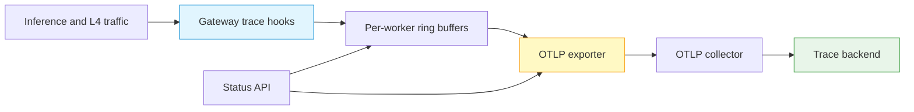

# Application and L4 Tracing

The Gateway can export HTTP/HTTPS protocol events and sampled TCP/SCTP
connection events to an OpenTelemetry Protocol (OTLP) collector. Use tracing
for bounded troubleshooting windows: it adds processing and storage load, and
trace attributes can expose workload metadata.

## Trace data flow



HTTP and L4 tracing share the exporter, but they have separate enable and
status controls. Enabling one trace family does not prove that the exporter has
connected. Confirm `otlp_connected` after trace traffic is produced.

## Before you enable tracing

1. Use a Gateway build that includes HTTP and L4 tracing. Build profiles differ:
   the Ubuntu 24.04 image build enables both hooks, while the default Ubuntu
   22.04 Dockerfile does not pass the trace build options. Verify the exact
   immutable image rather than inferring capability from an API declaration.
2. Provide a reachable OTLP collector and a certificate chain trusted by the
   Gateway.
3. Restrict the management and collector listeners with network policy.
4. Set retention and access controls in the trace backend before collecting
   production traffic.
5. Start with a low L4 sampling rate and a short observation window.

!!! warning "Trace data is sensitive operational data"
    Traces can identify services, models, endpoints, request paths, connection
    peers, and protocol-derived attributes. Do not place credentials, prompts,
    personal data, or customer content in trace labels. Grant trace-backend
    access separately from ordinary metrics access.

## Configure the OTLP exporter

Keep management credentials in an owner-readable header file:

--8<-- "snippets/common/control-api-header.md"

Configure an OTLP/gRPC collector with certificate verification enabled:

```bash
curl --fail-with-body --silent --show-error \
  --request POST \
  --header @control-plane.headers \
  --header 'Content-Type: application/json' \
  --data '{
    "endpoint": "otel-collector.example.com:4317",
    "protocol": "grpc",
    "use_tls": true,
    "tls_skip_verify": false
  }' \
  "$CONTROL_API/config/trace/otlp"
```

Supported protocols are `grpc` and `http`. TLS is enabled and certificate
verification is required by default. Do not set `tls_skip_verify: true` in
production.

The endpoint can also be initialized with these environment variables:

| Variable | Purpose | Built-in default |
|---|---|---|
| `LOXILB_OTLP_ENDPOINT` | Collector in `host:port` form | `localhost:4317` |
| `LOXILB_OTLP_PROTOCOL` | `grpc` or `http` | `grpc` |
| `LOXILB_OTLP_TLS_ENABLED` | Enable transport TLS | `true` |
| `LOXILB_OTLP_TLS_SKIP_VERIFY` | Skip certificate verification | `false` |

Runtime API configuration supports optional authentication headers. Avoid
putting a real token directly in shell history; create the JSON request in an
owner-readable secret workflow. `GET /config/trace/otlp` redacts header values,
but the Gateway keeps them in process memory. Treat runtime configuration as
ephemeral and reapply it after restart unless your deployment supplies the
environment values.

## Enable HTTP/HTTPS tracing

```bash
curl --fail-with-body --silent --show-error \
  --request POST \
  --header @control-plane.headers \
  "$CONTROL_API/config/trace/enable"

curl --fail-with-body --silent --show-error \
  --header @control-plane.headers \
  "$CONTROL_API/config/trace/status" | jq .
```

The HTTP trace status schema includes `enabled`, `total_events`,
`dropped_events`, per-worker `ring_utilization`, OTLP settings, and
`otlp_connected`. In the current HTTP handler, the event counters and ring
values are zero placeholders rather than live telemetry. A true `enabled`
value means trace hooks are active; use `otlp_connected` together with receipt
at the collector/backend to prove export.

## Enable sampled L4 tracing

Start with a low percentage and raise it only when the trace pipeline has
headroom:

```bash
curl --fail-with-body --silent --show-error \
  --request POST \
  --header @control-plane.headers \
  --header 'Content-Type: application/json' \
  --data '{"sampling_rate": 5}' \
  "$CONTROL_API/config/l4trace/enable"

curl --fail-with-body --silent --show-error \
  --header @control-plane.headers \
  "$CONTROL_API/config/l4trace/status" | jq .
```

The sampling rate is an integer from `0` through `100`; omitted enable payloads
default to `100`. Update it without disabling tracing:

```bash
curl --fail-with-body --silent --show-error \
  --request PUT \
  --header @control-plane.headers \
  --header 'Content-Type: application/json' \
  --data '{"sampling_rate": 10}' \
  "$CONTROL_API/config/l4trace/sampling"
```

Watch lifecycle counters and dropped events. Increasing sampling while rings or
the collector are already saturated reduces evidence quality.

## Verify export

1. Generate one non-sensitive test request or connection.
2. Confirm `otlp_connected` becomes true after a successful export.
3. Query the collector/backend using a test trace attribute that contains no
   customer data.
4. Record Gateway image identity, sampling rate, collector identity, and the
   test time without recording tokens or payloads.

If `otlp_connected` remains false, check DNS, route, protocol, TLS trust,
collector authentication, and collector logs. Do not use the HTTP trace
counter or ring fields for alerting until live accounting is implemented and
qualified.

## Disable and reset

```bash
curl --fail-with-body --silent --show-error \
  --request POST --header @control-plane.headers \
  "$CONTROL_API/config/l4trace/disable"

curl --fail-with-body --silent --show-error \
  --request POST --header @control-plane.headers \
  "$CONTROL_API/config/trace/disable"
```

Reset L4 counters only after retaining the required evidence:

```bash
curl --fail-with-body --silent --show-error \
  --request POST --header @control-plane.headers \
  "$CONTROL_API/config/l4trace/stats/reset"
```

## API availability boundary

`GET /config/trace/catalogs` is declared in the OpenAPI document but is marked
not implemented and currently returns `501`. Do not build automation against
it. Parser discovery and parser-to-catalog mapping have separate endpoints,
but qualify them with the exact release before operational use.

Tracing hooks and API handlers prove implementation, not production sizing.
Validate overhead, data exposure, collector failure behavior, and retention
with your immutable image and representative traffic before continuous use.

## See also

- [Monitoring and Metrics](monitoring.md)
- [Troubleshooting](troubleshooting.md)
- [Management API Authentication](../security/management-api-authentication.md)
