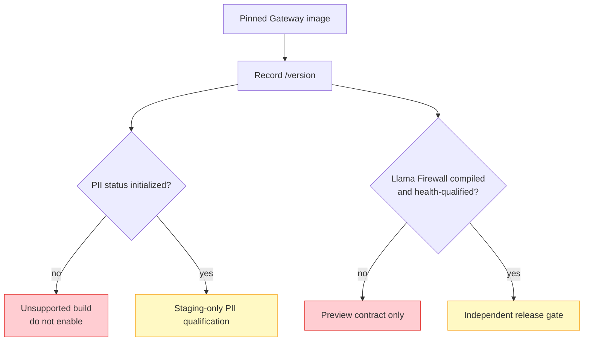

# AI Safety Scanning

--8<-- "snippets/common/mutation-fragment-notice.md"

The Gateway source tree contains two optional AI-safety integrations:
Microsoft Presidio-based personally identifiable information (PII) scanning
and Llama Firewall scanning. Their REST paths appear in OpenAPI regardless of
the selected build tags, so an endpoint declaration alone is not evidence that
the running image can enforce either control.

## Current capability boundary

| Control | Standard release Dockerfiles | Current operational status |
|---|---|---|
| Presidio PII scanning | Not compiled; requires the `piidetection` build tag through `HAVE_PII_DETECTION=1` | Optional source-build feature; request-direction qualification required |
| Llama Firewall | Not compiled; release Dockerfiles and Makefile provide no release build profile for the `llamafirewall` tag | Preview source integration; do not use as a production enforcement dependency |



This page describes the current feature-branch implementation. It is not a
release-qualification statement.

## Verify the running build first

Use the protected management listener and an owner-readable header file:

```bash
export CONTROL_API="https://gateway.example.com/netlox/v1"
install -m 600 /dev/null ./control-plane.headers
printf 'Authorization: Bearer %s\n' "$CONTROL_PLANE_TOKEN" > ./control-plane.headers

curl --fail-with-body --silent --show-error \
  --header @control-plane.headers \
  "$CONTROL_API/version" | jq .
```

Probe PII status:

```bash
curl --silent --show-error \
  --header @control-plane.headers \
  "$CONTROL_API/config/pii/status" | jq .
```

The normal non-PII build reports `PII detection not initialized`. Stop there;
the presence of `/config/pii/*` paths is generated API surface, not an active
scanner.

Probe Llama Firewall status and health only as a build check:

```bash
curl --silent --show-error \
  --header @control-plane.headers \
  "$CONTROL_API/config/llamafirewall/status" | jq .

curl --silent --show-error --request POST \
  --header @control-plane.headers \
  "$CONTROL_API/config/llamafirewall/health" | jq .
```

The standard build returns disabled/stub state and a not-compiled health error.
Do not interpret zero statistics as successful scanning.

## Presidio PII scanning behavior

When compiled, the PII path sends eligible HTTP request bodies to an external
Presidio analyzer. `detect` leaves the body unchanged; every other accepted
mode currently uses the same replacement operation and value, `***PII***`.
`mask`, `redact`, and `anonymize` are therefore not distinct data-path
transformations in the current implementation. Scanning is disabled by
default.

Important current limits:

- only the request direction has a data-path scanning hook;
- the API schema still lists `request`, `response`, and `both`, and the current
  configuration handler can store all three values; `response` and `both` do
  not add response scanning, so set `direction: request` explicitly;
- scanner errors currently forward the original request at the active HTTP
  caller for both declared fail modes; `fail_mode: closed` is stored and passed
  into the scanner wrapper, but is not wired to an HTTP block response and must
  not be treated as a working enforcement control;
- the compiled default uses truncation with a 65,536-byte maximum, but the
  current REST configuration handler does not apply the declared `scan_mode`
  or v2-specific fields; do not treat those OpenAPI fields as runtime controls;
- body-size settings determine how much content can be inspected;
- URL include/exclude patterns can create coverage gaps;
- `GET /config/pii/stats` currently returns placeholder zero values rather
  than aggregated data-path statistics.

!!! danger "Do not claim prevention from configuration alone"
    A `200` configuration response or `enabled: true` status does not prove
    that representative requests were scanned, transformed, or blocked. Test
    the exact content types, body sizes, transfer modes, paths, and failure
    modes used by your workload.

## Safe PII staging sequence

Use synthetic values that resemble PII but do not belong to a real person.

1. Build and sign an immutable image with `HAVE_PII_DETECTION=1`; record its
   source and dependency bill of materials.
2. Deploy Presidio on a restricted service network and protect the analyzer
   from direct tenant access. The current Gateway configuration exposes only a
   `host:port` analyzer address and no analyzer TLS or authentication settings;
   use a same-host or otherwise isolated trusted path until that boundary is
   strengthened and independently qualified.
3. Configure `direction: request`, a reviewed mode, body limits, timeout, URL
   patterns, and an explicit fail policy. Verify read-back and do not rely on
   fields the current handler does not apply.
4. Start with `detect` in a non-production environment. If transformation is
   required for qualification, test the current common `***PII***` replacement
   separately; do not infer mode-specific masking or redaction semantics.
5. Test a clean request, a synthetic match, an oversized body, scanner timeout,
   scanner outage, chunked transfer, and each included/excluded URL.
6. Confirm the backend receives the expected body and the client receives the
   expected status for every case.
7. Disable the scanner and remove synthetic evidence after the test.

An example request-only configuration for staging is:

```bash
curl --fail-with-body --silent --show-error \
  --request POST \
  --header @control-plane.headers \
  --header 'Content-Type: application/json' \
  --data '{
    "mode": "detect",
    "direction": "request",
    "fail_mode": "open",
    "analyzer_url": "presidio-analyzer.example.com:50051",
    "score_threshold": 0.7,
    "timeout_ms": 100,
    "max_body_size": 65536,
    "min_body_size": 100
  }' \
  "$CONTROL_API/config/pii/configure"

curl --fail-with-body --silent --show-error \
  --request POST \
  --header @control-plane.headers \
  --header 'Content-Type: application/json' \
  --data '{"enabled": true}' \
  "$CONTROL_API/config/pii/enable"
```

Values above illustrate the API, not universal security defaults. The current
HTTP hook forwards on scanner errors even when `fail_mode: closed` is selected.
Until a block response is wired and release-qualified, use an independent
enforcement layer when policy requires requests to stop on scanner failure.

## Llama Firewall preview boundary

The source integration defines configuration, scanner selection, status,
statistics, and health endpoints. The standard build uses a stub:

- enable and configuration attempts report that Llama Firewall is not compiled;
- status remains disabled and disconnected;
- health reports unhealthy/not compiled;
- statistics are zero-valued stub data.

The release build currently has no supported packaging path for the required
build tag and runtime dependencies. Therefore this documentation does not
provide a production enablement recipe. A future release must first define the
supported image, dependency provenance, server authentication and TLS, request
and response coverage, timeout/circuit behavior, metrics, resource sizing, and
failure-mode tests.

## Security checklist

- Authenticate every management API that changes scanner behavior.
- Never log or export full prompts, matches, replacement keys, or scanner
  credentials.
- Restrict scanner egress destinations and prevent tenants from choosing them.
- Use synthetic PII in tests and sanitize HTTP bodies from evidence.
- Alert on scanner errors and treat each as a possible inspection bypass; the
  current HTTP hook has no supported fail-closed block behavior.
- Revalidate after every Gateway, scanner, model, parser, or policy change.
- Keep a tested disable/rollback procedure; safety middleware can affect all
  inference traffic.

## See also

- [Management API Authentication](management-api-authentication.md)
- [Monitoring and Metrics](../operations/monitoring.md)
- [Audit Log](../operations/audit-log.md)
