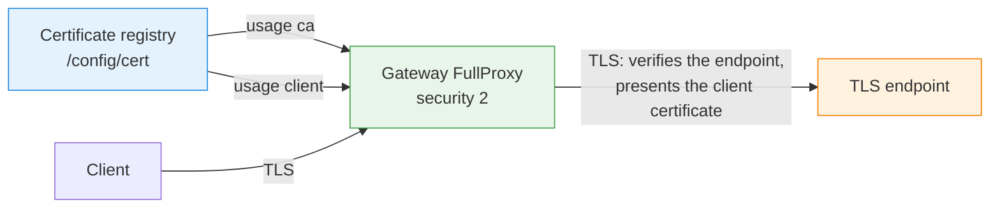

# Backend TLS Verification and Client Certificates

--8<-- "snippets/common/mutation-fragment-notice.md"

A FullProxy service with `security: 2` (`e2ehttps`) terminates the client's TLS connection and
opens a separate TLS connection to each endpoint. This page describes how a rule makes the gateway
verify the endpoints it connects to, and how it makes the gateway present a client certificate to
endpoints that require one.

!!! warning "The default backend leg is not authenticated"
    Without the arguments on this page, the backend leg of an `e2ehttps` rule is encrypted but
    the gateway accepts any certificate an endpoint presents, and presents none itself. Name a CA
    on every production rule.

Both features need `mode: 4`, `security: 2`, and a gateway built with client-certificate support.
Check the build before offering the arguments:

```bash
curl -s http://192.0.2.254:11111/netlox/v1/status/capabilities | jq '.capabilities[] | select(.name == "backend_tls_verify")'
```

When `ready` is false, its `reason_code` is `BACKEND_TLS_NOT_BUILT`, and a rule that asks for
verification, a certificate ID, or a server name is refused with `412`.

## How it fits together



Certificates are uploaded to the certificate registry once and a rule refers to them by ID. A rule
never carries a file path or PEM data.

## 1. Register the material

| `usage` | What it holds | Request body |
|---|---|---|
| `ca` | The CA bundle that endpoint certificates must chain to | `certPem` with one or more CA certificates. `keyPem` is sent as the empty string. |
| `client` | The certificate and key the gateway presents to endpoints | `certPem`, `keyPem`, optional `chainPem`. The pair must match. |
| `server` (default) | A listener certificate, selected by SNI | Not used for the backend leg. |

=== "curl"
    ```bash
    curl -s -X POST http://192.0.2.254:11111/netlox/v1/config/cert \
      -H 'Content-Type: application/json' \
      -d '{
        "certId": "backend-ca",
        "usage": "ca",
        "certPem": "<PEM text of the CA bundle>",
        "keyPem": ""
      }'

    curl -s -X POST http://192.0.2.254:11111/netlox/v1/config/cert \
      -H 'Content-Type: application/json' \
      -d '{
        "certId": "backend-client",
        "usage": "client",
        "certPem": "<PEM text of the client certificate>",
        "keyPem": "<PEM text of its private key>"
      }'
    ```

=== "loxicmd"
    ```bash
    # CLI availability: main-only
    loxicmd create cert --usage=ca --cert-id=backend-ca --cert-file=./backend-ca.pem
    loxicmd create cert --usage=client --cert-id=backend-client --cert-file=./gateway-client.pem --key-file=./gateway-client.key
    ```

- The usage of an ID is fixed when the entry is created. `PUT /config/cert/{certId}` rotates the
  material and cannot change the usage.
- `GET` returns the usage and never returns a private key.
- Only `server` entries are offered to clients. A `ca` or `client` entry is never used as a
  listener certificate.
- An entry that a rule refers to cannot be deleted: the request is refused with `400` and names
  the rule. Remove the ID from the rule first.
- A CA entry with a key, and a client entry without one, are refused.
- `certPem` and `keyPem` are JSON strings: newlines in the PEM text are written as `\n`. Build the
  body with a JSON tool rather than by hand, and do not leave a private key in shell history.

## 2. Refer to it from the rule

| Rule argument | Meaning |
|---|---|
| `mtls_backend.verify_server_cert` | `true` verifies the certificate of every endpoint. Requires `backend_ca_cert_id`. |
| `backend_ca_cert_id` | A registry entry with usage `ca`. There is no default trust store. |
| `backend_client_cert_id` | A registry entry with usage `client`. Without it the gateway presents no certificate. |
| `backend_tls_server_name` | A DNS host name sent as SNI to every endpoint and, when verification is on, required among the DNS names of the endpoint's certificate. |

=== "curl"
    ```bash
    curl -s -X POST http://192.0.2.254:11111/netlox/v1/config/loadbalancer \
      -H 'Content-Type: application/json' \
      -d '{
        "serviceArguments": {
          "externalIP": "192.0.2.10",
          "port": 443,
          "protocol": "tcp",
          "mode": 4,
          "security": 2,
          "host": "192.0.2.10",
          "mtls_backend": {"verify_server_cert": true},
          "backend_ca_cert_id": "backend-ca",
          "backend_client_cert_id": "backend-client"
        },
        "endpoints": [
          {"endpointIP": "198.51.100.11", "targetPort": 8443, "weight": 1},
          {"endpointIP": "198.51.100.12", "targetPort": 8443, "weight": 1}
        ]
      }'
    ```

=== "loxicmd"
    ```bash
    # CLI availability: main-only
    loxicmd create lb 192.0.2.10 --tcp=443:8443 --endpoints=198.51.100.11:1,198.51.100.12:1 --mode=fullproxy --security=e2ehttps --host=192.0.2.10 --backend-ca-cert-id=backend-ca --backend-client-cert-id=backend-client
    ```

With `loxicmd`, naming a CA is what asks for verification: `--backend-ca-cert-id` sends
`mtls_backend.verify_server_cert: true` together with the ID.

The request is refused with `400`, naming the argument, before anything is changed, when:

- verification is requested without `backend_ca_cert_id`, or a CA ID is sent without verification;
- an ID has nothing registered under it, or names an entry of the wrong usage;
- the server name is an address or is not a DNS host name;
- the rule's address, port and protocol already carry a rule with a different `security` mode or
  a different backend TLS policy. The answer names the rule that is already there and the
  arguments that differ.

### Rules that share a listener

Rules that differ only in host, path or model share one listener, and a listener has one security
mode and one backend TLS policy. Every rule on it must ask for the same. To change the policy of a
listener that carries several rules, delete all but one, change that one, and create the others
again with the new policy.

## 3. What a verified endpoint must present

A chain that ends in the rule's CA is not enough. The certificate must also name the endpoint the
gateway dialled:

- with `backend_tls_server_name`: the name must be a DNS subject alternative name of the
  certificate. A name that appears only in the certificate subject is not accepted.
- without it: the endpoint's IP address must be an IP subject alternative name. No SNI is sent.

The name is never taken from the VIP or from a request's `Host` header. The gateway does not
connect to an endpoint that fails the check; the request fails as it does for an endpoint that is
down.

## 4. Read what is installed

`GET` of a rule returns two different things. Only one of them describes the data plane:

- `mtls_backend.verify_server_cert`, `backend_ca_cert_id`, `backend_client_cert_id` and
  `backend_tls_server_name` are what the rule asks for.
- `backend_tls_effective` is what the listener has installed. It is read from the data plane on
  every `GET`, is present on `mode: 4` rules with `security: 2`, and is ignored on input.

=== "curl"
    ```bash
    curl -s http://192.0.2.254:11111/netlox/v1/config/loadbalancer/all |
      jq '.lbAttr[].serviceArguments | {externalIP, port, backend_tls_effective}'
    ```

=== "loxicmd"
    ```bash
    # CLI availability: main-only
    loxicmd get lb -o wide
    ```

```json
{
  "status": "applied",
  "verify": true,
  "ca": "backend-ca",
  "client_cert": true,
  "client_cert_id": "backend-client",
  "generation": 2
}
```

| `status` | Meaning |
|---|---|
| `applied` | The listener runs what the rule asks for. |
| `pending` | The rule has no listener in the data plane yet. Nothing is installed. |
| `failed` | The listener runs something other than what the rule asks for; the other members say what. A rule whose listener could not load a rotated certificate reads this way. |
| `unsupported` | The gateway was built without client-certificate support. The leg is TLS without verification or a client certificate. |

Every member except `status` describes the installed policy. `ca` is a certificate ID or `none`.
`generation` counts the in-place replacements of the listener's backend TLS context since the
listener was created. In `loxicmd get lb -o wide` the same state is the `Backend TLS` column, for
example `applied: verify, client, name`; the certificate IDs are in `-o json`.

The object says which policy new backend connections are made under. It does not say that any
particular connection was verified: prove that with a request, as in the next section.

## 5. Verify enforcement

Read-back confirms the control plane only. Prove the behavior on staging with endpoints you
control:

| Test | Expected result |
|---|---|
| Endpoints present certificates signed by the rule's CA and naming their address (or the configured server name) | Requests are served. |
| One endpoint presents a certificate from another CA, an expired certificate, or one that does not name the endpoint | The gateway does not connect to that endpoint. With no acceptable endpoint left, HTTP/1.1 clients receive `502` and HTTP/2 clients receive `503`. |
| Endpoints require a client certificate and the rule names one signed by the CA they trust | Requests are served. |
| Endpoints require a client certificate and the rule names none, or names one they do not accept | The same answer: HTTP/1.1 clients receive `502` and HTTP/2 clients receive `503`, both with the body `backend_unreachable`. An endpoint that uses TLS 1.3 turns the gateway away only after the handshake has completed; the data plane log then names it: `ssl-read <address>:<port>(failed after handshake, before any response)`, followed by the TLS alert when the endpoint sent one. An endpoint that closes with a reset can be met earlier, on the write of the request or before it; the line then starts with `ssl-write` or `ssl-setup` and carries no alert. An HTTP/1.1 client gets the same answer in all three. |

The answer the gateway writes is a complete response: the HTTP/1.1 `502` carries `Content-Length`
and `Connection: close`, and a TLS client is sent a close_notify before the connection is closed.

Keep a receipt counter on each test endpoint and require that a refused request does not increase
it. A timeout is not evidence of a refusal.

## 6. Change the policy of a serving rule

Post the rule again with the changed arguments. The gateway builds the new backend TLS context
first and puts it in service only when that succeeds. The listener is not re-created.

- Backend connections already established keep the context they were made with. A request or an
  HTTP/2 stream in flight finishes on its connection.
- No new work starts on a backend connection made under the replaced policy. On a rule that
  inspects requests (AI gateway routing), the next keep-alive request gets a new backend
  connection. A new HTTP/2 stream is never added to a backend connection made under the replaced
  policy.
- An HTTP/1.1 client connection on a rule that relays bytes without inspecting requests keeps the
  backend connection it has, so the gateway ends the client connection instead. It does so within
  about a second when every request the client sent has been answered: an idle keep-alive
  connection is closed, the client connects again, and the new connection is made under the new
  policy. A request in flight is answered first. A connection that still has an answer owed 30
  seconds after the change is closed then. Each such close is one line in the data plane log:
  `<address>:<port> backend TLS policy replaced: closing client fd=<n>, its backend connection
  was made under an earlier policy`, followed by `(no answer owed)` or `(an answer still owed
  after the bound)`.
- HTTP/2 client connections and rules that inspect requests are not closed: they move the next
  stream or request to a new backend connection, as above.

A client that sends a request at the moment its idle connection is closed sees that request
fail, as it does when any server closes an idle keep-alive connection; HTTP clients retry it on
a new connection.

The request waits for the data plane. When the new context cannot be built, the answer is `400`,
the rule keeps the policy it had, and the listener goes on serving with it. A new rule that the
data plane cannot install is also answered with `400` and is not kept.

`PATCH` cannot set a backend TLS argument.

## 7. Rotate a certificate

`PUT /config/cert/{certId}` replaces the material under the same ID. For a `ca` or `client` entry
the gateway then updates every rule that refers to the ID and waits for the data plane: each
listener builds a new backend TLS context from the new material and puts it in service as in
the previous section.

```bash
curl -s -X PUT http://192.0.2.254:11111/netlox/v1/config/cert/backend-ca \
  -H 'Content-Type: application/json' \
  -d '{
    "certId": "backend-ca",
    "usage": "ca",
    "certPem": "<PEM text of the new CA bundle>",
    "keyPem": ""
  }'
```

When a listener cannot load the new material, the answer is `400` and names the rules concerned.
The material is stored all the same, and those rules read `failed` in `backend_tls_effective` and
keep the context they had until the certificate is written again.

## 8. Upgrading from an earlier release

Earlier releases accepted backend TLS arguments that had no effect on traffic. They are now either
honoured or refused:

| Argument | Earlier releases | Now |
|---|---|---|
| `mtls_backend.backend_ca_path`, `client_cert_path`, `client_key_path`, `client_cert_data`, `client_key_data` | Accepted and stored | Refused with `400`; never returned on any read and never persisted |
| `mtls_backend.verify_server_cert: true` | Accepted, without effect | Honoured; needs `backend_ca_cert_id` |
| `backend_ca_cert_id`, `backend_client_cert_id` | Accepted, without effect | Honoured; each must name a registry entry of the right usage |
| `loxicmd create lb --mtls-backend-ca-path`, `--mtls-backend-cert-path`, `--mtls-backend-key-path`, `--mtls-backend-verify-server` | Sent the arguments above | Refused by the CLI, which names the replacement |

One thing changes for traffic. A backend that **requires** a client certificate used to be handed
the listener's default certificate. It no longer is: the gateway presents a client certificate
only when the rule names one with `backend_client_cert_id`. Register the certificate and name it on
the rule after the upgrade, or those backends refuse the gateway.

A persisted configuration written by an earlier release still loads. For each rule that carries a
retired argument the gateway logs one warning that names the rule, drops the argument, and applies
the rule; `verify_server_cert: true` without a CA ID is reset to `false`, with a warning. Run
`POST /config/persist` once after the upgrade so the stored configuration no longer contains the
retired arguments. Treat any older exported snapshot that may hold `client_key_data` as a file
that holds a private key.

## Troubleshooting

| Symptom | Check |
|---|---|
| `400` naming `backend_ca_cert_id` or `backend_client_cert_id` | The ID is not registered, or the entry has another usage. List it with `GET /config/cert/{certId}`. |
| `400` naming another rule | The listener already carries a rule with a different `security` mode or backend TLS policy. See [Rules that share a listener](#rules-that-share-a-listener). |
| `412` with `BACKEND_TLS_NOT_BUILT` | The gateway build has no client-certificate support. Check `GET /status/capabilities`. |
| Every request fails after verification is enabled | The endpoint certificates do not name what the gateway dials. Without `backend_tls_server_name` they need the endpoint IP as an IP subject alternative name. |
| Requests fail after an upgrade, and the endpoint log shows a missing client certificate | The rule does not name a client certificate. See [Upgrading from an earlier release](#8-upgrading-from-an-earlier-release). |
| `backend_tls_effective.status` is `failed` | The listener runs an earlier policy. Write the certificate again with valid material, or post the rule again. |
| `backend_tls_effective.status` is `pending` | The rule has no listener yet. Check that the rule was applied and the gateway is ready. |
| A certificate cannot be deleted | A rule still refers to it. The `400` names the rule. |

## See also

- [Frontend mTLS](mtls.md)
- [Configuration reference](../ai-gateway/configuration-reference.md#8-tls-mtls)
- [Running modes](../concepts/running-modes.md)
- [CLI reference](../reference/cli.md)
