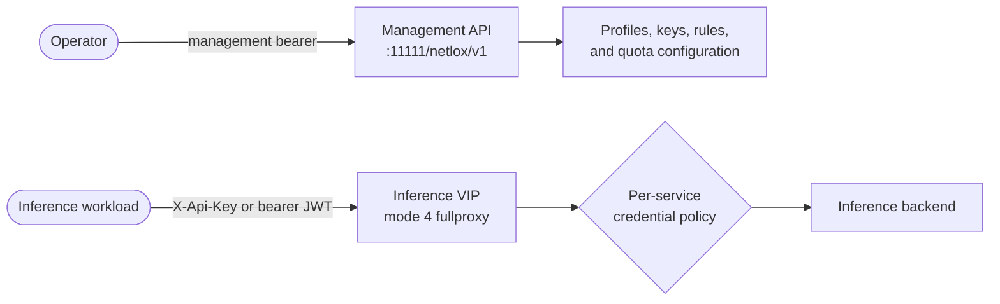

# Data-Plane Authentication and JWT

--8<-- "snippets/common/mutation-fragment-notice.md"

Inference credentials are evaluated on a `mode: 4` fullproxy service. They do
not authenticate operators to the management API. Configure management
authentication separately before creating API keys, JWT profiles, load
balancers, or quota policy.

!!! warning "Development contract"
    The five-state credential policy, JWT profile API, and HTTP/1.1 and HTTP/2
    admission paths are present in the current development contract. They have
    not completed release, Linux appliance, GPU, or two-node HA qualification.
    Confirm the served Swagger and immutable image before deployment.

## Keep the authentication planes separate



| Plane | Credential | Purpose |
|---|---|---|
| Management | `Authorization: Bearer` management token | Authorize configuration and lifecycle operations |
| Data plane, API-key arm | `X-Api-Key` | Authenticate a workload, identify its tenant/key, and apply model and quota policy |
| Data plane, JWT arm | `Authorization: Bearer` JWT | Verify the issuer and claims, derive tenant/user/model identity, and apply model and quota policy |

A management token is not an inference credential. An inference JWT is not a
management token. Never forward a browser or operator credential to an
inference VIP as a substitute for a data-plane credential.

## The five `api_key_auth` states

Omission is a real state; it is not an alias for `disabled`.

| Service declaration | Credential decision | Header ownership before backend dispatch | Dependency failure |
|---|---|---|---|
| field omitted | No Gateway credential namespace is declared | Preserve backend-owned `X-Api-Key`; proxying stays byte-identical for this contract | No auth-store dependency is introduced |
| `disabled` | Do not authenticate | Strip `X-Api-Key`; the service has explicitly declared the Gateway namespace | Keyless traffic continues; optional shared-VIP QoS has its own outage posture |
| `required` | Require `X-Api-Key` | Validate, then strip before dispatch | No store or an unevaluable policy returns `503 policy_store_unavailable` |
| `jwt` | Require a bearer JWT and named `jwt_auth_profile` | Validate; strip `Authorization` by default; strip `X-Api-Key` | Missing/unusable keyset returns `503 policy_store_unavailable` |
| `apikey-or-jwt` | If `X-Api-Key` is present, it decides alone; otherwise evaluate bearer JWT | Strip Gateway-owned credential headers | A rejected present API key is final; there is no JWT fallback |

The declaration is independent of `sse_mode` and `pd_disagg_mode`. Reading a
service back preserves omission versus an explicit value. When replacing a
service, omitting `api_key_auth` preserves the existing declaration; use
`disabled` explicitly to turn off enforcement and keep header stripping.

`loxicmd create lb --api-key-auth` currently accepts only `disabled` and
`required`. The `jwt` and `apikey-or-jwt` values and the
`jwt_auth_profile` association are REST-only. There is no supported
`--jwt-auth-profile` CLI flag.

## Create a JWT profile

Use a protected file for the management credential so it is not repeated in
`curl` arguments or command logs:

```bash
export CONTROL_API="https://gateway.example.com/netlox/v1"
install -m 600 /dev/null ./control-plane.headers
printf 'Authorization: Bearer %s\n' "$CONTROL_PLANE_TOKEN" > ./control-plane.headers

curl --fail-with-body --silent --show-error \
  --request POST "$CONTROL_API/config/ai/jwtauthprofile" \
  --header @control-plane.headers \
  --header 'Content-Type: application/json' \
  --data '{
    "name": "example-issuer",
    "issuer": "https://idp.example.com/realms/inference",
    "jwks_url": "https://idp.example.com/realms/inference/protocol/openid-connect/certs",
    "audiences": ["inference-client"],
    "algs": ["RS256"],
    "tenant_claim": "tenant_id",
    "user_claim": "sub",
    "roles_claim": "realm_access.roles",
    "model_role_prefix": "model:",
    "model_authz": "claims-required",
    "refresh_sec": 3600,
    "leeway_sec": 30
  }'
```

Expected result: `200`. Creating a profile starts its JWKS lifecycle but does
not wait for the first fetch. A successful management response therefore does
not prove the issuer is reachable or the profile can admit requests.

Read desired configuration back without exposing any token:

```bash
curl --fail-with-body --silent --show-error \
  --header @control-plane.headers \
  "$CONTROL_API/config/ai/jwtauthprofile" \
  | jq '.jwtAuthProfileAttr[] | {name, issuer, audiences, model_authz}'
```

`POST` replaces a profile with the same name. An unchanged replacement keeps
its running keyset. A changed replacement restarts the key lifecycle and fails
closed until the new configuration fetches a usable keyset. A profile
referenced by any LB rule cannot be deleted; delete returns `409` until every
reference is detached.

## Attach the profile to a service

This operation is REST-only:

```bash
curl --fail-with-body --silent --show-error \
  --request POST "$CONTROL_API/config/loadbalancer" \
  --header @control-plane.headers \
  --header 'Content-Type: application/json' \
  --data '{
    "serviceArguments": {
      "externalIP": "192.0.2.20",
      "port": 8443,
      "protocol": "tcp",
      "sel": 0,
      "mode": 4,
      "host": "ai.example.com",
      "path_prefix": "/",
      "path_match_mode": "prefix",
      "model_name": "example-chat-model",
      "api_key_auth": "jwt",
      "jwt_auth_profile": "example-issuer"
    },
    "endpoints": [
      {"endpointIP": "198.51.100.20", "targetPort": 8000, "weight": 1}
    ]
  }'
```

The Gateway rejects a JWT mode without a configured profile. It also rejects
`jwt_auth_profile` on omitted, `disabled`, or `required` policies. On replace,
omitting the profile preserves the existing reference while the policy remains
JWT-capable.

## Claim mapping and model authorization

Claim paths use dot-separated object traversal. Defaults are Keycloak-shaped:

| Profile field | Default | Effect |
|---|---|---|
| `tenant_claim` | `tenant_id` | Required metering tenant; absent/invalid denies `401` unless `default_tenant` is set |
| `user_claim` | `sub` | Stable user identity for user/user-model QoS; absence falls through to tenant scopes |
| `username_claim` | `preferred_username` | Display-only identity |
| `roles_claim` | `realm_access.roles` | Role source for model derivation |
| `model_role_prefix` | `model:` | Turns a role such as `model:example-chat-model` into an allowed model |
| `models_claim` | unset | When configured and present, its model list is authoritative, including an empty list |
| `model_authz` | `claims-required` | Deny a named model when no model list can be derived; `allow-all` is an explicit relaxation |

Issuer equality, signature algorithm, signature, time claims, and optional
audience/authorized-party matching are verified before claims are trusted.
`none` and HMAC algorithms are always rejected. Tenant and user identities
that cannot be safely carried into headers, logs, metrics, and quota keys are
rejected rather than truncated.

By default the Gateway strips `Authorization`. Set
`authorization_passthrough: true` only when the backend must receive the
verified token and has a separate reason to trust it. Set
`forward_identity: true` only when the backend trusts Gateway-injected
`X-Auth-Tenant` and `X-Auth-User`; client-supplied copies are stripped.

## JWKS lifecycle and HTTP boundaries

- `jwks_url` pins the key endpoint. If omitted, the Gateway performs OIDC
  discovery at `issuer + /.well-known/openid-configuration`.
- Verification reads an in-memory snapshot; it performs no network I/O on the
  request path.
- Before the first successful fetch, or after the last-known-good keyset ages
  past the 24-hour staleness cutoff, admission fails closed with `503`.
- A refresh failure keeps the last-known-good keyset until that cutoff. A key
  ID miss requests a rate-limited background refetch; the current request is
  still denied.
- HTTP/1.1 and HTTP/2 run the same credential and model decision per request or
  stream. A denial must not establish backend delivery. HTTP/2 connection
  reuse never authorizes later streams from an earlier stream's credential.
- The effective bearer-token size reachable through the data plane is 4088
  bytes: the captured `Bearer ` header value must fit in 4095 bytes. The next
  byte is refused before verification on both HTTP versions.
- A model-routed request whose body framing prevents safe model resolution is
  refused before dispatch. Do not interpret TCP segmentation as HTTP chunked
  framing coverage.

## Validate without creating a false green

Use a dedicated staging service and an independent backend receipt counter.
Give every probe a unique non-secret nonce, then compare the backend count
before and after. The client status alone cannot prove non-delivery.

| Probe | Client result | Backend receipt delta |
|---|---|---:|
| Valid token, allowed model | Backend response | `+1` |
| Missing, malformed, expired, wrong issuer/audience, or bad-signature token | `401` (`missing_token`, `invalid_token`, or `token_expired`) | `0` |
| Valid token, unauthorized model | `403 model_not_allowed` | `0` |
| Profile with no usable keyset | `503 policy_store_unavailable` | `0` |
| Same token on HTTP/1.1 and HTTP/2 | Same authorization decision | `+1` only for each admitted request/stream |
| One user/model is throttled; unrelated user or model is probed | Denied identity gets `429`; unrelated identity remains eligible | `0` for the denied request; no denial bleed |

Do not log the JWT, `Authorization`, `X-Api-Key`, raw API key, request body,
or prompt while collecting evidence.

## Clean up

Remove the LB rule first, verify that its profile reference is gone, and then
delete the profile:

```bash
curl --fail-with-body --silent --show-error \
  --request DELETE \
  --header @control-plane.headers \
  "$CONTROL_API/config/ai/jwtauthprofile/example-issuer"

rm -f ./control-plane.headers
unset CONTROL_PLANE_TOKEN
```

Expected profile delete result after detachment: `200`. A `409` means at least
one service still references the profile.

## Related pages

- [Management API Authentication](management-api-authentication.md)
- [API Key Management](../ai-gateway/api-key-management.md)
- [AI Traffic Governance](../ai-gateway/ai-traffic-governance.md)
- [AI Quotas and QoS](../operations/ai-qos.md)
- [Monitoring and Metrics](../operations/monitoring.md)
- [HA and Upgrade Limitations](../operations/ha-limitations.md)
