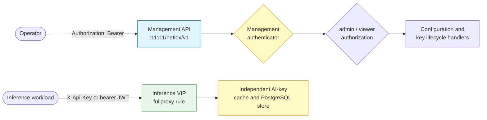
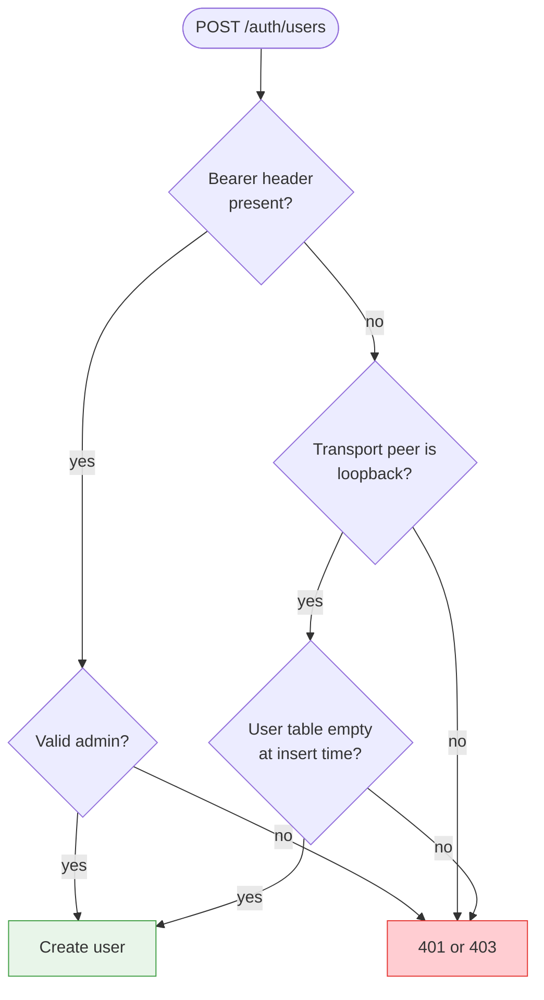

# Management API Authentication

Protect the Gateway management listener on port `11111` before configuring
load balancers, API keys, quotas, or security policy. Management bearer
credentials and inference API keys belong to different trust planes and are
not interchangeable.

!!! warning "Development-source behavior"
    The exact authorization, first-user bootstrap, and raw-handler protection described here are
    implemented in the current development source but have not completed release qualification.
    Confirm them against the exact image and Swagger document used by your deployment.

## Two credential planes



- `Authorization: Bearer ...` authenticates an operator to the management API.
- `X-Api-Key: ...` authenticates a workload on an inference VIP.
- `Authorization: Bearer ...` on a JWT-capable inference VIP is a data-plane
  JWT selected by that service's profile, not the management token.
- Presenting a data-plane key to the management API does not grant management
  authority and receives the same `401` response as an unknown credential.
- A management token is not an inference API key.
- Never reuse or forward a browser/operator bearer token as an inference JWT.
  The two token issuers and authorization policies are independent.

## Choose one management authentication mode

| Mode | Startup option | Credential source | Authorization behavior |
|---|---|---|---|
| User service | `--userservice` | Login-backed bearer token; management users and tokens use the `--database*` store | Exact `admin` or `viewer` role |
| OAuth | `--oauth2` | Supported OAuth provider flow | Current implementation hard-codes the validated principal as `admin`; no IdP role mapping |
| Manual token | `--manualtoken` | File selected by `--manualtokenvalue` | One shared unrestricted management credential |
| None | none of the above | No credential | **All management requests are authorized** |

If more than one mode is enabled, the current authenticator checks user
service first, then OAuth, then manual token. Enable exactly one mode unless a
tested migration procedure requires overlap; otherwise operators can easily
present a credential for a mode that is not being evaluated.

!!! danger "No mode means an open management API"
    The global Swagger security declaration does not by itself enable authentication. With no
    user, OAuth, or manual-token mode configured, the current authenticator returns an unrestricted
    principal. Network isolation is still useful, but it is not a substitute for enabling and
    testing a management authentication mode.

## Role rules

The role set is closed and compared exactly:

| Principal | Read (`GET`) | Mutation | `POST /auth/logout` |
|---|---:|---:|---:|
| `admin` | Allow | Allow | Allow |
| `viewer` | Allow | Deny with `403` | Allow |
| Unknown or malformed role | Deny with `403` | Deny with `403` | Deny with `403` |
| Data-plane key or unknown credential | Deny with `401` | Deny with `401` | Deny with `401` |
| Manual-token principal | Allow | Allow | Allow |

Use separate operator identities where possible. The manual-token mode has no
per-user role or attribution, so reserve it for tightly controlled bootstrap,
recovery, or single-operator deployments.

See [Data-Plane Authentication and JWT](data-plane-jwt-auth.md) for omitted
versus `disabled`, API-key/JWT precedence, profile lifecycle, and backend
header handling.

!!! danger "Current user and token handling blocks production release"
    A viewer can call `GET /auth/users`, and the current response exposes stored password material.
    JWT signing uses a hard-coded key. OAuth access and refresh token files are created with mode
    `0644`, and OAuth principals are always `admin` rather than being mapped from IdP roles. Current
    password writers and login both use bcrypt, but password rotation must still pass on the exact
    release image. These are development-source behaviors, not production-ready security controls.

!!! warning "Logout does not revoke a normal bearer token"
    The current logout handler sends the full `Bearer ...` header string to an exact token-key
    deletion. Stored token keys do not include that prefix, so the normal bearer token remains
    usable after logout. Do not rely on logout for revocation until this is corrected.

## First user bootstrap

`POST /auth/users` has a special first-account rule because an empty user
database has no credential that could authorize its own initialization.



The bootstrap is accepted only when all of these are true:

1. User-service authentication is enabled.
2. No management user exists yet.
3. The request arrives directly from a loopback transport peer.
4. The requested user passes normal password validation.

The server reads the transport peer address, not `X-Forwarded-For`. Sending a
loopback-looking header through a proxy cannot satisfy the condition. The
empty-table check and insert are coupled so concurrent bootstrap requests
cannot both create a first user.

Run the bootstrap locally on the Gateway host. Place the initial request body
in a permission-restricted secret file using your deployment's secret tooling;
do not put the password in a command argument:

```bash
curl --fail-with-body --silent --show-error \
  --request POST http://127.0.0.1:11111/netlox/v1/auth/users \
  --header 'Content-Type: application/json' \
  --data-binary @/run/secrets/initial-gateway-user.json
```

The JSON file contains `username`, `password`, and `role: "admin"`. Remove or
rotate the bootstrap secret immediately after the first login succeeds.

After the first user exists, unauthenticated bootstrap closes permanently for
that database state. Create later users with an authenticated administrator.
Do not expose the listener while the user table is empty.

!!! warning "Current create-user response mismatch"
    The development Swagger declares `201` with a `User` body, while the current handler's success
    responder emits `200` with `{ "result": "Success" }`. Treat any automation that depends on the
    exact success status or body as release-blocked until the contract and handler converge.

## Generated and raw routes use the same decision

Most operations pass through the generated OpenAPI handler chain. Five raw
handler groups are dispatched earlier:

- AI KV inventory;
- DPU debug;
- DPU hardware counters;
- OPA watcher;
- AI API-key `PATCH`.

The current development implementation runs those raw handlers through the
same authentication and role authorization decision. A viewer may read a raw
`GET`, but may not call raw `POST`, `PATCH`, or `DELETE` operations.

The generated contract has explicit public exceptions for product metadata,
login/provider flows, and Prometheus scraping. `POST /auth/users` also carries
an empty Swagger security block, but its conditional bootstrap enforcement is
implemented inside the handler; it is not an open user-creation route.

## Interpret authentication responses

| Status | Meaning | Operator action |
|---|---|---|
| `401` | Credential is missing, invalid, expired, or not a management principal | Obtain a valid management credential; do not test data-plane keys here |
| `403` | Management identity authenticated but its exact role cannot perform the operation | Use an administrator for mutations; keep viewer read-only |
| `503` | The authenticator recognized the management credential store as unavailable | Restore the credential store; do not report the token as invalid |

Error wording intentionally does not distinguish unknown, expired, and
cross-plane credentials. This prevents the management listener from becoming
an oracle for credential existence.

!!! note "Current outage-classification boundary"
    A startup/degraded-store sentinel maps to `503`. A raw database-driver error that occurs after
    initialization can still fall through to the generic fail-closed `401` path. Do not use a `401`
    response by itself as proof that the management credential store is healthy; correlate it with
    sanitized service health and logs.

## Production verification

Before allowing remote access to port `11111`:

1. Enable one management authentication mode.
2. Bind the listener to a trusted management network or place it behind a
   verified TLS reverse proxy.
3. Send a protected, invalid-body mutation without a credential and require
   `401` before request validation:

   ```bash
   # docs-example: expect-schema-error
   curl --silent --output /dev/null --write-out '%{http_code}\n' \
     --request POST https://gateway.example.com/netlox/v1/config/ai/apikey \
     --header 'Content-Type: application/json' \
     --data '{}'
   ```

4. After the user-list response is fixed to omit password material, authenticate
   as a viewer: a safe representative `GET` must succeed, `GET /auth/users`
   must expose no password field or hash, and a representative mutation must
   return `403`. The current development source cannot pass this gate.
5. Authenticate as an administrator and perform only a reversible test change.
6. Repeat the checks for at least one raw route, such as AI KV inventory.
7. Redact bearer tokens, cookies, user data, and private addresses from saved
   evidence.

## Related pages

- [API Reference](../reference/api.md)
- [API Key Management](../ai-gateway/api-key-management.md)
- [AI Key Store Operations](../operations/ai-key-store.md)
- [swagger-extras](../reference/swagger-extras.md)
