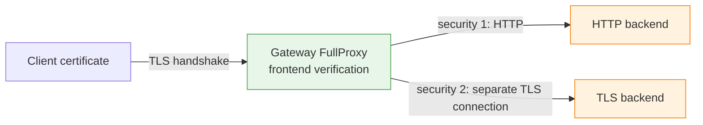

# Frontend mTLS for AI Services

The current active mTLS path can verify client certificates on the frontend of
a FullProxy service. Configure it through the `mtls_frontend` object nested in
`serviceArguments`; there is no standalone `/config/mtls` endpoint.

!!! warning "Current implementation boundary"
    The OpenAPI model also declares backend-mTLS and inline certificate-data
    fields. The current data-plane wiring applies only the frontend file-path
    fields documented below. Do not depend on `mtls_backend`,
    `client_ca_cert_data`, `client_cert_data`, or `client_key_data` for
    enforcement. API acceptance or read-back does not prove those fields are
    active.

No runnable AI-specific CICD scenario currently qualifies this path. Validate
the exact immutable build with a real TLS client and backend before production.

## Request flow



Frontend mTLS requires `mode: 4` and `security: 1` or `security: 2`. Security
mode `1` terminates frontend TLS and uses HTTP to the backend; mode `2`
re-originates a separate backend TLS connection. The frontend certificate
check does not prove backend-server identity under mode `2`, because the
declared backend verification configuration is not currently wired.

## Active frontend fields

| Field | Default | Current behavior |
|---|---|---|
| `client_cert_mode` | `disabled` | `optional` verifies a presented certificate; `required` rejects a client without a valid certificate |
| `client_ca_path` | unset | Absolute path to the PEM CA bundle used for client-certificate verification |
| `require_client_cn` | `false` | Enables the additional common-name pattern check |
| `client_cn_pattern` | unset | Pattern checked when `require_client_cn` is true |
| `client_crl_path` | unset | Path to an operator-supplied PEM CRL used for leaf-certificate revocation checks |

Mount certificate files read-only, grant access only to the Gateway process,
and rotate them through the organization's secret-management procedure. Do not
send PEM or private-key material in REST payloads.

## Configure a staging service

Set `GATEWAY_API` to the protected management origin and obtain
`GATEWAY_TOKEN` through the approved identity workflow:

```bash
install -m 600 /dev/null ./control-plane.headers
printf 'Authorization: Bearer %s\n' "$GATEWAY_TOKEN" > ./control-plane.headers

curl --fail-with-body --silent --show-error \
  --request POST \
  --header 'Content-Type: application/json' \
  --header @control-plane.headers \
  --data '{
    "serviceArguments": {
      "externalIP": "192.0.2.10",
      "port": 443,
      "protocol": "tcp",
      "mode": 4,
      "security": 1,
      "mtls_frontend": {
        "client_cert_mode": "required",
        "client_ca_path": "/run/secrets/loxilb/client-ca.crt",
        "require_client_cn": true,
        "client_cn_pattern": "client.example.test",
        "client_crl_path": "/run/secrets/loxilb/client.crl"
      }
    },
    "endpoints": [
      {"endpointIP": "198.51.100.20", "targetPort": 8080, "weight": 1}
    ]
  }' \
  "$GATEWAY_API/netlox/v1/config/loadbalancer"
```

The addresses are RFC 5737 documentation ranges; replace them with staging
addresses. Use `security: 1` here so the recipe tests only the currently wired
frontend control and does not imply backend certificate verification.

## Verify enforcement

Read-back confirms the control-plane object, not the TLS behavior:

```bash
curl --fail-with-body --silent --show-error \
  --header @control-plane.headers \
  "$GATEWAY_API/netlox/v1/config/loadbalancer/all" | jq .
```

Then perform both handshake tests against the staging VIP:

```bash
# Expected to succeed with a valid, non-revoked certificate and matching CN.
curl --fail-with-body --silent --show-error \
  --cert /run/secrets/client/client.crt \
  --key /run/secrets/client/client.key \
  --cacert /run/secrets/client/vip-ca.crt \
  https://192.0.2.10/v1/models

# Expected to fail during TLS negotiation because no client certificate is sent.
curl --fail-with-body --silent --show-error \
  --cacert /run/secrets/client/vip-ca.crt \
  https://192.0.2.10/v1/models
```

Also test an untrusted issuer, expired certificate, mismatched CN, and revoked
leaf certificate. Capture only sanitized outcomes; never record private keys or
unredacted certificates in public evidence.

## Troubleshooting

| Symptom | Check |
|---|---|
| Frontend settings appear in read-back but are not enforced | Confirm the build includes mTLS, `mode` is `4`, `security` is `1` or `2`, and the mounted paths exist inside the container |
| Every client is rejected | Verify the CA chain, client intermediates, file permissions, validity period, and clock |
| CN check rejects a valid certificate | Confirm `require_client_cn` and the exact certificate CN/pattern; SAN matching is not a substitute for this specific check |
| Revoked client is admitted | Confirm `client_crl_path` is readable and contains a current PEM CRL covering the leaf certificate |
| Backend certificate is not verified | Expected current limitation; `mtls_backend` is declared but not wired into the active data path |

## Release qualification boundary

Production qualification requires frontend positive/negative handshake tests,
certificate rotation, CRL refresh, restart, resource-load, and rollback tests
on the exact image. Backend mTLS and inline certificate data remain
documentation/API-contract surfaces until implementation and end-to-end tests
prove enforcement.

## See also

- [Configuration reference](../ai-gateway/configuration-reference.md)
- [Management API Authentication](management-api-authentication.md)
- [OPA L4 Policy](opa-l4.md)
