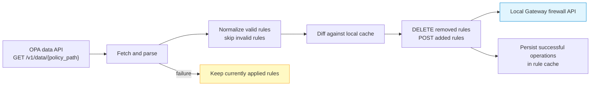

# OPA L4 Policy Watcher

The OPA L4 watcher polls an Open Policy Agent (OPA) data document, converts its
desired rules into Gateway firewall rules, diffs them against a local cache,
and applies additions and deletions through the Gateway REST API. It is a
desired-state synchronizer, not a per-connection OPA authorization call.

## Current production boundary

!!! danger "Experimental integration — do not use as a production enforcement boundary"
    The current watcher applies rules to the local HTTP management API without
    an authorization header. When Gateway management authentication is enabled,
    those internal apply requests are rejected. Disabling management
    authentication to make the watcher work would expose a larger control-plane
    risk. Until an authenticated internal apply path is implemented and tested,
    qualify this feature only in an isolated staging environment.

Other current limitations are also security-relevant:

- `fail_open` is stored and reported but does not change outage behavior;
- a fetch failure preserves the rules currently applied, for either
  `fail_open` value;
- a well-formed OPA response with a missing/empty rule list is desired empty
  state and can delete all OPA-managed rules;
- invalid individual rules are logged and skipped, not rejected as one atomic
  policy document; a previously applied rule that is now skipped can be
  treated as removed by the diff;
- stopping the watcher does not remove firewall rules it already applied;
- its cached rule-state file is written with mode `0644` under
  `/var/lib/loxilb` by default;
- the OPA client sends no authentication header and offers no custom CA option.

The OpenAPI route and unit tests prove code presence, not safe multi-process or
production behavior.

## How synchronization works



The default policy path is `loxilb/l4`, poll interval is 30 seconds, initial
poll delay is 10 seconds, OPA request timeout is 5 seconds, and each local rule
apply request has a 10-second timeout.

## Required OPA response

The watcher performs an HTTP `GET` with `Accept: application/json`:

```text
{opa_url}/v1/data/{policy_path}
```

For the default path, OPA must return this shape:

```json
{
  "result": {
    "l4": {
      "firewall_access_rules": [
        {
          "sourceIP": "198.51.100.0/24",
          "destinationIP": "203.0.113.10/32",
          "protocol": 6,
          "minSourcePort": 0,
          "maxSourcePort": 65535,
          "minDestinationPort": 443,
          "maxDestinationPort": 443,
          "action": "allow",
          "preference": 100
        }
      ]
    }
  }
}
```

| Field | Accepted values |
|---|---|
| `sourceIP`, `destinationIP` | IPv4 or IPv6 CIDR; empty is normalized to `0.0.0.0/0` |
| `protocol` | `0` any, `6` TCP, `17` UDP, `132` SCTP |
| source/destination port range | Minimum must not exceed maximum; `0`–`65535` is normalized to no port filter |
| `action` | `allow` or `deny` |
| `preference` | Integer used in the firewall rule key |

The document is not applied atomically. A failed add/delete is retried during a
later diff, but successful changes from the same cycle remain applied. Review
`last_error` for `partial apply failure` and compare actual firewall rules.

## Validate an OPA document separately

Select and pin an OPA release approved by your organization; do not use a
mutable image tag:

```bash
export OPA_IMAGE="openpolicyagent/opa:<PINNED_VERSION>"
docker pull "$OPA_IMAGE"
docker image inspect "$OPA_IMAGE" --format '{{index .RepoDigests 0}}'
```

Before connecting a Gateway, query the exact policy path directly and validate
the response shape:

```bash
curl --fail-with-body --silent --show-error \
  https://opa.example.com/v1/data/loxilb/l4 \
  | jq -e '
      .result.l4.firewall_access_rules | type == "array" and
      all(.[];
        (.action == "allow" or .action == "deny") and
        (.protocol == 0 or .protocol == 6 or
         .protocol == 17 or .protocol == 132))
    '
```

Use synthetic test ranges and validate empty, malformed, duplicate, and invalid
rules. Specifically prove that an unintended empty document cannot reach the
watcher.

## URL and transport restrictions

`POST /config/opa/watcher` resolves the configured hostname and rejects these
IPv4 ranges:

- `127.0.0.0/8` loopback;
- `10.0.0.0/8`, `172.16.0.0/12`, and `192.168.0.0/16` RFC 1918;
- `169.254.0.0/16` link-local and common metadata range.

This guard is not a complete reserved-address or IPv6 SSRF policy, and DNS can
change after validation. The watcher also cannot attach OPA authentication
headers. Treat the destination as administrator-controlled, enforce egress and
DNS policy outside the process, use HTTPS with a publicly trusted certificate,
and do not expose an unauthenticated OPA data API to an untrusted network.

These constraints are another reason the current integration is not a
recommended production enforcement path.

## Configure the watcher in isolated staging

The management route itself is protected when Gateway management auth is
configured:

```bash
export CONTROL_API="https://gateway.example.com/netlox/v1"
install -m 600 /dev/null ./control-plane.headers
printf 'Authorization: Bearer %s\n' "$CONTROL_PLANE_TOKEN" > ./control-plane.headers

curl --fail-with-body --silent --show-error \
  --request POST \
  --header @control-plane.headers \
  --header 'Content-Type: application/json' \
  --data '{
    "opa_url": "https://opa.example.com",
    "policy_path": "loxilb/l4",
    "poll_interval_sec": 30,
    "fail_open": false
  }' \
  "$CONTROL_API/config/opa/watcher"
```

This starts/replaces the watcher, but under the current implementation its
subsequent local firewall apply calls do not carry the management credential.
Expect them to fail when management auth is active; do not work around the
failure by exposing an unauthenticated production management listener.

## Status and circuit breaker

```bash
curl --fail-with-body --silent --show-error \
  --header @control-plane.headers \
  "$CONTROL_API/config/opa/watcher" | jq .
```

| Field | Interpretation |
|---|---|
| `status` | `not_configured`, `running`, or `stopped` |
| `last_sync_at` | Time the latest fetch/normalize/apply cycle completed, including a partial apply; it is not proof that every rule succeeded |
| `rules_count` | Successfully applied rules tracked in the watcher cache |
| `last_error` | Latest fetch, normalization, or partial-apply error |
| `circuit_breaker_state` | `0` closed, `1` open, `2` half-open |

Five consecutive OPA fetch failures open the circuit for 60 seconds. After the
timeout it enters half-open; two successful OPA fetches close it. A
normalization error records a failure, but the next successful fetch resets the
closed-state failure count before normalization, so repeated
normalization-only errors do not reliably open the circuit. Apply errors do not
open it. Alert on `last_error` and failed syncs rather than relying only on the
circuit state. While the circuit is open, polling does not change existing
rules.

Prometheus metrics:

| Metric | Meaning |
|---|---|
| `loxilb_opa_watcher_syncs_total{status}` | Sync cycles by `success` or `failure` |
| `loxilb_opa_sync_duration_seconds` | Duration of all sync attempts |
| `loxilb_opa_firewall_rules` | Successfully applied rules tracked in cache |
| `loxilb_opa_circuit_breaker_state` | `0` closed, `1` open, `2` half-open |

Alert on failed sync rate, open circuit, stale `last_sync_at`, partial apply,
and unexpected rule-count changes. Always corroborate with the Gateway firewall
read API.

## Stop the watcher

```bash
curl --fail-with-body --silent --show-error \
  --request DELETE \
  --header @control-plane.headers \
  "$CONTROL_API/config/opa/watcher"
```

Deleting the watcher stops polling but leaves its applied firewall rules and
state file. Inventory and remove rules through an approved firewall change
procedure; do not assume `DELETE /config/opa/watcher` is a policy rollback.

## Release gates

Before this integration can be treated as production-ready, require at least:

- an authenticated internal apply path compatible with management auth;
- authenticated OPA transport with configurable trust;
- fail-open/fail-closed behavior implemented and tested;
- document-level validation or atomic rejection of invalid/empty policy;
- restrictive cache-file permissions and lifecycle cleanup;
- IPv4/IPv6 SSRF and DNS-rebinding controls;
- restart, rollback, and two-node behavior tested on the release image.

## See also

- [Management API Authentication](management-api-authentication.md)
- [Monitoring and Metrics](../operations/monitoring.md)
- [Audit Log](../operations/audit-log.md)
