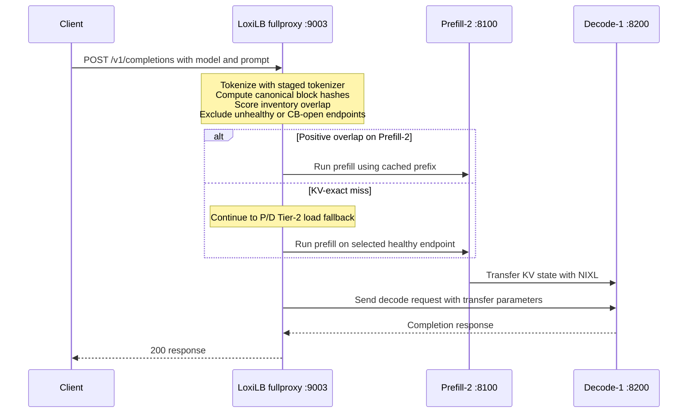

# Deploy: Prefill/Decode Disaggregation

--8<-- "snippets/common/mutation-fragment-notice.md"

A hands-on, cloud-agnostic deploy and debug guide for running KV-cache-aware routing on a
real GPU fleet with **prefill/decode (P/D) disaggregation** — bring-your-own hardware, any
GPU instance. This page is the operational companion to the mechanism reference in
[P/D Disaggregation](../ai-gateway/pd-disaggregation.md) and
[KV-Cache-Aware Routing](kv-cache-aware-routing.md); read those for the block-hash contract and
selection internals, and read this page for the wire, launch flags, and debugging playbook.

---

## 1. Choose the KV-exact topology before you deploy

LoxiLB supports two KV-exact topologies: mode 1 for a P/D-disaggregated pool and mode 3 for a
role-less single pool. This guide is intentionally about **P/D mode 1**, whose selector is invoked
only when both roles are present:

```
pd_disagg_mode == true  &&  n_prefill_eps > 0  &&  n_decode_eps > 0
```

A single-pool deployment can use `kvExactMode: 3`, but it has no prefill/decode handoff and is
outside this guide. For the P/D deployment described here:

- The rule must be `mode: 4` (fullproxy) with `pd_disagg_mode: true`, and endpoints tagged
  `ep_role: 1` (prefill) and `ep_role: 2` (decode) — at least one of each.
- The selector picks **among the prefill endpoints** by KV-block overlap. **Decode endpoints are
  never KV-selection candidates** — they serve the generation phase.
- **Two or more prefill endpoints are required** for the routing decision to be meaningful — with a
  single prefill node the load balancer is trivially correct.

This also means the backing vLLM instances must run **real disaggregation** (NIXL `kv_producer` /
`kv_consumer`) — see §4. Plain (non-disaggregated) vLLM instances will not work.

For the role-less alternative, use `mode: 4`, disable P/D, omit endpoint roles, and set
`kvExactMode: 3`; all endpoints publish inventory and are KV candidates. See
[Engine Capability Matrix](../concepts/engine-capability-matrix.md) before choosing between the
two shapes.

---

## 2. Reference topology (2 prefill + 1 decode)

Any GPU instances will do; co-locate the nodes on one low-latency subnet so NIXL KV transfer and
ZMQ events stay fast. Addresses below are placeholders — substitute your own.

| Node  | Role                          | Ports                                        |
|-------|-------------------------------|----------------------------------------------|
| gateway-1  | loxilb LB + REST              | REST `:11111`, VIPs `:9000–9003`             |
| gpu1  | **Prefill-1** (kv_producer)   | vLLM `:8100`, ZMQ PUB `:5557`, NIXL `:5600`  |
| gpu2  | **Prefill-2** (kv_producer)   | vLLM `:8100`, ZMQ PUB `:5557`, NIXL `:5600`  |
| gpu3  | **Decode-1** (kv_consumer)    | vLLM `:8200`, NIXL `:5600`                    |

!!! warning "Port discipline is load-bearing — change it on both sides or not at all"
    The vLLM launch scripts and the loxilb LB rules agree on a fixed port map: prefill vLLM
    `:8100`, decode vLLM `:8200`, ZMQ KV events `:5557` (prefill only), NIXL side-channel `:5600`
    (all GPU nodes). If you move a port, move it in both the container launch and the rule body.

---

## 3. The three planes

| Plane           | Carries                                         | Path                                                                     |
|-----------------|-------------------------------------------------|--------------------------------------------------------------------------|
| **Inventory**   | which prefix blocks each prefill endpoint holds | prefill vLLM → ZMQ PUB `:5557` → loxilb SUB (dials each prefill IP)       |
| **Request**     | the client completion request                   | client → loxilb VIP → selected prefill → (NIXL) → decode → client         |
| **KV transfer** | the computed KV tensors                         | prefill GPU → CPU → TCP/UCX `:5600` → CPU → decode GPU                    |

The **inventory** plane is what makes routing cache-aware; the **KV-transfer** plane is what makes
P/D disaggregation work. They are independent — a broken inventory plane silently degrades a
mode-1 rule to P/D minimum-load selection with round-robin only as a tie-break (see §9), while a
broken KV-transfer plane fails requests outright (503/timeout).

---

## 4. vLLM configuration (commonly misconfigured)

### 4.1 Prefill node (kv_producer + KV-event publish)

```bash
docker run -d --name vllm --gpus all --network host \
  -e VLLM_NIXL_SIDE_CHANNEL_HOST=<this-node-ip> \          # MUST be the node IP, NOT 0.0.0.0
  -e VLLM_NIXL_SIDE_CHANNEL_PORT=5600 \
  -e UCX_TLS=tcp \                                          # no RDMA/GDRcopy → tcp transport
  -e UCX_NET_DEVICES=all \
  -e PYTHONHASHSEED=0 \                                     # PARITY TRIAD leg 1 (see §6)
  vllm/vllm-openai \
    --model <MODEL> --host 0.0.0.0 --port 8100 \
    --block-size 16 \                                       # PARITY TRIAD leg 2
    --prefix-caching-hash-algo sha256_cbor \                # PARITY TRIAD leg 3 (NOT default "sha256"!)
    --enforce-eager --enable-request-id-headers \
    --kv-transfer-config '{"kv_connector":"NixlConnector","kv_role":"kv_producer","kv_buffer_device":"cpu","kv_load_failure_policy":"fail"}' \
    --kv-events-config '{"enable_kv_cache_events":true,"publisher":"zmq","endpoint":"tcp://*:5557"}'
```

### 4.2 Decode node (kv_consumer; no KV-event publish)

Identical to the prefill launch, except: `--port 8200`, `"kv_role":"kv_consumer"`, and **no
`--kv-events-config`** (decode nodes don't publish inventory; they're never KV-selection candidates).

### 4.3 Why each non-obvious flag matters

| Flag | Why | Failure if wrong |
|------|-----|------------------|
| `kv_buffer_device: "cpu"` | Instances without GDRcopy/RDMA can't do CUDA-aware UCX on `UCX_TLS=tcp`. Routes KV GPU→CPU→TCP→CPU→GPU. | vLLM crashes in the NIXL/UCX shared thread on the first request. |
| `UCX_TLS=tcp` | Forces the TCP transport when there is no RDMA fabric. | UCX init crash / hang. |
| `VLLM_NIXL_SIDE_CHANNEL_HOST=<node-ip>` | Peers must dial a reachable IP, never `0.0.0.0`. | Decode can't pull KV → request hangs/fails. |
| `--prefix-caching-hash-algo sha256_cbor` | vLLM's **default is pickle-`"sha256"`** (non-portable, NOT what loxilb computes). loxilb computes the CBOR variant. | 0% hash intersection → mode 1 silently falls through to P/D minimum-load selection. |
| `PYTHONHASHSEED=0` | Seeds vLLM's `NONE_HASH` (first-block parent) deterministically; must match loxilb's `LLB_KV_NONE_HASH_SEED`. | First block never matches → broken affinity. |
| `--block-size 16` | Must equal the rule's `kvBlockSize`. | Hashes computed over different token spans → no match. |
| `--kv-events-config endpoint tcp://*:5557` | `*` binds PUB mode; `127.0.0.1` puts ZMQ in connect mode and **nothing is published**. | `loxilb_pd_kv_blocks` stays 0 forever. |

### 4.4 Copy-paste launch reference — prefill and decode

The two launches below are the full, exact commands with every load-bearing flag spelled out.
Prefill **publishes** KV events; decode does **not**. Substitute `<MODEL>`, the node IPs, and the
memory fraction for your hardware. Both use `vllm/vllm-openai:v0.17.0`.

=== "Prefill node (kv_producer, publishes)"
    ```bash
    docker run -d --name vllm-prefill --gpus all --network host \
      -e VLLM_NIXL_SIDE_CHANNEL_HOST=<prefill-node-ip> \   # routable IP, NEVER 0.0.0.0
      -e VLLM_NIXL_SIDE_CHANNEL_PORT=5600 \                # == the endpoint's nixl_port in the rule
      -e UCX_TLS=tcp \                                      # TCP transport (no RDMA/GDRcopy)
      -e UCX_NET_DEVICES=all \
      -e PYTHONHASHSEED=0 \                                # parity triad leg 1
      vllm/vllm-openai:v0.17.0 \
        --model <MODEL> --host 0.0.0.0 --port 8100 \
        --max-model-len 8192 \
        --gpu-memory-utilization 0.90 \
        --block-size 16 \                                  # parity triad leg 2 (== rule kvBlockSize)
        --prefix-caching-hash-algo sha256_cbor \           # parity triad leg 3 (NOT default "sha256")
        --enforce-eager --enable-request-id-headers \
        --kv-transfer-config '{"kv_connector":"NixlConnector","kv_role":"kv_producer","kv_buffer_device":"cpu","kv_load_failure_policy":"fail"}' \
        --kv-events-config '{"enable_kv_cache_events":true,"publisher":"zmq","endpoint":"tcp://*:5557","topic":""}'
    ```
=== "Decode node (kv_consumer, no publish)"
    ```bash
    docker run -d --name vllm-decode --gpus all --network host \
      -e VLLM_NIXL_SIDE_CHANNEL_HOST=<decode-node-ip> \    # routable IP, NEVER 0.0.0.0
      -e VLLM_NIXL_SIDE_CHANNEL_PORT=5600 \
      -e UCX_TLS=tcp \
      -e UCX_NET_DEVICES=all \
      -e PYTHONHASHSEED=0 \
      vllm/vllm-openai:v0.17.0 \
        --model <MODEL> --host 0.0.0.0 --port 8200 \
        --max-model-len 8192 \
        --gpu-memory-utilization 0.90 \
        --block-size 16 \
        --prefix-caching-hash-algo sha256_cbor \
        --enforce-eager --enable-request-id-headers \
        --kv-transfer-config '{"kv_connector":"NixlConnector","kv_role":"kv_consumer","kv_buffer_device":"cpu","kv_load_failure_policy":"fail"}'
        # NO --kv-events-config on decode — decode never publishes inventory
    ```

!!! note "The two launches differ in exactly three places"
    `kv_role` (`kv_producer` vs `kv_consumer`), the serving `--port` (`8100` vs `8200`), and the
    **presence of `--kv-events-config`** (prefill only). Everything else — the parity triad, the NIXL
    side channel on `:5600`, `kv_buffer_device:"cpu"` paired with `UCX_TLS=tcp` (RDMA-free) — is
    identical on both roles. Keep `--max-model-len` identical fleet-wide.

### 4.5 The decode NIXL block-count contract

The NIXL producer and consumer must agree on GPU block counts. If the decode engine advertises a
different `num_gpu_blocks` than the prefill set, the handoff trips with `num_external_tokens == 0`
and the decode silently **recomputes** instead of reusing the transferred KV — you lose the entire
P/D benefit while latency merely looks "high."

Fix it on the **decode** side, one of two ways:

- `--no-enable-prefix-caching` — the simplest fix; the decode accepts any external block layout, or
- `--num-gpu-blocks-override <N>` — pin the block count, where **`N` = the MIN `num_gpu_blocks`
  across the prefill set**. On heterogeneous fleets (mixed GPU memory), pin **every** mesh member to
  the same uniform override so producer and consumer agree.

Read the effective count back from each engine before trusting the mesh:

```bash
curl -s http://<node-ip>:8100/metrics | grep 'vllm:cache_config_info'
# reconcile the num_gpu_blocks label across every prefill and decode engine
```

!!! warning "`num_external_tokens == 0` is a silent failure"
    There is no error — decode simply recomputes. Always reconcile `num_gpu_blocks` across the mesh
    before believing a P/D deployment is transferring KV.

### 4.6 Full-mesh redeploy discipline

The NIXL mesh is a fully-connected producer/consumer set. **A partial restart wedges it** — bringing
one prefill back against a mesh the others already joined leaves stale peer state, and the new node
never handshakes cleanly. Never restart a single engine in place.

When any engine's launch flags change, redeploy the **whole** mesh in order:

1. **Tear everything down** — stop all prefill and decode engines.
2. **Bring decode up first**, and wait until it is healthy (`GET /health`).
3. **Bring the prefills up**, and wait until each is healthy.
4. **Re-verify** the inventory plane (§8) before sending real traffic.

---

## 5. loxilb configuration

### 5.1 Run loxilb as a CONTAINER (native does not serve the VIP)

A natively-launched `loxilb` process has no eBPF VIP intercept wired — `curl VIP:9003` gets
connection-refused. You **must** run the container:

```bash
export LOXILB_IMAGE='ghcr.io/loxilb-io/loxilb-inference-gateway:<released-version>'

docker run -u root --cap-add SYS_ADMIN --restart unless-stopped --privileged \
  --network host -dit \
  -v /etc/loxilb/tokenizers:/etc/loxilb/tokenizers \
  -e LLB_KV_NONE_HASH_SEED=0 \
  -e LOXILB_KV_MAX_BLOCKS=1000000 \
  --name loxilb "$LOXILB_IMAGE" -p
```

Replace `<released-version>` with an explicitly reviewed release tag, or set
`LOXILB_IMAGE` to an immutable digest. Do not use `latest` for production. Enable
`LLB_KV_HASH_DEBUG=1` only during short, access-controlled parity troubleshooting because it
produces verbose per-block diagnostics.

### 5.2 The LB rules — four modes to compare

All P/D rules are `mode: 4` + `pd_disagg_mode: true`, with endpoints `ep_role: 1` (prefill) /
`ep_role: 2` (decode) and `nixl_port: 5600`. A four-way VIP setup lets you compare KV-exact against
its own baselines:

| VIP port | `pd_disagg_mode` | selector                                      | Purpose                          |
|----------|------------------|-----------------------------------------------|----------------------------------|
| `:9001`  | **false** (`ep_role:0`, `sse_mode:true`)      | round-robin, single pool         | non-P/D RR baseline              |
| `:9000`  | true, `pd_cache_aware_mode:false`             | round-robin across prefill EPs   | **P/D-RR baseline** (apples-to-apples for KV-exact) |
| `:9002`  | true, `pd_cache_aware_mode:true` (`pd_cache_threshold:20`, `pd_balance_abs_threshold:3`) | heuristic cache-affinity | heuristic mode |
| `:9003`  | true, **`kvExactMode:1`** (`kvZmqPort:5557`, `kvHashAlgo:sha256_cbor`, `kvWarmupSec:60`, `kvBlockSize:16`) | KV-exact overlap | the method |

`kvWarmupSec` is accepted but currently inert because the production path does not arm its
start timestamp. Do not sleep for 60 seconds and assume the inventory is ready; verify
subscriber connectivity and nonzero block inventory instead.

The KV-exact rule body (`:9003`), posted to `http://<VIP>:11111/netlox/v1/config/loadbalancer`:

=== "curl"
    ```bash
    curl -s -X POST http://<VIP>:11111/netlox/v1/config/loadbalancer \
      -H 'Content-Type: application/json' -d '{
      "serviceArguments": {
        "externalIP": "<VIP>", "port": 9003, "protocol": "tcp",
        "sel": 0, "mode": 4, "security": 0, "host": "<VIP>",
        "pd_disagg_mode": true, "probeRetries": 1,
        "kvExactMode": 1, "kvZmqPort": 5557, "kvHashAlgo": "sha256_cbor",
        "kvWarmupSec": 60, "kvBlockSize": 16
      },
      "endpoints": [
        {"endpointIP": "<prefill-1-ip>", "targetPort": 8100, "weight": 1, "ep_role": 1, "nixl_port": 5600},
        {"endpointIP": "<prefill-2-ip>", "targetPort": 8100, "weight": 1, "ep_role": 1, "nixl_port": 5600},
        {"endpointIP": "<decode-1-ip>",  "targetPort": 8200, "weight": 1, "ep_role": 2, "nixl_port": 5600}
      ]}'
    ```
=== "loxicmd"
    ```bash
    # NOTE: loxicmd applies one --tcp target port to every endpoint; the decode EP's
    # targetPort 8200 (curl) cannot be set per-endpoint — post it via REST if it differs.
    loxicmd create lb <VIP> --tcp=9003:8100 --endpoints=<prefill-1-ip>:1,<prefill-2-ip>:1,<decode-1-ip>:1 --mode=fullproxy --select=rr --host=<VIP> --pd-disagg --proberetries=1 --kv-exact-mode=1 --kv-zmq-port=5557 --kv-hash-algo=sha256_cbor --kv-warmup=60 --kv-block-size=16 --ep-role=prefill,prefill,decode --nixl-port=5600,5600,5600
    ```

!!! warning "Field-casing trap"
    `pd_disagg_mode`, `pd_cache_aware_mode`, `ep_role`, `nixl_port`, `security` are **snake_case**;
    `kvExactMode`, `kvZmqPort`, `kvHashAlgo`, `kvBlockSize`, `externalIP`, `targetPort` are
    **camelCase**. Mixing them up silently drops the field — the API does not error.

### 5.3 BYO fleet provisioning — the inventory model

For a reproducible bring-your-own-hardware deployment, drive the whole fleet from a **single
inventory** (one source of truth, zero hardcoded hosts). Describe each host once; every launch
command and every rule body derives from it.

Per-host attributes:

| Attribute | Values / notes |
|-----------|----------------|
| `ip` | routable address on the shared low-latency subnet |
| `ssh_user` / `ssh_key` | provisioning access |
| `role` | `ep` (GPU engine) · `loxilb` (LB host) · `client` (load driver) |
| `pd_role` | `prefill` or `decode` (EP hosts only) |
| `gpu_type` / `num_gpus` | hardware descriptor |
| `vllm_port` | `8100` for prefill, `8200` for decode |
| `gpu_mem_util` | `--gpu-memory-utilization` fraction (default `0.9`) |

Plus a single `loxilb_rest { ip, port: 11111 }` entry for the API endpoint.

The `role` / `pd_role` split maps directly onto the pools and their ports:

| Pool | Count | KV role | Ports |
|------|-------|---------|-------|
| Prefill | ≥ 2 | `kv_producer` | vLLM `:8100`, ZMQ PUB `:5557`, NIXL `:5600` |
| Decode | ≥ 1 | `kv_consumer` | vLLM `:8200`, NIXL `:5600` |
| loxilb | 1 | — | REST `:11111`, VIPs `:9003` (KV-exact) / `:9000` (RR baseline) |
| client | ≥ 1 | — | — |

Both prefill and decode run the NIXL side channel on `:5600`; only prefill runs the ZMQ publisher on
`:5557`.

### 5.4 Running loxilb on the fleet

On the `loxilb` host, run the gateway as a privileged host-network container so its eBPF/XDP hooks
attach to the real NIC. Mount the tokenizer tree (§5.5) and set the parity env:

=== "curl"
    ```bash
    export LOXILB_IMAGE='ghcr.io/loxilb-io/loxilb-inference-gateway:<released-version>'

    docker run -u root --cap-add SYS_ADMIN --privileged --network host -dit \
      --restart unless-stopped --name loxilb \
      -v /etc/loxilb/tokenizers:/etc/loxilb/tokenizers \
      -v /etc/loxilb/certs:/etc/loxilb/certs \
      -e LLB_KV_NONE_HASH_SEED=0 \
      "$LOXILB_IMAGE" -p
    ```
=== "loxicmd"
    !!! info "loxicmd"
        Deployment step — not a loxicmd operation.

Replace `<released-version>` with a reviewed release tag or use an immutable digest. Never
promote a moving tag directly into production.

!!! danger "NEVER `pkill loxilb` — always `docker stop -t 30 loxilb`"
    loxilb holds XDP/eBPF hooks on the host NIC. A `pkill` / `SIGKILL` leaves those hooks attached
    and **wedges the host's networking** — the box can lose connectivity until reboot. Always stop it
    gracefully with `docker stop -t 30 loxilb` so it detaches the data-plane hooks cleanly.

### 5.5 Staging per-model tokenizers

loxilb tokenizes prompts itself to compute block hashes, so each served model's tokenizer must be
staged on the loxilb host **before** the rule goes live. The directory name is the model id with
every `/` rewritten to `__`:

```
/etc/loxilb/tokenizers/<model-id with '/' → '__'>/tokenizer.json
# e.g.  Qwen/Qwen2.5-7B-Instruct  →  /etc/loxilb/tokenizers/Qwen__Qwen2.5-7B-Instruct/tokenizer.json
```

The tree is read at container startup. A missing or wrong tokenizer dir does **not** error — it
produces a KV-exact MISS on the tokenize step (visible as
`loxilb_pd_kv_tier15_miss_reason_total{reason="tokenize"}`), and a mode-1 P/D rule silently falls
through to minimum-load selection. Switching the model a rule serves means staging that model's
tokenizer dir first.

### 5.6 Synthesizing a capacity contrast

The rule in this guide uses `sel: 0`, whose Tier-2 score is active connections plus queued
requests. It does not consume a capacity contrast. The procedure below is retained only to prepare
a discriminating fleet for a future selector-9 validation after its activation blocker is fixed.

On identical GPUs you can synthesize a KV-capacity spread through each host's `gpu_mem_util`:

| `gpu_mem_util` per prefill host | Effect |
|---------------------------------|--------|
| `0.35` / `0.6` / `0.9` | ~4–5× spread in `num_gpu_blocks` across the pool |

Use at least a **≥ 4× spread** for a future capacity-aware experiment. Verify the spread you
actually got before running that post-fix test:

```bash
for ip in <prefill-1-ip> <prefill-2-ip> <prefill-3-ip>; do
  echo -n "$ip "; curl -s http://$ip:8100/metrics | grep 'vllm:cache_config_info'
done
# compare the num_gpu_blocks labels — max should be >= 4x min
```

### 5.7 The two-rule A/B pattern

To prove KV-exact routing is doing something, run it side by side against a round-robin baseline over
the **same** backends — two VIPs, identical endpoint lists, different selectors:

| VIP | Selector | Key fields |
|-----|----------|-----------|
| `:9003` | **KV-exact** | `mode:4`, `pd_disagg_mode:true`, `kvExactMode:1`, `kvZmqPort:5557`, `kvHashAlgo:"sha256_cbor"`, `kvWarmupSec`, `kvBlockSize:16`; endpoints carry `ep_role` 1/2 + `nixl_port:5600` |
| `:9000` | **RR baseline** | `mode:4`, `pd_disagg_mode:true`, `pd_cache_aware_mode:false`, `pd_session_ttl_sec` |

Drive identical traffic at both VIPs and compare. See §5.2 for the full four-way rule table and the
KV-exact rule body, and [KV-Cache-Aware Routing](kv-cache-aware-routing.md) for reading the result.

---

## 6. The block-hash parity contract (why routing silently degrades to RR)

For loxilb to match a prompt against a prefill endpoint's inventory, **loxilb and vLLM must compute
the identical block hash for the identical token span.** Three load-bearing knobs — the **parity
triad** — must agree on both sides:

| Leg | vLLM | loxilb |
|-----|------|--------|
| NONE_HASH seed | `PYTHONHASHSEED=0` | `LLB_KV_NONE_HASH_SEED=0` |
| hash algorithm | `--prefix-caching-hash-algo sha256_cbor` | `kvHashAlgo: "sha256_cbor"` |
| block size | `--block-size 16` | `kvBlockSize: 16` |

Plus loxilb needs the **same tokenizer** staged at
`/etc/loxilb/tokenizers/<model-slug>/tokenizer.json`, where `<model-slug>` is the model id with `/`
rewritten to `__` (e.g. `Qwen/Qwen2.5-7B-Instruct` → `Qwen__Qwen2.5-7B-Instruct`). A
missing/mismatched tokenizer produces different token ids → different hashes → no matches.

!!! warning "If any leg disagrees, there is no error"
    Every request takes the topology-specific fallback. For this mode-1 P/D recipe, that means
    minimum-load selection with round-robin only as a tie-break. This is the single most common
    "it's not working" cause. Detection is in §9.

---

## 7. End-to-end request sequence (client → response)

Observed flow for a request whose prefix is already cached on Prefill-2 (2 prefill, 1 decode):



!!! tip "The routing decision is visible in the response id"
    loxilb stamps the chosen pair into the completion `id`:
    `cmpl-___prefill_addr_<prefill-2-ip>:5600___decode_addr_<decode-1-ip>:5600_…`. You can read the
    routing decision per request straight off the response — no instrumentation needed.

!!! warning "Response IDs can reveal backend topology"
    The stamped prefill and decode addresses are operationally useful but may expose internal
    topology to an untrusted client or downstream log system. Keep backend networks private,
    review whether response IDs may cross a public trust boundary, and avoid publishing raw
    production responses in tickets or examples.

---

## 8. Observability — the metrics that exist (and a Prometheus gotcha)

Scrape on the loxilb host (the metrics port need not be exposed off-box):

```bash
curl -s http://localhost:11111/netlox/v1/metrics | grep -E 'loxilb_(pd_kv|kv_|pd_)'
```

!!! warning "Prometheus lazy-emission gotcha"
    **Labelled counters are not emitted until their first non-zero observation.** On a freshly
    deployed, zero-traffic system, `loxilb_pd_kv_tier15_hits_total` and several others are **simply
    absent** from `/metrics` — that does **not** mean they don't exist. Drive a few requests first,
    then scrape. Also note the **`loxilb_` prefix**: a scraper looking for bare
    `pd_kv_tier15_hits_total` will never match; the real name is `loxilb_pd_kv_tier15_hits_total`.

### 8.1 The KV / P/D metric set

```
# --- routing decisions ---
loxilb_pd_kv_tier15_hits_total{ep_idx="N"}        COUNTER  KV-exact HITS, per prefill EP index (1-based)
loxilb_pd_kv_tier15_spills_total{ep_idx="N"}      COUNTER  load-aware moves off the overlap winner
loxilb_pd_kv_tier15_cold_seeds_total{ep_idx="N"}  COUNTER  bounded requests diverted to cold endpoints
loxilb_pd_kv_tier15_fallthrough_total                COUNTER  requests that skipped KV-exact → P/D min-load
loxilb_pd_kv_tier15_miss_reason_total{reason="..."}  COUNTER  misses by guard reason:
                                                           mode_off, warmup, text_empty, model_empty,
                                                           tokenize, hashes, no_worker, excluded, shallow
loxilb_pd_fallback_to_normal_total                COUNTER  P/D selection failed → fell back to normal LB
loxilb_pd_cb_flips_total                          COUNTER  per-EP circuit-breaker state flips
# --- inventory / subscriber health ---
loxilb_pd_kv_blocks{service="<svc>",ep_idx="<ep_idx>"} GAUGE blocks held per prefill EP
loxilb_kv_subscriber_connected{service,ep}             GAUGE  1 = loxilb's ZMQ SUB is connected to that prefill EP
loxilb_kv_agent_up                                     GAUGE  KV agent liveness
# --- P/D serving + capacity ---
loxilb_ai_pd_requests_total                       COUNTER  total P/D requests
loxilb_ai_pd_kv_params_found_total                COUNTER  requests carrying kv_transfer_params
loxilb_ai_pd_prefill_duration_seconds             HISTO    prefill-leg latency
loxilb_ai_pd_decode_ttft_seconds                  HISTO    decode TTFT
loxilb_pd_sessions_active / loxilb_pd_trie_nodes  GAUGE    session-affinity + prefix-trie size
proxy_pd_kv_params_overflow_total                 COUNTER  kv_params buffer overflow (should stay 0)
loxilb_proxy_cache_bytes                          GAUGE    relay payload cached across proxy connections
loxilb_proxy_cache_bytes_max_conn                 GAUGE    largest relay cache on one connection
loxilb_proxy_cache_conns_queued                   GAUGE    connections currently holding relay payload
```

The `loxilb_proxy_cache_*` gauges describe fullproxy relay memory, not GPU KV-cache
inventory. Rising relay memory usually points to slow peers or large in-flight bodies.

The inventory gauge identifies the service and endpoint with separate `service` and `ep_idx`
labels; `tier15_hits_total` uses `ep_idx="N"` for the same endpoint index.

### 8.2 "Is KV-exact routing engaged?" — the three checks

1. `loxilb_kv_subscriber_connected{...} == 1` for **every** prefill EP (ZMQ plane healthy), AND
2. `loxilb_pd_kv_blocks > 0` on prefill EPs (inventory ingested ⇒ ZMQ **and** parity OK), AND
3. under same-prefix load, `loxilb_pd_kv_tier15_hits_total` **advances** while
   `tier15_fallthrough_total` stays flat (the only expected miss is the first request to a *cold*
   prefix).

When correct, hits pin to a single `ep_idx` under a shared prefix — that is the affinity signature.

### 8.3 Quick "did it fire?" checks for a fresh BYO fleet

Three fast signals that the KV plane came up on a newly provisioned fleet (full recipe in §8.2 and
[KV-Cache-Aware Routing](kv-cache-aware-routing.md)):

1. **`loxilb_pd_kv_tier15_hits_total` advances** after the first warm same-prefix request. A flat
   delta means broken parity — you are silently on P/D minimum-load selection, so abort and fix §6.
2. **`loxilb_kv_subscriber_connected` climbs by N** — one per prefill EP — after posting an
   N-prefill rule.
3. **Publishers are actually listening** — on each prefill host, `ss -tln | grep 5557` shows at
   least one listener. Missing ⇒ the prefill's `--kv-events-config` never took.

---

## 9. Debugging playbook

| Symptom | Likely cause | Diagnosis / fix |
|---------|-------------|-----------------|
| `curl VIP:9003` → connection refused | loxilb running **natively**, not as a container | `pgrep -a loxilb`; if native, kill it and run the container (§5.1). |
| Requests succeed but **KV-exact always falls through** (`tier15_fallthrough_total` climbs 1:1 with traffic) | **parity triad broken** or tokenizer missing | Confirm all 3 legs (§6) on both sides; confirm `/etc/loxilb/tokenizers/<slug>/tokenizer.json` is staged and mounted. Mode 1 then uses P/D minimum load. Enable `LLB_KV_HASH_DEBUG=1` and compare `[KV_HASH]` output against a published block. |
| `loxilb_pd_kv_blocks` stays **0** for all prefill EPs | ZMQ inventory not flowing | Check `loxilb_kv_subscriber_connected{ep=...}`: **0** ⇒ loxilb's SUB can't reach that prefill's `:5557` (firewall / netns / wrong IP). **1** but blocks still 0 ⇒ either (a) prefill `--kv-events-config endpoint` is `127.0.0.1` not `tcp://*:5557` (connect-mode publishes nothing), or (b) all test prompts are shorter than `block_size` (16) so no full block is ever cached/published — use a ≥16-token prefix. |
| `tier15_hits_total` **absent** from `/metrics` on a fresh deploy | Prometheus lazy-emission (zero observations) | Not a fault — drive a few same-prefix requests, then re-scrape (§8). |
| vLLM container **exits immediately** at startup | NIXL/UCX crash | `docker logs vllm`; ensure `kv_buffer_device:"cpu"` + `UCX_TLS=tcp` (§4.3). |
| `503 {"error":"pd_pool_unavailable"}` | no healthy prefill **or** decode | Check every EP `/health`; a P/D rule needs ≥1 healthy of **each** role. |
| Decode hangs / request times out after prefill | NIXL side-channel unreachable | `VLLM_NIXL_SIDE_CHANNEL_HOST` must be the node IP (not `0.0.0.0`); `:5600` open between prefill ↔ decode. |
| `kv inventory` REST query → `invalid service_id` | the inventory endpoint needs a `service_id` param | Cosmetic; use the Prometheus `loxilb_pd_kv_blocks` gauge instead. |

---

## 10. Verification recipe

A ~30-second probe proving the whole path: warm one long-prefix request, then confirm same-prefix
requests pin to the cached prefill endpoint and inventory grew.

1. **Warm** a shared prefix of ≥16 tokens (at least one full block) with a single request to the
   VIP `:9003`. Read the `prefill_addr_...` stamped in the response `id` — that is the endpoint the
   warm request landed on.
2. **Confirm inventory grew** for that endpoint: `loxilb_pd_kv_blocks{service="1",ep_idx="<N>"}`
   should jump `0 → N`.
3. **Replay** 8 follow-up requests with the same prefix. Read each response `id`.

Expected signature:

```
WARM routed to a prefill EP     →  loxilb_pd_kv_blocks{service="1",ep_idx="2"}: 0 → 5
SAME-PREFIX routes              =  same prefill EP on all 8 follow-ups (8/8 pinned)
fallthrough_delta = 1   miss_delta = 1   (the cold warm request only)
```

That is the correct result: **1 cold miss (expected), then 100% affinity to the cached endpoint.**
Any other shape points back to the parity triad (§6) or the ZMQ inventory plane (§9).

---

## See also

- [P/D Disaggregation](../ai-gateway/pd-disaggregation.md) — mechanism reference: selection
  internals, the `pd_*` service arguments, and endpoint roles.
- [KV-Cache-Aware Routing](kv-cache-aware-routing.md) — the block-hash contract, guard ladder, and
  the cache-aware routing model.
- [Configuration Reference](../ai-gateway/configuration-reference.md) — every `serviceArguments`
  field, default, and enum.
