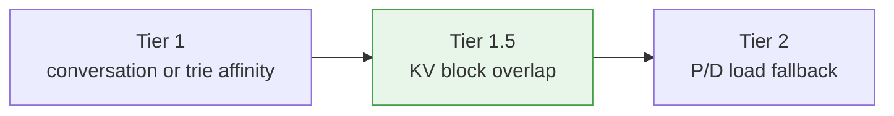

# KV-Cache-Aware Routing

Route each inference request to the vLLM worker that already holds the most of its prompt's KV blocks, so the worker skips recomputation instead of rebuilding the prefix from scratch. This is LoxiLB's flagship prefix-aware routing tier, and it works without moving a single KV tensor through the load balancer.

For the control-plane concepts and field reference, see [KV-Cache Routing](../ai-gateway/kv-caching.md). For where this tier sits in the full selection ladder, see [Routing Hierarchy](routing-hierarchy.md).

---

## 1. What it is and where it sits

vLLM keeps a **prefix cache**: the KV blocks it already computed for token prefixes it has seen. If a new request's prompt shares a prefix with blocks a particular worker still holds, sending the request to *that* worker can skip recomputation and improve time-to-first-token or throughput. Measure the effect with the deployed model and workload.

LoxiLB exploits this **without touching vLLM internals**. vLLM publishes **KV-cache events** (`BlockStored`, `BlockRemoved`, `AllBlocksCleared`) on a ZeroMQ PUB socket. LoxiLB subscribes to every prefill worker, mirrors each worker's block-hash inventory, and on each incoming request **recomputes the same block hashes vLLM would compute** for the prompt — then routes to the prefill endpoint with the highest block overlap.

In the routing ladder, this is the cache-affinity tier — it sits between exact conversation
stickiness and the topology-specific fallback:



KV-selection guard failures **fail through to the topology fallback**. That keeps a missing
tokenizer or empty inventory from blocking dispatch, but it does not hide later backend,
transfer, timeout, or P/D failures.

!!! note "Prerequisite: fullproxy"
    KV-cache-aware routing runs in the sockproxy (fullproxy) path only. The load-balancer rule must
    use `mode=4` (fullproxy). There is no eBPF fast-path involvement in this tier.

---

## 2. Architecture — inventory in Go, decision in C

The mechanism is a layered design across two planes with one call seam between them:

| Layer | Plane | Responsibility |
|---|---|---|
| **Inventory ingest** | Go control plane | One subscriber per prefill endpoint follows that endpoint's ZeroMQ KV-event stream and maintains a flat set of 64-bit block hashes for it. Handles reconnect, sequence-gap detection, and clear semantics. |
| **Request decision** | C data plane | On each proxied request: extract prompt + model, tokenize, compute the vLLM-contract block hashes, and query the Go inventory for the best-overlap prefill endpoint through the guard ladder. |
| **Selection + tokenize** | Go, called from the C plane | Argmax overlap scoring across per-endpoint inventories, honoring the prefill/excluded endpoint masks; a tokenizer pool keyed by model slug. |

Key design properties:

- **The inventory lives in Go; the decision runs in C.** The data plane calls back into the control plane twice per request — once to tokenize, once to pick the best-overlap worker. Keeping the authoritative inventory in one plane and the hot decision in the other keeps each subscriber isolated and the request path lock-scoped.
- **Per-endpoint isolation.** Each prefill endpoint has its own subscription and inventory. A near
  reconnect may preserve that inventory; a publisher clear event, an event-gap beyond the 64-event
  window, or rule teardown clears the affected state.
- **Hash parity is the whole game.** LoxiLB's C hash core must produce *bit-identical* 64-bit block hashes to vLLM's Python hash core, or the intersection is empty and routing takes the topology-specific fallback: P/D min-load in mode 1, or the configured rule selector in mode 3. The contract is frozen against a pinned vLLM release (see §5) and defended by golden vectors.

---

## 3. What exactly is synced — and why it is tiny

A common first misconception is that KV data flows through the load balancer. It does not. **No KV-cache tensor is ever transferred to or through LoxiLB.** The tensors stay inside each vLLM worker. What crosses the event bus is only a *content address* for each cached block — an 8-byte unsigned 64-bit hash. "Syncing KV information" therefore means *mirroring the set of block hashes each prefill worker currently holds*, nothing more.

The hash **is** the compressed representation of the block's KV state. There is deliberately no transport compression on this path — events are tens to hundreds of bytes of binary and latency-sensitive. The real reduction is semantic:

| Representation | Size for one 16-token block (small model, bf16) |
|---|---|
| Actual KV tensors inside the worker | ≈ 2 (K,V) × layers × KV-heads × head-dim × 16 tokens × 2 B ≈ **~1.8 MB** |
| What crosses the bus / sits in LoxiLB's inventory | **8 bytes** (one 64-bit hash) |

That is a **~200,000× reduction** on the wire. One million raw hashes are about 8 MB, but
LoxiLB's Go set, index, and ordering list add substantial memory overhead. Size the process from
measured resident memory under representative inventory, not from the raw-hash figure alone.

### Consistency model

The sync is push-based, event-driven, and eventually consistent:

- **Staleness window** = ZeroMQ propagation latency (sub-millisecond on a LAN). No polling.
- **Stale entries are harmless by construction.** If LoxiLB routes to a worker whose block was just evicted, vLLM simply recomputes that prefix — the response is always correct, only the optimization is lost. This is precisely why eventual consistency is acceptable here.
- **Reconciliation events** — `BlockRemoved` (worker evicted blocks) and `AllBlocksCleared` (worker reset its cache) keep the mirror honest in the shrinking direction.
- **Gap handling** — the retained event window is 64. A small detectable gap keeps inventory;
  a gap beyond the window clears it. The live receive loop has no replay callback, so replay is
  available only during fresh/bootstrap synchronization, not as an automatic repair for every gap.
- **Reconnect handling** — a near reconnect preserves inventory. This reduces cold misses but
  means a missed remove event can leave stale affinity until a later clear or large-gap reset.

---

## 4. End-to-end call flow

**Control path (rule creation).** An operator POSTs a load-balancer rule with `kvExactMode: 1` and endpoints tagged prefill / decode. For every prefill endpoint, LoxiLB starts a subscriber that dials the worker's ZeroMQ port. Initial dial failure does not kill the subscriber — it retries on an interval, so the rule can be created before vLLM is up. (A warmup window — Guard B — is defined in the guard ladder but is currently inert; see §7.)

**Ingest path (event → inventory).** vLLM publishes a multi-frame message `[topic | sequence | payload]`. `BlockStored` adds hashes, `BlockRemoved` removes them, and `AllBlocksCleared` empties the set. Sequence handling uses a 64-event window: small gaps keep state, while large gaps clear it. Rebuilding a live socket does not itself clear inventory or replay missed events.

**Request path (request → worker).** For each proxied request on a `kvExactMode=1` rule, the data plane runs the guard ladder (§7):

1. **Extract** prompt text and model from the request. The body must be OpenAI JSON (`{"model": ..., "prompt"/"messages": ...}`); a `text/plain` body leaves the model empty and takes the topology-specific fallback.
2. **Tokenize** the prompt via the control-plane tokenizer pool, loading the model's staged `tokenizer.json`.
3. **Hash** each block: for every `kvBlockSize`-token block, CBOR-encode `[parent_hash, [token_ids...], extra]`, hash it, truncate to a 64-bit value, and chain the full digest as the next block's parent (§5).
4. **Select** by argmax of block-overlap count across the prefill endpoints not in the excluded mask. Ties resolve by endpoint order.
5. **Post-filter** the winner: it must not be excluded, administratively down, or behind an open circuit breaker. On a connect failure the caller retries with the winner excluded, so the *second-best* overlap endpoint wins — never a decode endpoint, never plain round-robin.
6. On a mode-1 guard miss, selection falls to P/D minimum load with round-robin only as a tie-break. In mode 3 it falls to the configured rule selector. On success the hit counter for the chosen endpoint increments.

### Worked example — two prompts, end to end

Topology: two prefill endpoints (EP0, EP2) and one decode endpoint (EP1); `kvBlockSize=16`, `kvHashAlgo=sha256_cbor`, inventory populated. Both clients share an application **system preamble** that tokenizes to exactly 32 tokens (two full blocks) — the classic shared-prefix pattern (RAG preamble, few-shot header, system prompt).

- **Prompt A** (Client A): preamble + question A → 40 tokens → blocks `B1` (t1–16), `B2` (t17–32), `B3` (t33–40, partial).
- **Prompt B** (Client B): *same preamble* + question B → 38 tokens → `B1`, `B2` identical, `B3'` different.

Because block hashing is a deterministic chain over `(parent, token_ids)`, identical token prefixes produce identical `h1, h2` on every party that implements the contract — vLLM and LoxiLB compute the same values independently, without ever exchanging them.

1. **Cold request.** Prompt A tokenizes to 40 tokens; LoxiLB computes `h1, h2, h3`. Both inventories are empty, so `no_worker` sends this mode-1 request to P/D minimum load (round-robin breaks a tie), which happens to pick EP0. (LoxiLB also hashes the partial block `B3`; vLLM only *stores* full blocks, so `h3` simply never matches anything — harmless, since scoring is an overlap *count*.)
2. **First inference.** EP0's prefill computes KV for all 40 tokens and caches blocks `B1, B2`. In a prefill/decode topology the KV then moves prefill→decode over vLLM's own connector — LoxiLB routes requests, it never participates in that transfer. Decode generates the reply, which streams back to Client A through the proxy.
3. **The sync.** Storing `B1, B2` makes EP0 emit one `BlockStored` event (~60 wire bytes). LoxiLB's mirror of EP0 now reads `{h1, h2}` — 16 bytes representing several megabytes of worker-side KV.
4. **Warm request.** Prompt B shares the 32-token preamble, so LoxiLB derives the *same* `h1, h2` purely by local computation. Scoring gives EP0 = 2, EP2 = 0 → argmax routes to EP0 and the hit counter increments. EP0's prefix cache hits on `B1, B2`, so prefill runs only over the short question-B suffix instead of the full 38 tokens — markedly lower TTFT. Had the request gone to EP2, EP2 would have recomputed everything: correct but slow.

**Failure-mode coda.** A near reconnect can preserve `{h1, h2}`; a large sequence gap clears it.
Because the live loop does not replay missed events, preserved state can be briefly stale. A
subsequent mode-1 `no_worker` uses P/D minimum load. If EP0 instead refuses the connection, retry
re-enters the tier with EP0 excluded and selects the next-best eligible prefill endpoint.

---

## 5. The vLLM block-hash parity contract

Parity is **all-or-nothing**: any one mismatched leg yields 0% hash overlap and a silent
topology-specific fallback. The contract has three legs that must match between LoxiLB and every
vLLM prefill worker:

1. **Block size.** vLLM's `--block-size` must equal the rule's `kvBlockSize` (both `16` in the reference). CPU vLLM defaults to `128` and emits **zero** `BlockStored` events for prompts shorter than 128 tokens — run CPU vLLM with `--block-size 16`.
2. **Hash algorithm.** vLLM's `--prefix-caching-hash-algo` must equal the rule's `kvHashAlgo`, one of `sha256_cbor` or `xxhash_cbor`. vLLM's *own* default is a non-portable pickle-based `sha256` — you must explicitly select a `*_cbor` variant so both sides agree.
3. **NONE_HASH seed.** vLLM's `PYTHONHASHSEED` must equal LoxiLB's `LLB_KV_NONE_HASH_SEED`. This seeds the first block's parent (`NONE_HASH`); a mismatch corrupts *every* chained hash. Current Gateway main requires the Gateway value to be nonempty and at most 23 bytes for every vLLM KV-exact rule; an unset or empty value is refused before mutation with HTTP `412`.

Two more mechanical requirements complete the contract:

- **64-bit truncation = the last 8 digest bytes, big-endian.** The 64-bit value is `int.from_bytes(digest, 'big') & ((1<<64)-1)` — i.e. the trailing 8 bytes. (Using the *leading* 8 bytes yields 0% overlap.) The next block's parent is the **full** digest, not the truncated value.
- **Integer block hashes on the wire.** vLLM must run with `VLLM_KV_EVENTS_USE_INT_BLOCK_HASHES=1` so hashes are published as integers; LoxiLB's ingest accepts integer types only. The CBOR envelope and this integer flag together are what make the streams comparable.

By default vLLM binds its KV-event PUB socket on **port 5557**, which matches the rule's `kvZmqPort` default.

The Gateway also applies `LLB_KV_MIN_MATCH_TOKENS` before scoring: default `16`, valid range
`0–4096`, and `0` disables this minimum-token guard. Prompts below the configured threshold
record the `shallow` miss reason and follow the topology-specific fallback.

!!! warning "Silent failure on any contract mismatch"
    Get block size, hash algorithm, seed, or tokenizer wrong and there is **no error** — hashes
    simply never match, inventory overlap stays 0, and routing quietly takes the mode-specific
    fallback (P/D min-load for mode 1; configured selector for mode 3).
    Always verify engagement with the metrics in §9 rather than assuming it worked.

---

## 6. Parity preflight — inspect what is actually running

The parity contract in §5 is only worth anything if the *running* engine and the *running* loxilb agree on it. Deploy scripts drift from live containers; someone edits an env var by hand; an image tag rolls. Before you send a single request, run this **read-only** preflight — it inspects what the containers were launched with, not what you meant to launch them with.

### 6.1 The parity triad as an operational checklist

All three legs must agree, or you are measuring the fallback selector instead of KV-exact:

| # | Leg | Engine side | loxilb side | Rule field |
|---|---|---|---|---|
| 1 | Hash seed | `PYTHONHASHSEED=0` | `LLB_KV_NONE_HASH_SEED=0` | — |
| 2 | Block / page size | vLLM `--block-size 16` (SGLang: effective page size) | — | `kvBlockSize` == that value |
| 3 | Hash algorithm | `--prefix-caching-hash-algo *_cbor` | — | `kvHashAlgo` matches |

The seeds must be *equal*, nonempty, and the Gateway value must be at most 23 bytes. `0` on both
sides is the reproducible value the rest of these docs assume.

On current Gateway main, query `GET /netlox/v1/status/capabilities` before rule creation and
require `kv_exact_vllm.ready=true`. This catches an unset or oversized Gateway seed before a
request is submitted; it does not validate the engine-side seed or the other parity legs.

### 6.2 The read-only preflight — read the live container, not the script

Never trust the deploy script; read what Docker actually launched. These commands mutate nothing:

```bash
# the engine's real launch command (flags exactly as passed)
docker ps --no-trunc --format '{{.Names}}\t{{.Command}}' | grep -E 'vllm|sglang'

# the engine's real environment — confirm the seed and int-hash flag
docker inspect <engine-container> \
  --format '{{range .Config.Env}}{{println .}}{{end}}' \
  | grep -E 'PYTHONHASHSEED|VLLM_KV_EVENTS_USE_INT_BLOCK_HASHES'

# loxilb's real environment — confirm the seed matches and note the LB knobs
docker inspect <loxilb-container> \
  --format '{{range .Config.Env}}{{println .}}{{end}}' \
  | grep -E 'LLB_KV_NONE_HASH_SEED|LOXILB_KV_LB_MODE|LLB_PD_PREFILL_TIMEOUT_SEC'
```

If `PYTHONHASHSEED` and `LLB_KV_NONE_HASH_SEED` differ, every seeded block hash is corrupt and
overlap will read zero. Current Gateway main refuses an unset, empty, or longer-than-23-byte
Gateway seed before rule mutation; an unset engine seed or a nonmatching nonempty value still
breaks parity. Fix that before doing anything else. Select a reviewed, immutable tag or digest
from the `ghcr.io/loxilb-io/loxilb-inference-gateway` image repository; do not derive production
behavior from a moving tag.

### 6.3 Tested-artifact rule

Do not infer support from an OS, kernel, driver, or engine version table in a guide. Record the
exact immutable Gateway and engine image identities plus the host/kernel/GPU-driver tuple used
by your own acceptance test. Promote only that tested combination; retest after changing any
member. Keep `--max-model-len` consistent across a pool.

### 6.4 vLLM metric families the collector needs

loxilb's telemetry collector consumes a fixed set of vLLM Prometheus families. A missing one does not raise an error — it silently invalidates the decision it feeds:

| Family | Note |
|---|---|
| `vllm:num_requests_waiting`, `vllm:num_requests_running` | queue / load signals |
| `vllm:kv_cache_usage_perc` | the v1-engine name — the **v0 engine called it `gpu_cache_usage_perc`**; watch for this drift when reading dashboards |
| `vllm:cache_config_info` | carries `num_gpu_blocks` (the capacity fingerprint) |
| `vllm:prompt_tokens_total`, `vllm:generation_tokens_total` | throughput |
| `vllm:time_to_first_token_seconds` | histogram — the `_bucket` series must exist |

!!! warning "Lazy metric registration — warm up before you assert"
    vLLM registers its request-stat families **only after the first request**. Assert the metric
    schema against a *warmed* engine — fire one warm-up request before scraping. On a cold engine the
    request-stat families read as "missing" and you will chase a phantom collector bug that does not
    exist.

### 6.5 loxilb runtime env worth setting explicitly

| Variable | Default | Set to | Why |
|---|---|---|---|
| `LLB_PD_PREFILL_TIMEOUT_SEC` | `30` | `180` for long context | At ~32k-token prompts the default trips a `504 pd_prefill_timeout` before prefill completes. |
| `LOXILB_KV_LB_MODE` | unset → `hard` | `off` \| `hard` \| `soft` \| `adaptive` \| `adaptive-soft` | Sets the load-blend policy (see §12); set it explicitly for reproducible runs rather than leaning on the built-in default. |
| `LLB_KV_HASH_DEBUG` | unset | `1` | Surfaces per-block hash decisions for byte-level parity forensics; zero cost when unset. |

---

## 7. Guard ladder & miss reasons

Every KV-exact attempt runs a fixed ladder. Each miss increments one reason counter, then follows
the topology's fallback: P/D mode 1 continues to Tier-2 prefill selection, while role-less mode 3
continues to the rule's configured selector.

| Check | Fires when… | `reason` label |
|---|---|---|
| Feature enabled | `kvExactMode == 0` (feature off for this rule) | `mode_off` |
| Warmup timer | *(currently inert)* The field defines a delay, but the production path never arms its start timestamp; this check does not currently fire. | `warmup` |
| Prompt text | No prompt text in the request | `text_empty` |
| Model identity | No model resolvable from the body or `X-Model` header | `model_empty` |
| Tokenizer | Tokenizer missing or failed for the model slug | `tokenize` |
| Block hashing | Block hashes could not be computed, for example because the algorithm contract is invalid | `hashes` |
| Inventory overlap | No endpoint has positive inventory overlap | `no_worker` |
| Endpoint eligibility | The candidate is excluded, administratively down, or behind an open circuit breaker | `excluded` |

!!! note "Probe state and connect failures close different timing gaps"
    When an active probe changes an endpoint between healthy and unhealthy, the control plane
    immediately synchronizes that state to fullproxy. The P/D selector seeds its exclusion mask
    from both the synchronized inactive flag and the circuit-breaker state, so a probe-down
    endpoint cannot keep winning the KV overlap calculation. A connection can still fail before
    the next probe detects it; the same request then excludes that candidate and retries another
    healthy endpoint. Use both mechanisms: probes provide proactive state, while connect-failure
    retry covers the detection window.

---

## 8. Configuration

### 8.1 REST — the load-balancer rule

Create one fullproxy (`mode=4`) rule per model. Tag prefill endpoints `ep_role: 1` and decode endpoints `ep_role: 2`; only prefill endpoints are subscribed for KV events.

!!! warning "Protect the management API"
    The `curl` examples use plain HTTP for an isolated lab. In production, use an authenticated,
    TLS-protected management endpoint and read its authorization header from a
    permission-restricted file.

=== "curl"
    ```bash
    curl -s -X POST http://10.10.10.254:11111/netlox/v1/config/loadbalancer \
      -H 'Content-Type: application/json' -d '{
      "serviceArguments": {
        "externalIP": "10.10.10.254",
        "port": 8080,
        "protocol": "tcp",
        "sel": 3,
        "mode": 4,
        "pd_disagg_mode": true,
        "kvExactMode": 1,
        "kvZmqPort": 5557,
        "kvHashAlgo": "sha256_cbor",
        "kvBlockSize": 16,
        "kvWarmupSec": 30
      },
      "endpoints": [
        { "endpointIP": "192.0.2.1", "targetPort": 8000, "weight": 1, "ep_role": 1 },
        { "endpointIP": "192.0.2.2", "targetPort": 8000, "weight": 1, "ep_role": 2 }
      ]
    }'
    ```
=== "loxicmd"
    ```bash
    loxicmd create lb 10.10.10.254 --tcp=8080:8000 --endpoints=192.0.2.1:1,192.0.2.2:1 --mode=fullproxy --select=persist --pd-disagg --kv-exact-mode=1 --kv-zmq-port=5557 --kv-hash-algo=sha256_cbor --kv-block-size=16 --kv-warmup=30 --ep-role=prefill,decode
    ```

KV fields (all match the swagger `serviceArguments` defaults):

| Field | Default | Range / values | Meaning |
|---|---|---|---|
| `kvExactMode` | `0` | `0–3` | `0`=off; `1`=P/D role-partitioned; `2`=reserved; `3`=role-less single pool. This vLLM guide uses mode 1. |
| `kvBlockSize` | `16` | ≥1 | Must equal vLLM `--block-size`. |
| `kvHashAlgo` | engine-derived when omitted | `sha256_cbor`, `xxhash_cbor`, `sha256_sglang`, `blockhash_trtllm` | For this vLLM guide, use a coherent `*_cbor` value matching `--prefix-caching-hash-algo`. |
| `kvZmqPort` | `5557` | `1–65535` | The worker's KV-event PUB port. |
| `kvWarmupSec` | `30` | ≥0 | Guard-B window — accepted but currently inert (Guard B never fires; see §7). |
| `kvEngineType` | `vllm` | `vllm`, `sglang`, `trtllm`, `llamacpp` | Engine identity; immutable after rule creation. llama.cpp rejects KV-exact fields. |
| `kvDpRankCount` | `1` | `1–8` | SGLang data-parallel rank count; keep `1` for this vLLM guide. |

### 8.2 Environment variables (LoxiLB process)

| Variable | Purpose |
|---|---|
| `LLB_KV_NONE_HASH_SEED` | Required nonempty NONE_HASH seed for vLLM KV-exact; at most 23 bytes and **must equal vLLM's `PYTHONHASHSEED`**. Current Gateway main refuses an unset, empty, or oversized value with HTTP `412`. |
| `LLB_KV_HASH_DEBUG=1` | Emit one hash-debug log line per computed block (hash + CBOR hex) for byte-level parity forensics. Zero cost when unset. |

### 8.3 Tokenizer staging

Stage the model's HuggingFace `tokenizer.json` at `/etc/loxilb/tokenizers/<model-slug>/tokenizer.json`, where the slug replaces `/` with `__` (e.g. `Qwen/Qwen3-0.6B` → `Qwen__Qwen3-0.6B`). No network fetch happens at runtime; a missing tokenizer fires Guard E and uses the topology fallback.

### 8.4 vLLM side (must match the rule)

```bash
PYTHONHASHSEED=0 VLLM_KV_EVENTS_USE_INT_BLOCK_HASHES=1 \
vllm serve Qwen/Qwen3-0.6B --block-size 16 \
  --prefix-caching-hash-algo sha256_cbor \
  --kv-events-config '{"enable_kv_cache_events": true, "publisher": "zmq",
                       "endpoint": "tcp://*:5557"}'
```

Use the upstream `vllm/vllm-openai` image. On CPU builds, remember `--block-size 16` (the CPU default of 128 suppresses events for short prompts).

### 8.5 Onboarding a new model (one model per rule)

LoxiLB is model-agnostic — no rebuild is needed to serve a different model. Onboarding is pure config plus file staging. The catch is that the tokenizer, `kvBlockSize`, and `kvHashAlgo`/vLLM-version are per-deployment facts you must get right, and getting them wrong **fails silently**. The recommended production topology is **one model per rule**, so each rule carries exactly one correct set of KV parameters.

Per-model prerequisites:

| # | Requirement | Failure mode if wrong |
|---|---|---|
| 1 | Model ships a fast HF `tokenizer.json` | Sentencepiece-only models won't load → Guard E → topology-specific fallback. Convert first. |
| 2 | Tokenizer staged at the exact slug path (dir name = client model string with `/`→`__`) | Mismatch → "tokenizer not available" → Guard E → fallback selector. |
| 3 | `kvBlockSize` equals this deployment's vLLM `--block-size` | Mismatch → 0 overlap → fallback selector. |
| 4 | `kvHashAlgo` + vLLM version match the pinned contract | Different hash scheme → hashes never match → fallback selector. |
| 5 | `LLB_KV_NONE_HASH_SEED` == vLLM `PYTHONHASHSEED` | Seed mismatch corrupts seeded blocks → partial silent miss. |
| 6 | Prefill endpoint tagged `ep_role: 1` | Only prefill endpoints are subscribed → empty inventory → fallback selector. |

---

## 9. Verify it actually fired — the mandatory post-config check

**Run this every time you create or change a KV rule.** Because every parity failure degrades
*silently* to a topology-specific fallback, a config that "looks fine" and a config that is quietly
KV-blind are indistinguishable without this check. Treat the four steps below as a go/no-go gate:
until all four pass, any TTFT or throughput number reflects the fallback, **not** KV-aware routing.

### 9.1 Step 1 — the engagement assertion on `GET /netlox/v1/metrics`

=== "curl"
    ```bash
    curl -s http://10.10.10.254:11111/netlox/v1/metrics \
      | grep -E 'loxilb_pd_kv|kv_subscriber_connected'
    ```
=== "loxicmd"
    !!! info "loxicmd"
        `loxicmd get metrics` reports only whether metrics are enabled; scrape the `/netlox/v1/metrics` endpoint directly for series.

Assert, in order:

| Assertion | Meaning | If it fails |
|---|---|---|
| `loxilb_pd_kv_blocks{service,ep_idx} > 0` | inventory ingested from at least one prefill endpoint | events not arriving — check `kvZmqPort` vs the publisher and the `ep_role: 1` tag |
| `loxilb_pd_kv_tier15_hits_total` **advances after the first cold request** | the tier is making real decisions | **flat delta = broken parity; you are measuring the fallback → ABORT** and walk the §5 / §6 checklist before benchmarking |
| `loxilb_pd_kv_tier15_fallthrough_total` stays roughly flat under warm traffic | requests aren't leaving tier 1.5 | rising fallthrough = overlap not scoring; mode 1 then uses P/D min-load, while mode 3 uses its selector |

The middle assertion is the whole test. Fire one **cold** request to populate the inventory, then a **warm** request that shares its prefix; `loxilb_pd_kv_tier15_hits_total` **must** increment. A flat counter means overlap is zero and the tier is inert — abort and fix parity, rather than benchmarking the fallback selector.

### 9.2 Step 2 — inventory check

=== "curl"
    ```bash
    curl -s "http://10.10.10.254:11111/netlox/v1/config/ai/kv/inventory?service_id=<id>&ep_idx=0"
    ```
=== "loxicmd"
    ```bash
    loxicmd get kvinventory --service-id=<id> --ep-idx=0
    ```

Confirm each prefill endpoint's block gauge is **non-zero** within the ingest window. A zero gauge after warm traffic almost always means `kvBlockSize` ≠ the engine's effective block/page size.

### 9.3 Step 3 — subscriber count

`kv_subscriber_connected` should climb by **N** after you create an N-prefill-endpoint rule. Fewer than N means a subscriber failed to dial its publisher — re-check the endpoint's `kvZmqPort` and that the engine is up.

### 9.4 Step 4 — publisher-side sanity (on the engine host)

```bash
ss -tln | grep :5557
```

This must show at least one listener. If it is empty, the engine's `--kv-events-config` never took effect and **no events are being published at all** — loxilb has nothing to subscribe to. (Substitute the port you set on the engine and in `kvZmqPort`.)

---

## 10. Verify — inventory & metrics reference

Section 9 is the go/no-go gate; this section is the deeper reference for the same signals once the tier is live.

### 10.1 Inspect the live inventory

=== "curl"
    ```bash
    # per-endpoint 64-bit hash inventory (raw-middleware endpoint)
    curl -s "http://10.10.10.254:11111/netlox/v1/config/ai/kv/inventory?service_id=<id>&ep_idx=0"
    ```
=== "loxicmd"
    ```bash
    # per-endpoint 64-bit hash inventory
    loxicmd get kvinventory --service-id=<id> --ep-idx=0
    ```

Shortly after startup under cache-friendly traffic (allow the subscriber a few seconds to ingest KV events), a prefill endpoint's inventory should be **non-empty**.

### 10.2 Prometheus metrics

| Metric | Labels | Meaning |
|---|---|---|
| `loxilb_pd_kv_tier15_hits_total` | `ep_idx` | The tier selected this endpoint (the **decision** proof). |
| `loxilb_pd_kv_tier15_miss_reason_total` | `reason` | One increment per guard miss (`mode_off`, `warmup`, `text_empty`, `model_empty`, `tokenize`, `hashes`, `no_worker`, `excluded`, `shallow`). |
| `loxilb_pd_kv_tier15_fallthrough_total` | — | Requests that left KV-exact; mode 1 uses P/D min-load and mode 3 uses its configured selector. |
| `loxilb_pd_kv_blocks` | `service`, `ep_idx` | Inventory size per endpoint. |
| `loxilb_kv_subscriber_connected` | `service`, `ep` | ZeroMQ socket up (1) / down (0). |
| `loxilb_kv_subscriber_reconnect_total` | `service`, `ep` | Successful socket rebuilds; near reconnects can preserve inventory. |
| `loxilb_kv_subscriber_recv_error_total` | `service`, `ep` | Receive errors (precede rebuilds). |

**Dual proof.** Trust neither signal alone. A metrics-only check cannot catch a proxy that *decides* correctly but *delivers* elsewhere. Confirm both: the response identifies the expected backend (delivery) **and** `tier15_hits{ep_idx}` incremented for that endpoint (decision).

### 10.3 Healthy warm-route signature

Under cache-friendly traffic you expect `tier15_hits{ep_idx}` climbing while the `miss_reason` counters stay flat, and each prefill endpoint's `pd_kv_blocks` non-zero. For byte-level parity forensics, set `LLB_KV_HASH_DEBUG=1` and compare a computed block hash against the model's vLLM-published hash for the same prompt.

---

## 11. Troubleshoot

Silent-failure decoder for "tokenizer loaded but KV-exact is still falling through":

| Symptom | Likely cause |
|---|---|
| `tier15_miss_reason{reason="model_empty"}` climbs request-for-request | Client is not sending OpenAI JSON, or the model field / `X-Model` header is missing. |
| Tokenizer loaded, inventory empty | Prefill endpoint not tagged `ep_role: 1`, wrong `kvZmqPort`, or vLLM KV-events not enabled. |
| Tokenizer loaded, inventory non-empty, overlap still 0 | `kvBlockSize`, `kvHashAlgo`/vLLM-version, or seed mismatch — walk the §5 contract, then re-run the §6 preflight. |
| Everything looks right but the tier stays cold just after start | Inventory is still filling from KV events — not `kvWarmupSec` (Guard B is currently inert). Wait for the first events to ingest, then re-check the block gauge. |
| `504 pd_prefill_timeout` on long prompts | Prefill exceeds `LLB_PD_PREFILL_TIMEOUT_SEC` (default 30) — raise to 180 for long context (§6.5). |

---

## 12. Known limits

1. **Parity is all-or-nothing.** Any mismatch in seed, block size, hash algorithm, or tokenizer yields zero overlap and a silent topology-specific fallback. Watch `tier15_miss_reason{reason="no_worker"}` against a non-empty `pd_kv_blocks`.
2. **OpenAI JSON bodies required.** A non-JSON body fires Guard D (`model_empty`) and takes the fallback selector.
3. **Reconnect can preserve stale inventory.** A near reconnect keeps state; small gaps also keep
   state, while a gap beyond the 64-event window clears it. The live loop does not replay missed
   events, so a missed remove can temporarily preserve stale affinity.
4. **Inventory has no LoxiLB-side eviction.** Sizing is governed by vLLM's own cache limits plus `BlockRemoved` / `AllBlocksCleared`.
5. **Probe and retry timing differ.** Probe-down transitions are synchronized into fullproxy and
   seed the exclusion mask. Connect-failure retry covers the interval before the prober observes
   the failure; admin-down and an open circuit breaker are also excluded.
6. **CPU vLLM defaults to `--block-size 128`** — no events for short prompts; always set `16`.
7. **`kvWarmupSec` is currently inert.** The field is accepted, validated, and stored, but the warmup timer is never armed in the current data path — the tier is **not** suppressed after subscriber start and activates as soon as routing conditions are met. Do not design procedures around the warmup window.
8. **This guide exercises P/D mode 1.** A role-less single-pool vLLM service can instead use
   `kvExactMode: 3`, which scores every endpoint and falls back to the rule selector on a miss.
   Do not mix mode 3 with P/D endpoint roles.

### Load-blind argmax → capacity-weighted blend

Raw argmax scores by overlap *count* and nothing else, so it is **load-blind**: if many clients share one hot preamble, they all route to the same prefill endpoint while its siblings idle — cache affinity actively fighting load balancing. To resolve this, LoxiLB can blend the cache-affinity winner with a CHWBL-style capacity-weighted bounded-load selector: the overlap winner keeps the route while it stays under its capacity-weighted cap, and *spills* to the next endpoint once it is over, so a hot prefix can no longer herd every request onto one worker. This blended mode is the current default and can be tuned or disabled through the process environment (`LOXILB_KV_LB_MODE`, §6.5); the pure overlap-argmax selector remains available for workloads where affinity should always win.

Two current safeguards operate around that blend:

- `LOXILB_KV_SPILL_RELIEF` defaults to auto: on for single-pool mode 3 and off for
  P/D mode 1. When enabled, an over-cap affinity owner may spill to the least-loaded
  under-cap endpoint across the full healthy fleet, even if that endpoint has zero overlap.
- `LOXILB_KV_COLDSTART_SEED_N` defaults to `16`. While an eligible endpoint has fewer than
  `LOXILB_KV_COLDSTART_MIN_BLOCKS` blocks (default `16`), every sixteenth Tier-1.5 hit seeds
  the lowest-index cold endpoint. Seeding stops as its inventory warms; set the interval to
  `0` to disable it.

Observe these paths with `loxilb_pd_kv_tier15_spills_total` and
`loxilb_pd_kv_tier15_cold_seeds_total` instead of inferring them from request distribution.

---

## 13. Advanced: AI controller (experimental)

!!! warning "Experimental — no CI coverage, default OFF"
    The AI controller is an optional, experimental component. **No automated CI scenario ships for
    it**, and it is disabled by default. Most deployments never enable it; the tiers documented above
    are the default operational path. Enable the optional controller only for a specific
    heterogeneous-fleet need and after deployment-specific failure and rollback validation.

**What it is.** `loxilb-ai-controller` is a *separate* container that consumes fleet telemetry and emits per-endpoint routing-weight advice back to loxilb — capacity- and throughput-weighted prefill selection layered on top of cache affinity. It runs as a plain container (**no host networking, no XDP**), binds to a private address, and exposes gRPC on `:18856` and a Prometheus `/metrics` endpoint on `:18857`.

**Registry YAML shape.** The controller is driven by a registry file that declares the service and the expected shape of each endpoint:

```yaml
service:
  key: "10.10.10.254:8080:tcp"   # <vip>:<port>:<proto>
  vip: "10.10.10.254"
  port: 8080
epoch_period_sec: 10             # staleness deadline = 3x epoch
hosts:
  ep0:
    gpu_model: "<gpu>"
    hbm_gb: 80
    role: prefill
    port: 8000
    ep_idx: 0
    expected_num_gpu_blocks: 8192   # calibration fingerprint
    serving_throughput_prior: 1.0
  ep2:
    gpu_model: "<gpu>"
    hbm_gb: 40
    role: prefill
    port: 8000
    ep_idx: 1
    expected_num_gpu_blocks: 4096
    serving_throughput_prior: 0.5
```

**Calibration-fingerprint fallback.** Each endpoint's *live* `num_gpu_blocks` (from `vllm:cache_config_info`) must match its declared `expected_num_gpu_blocks`. On drift, the controller treats the capacity reading as untrustworthy and **falls back to the static priors** rather than routing on a mis-provisioned or stale capacity number — a deliberate safety discipline, not a failure.

**When to use it.** Reach for the controller only on **heterogeneous fleets** — mixed GPU models or HBM sizes where you want capacity- or throughput-weighted prefill selection beyond the built-in CHWBL blend (§12). Homogeneous deployments gain nothing from it and should leave it off.

---

## 14. Advanced: LMCache tiered cache

**What it adds.** LMCache wires into vLLM as a `MultiConnector` composing `LMCacheConnectorV1` with the `NixlConnector`, adding a **CPU KV tier** (and an optional remote/P2P tier) *beneath* the GPU KV cache. When a prefix is evicted from GPU it can still be retrieved from the CPU tier instead of recomputed, extending effective prefix-cache hit rates past raw GPU capacity. It attaches to the **prefill** tier; decode nodes are excluded.

This is **orthogonal** to LoxiLB's KV-cache-aware routing: LoxiLB still routes on the block hashes vLLM publishes, exactly as described above — LMCache only changes *where inside the worker* a hit is serviced. It also carries real deployment hazards (there is no official vLLM × LMCache × NIXL compatibility matrix, nested NIXL has cache-layout requirements, and `lmcache:retrieve_hit_rate` is a stale gauge that can read `1.0` with zero retrieves) and should be gated before rollout.

For the full connector configuration, the authoritative `lmcache:*` metrics, and the hazard checklist, see **[KV-Cache Routing (AI Gateway)](../ai-gateway/kv-caching.md)**.

---

## Related

- [KV-Cache Routing (AI Gateway)](../ai-gateway/kv-caching.md) — control-plane concepts, field reference, and LMCache tiered-cache details.
- [Routing Hierarchy](routing-hierarchy.md) — the full selection ladder and where this tier fits.
