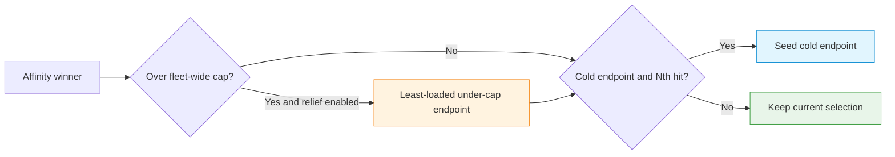

# Routing Hierarchy

How LoxiLB decides which worker serves each request: a strict, fail-through
priority ladder that prefers the strongest cache-affinity signal available, then bounds
it by load, capacity, health, and admission.

## Why a hierarchy?

vLLM keeps a **prefix cache** — the KV tensors for token prefixes it has already computed.
If a new request's prompt shares a prefix with blocks a particular worker already holds,
routing the request to *that* worker skips prefill recomputation for the shared span,
dramatically lowering time-to-first-token (TTFT) and freeing prefill capacity.

Two naive strategies both fail:

- **Plain round-robin** scatters same-prefix requests across the fleet, so every worker
  recomputes the same preamble.
- **Pure cache affinity** herds every hot-prefix request onto one worker while its siblings idle.

The routing problem is therefore **hierarchical**: prefer the strongest affinity signal
for the request, but bound it by load and capacity, and fall through gracefully when any
signal is missing. LoxiLB evaluates this as a strict priority ladder per request inside the
fullproxy (`mode:4`) data plane. Selection tiers fail through to the next tier, but admission
and terminal availability gates can return `429` or `503`; the ladder does not guarantee delivery.

!!! tip "See also"
    The Tier 1.5 block-hash contract, ZMQ inventory plane, and per-model onboarding live in
    [KV-Cache Routing](../ai-gateway/kv-caching.md) and
    [KV-Cache-Aware Routing](kv-cache-aware-routing.md).

## Terminology: "tiers" and "layers"

The selection stages are called **tiers** (Tier 0/1/1.5/2) in the routing engine; operators
often say **Layer 1 / 1.5 / 2 / 3** for the same thing. This page uses tier numbering.

| Operator shorthand | Tier | What it is |
|---|---|---|
| Layer 0 | Tier 0 | Conversation / session stickiness |
| Layer 1 | Tier 1 | Radix-trie prefix affinity (heuristic, P/D) / prefix-hash CHWBL (single-pool) |
| Layer 1.5 | Tier 1.5 | KV-exact block-hash routing (mirrors vLLM's real cache state) |
| Layer 2 | Tier 2 | Min-load fallback with round-robin tie-break |
| "Layer 3" | — (control plane) | Not a data-path tier: the adaptive selection law and the optional external controller, which *bias* Tiers 1.5/2 rather than select directly |

## The two deployment shapes

The hierarchy behaves differently depending on whether the service is **P/D-disaggregated**
(prefill and decode split across separate endpoint roles):

| Shape | Rule shape | Selection hierarchy |
|---|---|---|
| **P/D disaggregation** | `mode:4` + `pd_disagg_mode:true`, endpoints tagged `ep_role:1` (prefill) / `ep_role:2` (decode), at least one of each | The full P/D tier ladder: admission → Tier 0 → Tier 1 → Tier 1.5 → Tier 2, then decode selection |
| **Single pool** (non-disaggregated) | `mode:4`, one role-less endpoint pool (no `pd_disagg_mode`) | With `kvExactMode:3`, KV-exact scores all endpoints and a miss falls to the rule selector. Without mode 3, use the selector directly: CHWBL (`sel:8`), weighted CHWBL (`sel:10`), selector-9 modulo affinity, persist, WRR, or RR. |

!!! warning "Mode 1 and mode 3 are different selection graphs"
    `kvExactMode:1` is valid only inside a P/D ladder and scores eligible prefill endpoints.
    `kvExactMode:3` is valid only on a role-less non-P/D rule and scores every endpoint before
    falling back to that rule's selector. CHWBL (`sel:8`/`10`) remains an inventory-free
    approximation of cache locality and can be used without either KV-exact mode.

## The P/D tier ladder — one request, top to bottom

For a P/D rule, one request descends the ladder until a stage selects a **prefill** endpoint,
then a decode endpoint is chosen separately.

| Stage | Purpose | Falls through when |
|---|---|---|
| **excluded_mask seeding** | Health / circuit-breaker pre-filter: every down or CB-open endpoint is masked out of **every** tier below (so an excluded Tier-1.5 winner falls to the 2nd-best *prefill*, never straight to RR) | — (always runs) |
| **Controller fold-in** | Fold controller-DISABLED endpoints into the mask; collect the DRAINING set | No-op when no controller is attached |
| **Admission gate** (default-off) | Per-endpoint in-flight caps; when all are capped, either **park** (hold-don't-drop) or **shed** a retriable `429` | Caps unset (default) → byte-identical skip |
| **Tier 0 — session stickiness** | Pin the `(prefill, decode)` pair for a conversation | No key; pinned endpoint unhealthy / masked / CB-open / TTL-evicted |
| **Tier 1 — radix-trie prefix affinity** | Heuristic: LoxiLB's own trie of observed prefixes (not vLLM state) | `pd_cache_aware_mode` off; empty prefix; imbalance guard; `match_rate < pd_cache_threshold` |
| **Tier 1.5 — KV-exact block-hash** | Route to the prefill endpoint whose *actual* vLLM cache best overlaps the prompt, bounded by load | `kvExactMode` off; any guard miss (hash-contract, warmup, tokenize, empty inventory) |
| **Tier 2 — min-load fallback** | `score = active_conns + queued_requests`, lower wins; RR only on a genuine tie | Terminal (only returns "none" if no healthy candidate) |
| **Decode selection** | Session-pinned decode hint if valid, else min-load + RR among `ep_role:2` endpoints | — |
| **Any-healthy rescue** | Non-P/D rescue using role-0 endpoints; else `503` | None healthy → `503` |

!!! note "There is no data-path 'Tier 3'"
    Below Tier 2 is only the any-healthy rescue. What operators call "layer 3" is the control
    loop that *biases* the ladder (via the adaptive law and the optional controller), not a
    selection tier.

`LLB_KV_MIN_MATCH_TOKENS` adds a Tier-1.5 guard: default `16`, accepted range `0–4096`,
and `0` disables the minimum-token check.

### Tier 0 — session stickiness

The session key is the request's `user_id` JSON field if present, overridden by a
client-supplied `X-Conversation-Id` header (LoxiLB's own `auto-` prefixed IDs are deliberately
**not** used as stickiness keys). A hit pins the full `(prefill, decode)` pair for
`pd_session_ttl_sec`. The table is TTL-evicted and LRU-capped; a pinned endpoint that is
unhealthy, masked, or CB-open causes the key to be evicted and the ladder to continue —
**stickiness never overrides health**. A multi-turn conversation's growing KV state lives on
the workers that served the previous turns, so keeping the pair stable is the strongest
cache-affinity signal available, and it costs nothing to evaluate.

### Tier 1 — radix-trie prefix affinity (heuristic)

Enabled by `pd_cache_aware_mode:true`. LoxiLB maintains its **own** radix trie of prompt
prefixes it has routed before; the trie leaf remembers which endpoint last served that prefix.
Two REST-tunable guards keep the heuristic honest:

- **Match-rate threshold** — the matched span must cover at least `pd_cache_threshold` percent
  (default 20) of the prompt, or the affinity is judged too weak.
- **Load-imbalance guard** — if `max(active_conns) − min(active_conns)` across prefill
  endpoints exceeds `pd_balance_abs_threshold` (default 3), affinity is bypassed so a hot
  endpoint is not made hotter.

The trie tracks *what LoxiLB routed*, not *what vLLM actually holds*. It is cheap (no
tokenization, no hashing) and needs no vLLM-side configuration, but it can go stale when vLLM
evicts. Tier 1.5 tracks the truth; Tier 1 is a useful heuristic when KV-exact is not deployable.

### Tier 1.5 — KV-exact block-hash routing

The centerpiece. LoxiLB mirrors each prefill endpoint's **actual prefix-cache content** (a set
of 64-bit block hashes streamed over vLLM's ZMQ KV-events channel), recomputes the same block
hashes vLLM would compute for the prompt (tokenize → per-block canonical CBOR → hash →
truncate), scores every prefill endpoint by **overlap count**, and routes through the unified
blend law below. The mechanics — inventory plane, hash contract, and guard ladder — are
documented in [KV-Cache Routing](../ai-gateway/kv-caching.md).

### Tier 2 — min-load with RR tie-break

Despite the historical name, Tier 2 is a **min-load scorer**:

- **Default arm:** `score = active_conns + queued_requests`, lower wins.
- **Capacity-blend arm:** the scorer exists for GPU-aware (`sel:9`) rules, but its current
  activation gate checks a mutable endpoint cursor instead of the configured selector. Treat it as
  release-blocked; normal Tier 2 uses the default arm.

The round-robin counter advances **only on a genuine tie**, so it is a tie-breaker, not the
algorithm.

### Decode selection

After the prefill endpoint is chosen, decode picks: (1) the Tier-0 session-pinned decode hint
if valid; else (2) min-load among decode endpoints with its own RR tie-break. Decode endpoints
are **never** KV-selection candidates — they publish no KV events and hold no scored inventory.

### The admission gate (default-off)

Before any tier body runs, the admission gate can exclude prefill endpoints at their in-flight
cap and, when **all** are capped, either **park** the request (hold-don't-drop: enqueue on the
shortest per-endpoint FIFO, suspend the client, resume when capacity frees) or **shed** it with
a retriable `429`. A separate global valve refuses new connections beyond a total-in-flight
bound. All four knobs default to off. Treat admission as opt-in protection for latency-SLO
fleets, not a throughput optimizer.

## The unified selection law (Tier 1.5's blend modes)

Raw overlap-argmax is load-blind: 50 clients sharing one hot preamble would all route to the
same prefill endpoint. The **unified mode** bounds cache affinity by a capacity-weighted load
cap, in the spirit of CHWBL (consistent hashing with bounded loads). The mode is selected by
the `LOXILB_KV_LB_MODE` environment variable.

### The candidate set

Each prefill endpoint *i* contributes a candidate carrying:

- `overlap_i` — matched block-hash count against the prompt's hash chain;
- `load_i` — LoxiLB's **own** per-endpoint `active_conns` (not vLLM's view);
- `capacity_i` — the endpoint's advertised KV-block capacity, optionally scaled by the
  controller weight.

### `hard` mode (default) — capacity-weighted bounded load

A per-endpoint cap:

```
cap_i = ceil( (1 + ε) · totalLoad · capacity_i / totalCap )
```

with `ε` expressed as `mean_load_factor_pct = (1 + ε)·100`, default **175 ⇒ ε = 0.75**, and
`totalLoad = Σ load_i`, `totalCap = Σ capacity_i` over the candidate set. Selection:

1. **Argmax overlap among under-cap endpoints** (`load_i < cap_i`); ties → least load → lowest index.
2. If the global overlap winner was over its cap and selection moved off it, that is a **spill**.
3. **Negligible-overlap refinement:** if the best under-cap overlap is ≤ 0, pick the
   least-loaded under-cap endpoint (no affinity worth honoring).
4. **Saturated case** (all over cap): least-loaded among the positive-overlap candidates.

Intuition: an endpoint may hold its cache-affinity traffic while it carries at most `(1+ε)×`
its capacity-fair share of the current total load; beyond that, the excess spills to siblings.
Higher ε ⇒ more affinity-preserving; lower ε ⇒ more aggressive spilling.

### `soft` mode — continuous cost blend

No hard cutoff; argmin of a cost that prices both the cache miss and the queue:

```
cost_i = uncached_blocks_i · 1000  +  (λ · load_i) / capacity_i
uncached_blocks_i = promptBlocks − overlap_i
```

λ defaults to **32**; `1000` is the fixed cost scale. At zero load, soft mode reduces exactly
to overlap-argmax.

### `adaptive` / `adaptive-soft` — the load-keyed ε/λ law

No static ε/λ is optimal across load: the best values increase with load (tight ε wins at
moderate rate, loose ε at saturation). Adaptive mode scales the knob with the load the selector
itself observes:

```
L        = Σ active_conns over the candidate set
ε_eff(L) = clamp( 175 + 125·(L − 16)/10 ,  175, 300 )      // adaptive (hard-arm)
λ_eff(L) = clamp( 50000 + 5000·(L − 16) , 50000, 100000 )  // adaptive-soft
```

Below the floor anchor (L ≤ 16, the calibrated operating point) the behavior is identical to
static `hard`/`soft`; the law only loosens the bound where loosening wins, capping at the
saturation anchor (L ≥ 26). `adaptive` runs the `hard` selector with `ε_eff`; `adaptive-soft`
runs `soft` with `λ_eff` — nothing else differs.

### Mode resolution

A valid `LOXILB_KV_LB_MODE` (`off | hard | soft | adaptive | adaptive-soft`) wins outright;
garbage warns and falls back to `hard`. The **out-of-box default is `hard` with ε = 0.75**;
`off` restores pure overlap-argmax.

### Full-fleet pressure relief and cold-start seeding

The primary selector considers positive-overlap candidates. Two safeguards handle endpoints
outside that set:

1. **Pressure relief.** `LOXILB_KV_SPILL_RELIEF` lets an over-cap affinity winner spill to the
   least-loaded under-cap endpoint across the full healthy fleet, including zero-overlap
   endpoints. Unset means on for single-pool mode 3 and off for P/D mode 1. Explicit on/off
   values override every service in the process.
2. **Cold-start seeding.** While an eligible endpoint has fewer than
   `LOXILB_KV_COLDSTART_MIN_BLOCKS` blocks (default `16`), every
   `LOXILB_KV_COLDSTART_SEED_N`th Tier-1.5 hit (default `16`) is diverted to the lowest-index
   cold endpoint. The endpoint warms from that request, then leaves the cold set. Set the
   seed interval to `0` to disable this recovery path.



Use `loxilb_pd_kv_tier15_spills_total` and
`loxilb_pd_kv_tier15_cold_seeds_total` to observe these deliberate cache-locality tradeoffs.

## Resilience semantics

- **Health / CB pre-filter:** the excluded_mask guarantees an excluded Tier-1.5 winner falls to
  the 2nd-best-overlap prefill endpoint, never to a decode endpoint and never straight to RR.
- **Circuit breaker:** per-endpoint `CLOSED → OPEN → HALF_OPEN`. For P/D services this
  auto-enables with a threshold of 3 consecutive failures and a 30 s open window. CB state is
  local-only, never HA-synced.
- **Origin errors:** when the breaker is enabled, three consecutive origin 5xx responses also
  open it by default. `LLB_PD_ORIGIN_ERR_THRESHOLD=0` disables this demotion; a 4xx neither
  advances nor resets the origin-error streak. The current request still receives the origin
  response—demotion affects later selection and is not an automatic retry.
- **Probe state is synchronized:** a probe-down transition is pushed immediately into the
  fullproxy endpoint state and seeds the exclusion mask. Connect-failure retry and the circuit
  breaker cover failures that occur before the probe transition.
- **Inventory continuity has a tradeoff:** a near reconnect and a small gap preserve inventory;
  a gap beyond the 64-event window clears it. The live loop does not replay missed events, so a
  missed remove can create temporary stale affinity before later reconciliation.
- **Controller staleness glides to neutral:** if the optional external controller goes stale,
  per-endpoint weights decay toward neutral — capacity scaling relaxes back to unweighted;
  endpoints are never zero-filled or dropped by staleness alone.

## The single-pool (non-disaggregated) hierarchy

For a plain fullproxy pool (no `pd_disagg_mode`), the request path selects via the rule's
**selector algorithm** before the P/D gate. The cache-aware members of that family:

| REST `sel` | Selector | Mechanism |
|---|---|---|
| `8` | chwbl | Consistent Hash with Bounded Loads over a hash ring, keyed by **prefix_hash** |
| `9` | gpuaware | `prefix_hash % n_eps` placement on the single-pool path; the separate P/D capacity scorer is currently release-blocked |
| `10` | wrr-hash | CHWBL with endpoint **weights** folded into the ring (capacity-weighted bounded load) |

The routing-key priority is identical for all three:

1. **`prefix_hash`** — a hash over the request-derived LLM prefix and available model/context
   fields. Although the API stores CHWBL level and flag fields, the current proxy receives fixed
   flags `0` and derives the prefix scope from request content.
2. **`conv_id`** — fallback session stickiness (hash of the conversation ID).
3. **RR** — last resort.

Same-prefix requests hash to the same ring point and land on the same endpoint *while it is
under its bounded-load cap*. The current proxy uses a fixed factor of 175 (1.75× mean) and 256
virtual nodes; submitted CHWBL factor and replication fields do not currently change those values.

!!! note "What single-pool does not give you"
    `prefix_hash` is one hash of one extracted prefix — it cannot measure *partial* overlap,
    cannot see vLLM's evictions, and matches only byte-identical prefixes. In exchange it needs
    no vLLM-side config at all (no ZMQ events, no tokenizer staging, no hash-contract parity).

## Configuration

Both shapes are created with `POST /netlox/v1/config/loadbalancer` on port `11111`.

!!! warning "Protect the management API"
    The `curl` examples use plain HTTP for an isolated lab. In production, use an authenticated,
    TLS-protected management endpoint and read its authorization header from a
    permission-restricted file.

=== "curl"
    P/D-disaggregated rule with Tier 1.5 KV-exact:

    ```bash
    curl -s -X POST http://10.10.10.254:11111/netlox/v1/config/loadbalancer \
      -H "Content-Type: application/json" \
      -d '{
      "serviceArguments": {
        "externalIP": "10.10.10.254",
        "port": 2020,
        "protocol": "tcp",
        "sel": 0,
        "mode": 4,
        "host": "10.10.10.254",
        "pd_disagg_mode": true,
        "pd_cache_aware_mode": true,
        "kvExactMode": 1,
        "kvZmqPort": 5557,
        "kvHashAlgo": "sha256_cbor",
        "kvBlockSize": 16
      },
      "endpoints": [
        { "endpointIP": "192.0.2.1", "targetPort": 8100, "weight": 1, "ep_role": 1, "nixl_port": 5600 },
        { "endpointIP": "198.51.100.1", "targetPort": 8200, "weight": 1, "ep_role": 2, "nixl_port": 5600 }
      ]
    }'
    ```

    Single-pool CHWBL rule (`sel:8`) — cache affinity without P/D:

    ```bash
    curl -s -X POST http://10.10.10.254:11111/netlox/v1/config/loadbalancer \
      -H "Content-Type: application/json" \
      -d '{
      "serviceArguments": {
        "externalIP": "10.10.10.254",
        "port": 2021,
        "protocol": "tcp",
        "sel": 8,
        "mode": 4,
        "host": "10.10.10.254"
      },
      "endpoints": [
        { "endpointIP": "192.0.2.1", "targetPort": 8000, "weight": 1 },
        { "endpointIP": "198.51.100.1", "targetPort": 8000, "weight": 1 }
      ]
    }'
    ```

=== "loxicmd"
    P/D-disaggregated rule with Tier 1.5 KV-exact:

    ```bash
    # NOTE: loxicmd applies one --tcp target port to every endpoint; the decode EP's
    # targetPort 8200 (curl) cannot be set per-endpoint — post it via REST if it differs.
    loxicmd create lb 10.10.10.254 --tcp=2020:8100 --endpoints=192.0.2.1:1,198.51.100.1:1 --mode=fullproxy --select=rr --host=10.10.10.254 --pd-disagg --pd-cache-aware --kv-exact-mode=1 --kv-zmq-port=5557 --kv-hash-algo=sha256_cbor --kv-block-size=16 --ep-role=prefill,decode --nixl-port=5600,5600
    ```

    Single-pool CHWBL rule (`sel:8`) — cache affinity without P/D:

    ```bash
    loxicmd create lb 10.10.10.254 --tcp=2021:8000 --endpoints=192.0.2.1:1,198.51.100.1:1 --mode=fullproxy --select=chwbl --host=10.10.10.254
    ```

## Verify

Confirm the rule and watch the ladder engage on the metrics endpoint
(`GET http://10.10.10.254:11111/netlox/v1/metrics`):

- `loxilb_ai_pd_requests_total` advances for a P/D rule.
- `loxilb_pd_kv_tier15_hits_total{ep_idx}` advances after inventory is nonzero and repeated
  prefixes produce overlap. `kvWarmupSec` does not gate readiness because its timer is inert.
- For single-pool CHWBL, repeated same-prefix requests land on one backend; spread resumes past
  the load cap.

Field-by-field defaults, the full tuning playbook, and the observability reference are on the
[Configuration & Tuning](configuration-tuning.md) page.
