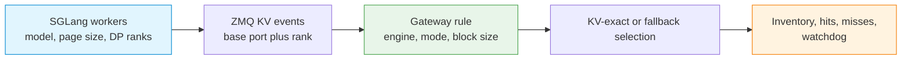

# SGLang Configuration and Tuning

Tune SGLang routing by keeping the rule topology, engine cache contract, event ports, and fallback selector coherent. Make one change at a time and verify both request success and routing metrics.

## Configuration layers



## Start with the topology

| Deployment | Required settings | Settings to avoid |
|---|---|---|
| Plain or CHWBL single pool | `mode: 4`, `kvEngineType: "sglang"` | P/D endpoint roles |
| KV-exact single pool | Add `kvExactMode: 3` | `pd_disagg_mode` |
| Base SGLang P/D | `pd_disagg_mode: true`, roles 1/2, optional `pdBootstrapPort` | `kvExactMode: 3` |
| KV-exact SGLang P/D | Add `kvExactMode: 1` | Role-less endpoints |

P/D and KV-exact are separate decisions. Establish base P/D before adding mode 1.

## Rule fields

| Field | Default | SGLang guidance |
|---|---:|---|
| `mode` | `0` | Use `4` for AI-aware routing. |
| `sel` | `0` | For single-pool cache affinity, `8` provides a content-aware fallback after a KV-exact miss. |
| `kvEngineType` | `vllm` | Set `sglang`; changing an existing rule requires delete and recreate. |
| `kvExactMode` | `0` | `3` for a role-less pool, `1` only with P/D, `0` to disable KV-exact routing. |
| `kvBlockSize` | `16` | Replace the default with the SGLang worker's effective page size when different. |
| `kvHashAlgo` | engine-derived | Omit it; the coherent SGLang value is derived automatically. |
| `kvZmqPort` | `5557` | Base publisher port for rank 0. |
| `kvDpRankCount` | `1` | Match the engine's DP rank count; supported range is 1 through 8. |
| `kvWarmupSec` | `30` | Accepted and stored, but the production warmup start timestamp is currently never armed. Treat this field as inert. |
| `pdBootstrapPort` | `0` | SGLang P/D only; `0` means port `8998`. |

### Port calculation

For base port `P` and `N` ranks, reserve and permit:

```text
P, P+1, ... P+N-1
```

The final port must not exceed `65535`. For example, base port `5561` with three ranks uses `5561`, `5562`, and `5563`.

## Safe tuning order

1. **Model readiness:** confirm every worker can serve a completion directly.
2. **Pool homogeneity:** confirm model, tokenizer, page size, and engine build agree.
3. **Fullproxy:** create a rule with KV-exact mode disabled and prove health-checked request routing.
4. **Event connectivity:** enable the SGLang KV publisher and confirm each expected rank port is reachable only from the Gateway.
5. **KV-exact routing:** set mode 3 for a single pool or mode 1 for P/D.
6. **Inventory readiness:** confirm subscriber connectivity and nonzero inventory, then send repeated-prefix requests. Do not use `kvWarmupSec` as a readiness gate; it is currently inert.
7. **Selector tuning:** adjust fallback or bounded-load settings only after metrics prove the expected mode is active.

## Verify page-size parity

Read the effective page size from the running SGLang server rather than assuming the Gateway default is correct. All endpoints behind one rule must report the same value.

```bash
curl -sS http://198.51.100.11:30000/get_server_info \
  | jq '.page_size // .pageSize'
```

Set `kvBlockSize` to the returned value. If the installed SGLang build exposes the field under a different response key, inspect the full response and use the documented effective page-size value for that build.

!!! warning "A mismatch can be silent"
    Requests can continue through fallback selection when page size or tokenizer parity is wrong. Treat nonzero inventory with zero cache hits as a configuration failure, not as proof that KV-exact routing is ineffective.

## Verify the event plane

Enable metrics first with an authenticated `POST /netlox/v1/config/metrics` as shown in
[Monitoring and Metrics](../operations/monitoring.md#enable-and-scrape-metrics), then check the
Gateway metrics after the event subscribers have connected and inventory has begun to populate:

```bash
curl --fail-with-body --silent --show-error \
  https://gateway.example.com/netlox/v1/metrics \
  | grep -E 'loxilb_kv_subscriber_connected|loxilb_kv_subscriber_(reconnect|recv_error)_total|loxilb_pd_kv_blocks|loxilb_pd_kv_tier15_hits_total|loxilb_pd_kv_zero_hit_watchdog_total'
```

Interpret them together:

| Signal | Healthy interpretation | Investigate when |
|---|---|---|
| `loxilb_kv_subscriber_connected` | Expected endpoint/rank subscribers are connected | Any required subscriber remains down |
| `loxilb_pd_kv_blocks` | Inventories grow after warm requests | Connected subscribers receive no stored events |
| `loxilb_pd_kv_tier15_hits_total` | Hits rise for repeated full-page prefixes | Inventory is nonempty but hits stay at zero |
| `loxilb_pd_kv_zero_hit_watchdog_total` | Stable after parity is established | It continues increasing under warm traffic |
| reconnect and receive-error counters | Occasional changes align with controlled restarts | Persistent growth indicates port, publisher, or network instability |

The connection gauge exposes only `service` and `ep` labels—there is no rank label. The inventory
gauge is likewise an endpoint-level union. Neither can prove that every SGLang DP rank is
contributing. Verify the expected subscriber count and each rank port separately.

## Tune the fallback selector

Single-pool mode 3 falls back to the rule's `sel` selector after a KV-exact miss.

- Use CHWBL (`sel: 8`) when repeated prompt families should stay on a consistent endpoint.
- Use round robin (`sel: 0`) when even cold-request distribution is more important than approximate prefix affinity.
- Do not judge balance from sequential requests alone. Bounded-load behavior becomes visible under concurrency.

P/D mode 1 returns to the P/D ladder after a KV-exact miss; it does not use the single-pool fallback behavior.

## Common validation errors

| Rejected shape | Correction |
|---|---|
| Mode 3 with P/D | Use mode 1 for P/D or remove P/D for a single pool. |
| Mode 3 outside fullproxy | Set `mode: 4`. |
| Mode 1 without P/D | Enable a valid role-partitioned P/D pool or use mode 3. |
| Unknown engine name | Use one of `vllm`, `sglang`, `trtllm`, or `llamacpp`. |
| More than eight DP ranks | Split the deployment or reduce rank fan-out. |
| Last rank port above `65535` | Choose a lower base port. |
| SGLang paired with another engine's explicit hash algorithm | Remove `kvHashAlgo` or set only `sha256_sglang`. |
| `pdBootstrapPort` outside SGLang P/D | Remove the field. |

## Change procedure

For changes that affect the hash space or subscriber layout:

1. Record the current rule from the read-only inventory endpoint.
2. Drain application traffic or use a controlled maintenance window.
3. Delete the rule if `kvEngineType` must change.
4. Change one of model, tokenizer, page size, rank count, or port layout at a time.
5. Recreate the rule and wait for endpoint health plus subscriber/inventory readiness.
6. Verify request success, subscriber connectivity, inventory growth, and cache hits.
7. Roll back to the previous complete rule if any parity signal fails.

## Security considerations

- Restrict the management API and ZMQ event ports with network policy or host firewall rules.
- Do not put model access tokens in command history or rule JSON.
- Do not expose `/get_server_info` publicly; it can reveal engine configuration.
- Protect logs and disable verbose payload diagnostics for sensitive workloads.
- Keep engines homogeneous and pin reviewed builds; a mixed fleet can create unpredictable compatibility and security behavior.

## Evidence limits

These settings describe implemented Gateway validation and event processing. `kvWarmupSec` is accepted but currently inert; use health and inventory signals instead. Optimal selector, memory, DP, and concurrency values depend on the engine build, model, workload, and hardware. Establish deployment-specific baselines before production rollout.

## See also

- [SGLang Routing](sglang-routing.md)
- [SGLang P/D Disaggregation](../ai-gateway/sglang-pd-disaggregation.md)
- [KV-Cache Routing](../ai-gateway/kv-caching.md)
- [Configuration Reference](../ai-gateway/configuration-reference.md)
