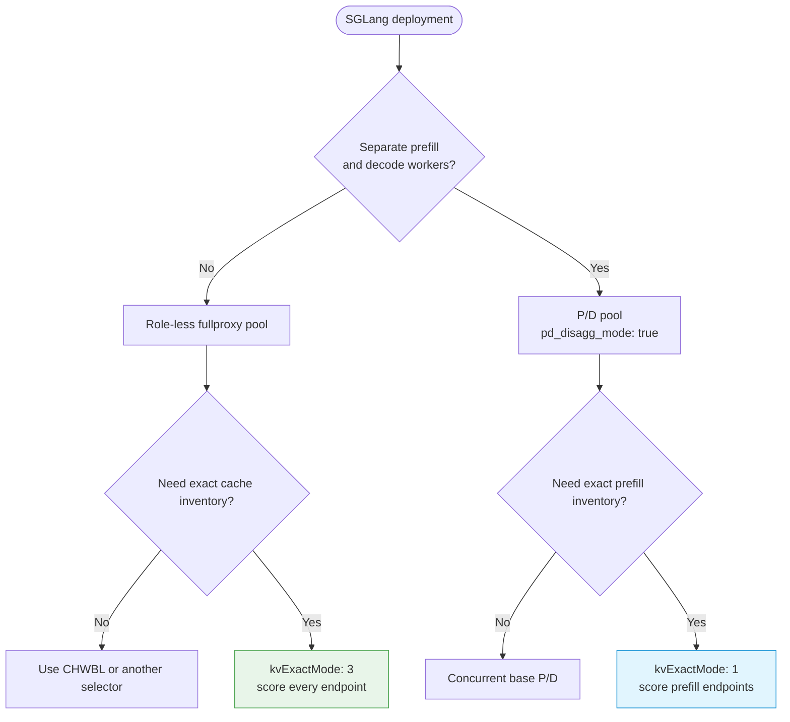
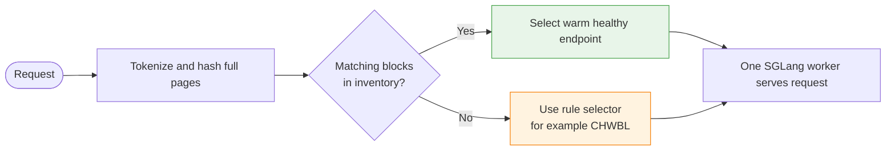

# SGLang Routing

--8<-- "snippets/common/mutation-fragment-notice.md"

Route SGLang as either a role-less single pool or a prefill/decode deployment. Both shapes use `kvEngineType: "sglang"`, but they use different request flows and different `kvExactMode` values.

## Choose the SGLang shape

| Shape | Gateway rule | Request flow | KV-exact option |
|---|---|---|---|
| Single pool | Fullproxy, role-less endpoints | One selected worker handles the full request | `kvExactMode: 3` |
| P/D | Fullproxy, `pd_disagg_mode: true`, endpoint roles | Gateway dispatches prefill and decode concurrently | `kvExactMode: 1` |



!!! warning "Modes 1 and 3 are mutually exclusive"
    Base SGLang P/D does not require `kvExactMode`. Add mode 1 only for P/D-coupled KV-exact routing. Mode 3 is rejected when P/D is enabled.

## Single-pool request path

With `kvExactMode: 3`, the Gateway subscribes every endpoint and scores the request against each endpoint's published block inventory. A cache miss uses the rule's configured selector; it does not enter the P/D session, trie, admission, or min-load ladder.



## SGLang KV parity contract

All of these values must agree:

1. The served model and Gateway tokenizer must produce the same token IDs.
2. `kvBlockSize` must equal SGLang's effective page size.
3. `kvEngineType` must be `sglang`.
4. `kvHashAlgo` should be omitted so the Gateway selects `sha256_sglang`.
5. `kvDpRankCount` must equal the publisher rank count.
6. Rank `N` must be reachable on `kvZmqPort + N`.

SGLang hashes raw token words with parent chaining and publishes one KV-event stream per data-parallel rank. The Gateway combines those rank events into one endpoint inventory because it routes to an endpoint, not to an internal rank.

## Configure a single pool

The example uses documentation-only addresses. Confirm the deployed page size before using `kvBlockSize: 16`.

!!! warning "The example inference listener is plaintext"
    `security: 0` is appropriate only for an isolated lab or a separately protected network.
    Use `security: 1` for frontend TLS termination or `security: 2` for frontend termination plus
    backend TLS, and verify certificates as described in [mTLS](../security/mtls.md).

Prepare a protected management header and an HTTPS API base URL as described in
[Monitoring and Metrics](../operations/monitoring.md#enable-and-scrape-metrics):

--8<-- "snippets/common/control-api-header.md"

=== "curl"

    ```bash
    curl --fail-with-body --silent --show-error \
      --request POST "$CONTROL_API/config/loadbalancer" \
      --header @control-plane.headers \
      --header 'Content-Type: application/json' \
      --data-binary '{
        "serviceArguments": {
          "externalIP": "192.0.2.10",
          "port": 2090,
          "protocol": "tcp",
          "mode": 4,
          "sel": 8,
          "security": 0,
          "kvExactMode": 3,
          "kvEngineType": "sglang",
          "kvDpRankCount": 1,
          "kvZmqPort": 5557,
          "kvBlockSize": 16,
          "kvWarmupSec": 30,
          "monitor": true,
          "probetype": "http",
          "probeport": 30000,
          "probereq": "/health"
        },
        "endpoints": [
          {"endpointIP": "198.51.100.11", "targetPort": 30000, "weight": 1},
          {"endpointIP": "198.51.100.12", "targetPort": 30000, "weight": 1}
        ]
      }'
    ```

=== "loxicmd"

    ```bash
    loxicmd create lb 192.0.2.10 \
      --tcp=2090:30000 \
      --endpoints=198.51.100.11:1,198.51.100.12:1 \
      --mode=fullproxy \
      --select=chwbl \
      --kv-exact-mode=3 \
      --kv-engine-type=sglang \
      --kv-dp-ranks=1 \
      --kv-zmq-port=5557 \
      --kv-block-size=16 \
      --kv-warmup=30
    ```

`--kv-warmup` maps to an accepted rule field, but the current production path does not arm
the warmup timer. Confirm subscriber connectivity and inventory growth before measuring
cache behavior.

For P/D, use the separate [SGLang P/D Disaggregation](../ai-gateway/sglang-pd-disaggregation.md) guide. Do not add endpoint roles or `pd_disagg_mode` to the single-pool rule above.

## Verify

1. Confirm the rule contains `kvEngineType: "sglang"`, `kvExactMode: 3`, and no endpoint roles.
2. Confirm all endpoint health checks pass.
3. Warm the same prompt prefix through the VIP.
4. Inspect these metric families:

   Before the first scrape, enable metrics with an authenticated
   `POST /netlox/v1/config/metrics`; see [Monitoring and Metrics](../operations/monitoring.md#enable-and-scrape-metrics).

   ```bash
   curl --fail-with-body --silent --show-error "$CONTROL_API/metrics" \
     | grep -E 'loxilb_kv_subscriber_connected|loxilb_pd_kv_blocks|loxilb_pd_kv_tier15_hits_total|loxilb_pd_kv_zero_hit_watchdog_total'
   ```

Expected signals:

- one connected-subscriber series per service endpoint, plus independent confirmation that every configured rank port is publishing;
- nonzero inventory after cache events arrive;
- increasing Tier-1.5 hits under repeat-prefix traffic;
- no continuing zero-hit watchdog growth.

## Failure diagnosis

| Symptom | Likely cause | Fix |
|---|---|---|
| Rule rejects mode 3 | P/D is enabled or fullproxy is missing | Remove P/D fields and set `mode: 4`. |
| Rank subscribers fail | Port range is blocked or exceeds `65535` | Open the complete consecutive range or move the base port. |
| Inventory is empty | SGLang event publishing is disabled or ports do not match | Verify publisher configuration and reachability. |
| Inventory grows but hits remain zero | Page size, tokenizer, or hash contract differs | Match parity settings and omit `kvHashAlgo`. |
| Hot prefix overloads one endpoint | Affinity dominates while concurrency rises | Use CHWBL as fallback and review bounded-load settings. |
| Engine change is rejected | `kvEngineType` is immutable | Delete and recreate the rule. |

## Cleanup

```bash
curl -sS -X DELETE \
  --header @control-plane.headers \
  "$CONTROL_API/config/loadbalancer/externalipaddress/192.0.2.10/port/2090/protocol/tcp"
```

Remove `control-plane.headers` after the workflow and unset `CONTROL_PLANE_TOKEN`.

## Security and evidence limits

- Expose ZMQ publisher ports only to the Gateway. They are operational event feeds, not public APIs.
- Keep tokenizer assets and model identity controlled; mixing models behind one rule invalidates cache routing.
- Avoid verbose payload diagnostics when requests can contain sensitive data.
- Configuration acceptance and metrics do not prove a performance improvement. Validate cache hits and latency with representative prompts and the production engine build.

## See also

- [SGLang Configuration and Tuning](sglang-configuration-tuning.md)
- [SGLang P/D Disaggregation](../ai-gateway/sglang-pd-disaggregation.md)
- [vLLM and SGLang Routing](vllm-vs-sglang.md)
- [Engine Capability Matrix](../concepts/engine-capability-matrix.md)
