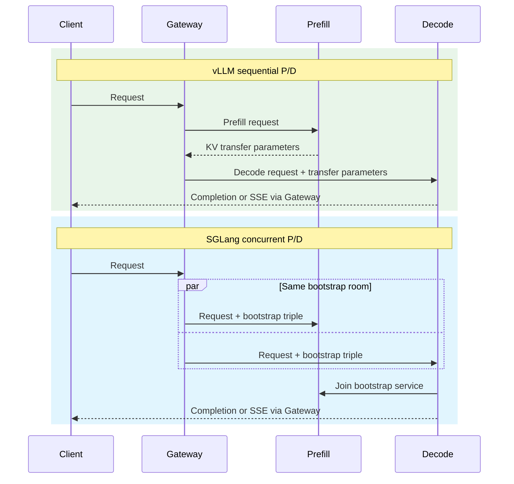

# vLLM and SGLang Routing

Compare the Gateway contracts for vLLM and SGLang without assuming that either engine has only one topology. Both engines can use P/D or single-pool routing, but their request dialects and KV hash contracts are different.

## Topology comparison

| Topic | vLLM | SGLang |
|---|---|---|
| Plain fullproxy pool | Supported | Supported |
| Single-pool KV-exact | `kvExactMode: 3` | `kvExactMode: 3` |
| P/D | Sequential prefill then decode | Concurrent prefill and decode |
| P/D KV-exact | `kvExactMode: 1`, prefill endpoints scored | `kvExactMode: 1`, prefill endpoints scored |
| Engine identity | `kvEngineType: "vllm"` or omitted | `kvEngineType: "sglang"` |
| Engine-specific transfer field | Endpoint `nixl_port` | Service `pdBootstrapPort` |



The important correction is that SGLang is not restricted to a single-role pool. Use either:

- role-less `kvExactMode: 3` for converged workers; or
- `pd_disagg_mode: true` with roles 1/2 for concurrent SGLang P/D, optionally adding `kvExactMode: 1`.

## KV event transport

Both integrations consume ZMQ KV events, but the publisher layout differs.

| Item | vLLM | SGLang |
|---|---|---|
| Publishers used in P/D mode 1 | Prefill endpoints | Prefill endpoints |
| Publishers used in single-pool mode 3 | Every endpoint | Every endpoint |
| Publisher count per endpoint | Normally one | One per configured DP rank |
| Port layout | `kvZmqPort` | `kvZmqPort + rank` |
| Rule rank setting | Default one | `kvDpRankCount` must match the engine |

For SGLang, reserve the entire consecutive rank-port range and keep it reachable only from the Gateway. A rank count greater than eight is rejected.

## Hash-contract comparison

The two engines' block hashes are not interchangeable.

| Contract element | vLLM | SGLang |
|---|---|---|
| Effective default | `sha256_cbor` | `sha256_sglang` |
| Request block encoding | Canonical CBOR | Raw token words with parent chaining |
| Digest truncation | Last eight digest bytes | First eight digest bytes |
| First-block seed | Depends on the vLLM seed contract | No vLLM-style seed |
| Size parity | `kvBlockSize` equals vLLM block size | `kvBlockSize` equals SGLang page size |
| Recommended `kvHashAlgo` | Omit unless an explicit tested value is needed | Omit |

!!! warning "Do not reuse engine-specific parity settings"
    A vLLM rule pointed at SGLang events, or an SGLang rule configured with a vLLM hash algorithm, produces no useful overlap. The Gateway rejects incoherent explicit engine/algorithm pairs, but tokenizer and block-size mismatches can still appear as ordinary cache misses.

## Which routing shape should you use?

| Need | vLLM choice | SGLang choice |
|---|---|---|
| Simplest healthy pool | Plain fullproxy | Plain fullproxy |
| Approximate prompt-family affinity | CHWBL | CHWBL |
| Exact inventory in one converged pool | Mode 3 | Mode 3 |
| Separate prefill and decode capacity | Sequential P/D | Concurrent P/D |
| Exact prefill inventory inside P/D | Mode 1 | Mode 1 |

Start with the least complex shape that meets the workload goal. P/D adds transfer networking and paired failure handling. KV-exact routing adds tokenizer, block-size, hash, event-port, and inventory-readiness requirements. The accepted `kvWarmupSec` field is currently inert, so verify readiness from subscriber and inventory metrics.

## Operational differences

### vLLM

- The Gateway waits for the prefill response before constructing the decode request.
- Prefill output carries the transfer parameters used by decode.
- `nixl_port: 0` uses the endpoint target port; a dedicated side-channel port can be set per endpoint.
- vLLM hash parity includes its block size, tokenizer, selected hash algorithm, and seed contract.

### SGLang

- The Gateway must send both legs concurrently with one fresh bootstrap room.
- `pdBootstrapPort: 0` selects port `8998`; a nonzero value is accepted only for SGLang P/D.
- A decode endpoint must reach the selected prefill endpoint's bootstrap service.
- Data-parallel ranks publish on consecutive ZMQ ports and are combined into an endpoint-level inventory.

## Verification checklist

For either engine:

- [ ] The rule read-back shows the intended `kvEngineType` and topology.
- [ ] Every endpoint reports model readiness and passes the Gateway health probe.
- [ ] Non-streaming and SSE requests complete.
- [ ] P/D logs or engine metrics show both roles handled the request.
- [ ] Every expected KV subscriber connects before cache testing.
- [ ] Inventories grow after warm traffic.
- [ ] Tier-1.5 hit counters increase on repeat full-block prefixes.
- [ ] Zero-hit watchdog counters do not continue increasing.
- [ ] A controlled endpoint failure does not leave requests hanging.

Before running the metrics check, enable metrics with an authenticated
`POST /netlox/v1/config/metrics`; see [Monitoring and Metrics](../operations/monitoring.md#enable-and-scrape-metrics).

```bash
curl --fail-with-body --silent --show-error \
  https://gateway.example.com/netlox/v1/metrics \
  | grep -E 'loxilb_kv_subscriber_connected|loxilb_pd_kv_blocks|loxilb_pd_kv_tier15_hits_total|loxilb_pd_kv_zero_hit_watchdog_total'
```

## Security considerations

- Restrict management and ZMQ event ports to trusted networks.
- Restrict vLLM NIXL and SGLang bootstrap reachability to the role endpoints that require it.
- Keep model and tokenizer artifacts controlled and consistent across a rule.
- Avoid debug logging of prompts and transfer objects for sensitive workloads.
- Treat cache affinity and session stickiness as routing behavior, not access control.

## Evidence limits

This comparison describes implemented configuration validation and request/event paths. It does not claim equivalent performance between engines, models, or topologies. Benchmark the exact engine builds, model, prompt distribution, GPU hardware, and network used in production.

## Other engines

TensorRT-LLM uses a destructive HTTP event drain rather than ZMQ. llama.cpp supports fullproxy, CHWBL, and session affinity but not Gateway KV-exact routing or P/D. See the [Engine Capability Matrix](../concepts/engine-capability-matrix.md) for the complete four-engine view.

## See also

- [SGLang Routing](sglang-routing.md)
- [SGLang Configuration and Tuning](sglang-configuration-tuning.md)
- [SGLang P/D Disaggregation](../ai-gateway/sglang-pd-disaggregation.md)
- [vLLM Integration](../ai-gateway/vllm-integration.md)
