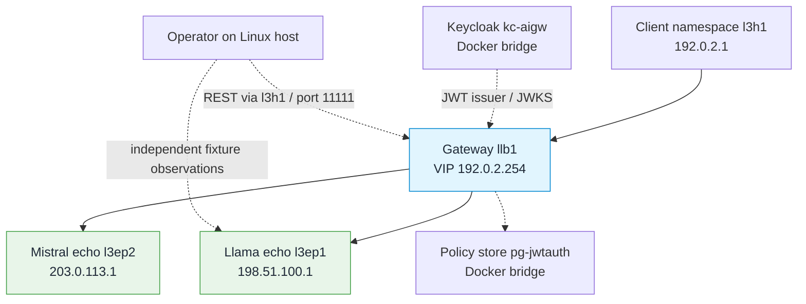

```mermaid
flowchart TD
    C["Client namespace l3h1<br/>192.0.2.1"] --> G["Gateway llb1<br/>VIP 192.0.2.254"]
    G --> L["Llama echo l3ep1<br/>198.51.100.1"]
    G --> M["Mistral echo l3ep2<br/>203.0.113.1"]
    K["Keycloak kc-aigw<br/>Docker bridge"] -.->|"JWT issuer / JWKS"| G
    G -.-> P["Policy store pg-jwtauth<br/>Docker bridge"]
    O["Operator on Linux host"] -.->|"REST via l3h1 / port 11111"| G
    O -.->|"independent fixture observations"| L
    style G fill:#e1f5fe,stroke:#0288d1,color:#1f2937
    style L fill:#e8f5e9,stroke:#43a047,color:#1f2937
    style M fill:#e8f5e9,stroke:#43a047,color:#1f2937
```
