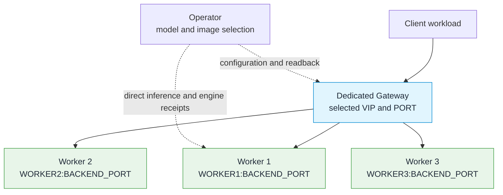

```mermaid
flowchart TD
    C["Client workload"] --> G["Dedicated Gateway<br/>selected VIP and PORT"]
    G --> A["Worker 1<br/>WORKER1:BACKEND_PORT"]
    G --> B["Worker 2<br/>WORKER2:BACKEND_PORT"]
    G --> D["Worker 3<br/>WORKER3:BACKEND_PORT"]
    O["Operator<br/>model and image selection"] -.->|"configuration and readback"| G
    O -.->|"direct inference and engine receipts"| A
    style G fill:#e1f5fe,stroke:#0288d1,color:#1f2937
    style A fill:#e8f5e9,stroke:#43a047,color:#1f2937
    style B fill:#e8f5e9,stroke:#43a047,color:#1f2937
    style D fill:#e8f5e9,stroke:#43a047,color:#1f2937
```
