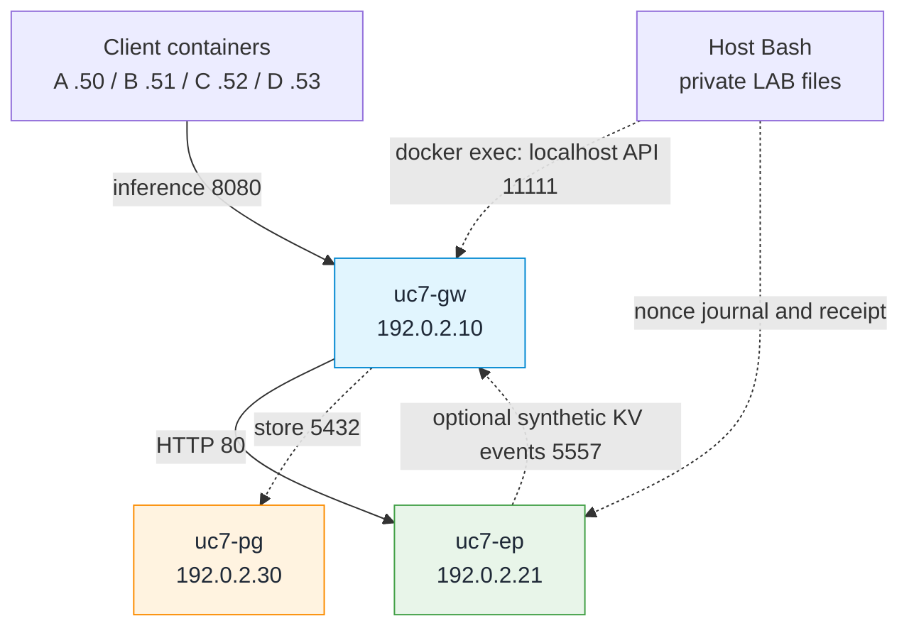

```mermaid
flowchart TD
    C["Client containers<br/>A .50 / B .51 / C .52 / D .53"] -->|"inference 8080"| G["uc7-gw<br/>192.0.2.10"]
    G -->|"HTTP 80"| E["uc7-ep<br/>192.0.2.21"]
    G -.->|"store 5432"| P["uc7-pg<br/>192.0.2.30"]
    O["Host Bash<br/>private LAB files"] -.->|"docker exec: localhost API 11111"| G
    O -.->|"nonce journal and receipt"| E
    E -.->|"optional synthetic KV events 5557"| G
    style G fill:#e1f5fe,stroke:#0288d1,color:#1f2937
    style E fill:#e8f5e9,stroke:#43a047,color:#1f2937
    style P fill:#fff3e0,stroke:#fb8c00,color:#1f2937
```
